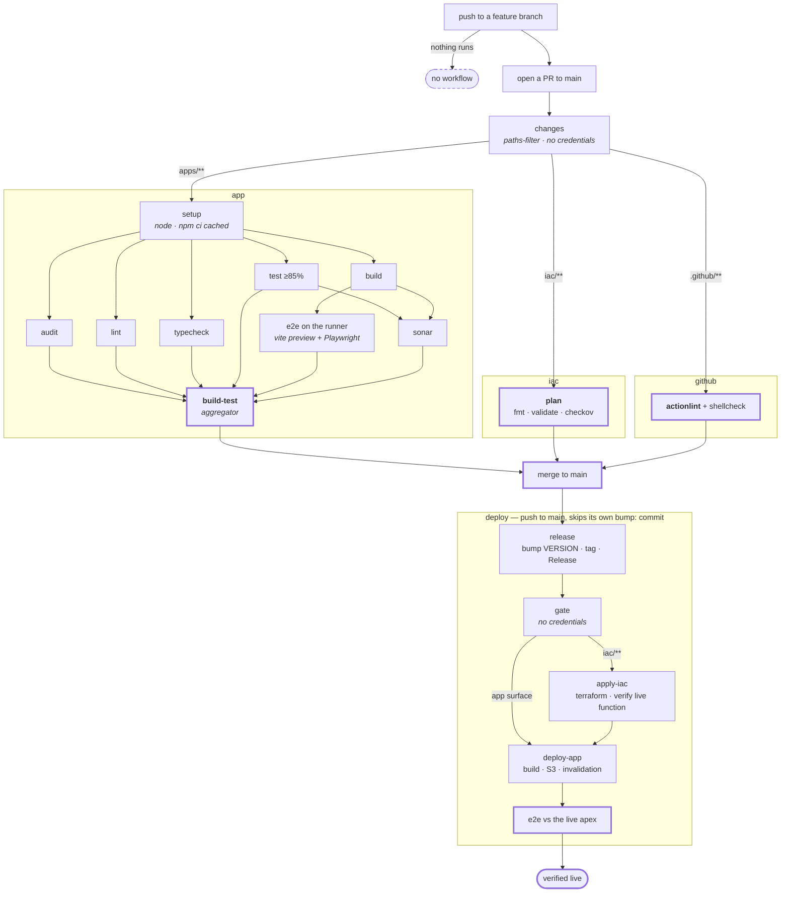

# CI/CD — the design

**Status: agreed shape, not yet built.** The YAML in this directory does not match this document
yet. When it does, this file describes it and the YAML is the source of truth.

Four workflows. Three gate the merge, one publishes.

---

## The four workflows

**Named after the top-level directory each one gates**, so the name says what it guards rather than
what it does to it.

| workflow | gates | required check |
|---|---|---|
| `app` | `apps/**` | `build-test` |
| `iac` | `iac/**` | `plan` |
| `github` | `.github/**` | `actionlint` |
| `deploy` | — publishes | none — it *is* the change |

`github` also covers `dependabot.yml`, which nothing validates today.

---

## Per-job path filters

Every job filters on changed files. **The criterion is what the job consumes, not where the files
live** — a filter is an assertion that the skipped job's outcome *cannot* change, and directories do
not prove that.

| job | runs when these change |
|---|---|
| `lint`, `typecheck` | `apps/**` (**including `e2e/**`**), `packages/shared/**`, root TS + lint config |
| `test`, `sonar` | the above + `vitest.config.ts`, `sonar-project.properties` |
| `build` | the above + **`VERSION`** |
| `e2e` | the above — **never only when `e2e/**` changes**, because it drives the build |
| `plan`, `apply-iac` | `iac/**` **minus** `iac/cloudfront-functions/**` |
| `actionlint` | `.github/**` |

**Two entries carry the whole rule.**

`iac/cloudfront-functions/**` belongs to the **app** gate, not the iac one: it is IaC by path but
JavaScript with behaviour, and `plan` validates Terraform, not behaviour. Filter it as infra and the
only gate that exercises it never runs.

`VERSION` belongs to **`build`**: `apps/fed/src/lib/version.ts` imports it as a build input and the
footer renders it. Filter it out and an edit to it changes what a reader sees with no gate run.

**The app jobs' filter sets overlap almost entirely.** Splitting the app gate into jobs therefore
buys little in *filtering* — the value is parallelism and a readable graph, and it should be argued
on that alone.

---

## Three rules the design has to obey

**`release` runs first, and the deploy always rebuilds.** The version is a build input baked into
the bundle, so the bump must precede the build that ships. The artifact the `app` workflow built and
E2E-tested therefore **cannot** be promoted — it carries the previous version. The PR's E2E tests an
artifact that differs from production by one string.

**Job names are fixed by branch protection.** It requires `build-test`, `plan`, `actionlint` — job
names, not workflow names. Workflows can be renamed freely; these three jobs cannot. `build-test`
becomes a terminal aggregator that only `needs:` the others, which keeps the name and gives the
graph one node answering "did the code gate pass".

**`github` stays its own file, for a circular reason.** If it lived inside `app`, a syntax error in
`app`'s YAML would stop the very linter that exists to catch it. The verifier of workflows cannot
depend on the file it verifies.

---

## What this design does not do

**The post-deploy e2e is not a gate.** It runs after the publish, in the same workflow, and cannot
revert anything. Merging `deploy` and `infra-apply` makes it *reachable for infrastructure changes*
— which it is not today — but it does not make it blocking. A red e2e means the site is broken and
someone has to act.

**Pushing to a feature branch runs nothing.** The local loop is the only gate until the PR exists:
`npm test`, `npm run lint`, `npm run typecheck`, `npm run e2e:local`. The last runs the same
Playwright suite CI runs, against a preview of the real build.

**A skipped job reports green** and is indistinguishable from one that passed. Every workflow ends
with a `::notice::` naming which of three cases happened — *nothing matched, so nothing was
verified* · *a step failed, so the rest never ran* · *the gate ran, here is the list*.

---

## Open decisions

1. **Does `apply-iac` keep a path filter?** Without one, the infra mutation runs on every merge.
   Drawn **with** it.
2. **Does `deploy-app` run when `apply-iac` failed?** Drawn as **no** — you do not ship code onto
   infrastructure that did not converge. The cost is that an infra problem holds a content release.
3. **Split the app gate into jobs — yes or no?** Pending a wall-clock measurement that has not been
   done. Every job is a fresh runner with its own `npm ci`; runner-minutes certainly go up,
   wall-clock is unknown. If it does not improve, keep the monolith.
4. **If split: does `sonar` need `build`, or only the coverage from `test`?** Drawn conservatively as
   needing both.
5. **Where does "verify the LIVE function matches the repo" run** — next to `apply-iac`, or in the
   shared e2e? Drawn next to the apply.
6. **`VERSION` is missing from the app filter today.** One line, and it is a live gap independent of
   this redesign. Fix as its own slice, or fold in?
