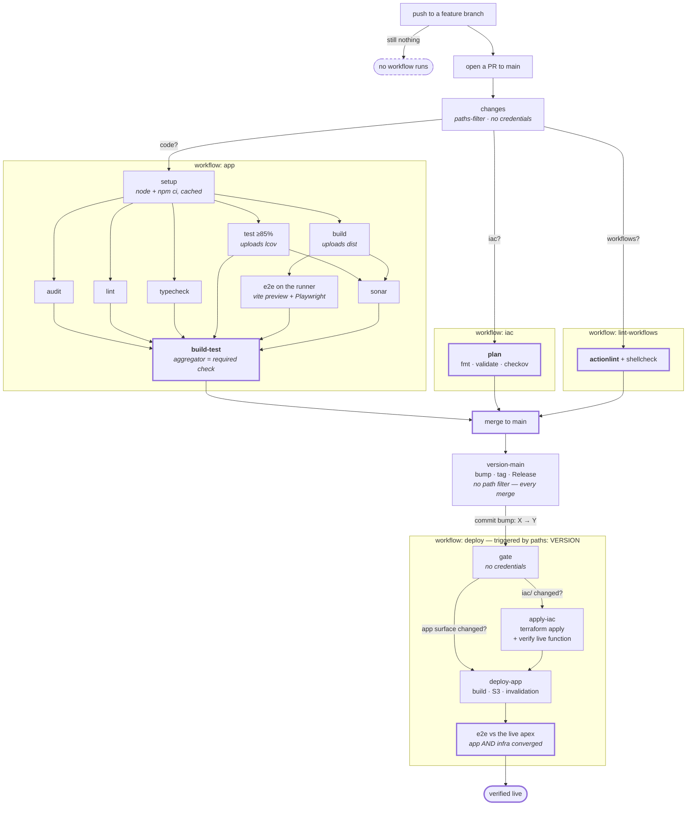
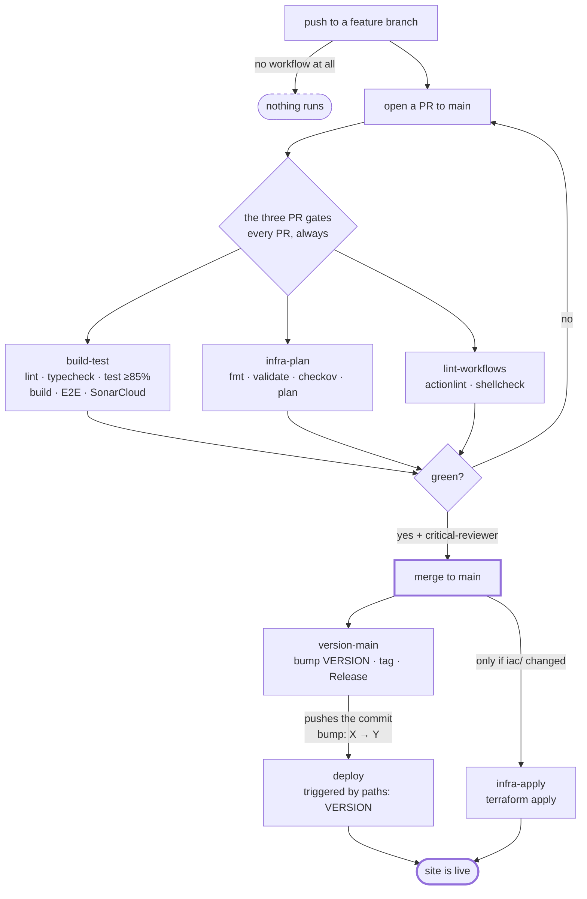
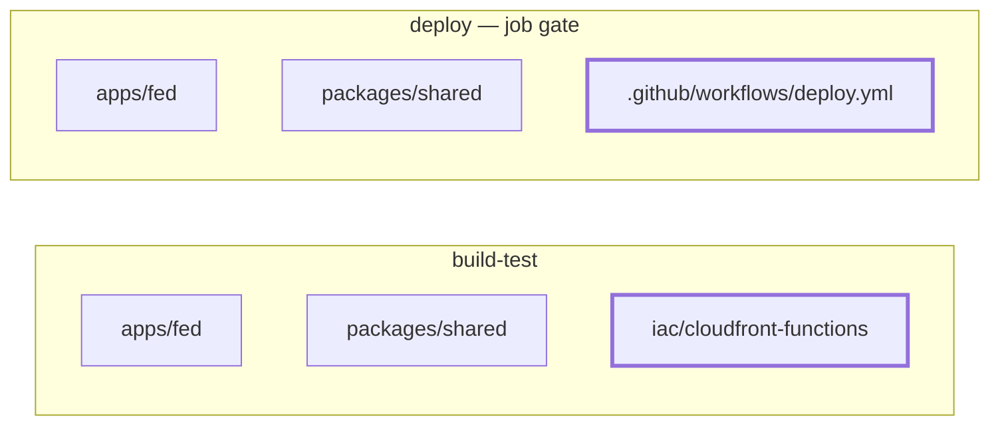

# CI/CD — the design we are aligning on, and the one running today

Two halves, in this order:

- **Part I — the target.** One drawing of the whole lifecycle as we want it. **Under discussion,
  nothing built.** This is the picture to argue with.
- **Part II — today.** How it actually works right now, drawn the same way, as the reference the
  target is a delta against.

> Diagrams render natively on github.com from the ```mermaid``` fences. This is **not** the
> [ADR-0040](../../docs/adr/0040-build-time-mermaid-diagrams.md) pipeline — that one compiles
> Mermaid to inline SVG at build time because the *site* must serve it to a crawler with no
> JavaScript. Here the reader is a person on github.com, so the fence is enough and there is no
> generated artifact to keep in sync.

**Source of truth for Part II is the YAML in this directory.** If they disagree, the YAML wins and
this file is the bug.

---
---

# PART I — THE TARGET

> **Status: proposed, 2026-07-31. No YAML has been touched.**
> Numbered markers below are discussion items, not a sequence.

## The whole lifecycle, as proposed

Owner's structure (2026-07-31): **two workflows before the merge — `app` and `iac`** — and **one
`deploy` workflow after it, with the app deploy and the iac apply as jobs**, followed by a single
e2e against the converged environment.



## Why the owner's post-merge structure is better than my first draft

**It closes the hole that broke production on 2026-07-31, by construction.** Today `deploy` and
`infra-apply` are separate workflows with separate triggers, and an `iac/`-only merge matches none
of `deploy`'s gate paths — so the full post-deploy smoke never runs for infrastructure changes.
That is exactly how a misrouted `/og/*` prefix stayed live for four hours. One `deploy` workflow
triggered by the **bump commit** reaches every merge, because `version-main` has **no path filter**
and bumps on all of them.

**It also removes a race the current design documents as unsolved.** `infra-apply.yml` says today:

> *the two workflows have different concurrency groups and no ordering, so deploy's smoke would race
> terraform apply and — given CloudFront takes minutes to propagate — almost certainly assert against
> the PREVIOUS function and report green.*

As jobs in one workflow, `needs:` gives that ordering for free. The final e2e runs against an
environment where both the infra and the app have converged, which is the thing neither workflow
can assert on its own today.

## Two objections to it, neither fatal

**The apply job must keep its own path filter.** With the trigger moved to `VERSION`, an unfiltered
apply job would run `terraform apply` on **every merge**. A no-op apply is mostly harmless, but
"apply runs always" is a real change in blast radius and it loses the property that infrastructure
is only touched when someone touched infrastructure.

**`needs:` couples them: a failed apply blocks the app deploy.** I think that is correct — you do
not want to ship code onto infrastructure that did not converge. But the cost is that an unrelated
infra hiccup holds a content release, and that should be chosen deliberately rather than inherited
from the drawing.

## What changes, and what deliberately does not

**Two changes:**

1. `build-test` stops being a 13-step monolith and becomes jobs with the dependencies it always had
   — that is where the edges in the top half come from.
2. `deploy` and `infra-apply` merge into **one** post-merge workflow, so the apply and the app
   publish are ordered and a single e2e verifies both.

**Already true today — listed so the drawing is not read as proposing them:**

- pushing to a feature branch runs nothing;
- the app's e2e already runs **on the runner**, against a `vite preview` of the real build;
- `version-main` already bumps on **every** merge, with no path filter. That is the fact the whole
  post-merge redesign rests on.

**Deliberately unchanged:**

- `plan` and `actionlint` keep their names, so branch protection is untouched;
- `actionlint` stays its **own workflow**, and the reason is circular: if it lived inside `app`, a
  syntax error in `app`'s YAML would stop the very linter that exists to catch it. The verifier of
  workflows cannot depend on the file it verifies;
- the post-deploy e2e is **still not a gate**. It runs after the publish and cannot revert
  anything (Part II §3). Merging the workflows makes it *reachable for infra changes* — it does not
  make it *blocking*.

## Three things this design turns on

**1 · `build-test` becomes a terminal aggregator.** It stops doing work and only `needs:` the
others, succeeding or failing with them. Branch protection requires the job names
**`plan`, `build-test`, `actionlint`** — not workflow names — so keeping this name means **no
change to branch protection at all**. The graph also gains a real terminal node: "did the code gate
pass" becomes one box instead of an AND over six.

**2 · The path filter gets simpler, not more complex.** Today `dorny/paths-filter` runs as step 2
and **eleven** steps repeat `if: steps.changes.outputs.code == 'true'`. As jobs it becomes one
`changes` job whose outputs each job reads once. A skipped job satisfies a required check, so a
non-matching PR still reports green without the workflow-level `paths:` trap in Part II §6.

**3 · Two artifacts appear where there were none:** `dist` (build → e2e) and the lcov report
(test → sonar). That is real latency and a genuinely new failure mode — a job that passes locally
and fails in CI because an artifact did not arrive.

## The cost I am not going to pretend I know

**Every job is a fresh runner**, so each runs its own `npm ci`. `actions/setup-node`'s cache makes
that cheaper, not free. Total runner-minutes will certainly go up. **Wall-clock I have not
measured.** Measuring it is the first task, not a footnote — and if it does not improve, the honest
outcome is to keep the monolith and say so.

## The question I think should NOT be decided by the picture

**Merging `build-test` + `infra-plan` + `lint-workflows` into one file.** It gives one run per PR
instead of three. It draws **no edges** — those three are genuinely independent, so they would be
three unconnected boxes sharing a run. And it couples their failure: a YAML syntax error in the
merged file makes GitHub fail the whole workflow, so all three required checks go missing at once
and the PR blocks with no useful signal. Today a broken `lint-workflows.yml` costs `actionlint` and
nothing else.

**Recommendation: leave the three files alone.** Split the monolith, measure, and revisit only if
there is a reason beyond the drawing.

## Every job filters on changed paths — but the criterion is not the directory

Owner's principle (2026-07-31): each job should run only when files it cares about changed, so an
`iac`-only MR does not run the app suite and an `app`-only MR does not plan Terraform. Right, and
the repo already does it — the filter lives *inside* the job so the check still reports (§6).

**The correction is the criterion.** A filter is an assertion that *the skipped job's outcome cannot
change*. "These files live in another directory" does not prove that, and this repo already carries
one carved-out exception and one live bug because of it.

**The documented exception.** `build-test`'s filter includes `iac/cloudfront-functions/**` — IaC by
path, but JavaScript with behaviour, unit-tested by the app gate rather than by `infra-plan` (#205).
A naive `iac/**` filter would skip the only gate that exercises it.

**The bug, found while writing this table.** `apps/fed/src/lib/version.ts` does
`import raw from '../../../../VERSION?raw'` — the root `VERSION` file is a **build input to the
bundle**, and it is what the footer shows. It is **not in any filter.** An MR touching only `VERSION`
skips the entire app gate while changing what a reader sees.

| job | runs when these change |
|---|---|
| `lint`, `typecheck` | `apps/fed/**` (**including `e2e/**`**), `packages/shared/**`, root TS/lint config |
| `test`, `sonar` | the above + `vitest.config.ts`, `sonar-project.properties` |
| `build` | the above + **`VERSION`** ← the gap today |
| `e2e` | the above — **never only when `e2e/**` changes**, because it drives the build |
| `plan`, `apply-iac` | `iac/**` **minus** `iac/cloudfront-functions/**` |
| `actionlint` | `.github/workflows/**` |

**Why "an MR that only touches e2e" is the clarifying case.** The e2e specs are TypeScript in the
same project, so `lint` and `typecheck` cover them. Filtering "e2e changed → run only e2e" skips the
two gates that catch a type error *in the files that changed*. The filter must be derived from what
each gate **consumes**, never from what the author thinks they touched.

**And note what the table shows about splitting:** the app job's filter sets overlap almost
entirely. That is information, not waste — it means splitting buys little in *filtering*. The gain
from splitting is parallelism and the graph, and it should be argued on that alone.

**The risk this shares with today's incident.** A skipped job reports green and is
indistinguishable from one that passed. Today's four-hour outage was a gate that ran and was
ignored; a wrong filter is the worse version — the gate never runs and nothing says so. That is why
every workflow here ends with a `::notice::` naming which of the three cases happened.

## Open, in the order to settle

1. **Does the `apply-iac` job keep a path filter?** If not, `terraform apply` runs on every merge.
   Drawn above *with* the filter.
2. **Is `deploy-app` allowed to run when `apply-iac` failed?** Drawn above as **no** (`needs:`).
3. Split the app monolith — yes or no, pending a wall-clock measurement I have not done.
4. If yes: does `sonar` need `build`, or only the lcov from `test`? Drawn conservatively as needing
   both.
5. Where does the "verify the LIVE function stage matches the repo" assertion go? Today it is inside
   `infra-apply` precisely because of the race the merge removes — so it could move to the shared
   e2e, or stay next to the apply. Drawn above as staying.
6. **`VERSION` missing from the app filter is a bug that exists today**, independent of this
   redesign. Fix it now as its own slice, or fold it into the rebuild? It is one line either way,
   but shipping it separately means the fix is not held hostage to a design still being argued.

Settled by the owner, 2026-07-31: the pre-merge shape is **`app` + `iac`** (plus `lint-workflows`,
kept separate for the circular reason above), and the post-merge shape is **one `deploy` workflow**
with the apply and the publish as ordered jobs.

---
---

# PART II — TODAY

GitHub's Actions tab shows six independent lists. The relationship between them is not visible
anywhere in that UI, because it does not exist as configuration: **one workflow pushes a commit
that another one listens for.**

## 1 · The whole lifecycle



**Two things this diagram exists to make obvious.**

**Pushing to a feature branch runs nothing.** Not one of the six. The three PR workflows listen for
`pull_request: branches: [main]` — a push to a branch is not that event. The other three listen for
`push: branches: [main]` — your branch is not `main`. Verified against this repo's history: **zero**
runs have ever been triggered by a push outside `main`.

So **the local loop is your only gate until the PR exists**: `npm test`, `npm run lint`,
`npm run typecheck`, `npm run e2e:local`. The last one runs the same Playwright suite CI runs,
against a preview of the real build.

**The trigger is the PR, not the push.** Once the PR is open, every further push *does* re-run the
three — but as a `pull_request` event of type `synchronize`, not as a `push`. Same git operation,
different answer depending on whether a PR exists.

---

## 2 · The chain nothing declares

`version-main` does not mention `deploy`. `deploy` does not mention `version-main`. They are linked
only by a commit.


**Why the bump and not the merge.** `version-main` pushes `bump: X → Y` and tags `vY` on top of
every merge, so the bump commit is the **only** commit on `main` whose tree carries the version it
is tagged with. Triggering on the merge would build a tree whose `VERSION` still names the
*previous* release.

**Why it needs a special token.** A push made with the default `GITHUB_TOKEN` **does not trigger
other workflows**. `version-main` pushes with `VERSION_BUMP_TOKEN` — without it the bump would
happen and `deploy` would never wake up.

**The cost, which is inherent and cannot be designed away:** `version-main` is now load-bearing for
deployment. It wedged once, for four merges; back then that only stopped tagging. Now it stops the
site shipping. `workflow_dispatch` on `deploy` is the unconditional manual deploy and the rollback
path.

---

## 3 · Where the post-deploy smoke actually sits

This is the one most worth internalising, because it explains what a red `deploy` does and does not
mean.


**The smoke is not a gate — it is the last step of the job that already published.** It runs at step
10; `Publish to S3` ran at step 08. It is not a separate job with `needs:`, it is a later step on the
same machine. When it goes red, the site changed seconds ago. It does not revert, does not block,
does not hold traffic.

That is deliberate — it is the post-deploy health confirmation, and it catches CDN-level breakage
the pre-merge run structurally cannot see (there is no local CloudFront). But **the only effect of a
red smoke is the colour of the workflow**, and that is worth knowing before you rely on it.

---

## 4 · The two filters are not the same list

Both filter on three paths. The lists look alike and are not.



**The consequence:** a PR touching only `iac/` matches **none** of the deploy gate's paths, so
`deploy` **skips** and the post-deploy smoke never runs. An infrastructure fix to a
*content-serving* path is therefore unverifiable by CI — the only proof is a manual
`workflow_dispatch` on `deploy` after `infra-apply` goes green.

This is not hypothetical: it is why the `/og/*` origin fix on 2026-07-31 needed a manual dispatch to
be proven.

---

## 5 · Jobs are not atomic

Six workflows, **seven** jobs. Only `deploy` has more than one.

| workflow | jobs | what that means in practice |
|---|---|---|
| `build-test` | 1 | 13 steps in series on one machine. Nothing runs in parallel — typecheck waits for lint, which waits for audit. Fail at step 8 and steps 9–13 never run, while the Actions tab says only "build-test failed". |
| `deploy` | 2 | `gate` decides, `deploy` executes. The split exists so **the deciding job holds no credential** — on a release that touched nothing we serve, no token is ever issued. |
| `infra-plan` | 1 | — |
| `infra-apply` | 1 | Apply and the edge assertion share a job on purpose: the assertion must run against the function *this* apply published. Playwright is installed **before** the apply, so a download flake fails having changed nothing. |
| `lint-workflows` | 1 | — |
| `version-main` | 1 | — |

---

## 6 · Green does not mean "verified"

Every PR workflow runs on **every** PR and applies its path filter **inside** the job. That is not a
style preference: a workflow-level `paths:` filter can never be a required status check, because on
a non-matching PR it never reports and sits pending forever.

So a workflow can pass having skipped everything. Each one therefore ends with a `::notice::` naming
which of **three** cases happened:

- *nothing matched, so nothing was verified*
- *a step failed, so the rest never ran*
- *the gate ran — here is the list*

A check that matched nothing must not read like one that passed.

---

## The six files

| file | trigger | can it stop anything? |
|---|---|---|
| `build-test.yml` | PR → main · push → main | **yes** — blocks the merge |
| `infra-plan.yml` | PR → main | **yes** — blocks the merge |
| `lint-workflows.yml` | PR → main · push → main | **yes** — blocks the merge |
| `version-main.yml` | push → main | no — it produces the deploy's trigger |
| `deploy.yml` | push → main `paths: VERSION` · dispatch | **no** — it *is* the change |
| `infra-apply.yml` | push → main `paths: iac/**` · dispatch | **no** — it *is* the change |

`claude.yml` is on-demand (`@claude` in a comment) and is not part of this flow.
