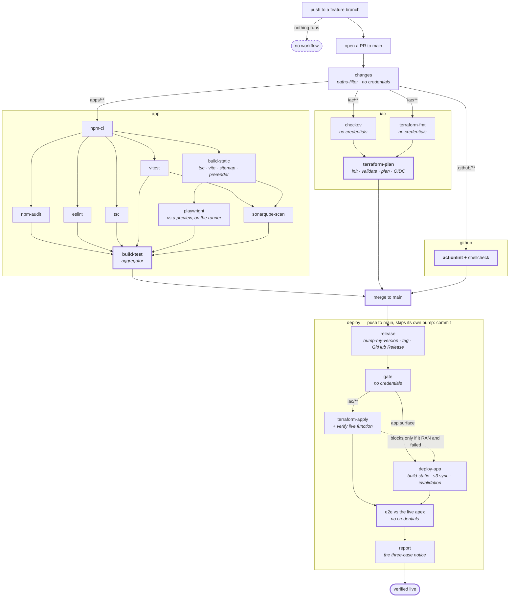

# CI/CD — the design

**Status: built.** The YAML in this directory implements this document, and the YAML is now the source
of truth — this file describes it. Four points where the design did not survive contact with the build
are recorded in *[Where the drawing was wrong](#where-the-drawing-was-wrong)* at the bottom; the
original claims are left standing there rather than edited out.

**One thing is not done and cannot be done from here: branch protection still requires the job name
`plan`, which no longer exists.** See *[Rules the design has to obey](#rules-the-design-has-to-obey)*.

Four workflows. Three gate the merge, one publishes. **Jobs are named after the command they run**,
in kebab-case; a job that runs a pipeline of several commands is named after the script instead.



---

## The four workflows

**Named after the top-level directory each one gates**, so the name says what it guards rather than
what it does to it.

| workflow | gates | required check |
|---|---|---|
| `app` | `apps/**` | `build-test` |
| `iac` | `iac/**` | `terraform-plan` |
| `github` | `.github/**` | `actionlint` |
| `deploy` | — publishes | none — it *is* the change |

`github` also covers `dependabot.yml`, which nothing validated before — but only as far as it honestly
can. Its filter is `.github/**` rather than `.github/workflows/**`, so a dependabot.yml edit now
triggers the gate, and the gate parses the file as YAML. actionlint knows nothing about dependabot's
schema, so a wrong `package-ecosystem` still gets through. The job's `::notice::` says "syntax only,
not schema-validated" for that reason — a check that overstates its reach is the defect this whole
notice convention exists to remove.

---

## Job naming

**A job that runs one tool is named after the tool. A job that runs a pipeline is named after the
script.** Two jobs are named after their outcome instead, and both are aggregators rather than
commands:

- **`build-static`** runs `tsc --noEmit && vite build && gen-sitemap && prerender` — four commands.
  `vite-build` would name a quarter of it and hide the part that matters most: the prerender launches
  Chromium and snapshots every route, which is what puts the OG tags in the served HTML.
- **`build-test`** is the aggregator, and its name is **fixed by branch protection** (below).
- **`release`** bumps with `bump-my-version`, tags, and publishes the GitHub Release — three things,
  and the Release is the one the site's footer links to. The tool is in the node description so the
  graph shows both.

---

## Why the `iac` jobs split where they do

**The cut is credentials, not commands.**

| step | needs `init`? | needs AWS credentials? |
|---|---|---|
| `checkov` | no | **no** |
| `terraform fmt -check` | no | **no** |
| `terraform validate` | yes | yes — `init` talks to Terraform Cloud |
| `terraform plan` | yes | yes — OIDC; the plan refreshes data sources |

**`checkov` and `terraform-fmt` become their own jobs and that is pure gain.** Neither touches AWS,
neither needs `init`, both fail in seconds. Today they sit behind a job carrying `id-token: write`;
split out, **fewer jobs hold a credential**, which is the direction the repo's least-privilege floor
points.

**`validate` stays inside `terraform-plan`.** Splitting it would run `init` twice — two provider
downloads, two Terraform Cloud round-trips — and put a credential in a second job, undoing the gain
above. `plan` already validates; a separate job buys a clearer error message and pays for it twice.

---

## Per-job path filters

Every job filters on changed files. **The criterion is what the job consumes, not where the files
live** — a filter is an assertion that the skipped job's outcome *cannot* change, and directories do
not prove that.

| job | runs when these change |
|---|---|
| `eslint`, `tsc` | `apps/**` (**including `e2e/**`**), `packages/shared/**`, root TS + lint config |
| `vitest`, `sonarqube-scan` | the above + `vitest.config.ts`, `sonar-project.properties`, **`docs/adr/**`** |
| `build-static` | the above + **`VERSION`** |
| `playwright` | the above — **never only when `e2e/**` changes**, because it drives the build |
| `checkov`, `terraform-fmt`, `terraform-plan`, `terraform-apply` | `iac/**` — **all of it, `cloudfront-functions/` included** |
| `actionlint` | `.github/**` |

**Three entries carry the whole rule, and they are the same rule three times: a gate belongs to what a
file IS, not to the directory it sits in** (ADR-0018's amendment).

`iac/cloudfront-functions/**` belongs to the **app** gate: it is IaC by path but JavaScript with
behaviour, and `terraform-plan` validates Terraform, not behaviour. Filter it as infra *only* and the
only gate that exercises it never runs. It is in `app`'s `code` filter for exactly that reason —
`apps/fed/scripts/spa-rewrite.test.mjs` reads `../../../iac/cloudfront-functions/spa-rewrite.js`
directly.

**But it stays in the `iac` filter too, and the original draft of this document was wrong to remove it
there.** `iac/frontend.tf` line 27 is `code = file("${path.module}/cloudfront-functions/spa-rewrite.js")`,
so an edit to that file *is* a Terraform diff. Excluding it from `terraform-plan` and `terraform-apply`
would mean an edge-function change is planned by nothing and applied by nothing: it merges green and
never reaches the edge, with no signal anywhere. The two gates make two **different** claims about the
same file — `app` proves the rewrite logic is correct, `iac` proves the edge is actually running it —
and both are required. Belonging to one gate was never the same as being excluded from the other.

`VERSION` belongs to **`build-static`**: `apps/fed/src/lib/version.ts` imports it as a build input and
the footer renders it. Filter it out and an edit to it changes what a reader sees with no gate run.
It is in `app`'s filter as its own `version` key, so a VERSION-only change rebuilds and re-runs
Playwright while `eslint`/`tsc`/`vitest`/`sonarqube-scan` — which have nothing to look at — stay
skipped. **It is deliberately absent from `deploy`'s gate**, for a measured reason: see below.

`docs/adr/**` belongs to the **app** gate because it is the **authored source of a published artifact**:
`apps/fed/scripts/gen-adrs.mjs` compiles the decision library into a committed
`src/content/generated/adrs.json`, `/architecture` renders it, and `adr-source.test.mjs` fails when the
two separate. Every other generated artifact here reads from `apps/fed/src/content/`, so its guard is
self-triggering and nobody had to think about this before; this is the first whose source lives outside
`apps/**`. Without the entry the guard is correct and **never runs on its own trigger** — an ADR-only PR
skips `vitest`, `build-test` reports *"nothing was verified"* and passes, and the page's own claim that
a decision added or re-statused turns the build red is false. The red would instead surface on the next
unrelated PR touching `apps/**`, landing on an author who did not cause it.

**And it is deliberately NOT in `deploy`'s gate — for a different reason from `VERSION`'s, which is
credentials rather than noise.** `app.yml` declares `contents: read` and holds `id-token: write` nowhere,
so widening *its* filter costs runner minutes. `deploy.yml`'s gate outputs are the predicate deciding
whether a **credentialed** job runs: `app` gates `deploy-app` (the deploy role), `iac` gates
`terraform-apply` (the infra role, strictly more powerful). Two edits that look identical; only one
widens the credential surface — ADR-0015 applied to a filter. Nothing is lost: an ADR-only PR reddens
here, the author regenerates, and the PR then touches `apps/fed/`, which the deploy pathspec already
matches.

**The app jobs' filter sets overlap almost entirely.** Splitting the app gate into jobs therefore
buys little in *filtering* — the value is parallelism and a readable graph, and it should be argued
on that alone.

---

## Rules the design has to obey

**`release` runs first, and the deploy always rebuilds.** The version is a build input baked into
the bundle, so the bump must precede the build that ships. The artifact `app` built and
Playwright-tested therefore **cannot** be promoted — it carries the previous version. The PR's e2e
tests an artifact that differs from production by one string.

**`terraform-apply` runs before `deploy-app`, and that is a data dependency, not caution.**
`deploy-app` resolves `/{env}/frontend/s3-bucket-name` and `/{env}/frontend/cloudfront-distribution-id`
from SSM — parameters Terraform creates. On a cold environment it cannot even start.

**But ordering is not blocking.** `deploy-app` runs when `terraform-apply` was *skipped* (the merge
touched no infra — the common case) and blocks only when it **ran and failed**, because that means
this merge did touch infra and the app change may depend on it. Note the Actions trap: a skipped
`needs:` dependency skips the dependent too, so this requires
`if: always() && needs.terraform-apply.result != 'failure'` rather than a bare `needs:`.

**Job names are fixed by branch protection.** It requires `build-test`, `plan`, `actionlint` — job
names, not workflow names. `build-test` and `actionlint` survive verbatim. `plan` is now
`terraform-plan`, so **the protection is out of step with the YAML until the owner resequences it**:
remove `plan` from required → merge → add `terraform-plan`. There is a window in between where iac PRs
are ungated. Nothing in the agent loop touches branch protection, so this is a human step and it did
not happen as part of the build.

**Every required check must RUN, not merely be needed.** A required job with a bare `needs:` is
*skipped* when a dependency fails — and GitHub counts a skipped required check as satisfied. The
monolith could not have this bug: one job, one status. Splitting it introduces it. So `build-test` and
`terraform-plan` both carry `if: always()` and decide explicitly from `needs.*.result`, which is also
what lets them report on a PR that matched nothing. This is the single largest piece of machinery the
split added, and it exists entirely to stop the gate going green by omission.

**`github` stays its own file, for a circular reason.** If it lived inside `app`, a syntax error in
`app`'s YAML would stop the very linter that exists to catch it. The verifier of workflows cannot
depend on the file it verifies.

---

## What this design does not do

**The post-deploy e2e is not a gate.** It runs after the publish, in the same workflow, and cannot
revert anything. Putting the apply and the publish in one workflow makes it *reachable for
infrastructure changes* — which it is not today — but it does not make it blocking. A red e2e means
the site is broken and someone has to act.

**Pushing to a feature branch runs nothing.** The local loop is the only gate until the PR exists:
`npm test`, `npm run lint`, `npm run typecheck`, `npm run e2e:local`. The last runs the same
Playwright suite CI runs, against a preview of the real build.

**A skipped job reports green** and is indistinguishable from one that passed. Every workflow ends
with a `::notice::` naming which of three cases happened — *nothing matched, so nothing was
verified* · *a step failed, so the rest never ran* · *the gate ran, here is the list*.

---

## Open decisions — resolved

1. **Split the app gate into jobs — yes or no?** Built as drawn, **still unmeasured**. Runner-minutes
   definitely go up: eight jobs, eight `npm ci`, and **two** Chromium downloads (`build-static` needs
   one to prerender, `playwright` needs one to drive the suite, and a runner cannot hand a browser to
   another runner). `npm-ci` also sits on the critical path of every job that follows it. If the
   wall-clock measurement does not justify this, the revert is mechanical — merge the jobs back, keep
   the names.
2. **`tsc --noEmit` runs twice** — once as `tsc`, once inside `build-static`. **Accepted**, as drawn.
3. **Does `sonarqube-scan` need `build-static`?** **No — resolved by reading
   `apps/fed/sonar-project.properties`**, which sets `sonar.sources=src,scripts` and
   `sonar.javascript.lcov.reportPaths=coverage/lcov.info`. `dist/` appears in neither, so the scan
   consumes nothing the build produces. `sonarqube-scan` needs `vitest` only, for the lcov artifact.
   Waiting for the build would have serialised the slowest gate behind the second-slowest for no input.
   The doc drew this edge conservatively; the properties file answers it.
4. **Where does "verify the LIVE function matches the repo" run?** **Inside `terraform-apply`**, as
   drawn — it reads `terraform output` for the function name, so it cannot move to a job without the
   Terraform working directory and state.
5. **`VERSION` is missing from the app filter.** **Folded in** — as its own filter key in `app`, so a
   VERSION-only change rebuilds and re-runs E2E without waking the checks that have nothing to read.

---

## Where the drawing was wrong

Four things this document asserted did not survive being built. They are recorded rather than edited
away.

**1. "`iac/**` minus `iac/cloudfront-functions/**`" would have silently stopped deploying the edge
function.** The reasoning behind the exclusion was sound and the conclusion did not follow from it.
`iac/frontend.tf` embeds the file with `file()`, so it is a real Terraform diff; excluded, an
edge-function change would have been planned by nothing and applied by nothing. Corrected above.

**2. `VERSION` must NOT go in `deploy`'s surface filter, only in `app`'s.** `deploy`'s gate diffs
`<last tag>..HEAD` where HEAD is the **bump commit** — and the bump commit's entire content is an edit
to `VERSION`. Measured on the real range for v0.1.155, an `iac`-only release:

```
$ git diff --name-only v0.1.154..v0.1.155 -- apps/fed packages/shared VERSION
VERSION
```

So including it makes `app=true` on every release and the surface filter stops filtering. The two
filters answer different questions: `app` asks *"does this PR need a rebuild and an E2E?"* (yes, the
footer changed), `deploy` asks *"did this release change anything we serve besides its own version
stamp?"*. Verified in both directions after the fix: v0.1.154..v0.1.155 → `app=false iac=true`
(`iac/storage.tf`); v0.1.152..v0.1.153 → `app=true` (`apps/fed/src/i18n/messages.ts`) `iac=false`.

**3. `npm-ci` is not the node the graph implies.** node_modules cannot cross runners, so every job
below it still runs its own `npm ci --ignore-scripts`. What the job really does is fail fast on a
broken lockfile and populate the `actions/setup-node` npm cache the others restore from. Persisting
`node_modules` as an artifact was considered and rejected — this tree is larger than the install it
would save.

**4. Splitting the post-deploy smoke into its own job breaks #195's letter.** That rule put Playwright
setup *before* the deploy, because `--with-deps` shells out to apt and a transient mirror failure once
turned a successful deploy red. A separate runner cannot install before the deploy it runs after. The
rule's **purpose** — a red must not be ambiguous — is preserved explicitly instead: the `e2e` job
diagnoses a setup failure as a setup failure and says outright that the site was published and is now
unverified. That is a weaker guarantee than #195 had, and it is the price of the job split.

**Two smaller notes.** `deploy`'s `workflow_dispatch` grew two boolean inputs (`deploy_app`,
`apply_infra`, the latter defaulting **false**), because absorbing `infra-apply` would otherwise have
silently widened the documented rollback path into something that runs `terraform apply` against real
AWS. And `app` keeps its **push-to-`main`** trigger even though the diagram draws only the PR edge:
SonarCloud needs a main-branch analysis to have a "new code" baseline, and without it the quality gate
slowly stops meaning what it says.
