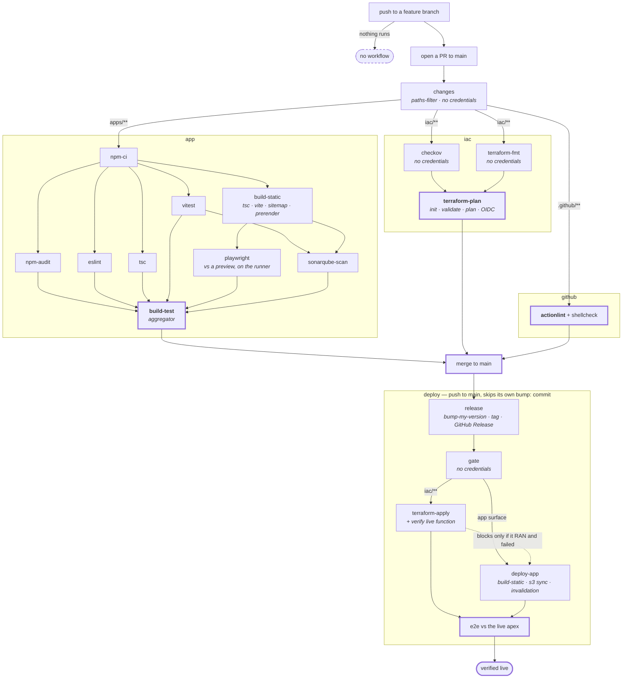

# CI/CD — the design

**Status: agreed shape, not yet built.** The YAML in this directory does not match this document
yet. When it does, this file describes it and the YAML is the source of truth.

Four workflows. Three gate the merge, one publishes. **Jobs are named after the command they run**,
in kebab-case; a job that runs a pipeline of several commands is named after the script instead.

---

## The four workflows

**Named after the top-level directory each one gates**, so the name says what it guards rather than
what it does to it.

| workflow | gates | required check |
|---|---|---|
| `app` | `apps/**` | `build-test` |
| `iac` | `iac/**` | `terraform-plan` |
| `github` | `.github/**` | `actionlint` |
| `deploy` | — publishes | none — it *is* the change |

`github` also covers `dependabot.yml`, which nothing validates today.

---

## Job naming

**A job that runs one tool is named after the tool. A job that runs a pipeline is named after the
script.** Two jobs are named after their outcome instead, and both are aggregators rather than
commands:

- **`build-static`** runs `tsc --noEmit && vite build && gen-sitemap && prerender` — four commands.
  `vite-build` would name a quarter of it and hide the part that matters most: the prerender launches
  Chromium and snapshots every route, which is what puts the OG tags in the served HTML.
- **`build-test`** is the aggregator, and its name is **fixed by branch protection** (below).
- **`release`** bumps with `bump-my-version`, tags, and publishes the GitHub Release — three things,
  and the Release is the one the site's footer links to. The tool is in the node description so the
  graph shows both.

---

## Why the `iac` jobs split where they do

**The cut is credentials, not commands.**

| step | needs `init`? | needs AWS credentials? |
|---|---|---|
| `checkov` | no | **no** |
| `terraform fmt -check` | no | **no** |
| `terraform validate` | yes | yes — `init` talks to Terraform Cloud |
| `terraform plan` | yes | yes — OIDC; the plan refreshes data sources |

**`checkov` and `terraform-fmt` become their own jobs and that is pure gain.** Neither touches AWS,
neither needs `init`, both fail in seconds. Today they sit behind a job carrying `id-token: write`;
split out, **fewer jobs hold a credential**, which is the direction the repo's least-privilege floor
points.

**`validate` stays inside `terraform-plan`.** Splitting it would run `init` twice — two provider
downloads, two Terraform Cloud round-trips — and put a credential in a second job, undoing the gain
above. `plan` already validates; a separate job buys a clearer error message and pays for it twice.

---

## Per-job path filters

Every job filters on changed files. **The criterion is what the job consumes, not where the files
live** — a filter is an assertion that the skipped job's outcome *cannot* change, and directories do
not prove that.

| job | runs when these change |
|---|---|
| `eslint`, `tsc` | `apps/**` (**including `e2e/**`**), `packages/shared/**`, root TS + lint config |
| `vitest`, `sonarqube-scan` | the above + `vitest.config.ts`, `sonar-project.properties` |
| `build-static` | the above + **`VERSION`** |
| `playwright` | the above — **never only when `e2e/**` changes**, because it drives the build |
| `checkov`, `terraform-fmt`, `terraform-plan`, `terraform-apply` | `iac/**` **minus** `iac/cloudfront-functions/**` |
| `actionlint` | `.github/**` |

**Two entries carry the whole rule.**

`iac/cloudfront-functions/**` belongs to the **app** gate, not the iac one: it is IaC by path but
JavaScript with behaviour, and `terraform-plan` validates Terraform, not behaviour. Filter it as
infra and the only gate that exercises it never runs.

`VERSION` belongs to **`build-static`**: `apps/fed/src/lib/version.ts` imports it as a build input and
the footer renders it. Filter it out and an edit to it changes what a reader sees with no gate run.

**The app jobs' filter sets overlap almost entirely.** Splitting the app gate into jobs therefore
buys little in *filtering* — the value is parallelism and a readable graph, and it should be argued
on that alone.

---

## Rules the design has to obey

**`release` runs first, and the deploy always rebuilds.** The version is a build input baked into
the bundle, so the bump must precede the build that ships. The artifact `app` built and
Playwright-tested therefore **cannot** be promoted — it carries the previous version. The PR's e2e
tests an artifact that differs from production by one string.

**`terraform-apply` runs before `deploy-app`, and that is a data dependency, not caution.**
`deploy-app` resolves `/{env}/frontend/s3-bucket-name` and `/{env}/frontend/cloudfront-distribution-id`
from SSM — parameters Terraform creates. On a cold environment it cannot even start.

**But ordering is not blocking.** `deploy-app` runs when `terraform-apply` was *skipped* (the merge
touched no infra — the common case) and blocks only when it **ran and failed**, because that means
this merge did touch infra and the app change may depend on it. Note the Actions trap: a skipped
`needs:` dependency skips the dependent too, so this requires
`if: always() && needs.terraform-apply.result != 'failure'` rather than a bare `needs:`.

**Job names are fixed by branch protection.** It requires `build-test`, `plan`, `actionlint` — job
names, not workflow names. Renaming `plan` → `terraform-plan` therefore needs a protection change,
sequenced: remove `plan` from required, merge the rename, add `terraform-plan`. There is a window
in between where iac PRs are ungated — do it in the same change that builds these workflows, so the
protection is touched once.

**`github` stays its own file, for a circular reason.** If it lived inside `app`, a syntax error in
`app`'s YAML would stop the very linter that exists to catch it. The verifier of workflows cannot
depend on the file it verifies.

---

## What this design does not do

**The post-deploy e2e is not a gate.** It runs after the publish, in the same workflow, and cannot
revert anything. Putting the apply and the publish in one workflow makes it *reachable for
infrastructure changes* — which it is not today — but it does not make it blocking. A red e2e means
the site is broken and someone has to act.

**Pushing to a feature branch runs nothing.** The local loop is the only gate until the PR exists:
`npm test`, `npm run lint`, `npm run typecheck`, `npm run e2e:local`. The last runs the same
Playwright suite CI runs, against a preview of the real build.

**A skipped job reports green** and is indistinguishable from one that passed. Every workflow ends
with a `::notice::` naming which of three cases happened — *nothing matched, so nothing was
verified* · *a step failed, so the rest never ran* · *the gate ran, here is the list*.

---

## Open decisions

1. **Split the app gate into jobs — yes or no?** Pending a wall-clock measurement that has not been
   done. Every job is a fresh runner with its own `npm ci`; runner-minutes certainly go up,
   wall-clock is unknown. If it does not improve, keep the monolith.
2. **`tsc --noEmit` would run twice** — once as `tsc`, once inside `build-static`. Accept the
   duplication (seconds, and the script stays self-sufficient for local use), or strip it from
   `build:static` (and local `npm run build` loses its type check)? Drawn as accepting it.
3. **Does `sonarqube-scan` need `build-static`, or only the coverage from `vitest`?** Drawn
   conservatively as needing both.
4. **Where does "verify the LIVE function matches the repo" run** — inside `terraform-apply`, or in
   the shared e2e? Drawn inside the apply.
5. **`VERSION` is missing from the app filter today.** One line, a live gap independent of this
   redesign. Fix as its own slice, or fold in?
