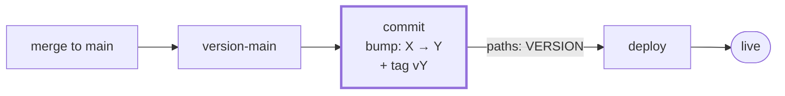
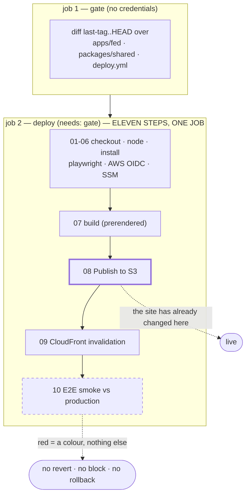
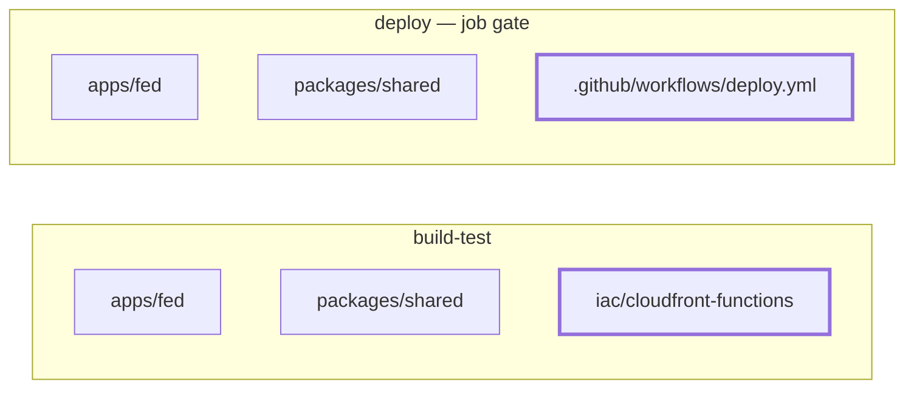

# CI/CD — what runs, when, and what can actually stop anything

GitHub's Actions tab shows six independent lists. The relationship between them is not visible
anywhere in that UI, because it does not exist as configuration: **one workflow pushes a commit
that another one listens for.** This file is that relationship, drawn.

> This diagram is rendered by GitHub natively from the ```mermaid``` fence below. It is **not**
> the [ADR-0040](../../docs/adr/0040-build-time-mermaid-diagrams.md) pipeline — that one compiles
> Mermaid to inline SVG at build time because the *site* has to serve it to a crawler with no
> JavaScript. Here the reader is a person on github.com, so the fence is enough and there is no
> generated artifact to keep in sync.

**Source of truth is the YAML in this directory, not this file.** If they disagree, the YAML wins
and this file is the bug.

---

## 1 · The whole lifecycle


**Two things this diagram exists to make obvious.**

**Pushing to a feature branch runs nothing.** Not one of the six. The three PR workflows listen for
`pull_request: branches: [main]` — a push to a branch is not that event. The other three listen for
`push: branches: [main]` — your branch is not `main`. Verified against this repo's history: **zero**
runs have ever been triggered by a push outside `main`.

So **the local loop is your only gate until the PR exists**: `npm test`, `npm run lint`,
`npm run typecheck`, `npm run e2e:local`. The last one runs the same Playwright suite CI runs,
against a preview of the real build.

**The trigger is the PR, not the push.** Once the PR is open, every further push *does* re-run the
three — but as a `pull_request` event of type `synchronize`, not as a `push`. Same git operation,
different answer depending on whether a PR exists.

---

## 2 · The chain nothing declares

`version-main` does not mention `deploy`. `deploy` does not mention `version-main`. They are linked
only by a commit.



**Why the bump and not the merge.** `version-main` pushes `bump: X → Y` and tags `vY` on top of
every merge, so the bump commit is the **only** commit on `main` whose tree carries the version it
is tagged with. Triggering on the merge would build a tree whose `VERSION` still names the
*previous* release.

**Why it needs a special token.** A push made with the default `GITHUB_TOKEN` **does not trigger
other workflows**. `version-main` pushes with `VERSION_BUMP_TOKEN` — without it the bump would
happen and `deploy` would never wake up.

**The cost, which is inherent and cannot be designed away:** `version-main` is now load-bearing for
deployment. It wedged once, for four merges; back then that only stopped tagging. Now it stops the
site shipping. `workflow_dispatch` on `deploy` is the unconditional manual deploy and the rollback
path.

---

## 3 · Where the post-deploy smoke actually sits

This is the one most worth internalising, because it explains what a red `deploy` does and does not
mean.



**The smoke is not a gate — it is the last step of the job that already published.** It runs at step
10; `Publish to S3` ran at step 08. It is not a separate job with `needs:`, it is a later step on the
same machine. When it goes red, the site changed seconds ago. It does not revert, does not block,
does not hold traffic.

That is deliberate — it is the post-deploy health confirmation, and it catches CDN-level breakage
the pre-merge run structurally cannot see (there is no local CloudFront). But **the only effect of a
red smoke is the colour of the workflow**, and that is worth knowing before you rely on it.

---

## 4 · The two filters are not the same list

Both filter on three paths. The lists look alike and are not.



**The consequence:** a PR touching only `iac/` matches **none** of the deploy gate's paths, so
`deploy` **skips** and the post-deploy smoke never runs. An infrastructure fix to a
*content-serving* path is therefore unverifiable by CI — the only proof is a manual
`workflow_dispatch` on `deploy` after `infra-apply` goes green.

This is not hypothetical: it is why the `/og/*` origin fix on 2026-07-31 needed a manual dispatch to
be proven.

---

## 5 · Jobs are not atomic

Six workflows, **seven** jobs. Only `deploy` has more than one.

| workflow | jobs | what that means in practice |
|---|---|---|
| `build-test` | 1 | 13 steps in series on one machine. Nothing runs in parallel — typecheck waits for lint, which waits for audit. Fail at step 8 and steps 9–13 never run, while the Actions tab says only "build-test failed". |
| `deploy` | 2 | `gate` decides, `deploy` executes. The split exists so **the deciding job holds no credential** — on a release that touched nothing we serve, no token is ever issued. |
| `infra-plan` | 1 | — |
| `infra-apply` | 1 | Apply and the edge assertion share a job on purpose: the assertion must run against the function *this* apply published. Playwright is installed **before** the apply, so a download flake fails having changed nothing. |
| `lint-workflows` | 1 | — |
| `version-main` | 1 | — |

---

## 6 · Green does not mean "verified"

Every PR workflow runs on **every** PR and applies its path filter **inside** the job. That is not a
style preference: a workflow-level `paths:` filter can never be a required status check, because on
a non-matching PR it never reports and sits pending forever.

So a workflow can pass having skipped everything. Each one therefore ends with a `::notice::` naming
which of **three** cases happened:

- *nothing matched, so nothing was verified*
- *a step failed, so the rest never ran*
- *the gate ran — here is the list*

A check that matched nothing must not read like one that passed.

---

## The six files

| file | trigger | can it stop anything? |
|---|---|---|
| `build-test.yml` | PR → main · push → main | **yes** — blocks the merge |
| `infra-plan.yml` | PR → main | **yes** — blocks the merge |
| `lint-workflows.yml` | PR → main · push → main | **yes** — blocks the merge |
| `version-main.yml` | push → main | no — it produces the deploy's trigger |
| `deploy.yml` | push → main `paths: VERSION` · dispatch | **no** — it *is* the change |
| `infra-apply.yml` | push → main `paths: iac/**` · dispatch | **no** — it *is* the change |

`claude.yml` is on-demand (`@claude` in a comment) and is not part of this flow.
