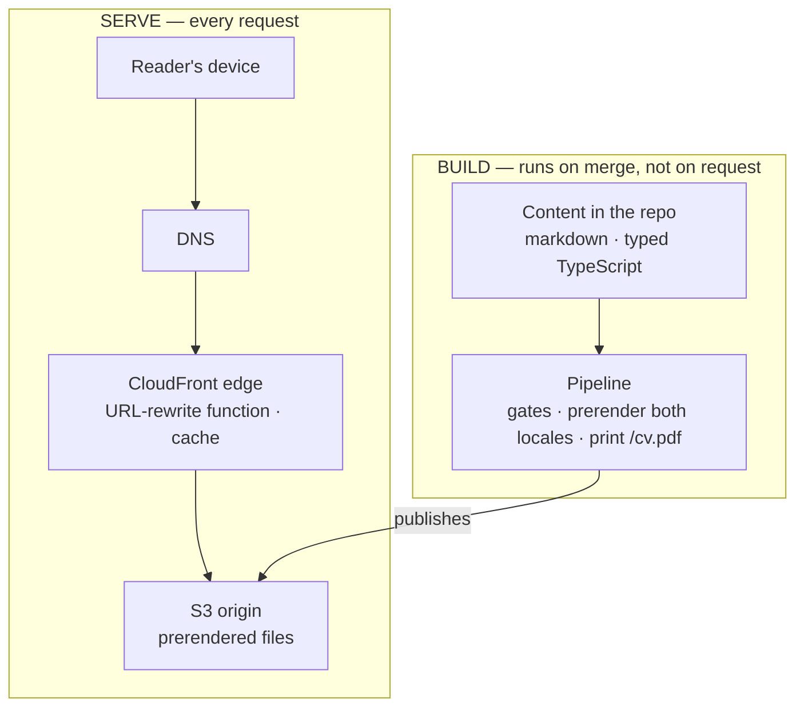
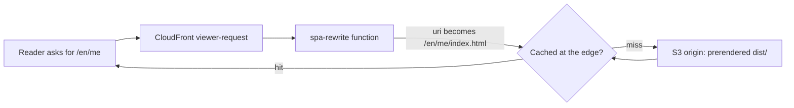
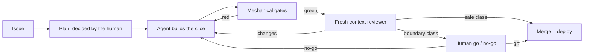
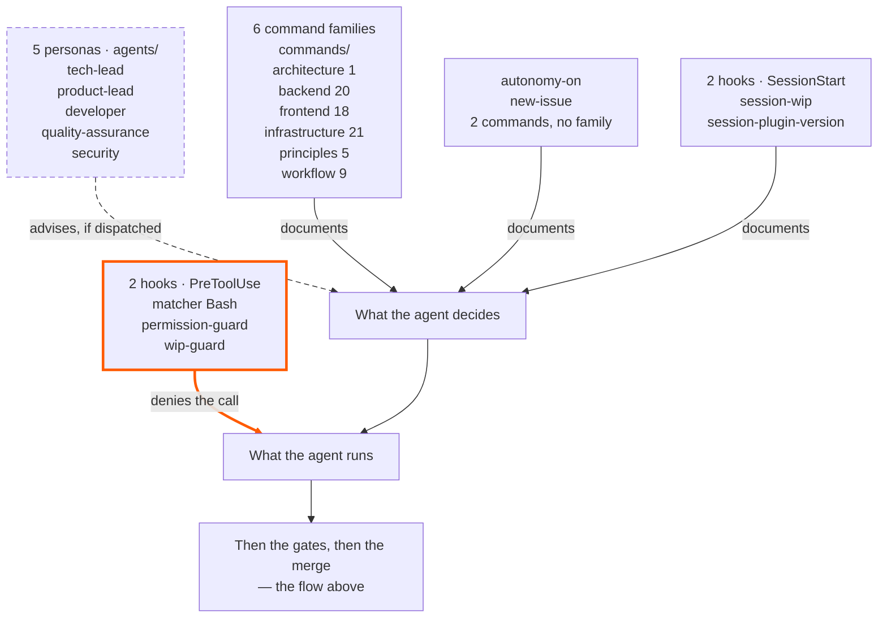

_This site is the argument. This page is the blueprint — how it's built, and how you'd build your own._

## The thesis

For a proof-of-engineering site, the code is the pitch — so the honest thing is to show the machine, not just its output. This is the whole build, in the open: the architecture below, the decisions that shaped it (each one recorded as an ADR), and the reusable layer that lets you replicate it. I build this the way I want to be hired to build — AI-native development (Claude Code, Kiro, a loop built on AI-DLC & Agent Harness Engineering) with the SDLC rigor most AI work skips. The site is that loop's public output.

## The shape

A fully static SPA — React + Vite + TypeScript — served from **S3 behind CloudFront**, with a small CloudFront Function rewriting clean URLs. No backend: no server, no database, no auth. Cost near-zero, attack surface minimal, nothing to keep running at 3am. *(→ [ADR-0002](https://github.com/tedeuxx/tadeumendonca-io/blob/main/docs/adr/0002-fully-static-spa-no-backend.md) fully static / no backend · [ADR-0013](https://github.com/tedeuxx/tadeumendonca-io/blob/main/docs/adr/0013-s3-cloudfront-hosting.md) S3 + CloudFront)*

In layers, and **the interesting thing about this picture is what is not in it** — there is no application tier and no data tier, because everything that would normally live at runtime happens at build time instead:



**The absence is the design, not a gap.** A layer diagram for a system like this usually continues into an application tier, a database and internal integrations; here it stops at a bucket. The only third party at runtime is analytics, and it is consent-gated *(→ [ADR-0033](https://github.com/tedeuxx/tadeumendonca-io/blob/main/docs/adr/0033-ga4-consent-gated-analytics.md))*. What a backend would do per request — resolve content, render HTML, build the OG tags — happens once, in the build lane, and ships as files.

That is also why the bill below is what it is: **the name and the hosted zone bill whether anyone comes or not, and what a visit adds on top of them rounds to nothing.**

What none of that places is where a clean URL becomes a file:



There is no application in that path — so the only logic between a reader and a file is [ten executable lines of JavaScript](https://github.com/tedeuxx/tadeumendonca-io/blob/main/iac/cloudfront-functions/spa-rewrite.js), and it carries [its own unit tests](https://github.com/tedeuxx/tadeumendonca-io/blob/main/apps/fed/scripts/spa-rewrite.test.mjs) plus a [post-deploy check](https://github.com/tedeuxx/tadeumendonca-io/blob/main/.github/workflows/deploy.yml) that the live function still matches this repo. It runs on every *page* request; the build's assets are a separate behaviour that never invokes it — OG images do reach it and pass through untouched, because the last path segment has an extension.

That check is the price of putting logic at the edge, not a nicety: a function version is published independently of the distribution, so nothing about deploying the site proves which one is actually running.

## What it actually costs: USD 6.57 a month, and USD 6.42 of that is the name

"Near-zero" is the easiest claim on this page to make and the easiest to leave unchecked. So here is the AWS bill — the serving lines read from the account's daily cost in **late July 2026**, the registration read from the registrar's price list, neither estimated:

- **The domain** — USD 71.00/yr for the `.io`, an annual charge that lands in one month. **USD 5.92/month** amortized.
- **Route 53** — USD 0.50/month, fixed. The hosted zone, whether or not anyone visits.
- **S3** — about USD 0.15/month, and it is deploy *writes*, not reads.
- **CloudFront** — effectively USD 0.00 at this traffic.

Note the shape, because it is not a small effect and it is a three-way split rather than a ratio: **the name is 6.42, publishing is 0.15, and answering requests is zero.** Registration and DNS cost more than everything else in this bill combined, forty times over; the 0.15 is the build pushing files to S3, not readers pulling them; and the part that actually serves a visitor rounds to nothing.

Treat the serving lines as a measurement with a date on it rather than a standing fact — no invoice has closed at that rate yet. And note *why* the sourcing is split, because it is the mistake this section already made once: the daily cost series is a window, and **a charge that recurs less often than your window is long is invisible to it.** The renewal is annual and falls in October, so reading the account was correct and answered a different question than the one asked. "Measured, not estimated" is not a defence against measuring the wrong interval. The only compute in the path is the edge function above, metered per invocation and rounding to zero at this volume; there is no *server* line at all, and that is what "no backend" buys: a **floor** with no compute in it — nothing sitting there billing for capacity, though the name and the hosted zone bill regardless. It does not buy indifference to traffic — S3 and CloudFront are purely usage-priced, so the variable part is zero here because of the free tier and small payloads, not because there is nothing to scale.

### The other providers, and why one number is the wrong shape

AWS is one of the providers that could invoice this — and that is the criterion, stated rather than left to a count, because a number goes stale the moment a dependency is added. **Anything that bills to keep the published site up, or would bill on a condition, belongs here.** The scope is deliberate and the closing section returns to it: what I build the site *with* is a different question from what the site *runs on*. Applied honestly it still turns up more than a list of zeros, and the interesting part is that they do not all behave the same way.

**Two bill today, and neither charge was created by this site.** **GitHub** hosts the code and runs every gate, on a paid plan — the subscription predates the site, though the CI load on it is entirely the site's own, and priced at zero for a reason two paragraphs down. **iCloud+** carries the custom-domain email at the apex — [`iac/email.tf`](https://github.com/tedeuxx/tadeumendonca-io/blob/main/iac/email.tf) provisions its MX, DKIM and SPF records, so it is not adjacent to this infrastructure, it is inside it *(→ [ADR-0016](https://github.com/tedeuxx/tadeumendonca-io/blob/main/docs/adr/0016-custom-email-via-icloud.md) custom email via iCloud)*. Both subscriptions existed before the site and would bill exactly the same if it were deleted tomorrow, which is why the USD 6.57 does not absorb them: that figure is what this site **added**, not what it **depends on**. Those are different claims, and "runs on almost nothing" is only the first one.

**The rest bill zero, on conditions that are the part worth knowing:**

- **GitHub Actions is free because the repositories are public** — a property of the repos, not of the plan, so it would outlive a downgrade and it would not outlive going private. That starts metering minutes against a monthly allowance, and this pipeline runs the full gate set — install, audit, lint, typecheck, unit, build, E2E, a Sonar scan — on **every pull request that touches the app** — the workflows filter by path, and the ADRs are inside that filter because this page publishes them, so it is prose *outside* those paths that runs far less — and **again on the merge**, which additionally publishes and runs a second end-to-end pass against the live site. The number that appears is not small, and nothing about the code would have changed.
- **SonarCloud turns on the same condition**, on a separate account: its free tier is for public projects. Its gate blocks a merge, so it is load-bearing in the loop at exactly zero — which is the clearest case for why writing only the zero would be the more misleading answer.
- **Terraform Cloud's free tier covers this workspace** because the infrastructure is small — the last plan resolved against roughly fifty resources, well inside the tier. That ceiling is counted in *resources*, not in traffic or in spend, so it is the one limit here that a **decision** moves rather than an audience.

Analytics is named further up as the only third party at runtime and is deliberately not in this list: it is consent-gated and free at any volume this site will produce, which makes it a privacy question rather than a billing one.

So the honest shape is **one measured bill, a set of conditional zeros, and two subscriptions that would bill with or without this site** — and no provider here moves with readers. Going private, growing the estate, registering a name: all decisions. The only traffic-priced lines anywhere in this are inside the AWS bill, and they are the two that round to nothing.

**And that is true of the measured one too, which is the part a single total hides.** Of the USD 6.57, USD 5.92 is the amortized annual registration and USD 0.50 the fixed hosted zone — 6.42 of it before a single file is served. The remaining 0.15 is the build writing to S3, not readers reading from it.

**This is stated rather than tabulated deliberately.** A row reading `GitHub — USD 0.00` invites the reader to add it up and stop. What matters is not that the cell is empty but that it is empty *for a reason someone chose*, and that the reason is reversible by a decision rather than by traffic.

### What the figure still excludes

It is one provider's bill, deliberately — and the axis above is what makes that honest rather than partial: USD 6.57 is what this site **added**, not what it depends on. So it leaves out the two subscriptions that would bill with or without it, it leaves out the Claude Max subscription this work runs on, and it leaves out every hour of mine. **Infrastructure and tooling only**, and not even all of that.

That has to be said or the number lies by omission: **USD 6.57 a month is what it costs to keep this running, not what it cost to build.** Two different questions, and this section only answers the first.

### What the guardrail is actually for

The same reading turned up roughly **USD 12.80 a month** the site was not using: WAF web ACLs and idle public IPv4 addresses attached to nothing, left behind when the backend was retired. More than eighty times what publishing the site costs. **Those are gone** — removed in July 2026, and the daily cost series confirms the charges stop rather than an empty console implying it. Not all of it: a residue from the same era, **under a dollar a month**, is still accruing while I work out what it holds — an account-level line, not a site one, and the honest state of this at the time of writing.

I found them by reading the bill, which is late. So what watches now is an account-wide budget in `iac/budget.tf`, and two things about it are deliberate. It is **not** scoped to this project's tags — otherwise it would only ever see spend this repo created, and this was exactly the kind it did not. And the sensitivity lives in the **thresholds**, not the ceiling: a ceiling has to be sized for your worst legitimate month, which here is the October renewal, so it is by construction deaf to anything smaller than itself. The alarm that matters fires at 15% — around USD 12, quiet at the normal run rate, and awake to any new recurring cost of roughly USD 8/month. A conventional 50/80 pair would first have spoken at USD 40, several times actual spend, and stayed silent for a year about a new USD 30/month service.

That is the transferable part, and it is two-sided: infrastructure you stop using does not stop billing, and the thing meant to catch it has to look **wider** than what you are building and **lower** than what you are afraid of. *(→ [`iac/budget.tf`](https://github.com/tedeuxx/tadeumendonca-io/blob/main/iac/budget.tf))*

## What was cut — and it was built first, which is the part that matters

The easy version of this section is *"we kept the scope tight."* That is a posture, and anyone can claim it. The true version is stronger and it is checkable: **this was not built lean. It was built full and then cut**, and every reversal is on the record with the decision that replaced it.

| removed | what it was | replaced by |
|---|---|---|
| [ADR-0025](https://github.com/tedeuxx/tadeumendonca-io/blob/main/docs/adr/0025-superseded-backend-platform.md) | Backend platform — BFF on Lambda, DynamoDB, Cognito, SES | [0002](https://github.com/tedeuxx/tadeumendonca-io/blob/main/docs/adr/0002-fully-static-spa-no-backend.md) |
| [ADR-0026](https://github.com/tedeuxx/tadeumendonca-io/blob/main/docs/adr/0026-superseded-lambda-edge-og.md) | Lambda@Edge rendering OG images per request | [0004](https://github.com/tedeuxx/tadeumendonca-io/blob/main/docs/adr/0004-build-time-render-not-ssr-or-edge.md) |
| [ADR-0027](https://github.com/tedeuxx/tadeumendonca-io/blob/main/docs/adr/0027-superseded-backend-link-unfurl.md) | Backend link-unfurl service for preview cards | [0004](https://github.com/tedeuxx/tadeumendonca-io/blob/main/docs/adr/0004-build-time-render-not-ssr-or-edge.md) |
| [ADR-0028](https://github.com/tedeuxx/tadeumendonca-io/blob/main/docs/adr/0028-superseded-gitflow-two-env.md) | GitFlow with staging and production | [0003](https://github.com/tedeuxx/tadeumendonca-io/blob/main/docs/adr/0003-trunk-based-single-environment.md) |
| [ADR-0029](https://github.com/tedeuxx/tadeumendonca-io/blob/main/docs/adr/0029-superseded-offline-first-pwa.md) | Offline-first installable PWA | [0002](https://github.com/tedeuxx/tadeumendonca-io/blob/main/docs/adr/0002-fully-static-spa-no-backend.md) |

Those five are the ones this section walks through, all in July 2026 — the backend and the machinery that came with it, which is why a staging flow and an offline-first PWA are in the list beside the server. They are not all the reversals. The full index below carries the load-bearing decisions, and the superseded ones outnumber the five above. None of them was quietly deleted: **the superseded record stays and says what replaced it**, which is the only way a reader can tell a decision from a rationalisation. Click any row and you get what was decided, what it cost, and why it stopped being right.

**What the objective actually needed was content**, and none of that machinery served it. A database with nothing to store. Auth with nobody to authenticate. A staging environment for a site whose revert is a merge. Each one was defensible when it was decided and none survived the question *"what is this for, here."*

### If you need the backend back, the record tells you which decision to reverse

This is what makes the growth path concrete rather than a promise that the architecture "could scale". A system that grew into needing a server does not need this site redesigned — it needs **one specific decision reopened**, and each of the five above names the one that closed it:

- **dynamic data or accounts** → reverse [0002](https://github.com/tedeuxx/tadeumendonca-io/blob/main/docs/adr/0002-fully-static-spa-no-backend.md), and 0025 is the shape it had;
- **per-request rendering** → reverse [0004](https://github.com/tedeuxx/tadeumendonca-io/blob/main/docs/adr/0004-build-time-render-not-ssr-or-edge.md); 0026 and 0027 are two things that were tried at the edge;
- **a change you cannot revert by merging** → reverse [0003](https://github.com/tedeuxx/tadeumendonca-io/blob/main/docs/adr/0003-trunk-based-single-environment.md), and 0028 is the two-environment flow it replaced.

The build lane in the diagram above is the seam: adding a server means moving work **out** of it, not bolting a tier onto the side.

## Every decision, and where it stands

The table below is **not typed here**. It is generated from `docs/adr/`, committed as an artifact, and checked in CI: adding or superseding a decision without regenerating the index turns the pipeline red, so the page either matches the library or nothing ships. A hand-copied index of a library this size is stale within a week and nothing says so — this one is the same mechanism as the diagrams above, and for the same reason.

```adr-index
```

That is this page's own principle applied to the one list it cannot avoid reproducing: **link the canonical detail rather than restating it.** Every row is a link, and the decision itself lives in the record — with its context, the options that lost, and what it cost.

## Content is markdown in the repo, resolved at build

Every page's content — the CV, this page, the articles — is markdown or typed data in the repo. Each route is **prerendered** at build (a headless snapshot) so the OG/SEO tags and crawlable HTML land in the served files — no SSR, no edge rendering. The downloadable CV PDF is printed from the live `/me` by the same step. *(→ [ADR-0004](https://github.com/tedeuxx/tadeumendonca-io/blob/main/docs/adr/0004-build-time-render-not-ssr-or-edge.md) build-time render · [ADR-0005](https://github.com/tedeuxx/tadeumendonca-io/blob/main/docs/adr/0005-og-coverage-every-public-url.md) every URL OG-complete · [ADR-0034](https://github.com/tedeuxx/tadeumendonca-io/blob/main/docs/adr/0034-build-time-cv-pdf-static-artifact.md) the CV PDF)*

## The dev-loop is the product

The interesting part isn't the stack — it's how it's built: **agent-led verification, human-residual**. The agent proves "done" with mechanical gates and real evidence (lint, types, tests ≥85%, a green build, SonarCloud, functional E2E, a fresh-context reviewer); the human keeps the irreversible and architectural calls. That loop lives in a separate reusable plugin — **[tadeumendonca-skills](https://github.com/tedeuxx/tadeumendonca-skills)** — so it's a methodology you can adopt, not something bespoke to this site. *(→ [ADR-0003](https://github.com/tedeuxx/tadeumendonca-io/blob/main/docs/adr/0003-trunk-based-single-environment.md) trunk-based single-environment · [ADR-0018](https://github.com/tedeuxx/tadeumendonca-io/blob/main/docs/adr/0018-ci-gates-e2e-on-pr-coverage.md) the CI gates)*



The human appears twice, and the two appearances are different jobs. At the plan, deciding what is worth building and how — the architectural calls are never made solo. At the end, on boundary-class work only, deciding whether it ships. In between, the agent builds and the machine proves, and most changes reach production without a person in that path at all.

The picture shows the routing. What it cannot show is that the routing was **decided** — which edge the human sits on, what counts as a class boundary, where a gate is worth what it costs. That is the engineering this page is offering, more than any box in the figure.

And the cost of it, since the rest of this page states its own: what decides a change is safe is the same kind of thing that wrote the change. Mis-classify one and it takes the empty path. What makes that acceptable here is blast radius, not confidence — this is a static site, and a revert is a merge.

### What the loop is made of, and what each part can actually do

The picture above answers *how work moves*. It does not say what the loop is **made of** — and that is the question a reader deciding whether to adopt it is actually asking. The two are separate diagrams on purpose: one drawing that tried to be both would have to give a hook that refuses a command and a lens somebody has to remember to invoke the same arrow, and that difference is the most useful thing on this page.



**Of the plugin's own components, exactly one kind can stop you**, and that is the honest version of the adoption pitch. (The box that is *not* a plugin component — *Then the gates, then the merge* — is a pointer back to the first diagram, and those gates certainly do stop you: SonarCloud and the terminal `build-test` check block a merge outright. They live in this repo's workflows rather than in the plugin, which is why they are not rows in the inventory below.) Two of the four hooks run on `PreToolUse`: the agent runtime calls them *before* a tool runs, they return a denial, and the command does not happen. The other two run at `SessionStart` and only report — they have no tool call to refuse, which is why they are not drawn as a floor. The personas advise, and *advise* is a claim about the judgement they produce, not about where they sit: one of them, `quality-assurance`, has a mechanically enforced seat — the same permission hook lets only that agent type run the merge command — and being the only one who *may* merge is a different property from being checked on how it merged. `product-lead` is the mirror image of that: it **blocks** a merge when it finds a published claim that is untrue — but by convention rather than by hook, so nothing refuses the merge command on its behalf and the drawing cannot honestly show it as a floor. Nothing checks the judgement in either case, and this repo's own guide says in as many words that a lens nobody dispatches *fails silently*. The commands are neither — they are the written form of a decision already taken, so nobody re-litigates it at 2am.

**The inventory is typed here and pinned to the plugin** — which is a narrower claim than *generated*, and the one that is actually true. Every name, event, matcher, path and count above is written by hand into the diagram; what makes it trustworthy is a chain of two. A test compares the drawing, node by node and count by count, against a [committed manifest](https://github.com/tedeuxx/tadeumendonca-io/blob/main/apps/fed/src/content/generated/harness.json), so the fence cannot drift from it in either locale. And a [CI job](https://github.com/tedeuxx/tadeumendonca-io/blob/main/.github/workflows/app.yml) compares that manifest against the plugin's live tree three ways — a component the manifest is missing, a manifest row with nothing behind it, and one that is present on both sides having changed shape. Add, retire or rename a persona over there and this repo's build goes red. *(→ [ADR-0043](https://github.com/tedeuxx/tadeumendonca-io/blob/main/docs/adr/0043-harness-inventory-derived-from-plugin-repo.md))*

**What that does not buy is freshness, and the gap is structural rather than an oversight.** The plugin is a *different repository*, and nothing in this one can trigger on a merge in it. So the red arrives at the next build here — which may be days later, and on a change that has nothing to do with it. **This page can be wrong for that whole window and will not say so.** Two smaller limits, for the same reason the rest of this page states its own: the check compares **identity**, so a hook that keeps its name and changes what it does publishes a stale description under a green build; and the short glosses on the edges — *denies the call*, *advises, if dispatched* — are **authored here** and checked by nothing.

That is also where the two terms in the opening paragraph land — and they do not land the same way, which is worth being exact about. **AI-DLC** is not mine: it is AWS's name for a delivery lifecycle whose stages are run and verified by agents rather than around them, and the first picture is what practising it looks like here. **Agent Harness Engineering** is the claim I am making, and it is this picture — that the harness is a thing you build, count and check, rather than a way of prompting. Adopting a methodology costs nothing to say; the second one has to be paid for, and the payment is that it can be inventoried at all, from the repository it lives in, with a build that breaks when the inventory stops being true.

## The decision record IS the documentation

No separate architecture doc that drifts. Every load-bearing decision — and the reversed ones, kept as history — is an **[Architecture Decision Record](https://github.com/tedeuxx/tadeumendonca-io/blob/main/docs/adr/README.md)**, read through the keystone [ADR-0001](https://github.com/tedeuxx/tadeumendonca-io/blob/main/docs/adr/0001-lean-by-design-calibrated-to-strategy.md): *lean by design, calibrated to strategy.* The real "why" behind anything above is there, dated, with its trade-off.

## Replicate it for your own context

It's all public — two repos, no secrets:

[https://github.com/tedeuxx/tadeumendonca-io](https://github.com/tedeuxx/tadeumendonca-io)

[https://github.com/tedeuxx/tadeumendonca-skills](https://github.com/tedeuxx/tadeumendonca-skills)

**The bar:** a project is only listed in the portfolio when it clears **[docs/catalog-ready.md](https://github.com/tedeuxx/tadeumendonca-io/blob/main/docs/catalog-ready.md)** — the proof-of-engineering gate. This site is the one entry that did not come through it, because it *is* the shelf; what holds it up is on this page — the ADRs above, the gates, and the limitations it states about itself below. The bar is written down and public, so you can read it and decide whether it is yours.

### Where the setup lives, and why not here

The fork-to-live steps are in the READMEs, not on this page. That is the same rule the rest of this page runs on: it links canonical detail rather than restating it. A step-by-step guide living here would be a second copy of what a README owns — and the copy that used to be here had already gone stale, describing workflows that had been renamed underneath it. **[This repo's README](https://github.com/tedeuxx/tadeumendonca-io#fork-to-live)** carries the cloud path end to end, from the domain to the first merge; **[the plugin's README](https://github.com/tedeuxx/tadeumendonca-skills#run-it)** carries the loop half, which installs with no cloud account and nothing to deploy.

Two of those steps are decisions rather than procedure, and they are the ones worth reading before you start rather than while you are stuck.

**Terraform here does not create the GitHub OIDC provider, nor the role that runs Terraform itself.** Those are created out of band, with the AWS CLI, and they stay outside Terraform permanently. There are two independent reasons and only one of them would ever go away: the first run would need the credential it has not created yet, and — the one that does not expire — a role able to rewrite its own trust policy has no ceiling on it. **[ADR-0042](https://github.com/tedeuxx/tadeumendonca-io/blob/main/docs/adr/0042-trust-root-bootstrapped-out-of-band.md)** records both, along with the part that is uncomfortable to write down: this is a documented hole in a floor, the hand path reopens every time that role's policy is revised, and no `plan` will ever tell you it has drifted.

**The roles trust an *immutable* subject** — by numeric ID rather than by name, because a name can be transferred to someone else and the IDs cannot. It is the step most likely to cost you an afternoon, since getting it wrong fails as an unhelpful `sts:AssumeRoleWithWebIdentity` denial. **[ADR-0015](https://github.com/tedeuxx/tadeumendonca-io/blob/main/docs/adr/0015-oidc-immutable-subject-least-privilege.md)** has the form, the trade-off, and the rename that taught it.

The part I would be nervous seeing someone copy without the rest is **merging straight to production**. Trunk-based with a single environment is fast and unforgiving in equal measure; without the gates in front of it, only the second half survives.

## Two honest limitations

This is a single-author site, tuned to one person's positioning — not a general-purpose template, and no one else's hands have been on it. Take the pattern, not the specifics.

And all four diagrams above show the **shape** of a thing, not a run of it. Three of them you can check, in three different strengths. That the request path is what the edge actually does: the function, its tests and the post-deploy comparison are linked. That the layers are what this repo actually builds: `iac/` and the build script settle it between them. That the harness has the parts the inventory names: a build here fails when it stops matching the plugin repo — but **late**, since nothing here can see a merge over there, and only for the parts that are *names*, never for what those parts do. The fourth you cannot check at all. That the loop is followed the way it is drawn is not something this page proves — nothing here shows that any particular change took the route in the picture. That one is a claim about how I work, and no artifact on this page can settle it for you.
