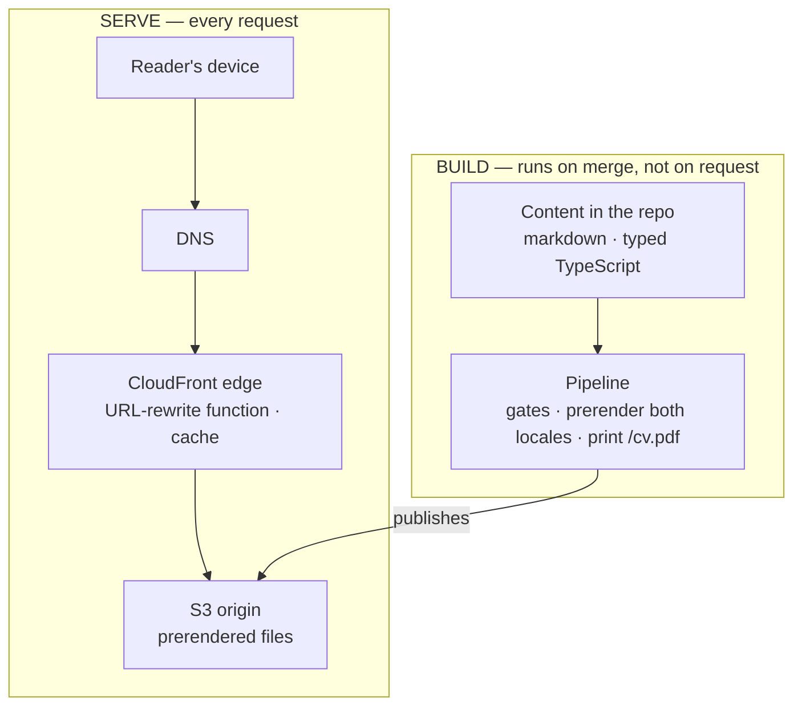
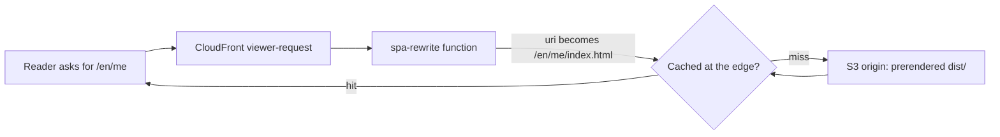
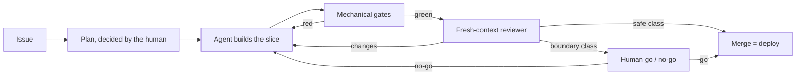

_This site is the argument. This page is the blueprint — how it's built, and how you'd build your own._

## The thesis

For a proof-of-engineering site, the code is the pitch — so the honest thing is to show the machine, not just its output. This is the whole build, in the open: the architecture below, the decisions that shaped it (each one recorded as an ADR), and the reusable layer that lets you replicate it. I build this the way I want to be hired to build — AI-native development (Claude Code, Kiro, a loop built on AI-DLC & Agent Harness Engineering) with the SDLC rigor most AI work skips. The site is that loop's public output.

## The shape

A fully static SPA — React + Vite + TypeScript — served from **S3 behind CloudFront**, with a small CloudFront Function rewriting clean URLs. No backend: no server, no database, no auth. Cost near-zero, attack surface minimal, nothing to keep running at 3am. *(→ [ADR-0002](https://github.com/tedeuxx/tadeumendonca-io/blob/main/docs/adr/0002-fully-static-spa-no-backend.md) fully static / no backend · [ADR-0013](https://github.com/tedeuxx/tadeumendonca-io/blob/main/docs/adr/0013-s3-cloudfront-hosting.md) S3 + CloudFront)*

In layers, and **the interesting thing about this picture is what is not in it** — there is no application tier and no data tier, because everything that would normally live at runtime happens at build time instead:

**The absence is the design, not a gap.** A layer diagram for a system like this usually continues into an application tier, a database and internal integrations; here it stops at a bucket. The only third party at runtime is analytics, and it is consent-gated *(→ [ADR-0033](https://github.com/tedeuxx/tadeumendonca-io/blob/main/docs/adr/0033-ga4-consent-gated-analytics.md))*. What a backend would do per request — resolve content, render HTML, build the OG tags — happens once, in the build lane, and ships as files.

That is also why the bill below is what it is: **there is nothing in the serving lane that costs money while nobody is visiting.**

What that sentence cannot place is where a clean URL becomes a file:

There is no application in that path — so the only logic between a reader and a file is [nineteen lines of JavaScript](https://github.com/tedeuxx/tadeumendonca-io/blob/main/iac/cloudfront-functions/spa-rewrite.js), and it carries [its own unit tests](https://github.com/tedeuxx/tadeumendonca-io/blob/main/apps/fed/scripts/spa-rewrite.test.mjs) plus a [post-deploy check](https://github.com/tedeuxx/tadeumendonca-io/blob/main/.github/workflows/deploy.yml) that the live function still matches this repo. It runs on every *page* request; the build's assets are a separate behaviour that never invokes it — OG images do reach it and pass through untouched, because the last path segment has an extension.

That check is the price of putting logic at the edge, not a nicety: a function version is published independently of the distribution, so nothing about deploying the site proves which one is actually running.

## What it actually costs: USD 6.57 a month, and USD 6.42 of that is the name

"Near-zero" is the easiest claim on this page to make and the easiest to leave unchecked. So here is the whole bill — the serving lines read from the account's daily cost in **late July 2026**, the registration read from the registrar's price list, neither estimated:

- **The domain** — USD 71.00/yr for the `.io`, an annual charge that lands in one month. **USD 5.92/month** amortized.
- **Route 53** — USD 0.50/month, fixed. The hosted zone, whether or not anyone visits.
- **S3** — about USD 0.15/month, and it is deploy *writes*, not reads.
- **CloudFront** — effectively USD 0.00 at this traffic.

Note the shape, because it is not a small effect and it is a three-way split rather than a ratio: **the name is 6.42, publishing is 0.15, and answering requests is zero.** Registration and DNS cost more than everything else on this page combined, forty times over; the 0.15 is the build pushing files to S3, not readers pulling them; and the part that actually serves a visitor rounds to nothing.

Treat the serving lines as a measurement with a date on it rather than a standing fact — no invoice has closed at that rate yet. And note *why* the sourcing is split, because it is the mistake this section already made once: the daily cost series is a window, and **a charge that recurs less often than your window is long is invisible to it.** The renewal is annual and falls in October, so reading the account was correct and answered a different question than the one asked. "Measured, not estimated" is not a defence against measuring the wrong interval. There is no compute line at all, and that is what "no backend" buys: a **floor** of zero, nothing billing while nobody visits. It does not buy indifference to traffic — S3 and CloudFront are purely usage-priced, so the variable part is zero here because of the free tier and small payloads, not because there is nothing to scale.

### What the guardrail is actually for

The same reading turned up roughly **USD 12.80 a month** the site was not using: WAF web ACLs and idle public IPv4 addresses attached to nothing, left behind when the backend was retired. More than eighty times what publishing the site costs. **Those are gone** — removed in July 2026, and the daily cost series confirms the charges stop rather than an empty console implying it. Not all of it: a residue from the same era, **under a dollar a month**, is still accruing while I work out what it holds — an account-level line, not a site one, and the honest state of this at the time of writing.

I found them by reading the bill, which is late. So what watches now is an account-wide budget in `iac/budget.tf`, and two things about it are deliberate. It is **not** scoped to this project's tags — otherwise it would only ever see spend this repo created, and this was exactly the kind it did not. And the sensitivity lives in the **thresholds**, not the ceiling: a ceiling has to be sized for your worst legitimate month, which here is the October renewal, so it is by construction deaf to anything smaller than itself. The alarm that matters fires at 15% — around USD 12, quiet at the normal run rate, and awake to any new recurring cost of roughly USD 8/month. A conventional 50/80 pair would first have spoken at USD 40, several times actual spend, and stayed silent for a year about a new USD 30/month service.

That is the transferable part, and it is two-sided: infrastructure you stop using does not stop billing, and the thing meant to catch it has to look **wider** than what you are building and **lower** than what you are afraid of. *(→ [`iac/budget.tf`](https://github.com/tedeuxx/tadeumendonca-io/blob/main/iac/budget.tf))*

## What was cut — and it was built first, which is the part that matters

The easy version of this section is *"we kept the scope tight."* That is a posture, and anyone can claim it. The true version is stronger and it is checkable: **this was not built lean. It was built full and then cut**, and every reversal is on the record with the decision that replaced it.

| removed | what it was | replaced by |
|---|---|---|
| [ADR-0025](https://github.com/tedeuxx/tadeumendonca-io/blob/main/docs/adr/0025-superseded-backend-platform.md) | Backend platform — BFF on Lambda, DynamoDB, Cognito, SES | [0002](https://github.com/tedeuxx/tadeumendonca-io/blob/main/docs/adr/0002-fully-static-spa-no-backend.md) |
| [ADR-0026](https://github.com/tedeuxx/tadeumendonca-io/blob/main/docs/adr/0026-superseded-lambda-edge-og.md) | Lambda@Edge rendering OG images per request | [0004](https://github.com/tedeuxx/tadeumendonca-io/blob/main/docs/adr/0004-build-time-render-not-ssr-or-edge.md) |
| [ADR-0027](https://github.com/tedeuxx/tadeumendonca-io/blob/main/docs/adr/0027-superseded-backend-link-unfurl.md) | Backend link-unfurl service for preview cards | [0004](https://github.com/tedeuxx/tadeumendonca-io/blob/main/docs/adr/0004-build-time-render-not-ssr-or-edge.md) |
| [ADR-0028](https://github.com/tedeuxx/tadeumendonca-io/blob/main/docs/adr/0028-superseded-gitflow-two-env.md) | GitFlow with staging and production | [0003](https://github.com/tedeuxx/tadeumendonca-io/blob/main/docs/adr/0003-trunk-based-single-environment.md) |
| [ADR-0029](https://github.com/tedeuxx/tadeumendonca-io/blob/main/docs/adr/0029-superseded-offline-first-pwa.md) | Offline-first installable PWA | [0002](https://github.com/tedeuxx/tadeumendonca-io/blob/main/docs/adr/0002-fully-static-spa-no-backend.md) |

Five reversals, all in July 2026, none of them quietly deleted — **the superseded record stays and says what replaced it**, which is the only way a reader can tell a decision from a rationalisation. Click any row and you get what was decided, what it cost, and why it stopped being right.

**What the objective actually needed was content**, and none of that machinery served it. A database with nothing to store. Auth with nobody to authenticate. A staging environment for a site whose revert is a merge. Each one was defensible when it was decided and none survived the question *"what is this for, here."*

### If you need the backend back, the record tells you which decision to reverse

This is what makes the growth path concrete rather than a promise that the architecture "could scale". A system that grew into needing a server does not need this site redesigned — it needs **one specific decision reopened**, and each of the five above names the one that closed it:

- **dynamic data or accounts** → reverse [0002](https://github.com/tedeuxx/tadeumendonca-io/blob/main/docs/adr/0002-fully-static-spa-no-backend.md), and 0025 is the shape it had;
- **per-request rendering** → reverse [0004](https://github.com/tedeuxx/tadeumendonca-io/blob/main/docs/adr/0004-build-time-render-not-ssr-or-edge.md); 0026 and 0027 are two things that were tried at the edge;
- **a change you cannot revert by merging** → reverse [0003](https://github.com/tedeuxx/tadeumendonca-io/blob/main/docs/adr/0003-trunk-based-single-environment.md), and 0028 is the two-environment flow it replaced.

The build lane in the diagram above is the seam: adding a server means moving work **out** of it, not bolting a tier onto the side.

## Content is markdown in the repo, resolved at build

Every page's content — the CV, this page, the articles — is markdown or typed data in the repo. Each route is **prerendered** at build (a headless snapshot) so the OG/SEO tags and crawlable HTML land in the served files — no SSR, no edge rendering. The downloadable CV PDF is printed from the live `/me` by the same step. *(→ [ADR-0004](https://github.com/tedeuxx/tadeumendonca-io/blob/main/docs/adr/0004-build-time-render-not-ssr-or-edge.md) build-time render · [ADR-0005](https://github.com/tedeuxx/tadeumendonca-io/blob/main/docs/adr/0005-og-coverage-every-public-url.md) every URL OG-complete · [ADR-0034](https://github.com/tedeuxx/tadeumendonca-io/blob/main/docs/adr/0034-build-time-cv-pdf-static-artifact.md) the CV PDF)*

## The dev-loop is the product

The interesting part isn't the stack — it's how it's built: **agent-led verification, human-residual**. The agent proves "done" with mechanical gates and real evidence (lint, types, tests ≥85%, a green build, SonarCloud, functional E2E, a fresh-context reviewer); the human keeps the irreversible and architectural calls. That loop lives in a separate reusable plugin — **[tadeumendonca-skills](https://github.com/tedeuxx/tadeumendonca-skills)** — so it's a methodology you can adopt, not something bespoke to this site. *(→ [ADR-0003](https://github.com/tedeuxx/tadeumendonca-io/blob/main/docs/adr/0003-trunk-based-single-environment.md) trunk-based single-environment · [ADR-0018](https://github.com/tedeuxx/tadeumendonca-io/blob/main/docs/adr/0018-ci-gates-e2e-on-pr-coverage.md) the CI gates)*

The human appears twice, and the two appearances are different jobs. At the plan, deciding what is worth building and how — the architectural calls are never made solo. At the end, on boundary-class work only, deciding whether it ships. In between, the agent builds and the machine proves, and most changes reach production without a person in that path at all.

The picture shows the routing. What it cannot show is that the routing was **decided** — which edge the human sits on, what counts as a class boundary, where a gate is worth what it costs. That is the engineering this page is offering, more than any box in the figure.

And the cost of it, since the rest of this page states its own: what decides a change is safe is the same kind of thing that wrote the change. Mis-classify one and it takes the empty path. What makes that acceptable here is blast radius, not confidence — this is a static site, and a revert is a merge.

## The decision record IS the documentation

No separate architecture doc that drifts. Every load-bearing decision — and the reversed ones, kept as history — is an **[Architecture Decision Record](https://github.com/tedeuxx/tadeumendonca-io/blob/main/docs/adr/README.md)**, read through the keystone [ADR-0001](https://github.com/tedeuxx/tadeumendonca-io/blob/main/docs/adr/0001-lean-by-design-calibrated-to-strategy.md): *lean by design, calibrated to strategy.* The real "why" behind anything above is there, dated, with its trade-off.

## Replicate it for your own context

It's all public — two repos, no secrets:

- **[tadeumendonca-io](https://github.com/tedeuxx/tadeumendonca-io)** — this site and its infrastructure (`iac/`: Terraform for S3/CloudFront/OIDC).
- **[tadeumendonca-skills](https://github.com/tedeuxx/tadeumendonca-skills)** — the reusable dev-loop plugin: the principles, the agent personas, the permission guards.

**The bar:** a project is only listed in the portfolio when it clears **[docs/catalog-ready.md](https://github.com/tedeuxx/tadeumendonca-io/blob/main/docs/catalog-ready.md)** — the proof-of-engineering gate. This site is the one entry that did not come through it, because it *is* the shelf; what holds it up is on this page — the ADRs above, the gates, and the limitations it states about itself below. The bar is written down and public, so you can read it and decide whether it is yours.

### The walkthrough

Roughly an evening, most of it waiting on DNS and a certificate.

1. **Fork both repos.** Read the ADRs first, starting at 0001 — the decisions are the part worth taking, and several of them will not fit your context.
2. **Register the domain and create its Route 53 hosted zone.** Your cost floor starts here and it is mostly the name, not the hosting — check the renewal price of the TLD you picked, not just the first year. Then request an ACM certificate **in `us-east-1`** — CloudFront reads certificates from that region only, wherever the rest of your stack lives — and **add its validation CNAMEs to the zone**, which is the part that actually makes you wait.
3. **Create a Terraform Cloud organization and one workspace**, execution mode **Local**, then point `iac/versions.tf` at your names — **and the `TF_WORKSPACE` in the two infra workflows**, which is where the workspace is actually selected. Change only the first and CI still talks to mine. This is what the repo uses, not a recommendation: state lives there, but plan and apply run in my CI, where the credentials are short-lived OIDC roles. Remote mode would keep credentials in the workspace — and then there are two places infrastructure can change from.
4. **Bootstrap by hand what CI cannot bootstrap for itself**, and be precise about which pieces those are, because "run it once locally" is not the whole story. Terraform here creates the **deploy** role that publishes the site. It does **not** create the GitHub OIDC provider, and it does **not** create the infra role that runs Terraform itself — not because managing it is impossible, but because its first run would need the credential it has not created yet, and because a role that can rewrite its own trust policy is a role with no ceiling on it; [`docs/iac-deploy-policy.md`](https://github.com/tedeuxx/tadeumendonca-io/blob/main/docs/iac-deploy-policy.md) is its runbook. Get those two in place first, or your first CI run has nothing to assume. This is the one honest exception to *apply is pipeline-only* — and afterwards, take the local credentials away and never apply from a laptop again.
5. **Wire the GitHub secrets, and mind which scope each one takes.** Anything that names AWS — `AWS_FED_OIDC_ROLE_ARN`, `AWS_INFRA_OIDC_ROLE_ARN`, and the budget alert address `BUDGET_ALERT_EMAIL` — is an **environment** secret; the tooling tokens — `TFC_API_TOKEN`, `SONAR_TOKEN`, `VERSION_BUMP_TOKEN` — are **repository** secrets. The split is what keeps a token that lints your code from reaching anything in your account.
6. **Fix the trust policy's subject, and expect this one to bite.** The roles trust an *immutable* subject — `repo:<org>@<org_id>/<repo>@<repo_id>:*`, by numeric ID, not by name. The plain `repo:<org>/<repo>:*` form is a name, and a name can be transferred to someone else; the IDs cannot. The cost of the safer form is that it is not copy-pasteable — you have to look your IDs up.
7. **Replace the content and the positioning.** `src/content/` for the long-form, `src/data/profile.ts` for the CV, `src/data/catalog.ts` for the portfolio, `src/i18n/messages.ts` for the chrome. Every reader-facing module is typed so that a missing translation is a **compile error** rather than a page that quietly serves the wrong language.
8. **Merge to `main`.** The merge *is* the deploy — there is no promote step and no second environment to catch what the pull request missed. That is the trade the whole architecture makes, and it is only safe because the gates run on the PR.

The part I would be nervous seeing someone copy without the rest is **merging straight to production**. Trunk-based with a single environment is fast and unforgiving in equal measure; without the gates in front of it, only the second half survives.

## Two honest limitations

This is a single-author site, tuned to one person's positioning — not a general-purpose template, and no one else's hands have been on it. Take the pattern, not the specifics.

And both diagrams above show the **shape** of a thing, not a run of it. That the request path is what the edge actually does is checkable — the function, its tests and the post-deploy comparison are linked. That the loop is followed the way it is drawn is not: nothing on this page proves any particular change took the route in the picture. The diagram is a claim about how I work, and no artifact on this page can settle it for you.
