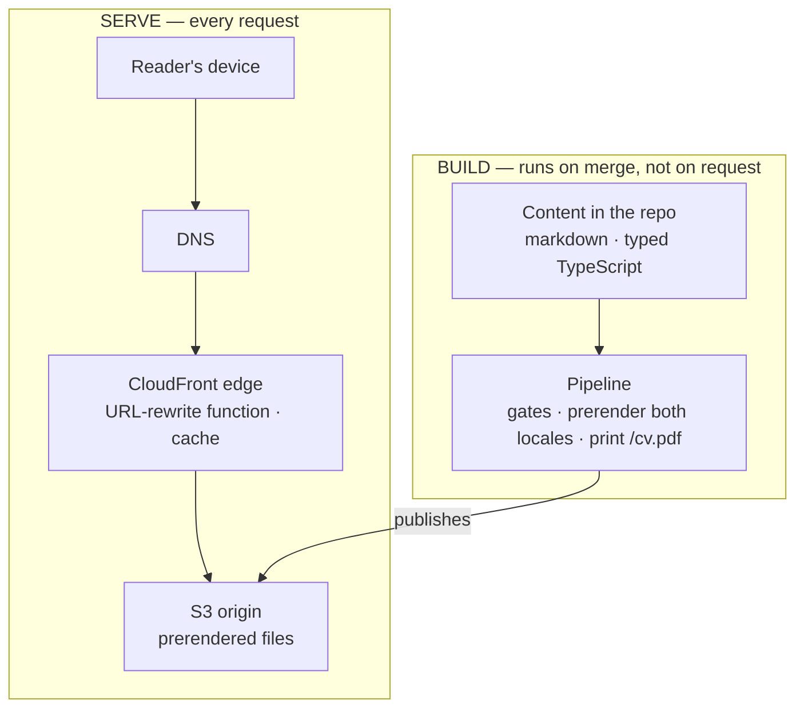
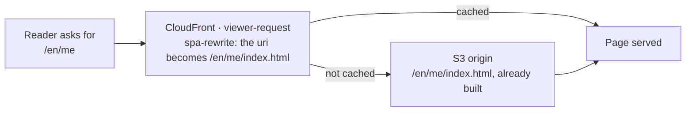
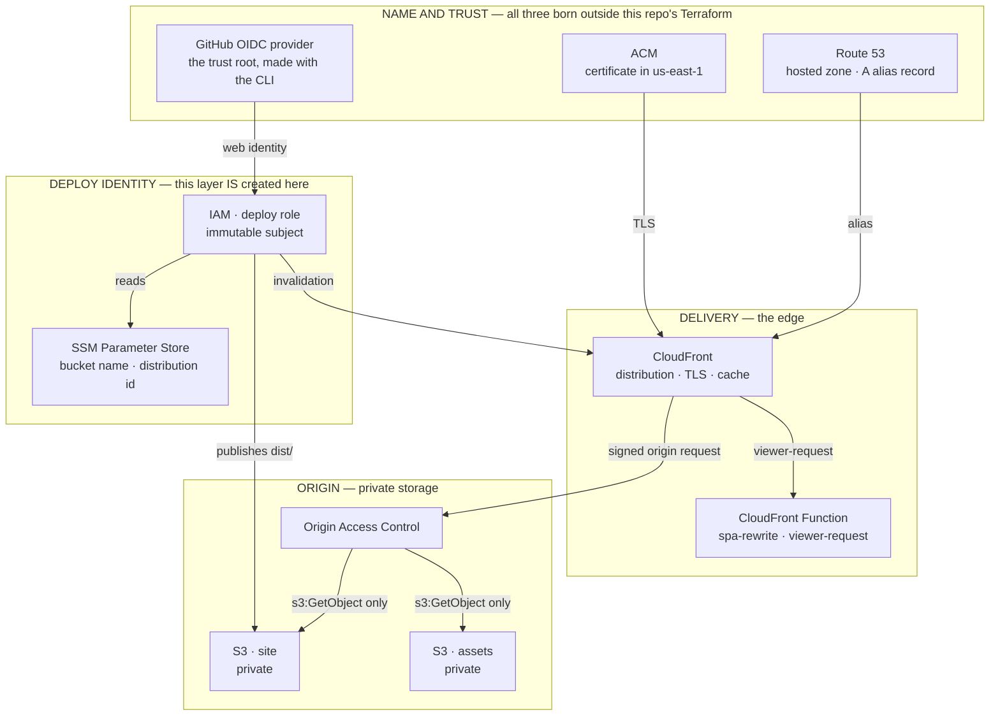
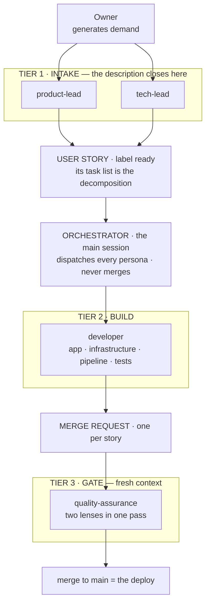
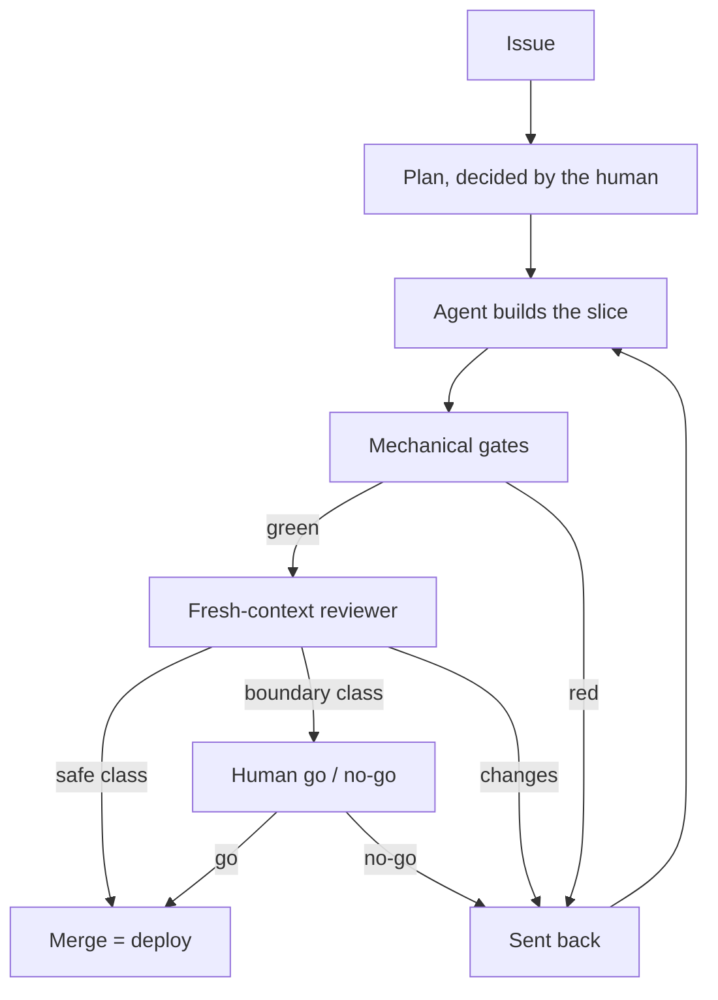
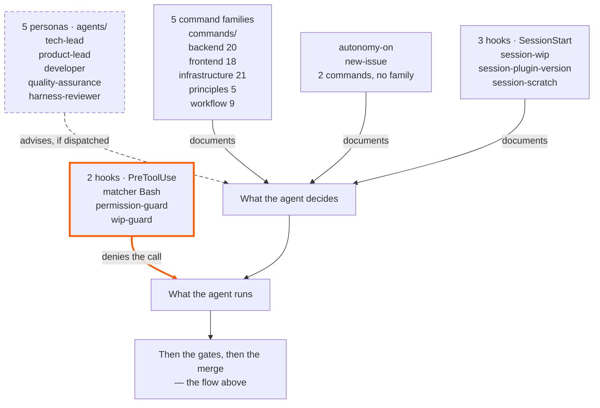

_This site is the argument. This page is the blueprint — how it's built, and how you'd build your own._

## Three things

This is three things.

- **A static site.** React, Vite and TypeScript in a bucket behind CloudFront — no server, no database, no auth. It is what you are reading right now.
- **A dev-loop plugin.** The personas, the hooks and the commands that decide *how* the work gets done: versioned in a separate repository, installable in any project, and what it delivers is a verification that does not depend on whoever wrote the code.
- **An agent runtime.** Claude Code, which runs that — the orchestrator, the subagents, the permission floor. It is the one of the three I did not write.

These are not three products. **It is one thing**, and this site is what it produces in public.

On a proof-of-engineering site the code is the pitch, and what it owes a reader is not the output — it is the machine that produced the output. So the honest thing is to show the whole build, in the open: the architecture below, the decisions that shaped it (each one recorded as an ADR), and the reusable layer that lets you replicate it. I build this the way I want to be hired to build: AI-native development with the SDLC rigor most AI work skips — Claude Code, Kiro, a loop built on AI-DLC & Agent Harness Engineering.


### The three pillars, and what sits in the intersection

The three are not tiers of one system, and that is what the drawing below exists to make obvious: **each one exists without the other two**. The site runs without the plugin. The plugin installs in any repository. The runtime is not mine. What sits in the middle is the one thing none of the three delivers on its own.

```venn
accTitle: The three pillars, and what sits in the intersection
accDescr: Three circles of the same size, overlapping, with one shared intersection at the centre. The first circle is the solution, the tadeumendonca-io repository, and inside it sit the React SPA built with Vite and TypeScript, the Terraform that provisions CloudFront and S3, the pipeline with its gates and its deploy, and the markdown content held in the repository itself. The second is the harness customization, the tadeumendonca-skills repository, and inside it sit the personas in the agents directory, the hooks registered in hooks.json, the skill library in the commands directory, the commands in no family — autonomy-on and new-issue — and the methodology ADRs. The third is the harness runtime, Claude Code, and inside it sit the orchestrator and the subagents, the PreToolUse and SessionStart events, the permission policy, and the tools with MCP. At the centre, where all three overlap, it reads Agent Harness Engineering, with the word Agent in parentheses. That is the claim the drawing makes: none of the three circles is the discipline on its own, it is what exists where the three meet.
centre: (Agent) Harness | Engineering
pillar: The solution | tadeumendonca-io
- React SPA · Vite · TS
- Terraform: CloudFront, S3
- Pipeline: gates, deploy
- Markdown in the repo
pillar: The customization | tadeumendonca-skills
- Personas in agents/
- Hooks in hooks.json
- Skills in commands/
- Commands in no family
- Methodology ADRs
pillar: The runtime | Claude Code
- Orchestrator, subagents
- PreToolUse · SessionStart
- The permission policy
- Tools and MCP
```

What sits in the intersection is the actual work: deciding what the harness **refuses**, what it **advises** and what it only **documents** — and then proving the inventory of that is still true. `Agent` is in parentheses on purpose: *harness engineering* is commonly said today for the practice alone, and the brackets tie one term to the other without pretending they are two different things.

The topics inside each circle are that pillar's **inventory**; what each one **delivers** has a section of its own further down, and it is worth naming which is which: the site's is *What the site does, from the reader's side*; the customization's is *The four harness elements*; the runtime's is *The orchestrator is the part of the harness you cannot install*.

## The shape

A fully static SPA — React + Vite + TypeScript — served from **S3 behind CloudFront**, with a small CloudFront Function rewriting clean URLs. No backend: no server, no database, no auth. Cost near-zero, attack surface minimal, nothing to keep running at 3am.

*(→ [ADR-0002](https://github.com/tedeuxx/tadeumendonca-io/blob/main/docs/adr/0002-fully-static-spa-no-backend.md) fully static / no backend · [ADR-0013](https://github.com/tedeuxx/tadeumendonca-io/blob/main/docs/adr/0013-s3-cloudfront-hosting.md) S3 + CloudFront)*

In layers, and **the interesting thing about this picture is what is not in it** — there is no application tier and no data tier, because everything that would normally live at runtime happens at build time instead:



**The absence is the design, not a gap.** A layer diagram for a system like this usually continues into an application tier, a database and internal integrations; here it stops at a bucket. The only third party at runtime is analytics, and it is consent-gated. What a backend would do per request — resolve content, render HTML, build the OG tags — happens once, in the build lane, and ships as files.

*(→ [ADR-0033](https://github.com/tedeuxx/tadeumendonca-io/blob/main/docs/adr/0033-ga4-consent-gated-analytics.md) consent-gated analytics)*

That is also why the bill below is what it is: **the domain and the hosted zone bill whether anyone comes or not, and what a visit adds on top of them rounds to nothing.**

What none of that places is where a clean URL becomes a file:



**"No backend" raises one question before all others — how does a crawler see this — and the answer is that nothing has to run for it to.** A search engine or an unfurl scraper asks for a URL and gets **complete HTML with the OG tags already in it**, straight from a static file, not an empty shell that only becomes a page once JavaScript runs. **Nothing is assembled when it asks**: every route is rendered once, at build, in both languages. No SSR, no edge rendering — the function above rewrites a URL and does nothing else.

The limit travels with the claim, because it is the part a reader can falsify: **a URL that does not exist answers 200, not 404 — and what comes back is the landing page**, complete with the landing page's own OG tags, under an address that was never real. CloudFront maps `403` and `404` onto `/index.html`, which is what lets a SPA work on deep routes and is a real trade rather than a detail. So a scraper unfurling a bad link to this site gets a plausible card for the home page instead of an error. It has bitten here once: a path misroute sent the per-article OG images into that same fallback, and each one answered `200 text/html` to every scraper that asked.

*(→ [ADR-0004](https://github.com/tedeuxx/tadeumendonca-io/blob/main/docs/adr/0004-build-time-render-not-ssr-or-edge.md) build-time render, no SSR · [ADR-0005](https://github.com/tedeuxx/tadeumendonca-io/blob/main/docs/adr/0005-og-coverage-every-public-url.md) every URL OG-complete)*

### The AWS stack, layer by layer

The two drawings above show **time** — when each thing happens. This one shows **inventory**: which AWS services are live, and which layer each one sits in. Every one of them is named somewhere in this page's prose, and the bill below charges for some of them; no drawing had them together.



Two things here are worth saying out loud. **The whole first layer is born outside this repository's Terraform.** The hosted zone and the certificate already exist in the account and arrive as `data source`s — a choice rather than an omission: they survive a full `destroy` of this stack, which is why the hosted zone's USD 0.50 line would keep billing with no site at all. And the OIDC provider, which is the trust root, is made by hand with the AWS CLI and **stays outside Terraform permanently** — the why is further down, along with the uncomfortable part of admitting it. What is created here is the *role*, not the provider. The second: the site bucket **is not public in any sense** — its policy allows `s3:GetObject` only for the CloudFront service, and only when the `AWS:SourceArn` is this distribution's.

The only logic that runs between a reader and a file is the function in the second layer: [ten executable lines](https://github.com/tedeuxx/tadeumendonca-io/blob/main/iac/cloudfront-functions/spa-rewrite.js), with [their own unit tests](https://github.com/tedeuxx/tadeumendonca-io/blob/main/apps/fed/scripts/spa-rewrite.test.mjs) and a [post-deploy check](https://github.com/tedeuxx/tadeumendonca-io/blob/main/.github/workflows/deploy.yml) that the live function still matches this repo.

*(→ [`iac/frontend.tf`](https://github.com/tedeuxx/tadeumendonca-io/blob/main/iac/frontend.tf) the distribution, the function and the bucket policies · [`iac/iam.tf`](https://github.com/tedeuxx/tadeumendonca-io/blob/main/iac/iam.tf) the deploy role and the OIDC subject)*

## Why this site exists

To learn AI you have to build the use cases. You do not learn without them. Everything needs a user, an application, a feature, a business case — and that is where I keep seeing the gap. In the AI work I have been close to, the modelling is strong and the other half is thin: systems integration, legacy that cannot be replaced, the ordinary complications of corporate IT. That other half is where I have spent eighteen years. This site is a use case, and the open repository lets anyone check it.

I started the year lost. A project that was not going well, a pile of catch-up obligations on AI tooling, and things degraded until I took my holiday. And there is a detail I suspect a lot of senior engineers are living through and not saying out loud: **I had the agentic development tools in hand — Claude Code, Kiro — and still felt outside the hype.**

And there is a reason this is public rather than a notebook. We live in a world with far too many configuration options — which harness, which hooks, which persona, which gate, which model — and nobody has enough sessions to test them all alone. **Trading each other's experience of using AI is what will speed that learning up**, and it is why what is here is the whole setup, in the open, rather than only the conclusion it reached.


Building software is what I love. Nothing is more fun to me than seeing an application up and running, looking just right. What these tools gave back was exactly that, at a scale I could not reach on my own.

> "Computer programming is an art, because it applies accumulated knowledge to the world,
> because it requires skill and ingenuity, and especially because it produces objects of beauty."
>
> — Donald Knuth, 1974


The case that proved it to me was not this site. It was an authentication and authorization mechanism with dense business rules, custom-built on Spring Boot and Spring Security, integrating legacy systems. I started building it on the side, coming back from my holiday, and it grew and matured from there. **I would never have delivered that mechanism without an agentic development tool** — and it was not only the deadline. I was carrying tech-lead responsibilities on that project **at the same time** as doing the hands-on agent development, in parallel. That is what the tool bought: not typing speed, but both of those fitting into the same week.

Since then I have worked on two fronts: an internal one, at my job, with **Kiro**, and this one, in public, with **Claude Code**. The split is deliberate — two different harnesses running the same kind of work is what lets me compare them, and it is how you separate what comes from the model from what comes from the setup around it. During working hours, I don't always get to work directly on building digital products, and that is where I want to spend more of my time. I like building apps.


San Francisco and the Valley, May 2026. There was not a place I passed through without some AI offering in it — on the train, on the street, in a shop window, on the lanyard of the person next to me. I came back from that week with both fronts decided.

*The photographs on this page are mine. One week, one city — this is not a survey; it is what was in front of me.*

## Who did what

Working with an autonomous team of agents is part of this site's purpose, so the split is worth stating precisely — with no hour count, because I did not track hours and an invented number would be worth nothing.

**Mine:** the idea, the product, the content — mine even where they polished it — the site's voice, the agent architecture, the harness configuration and the experimentation with setups, the architecture patterns.
**The agent team's:** drafting the development and the code.

But the method is not dispatch. It starts from my idea. Then I **listen to how they would do it**, and shape that against my architectural judgement and my distributed-systems experience. The authorship stays mine; it is simply exercised after listening.

And listening pays. They carry more seniority than I do in the frameworks and languages this is built in — I add architecture and direction. **I recurrently learn ways to use AWS services I did not know were possible.** On this site it was Lambda@Edge OG rendering: I had no idea it could stand in for SSR and solve crawler indexing. On another system it was semantic search on Amazon S3 Vectors: I did not know you could assemble it from serverless pieces and pay on demand, instead of for a provisioned OpenSearch cluster running around the clock. The trade is throughput and latency — AWS itself positions the two as tiers, not as alternatives.

The irony of that first example sits two sections down: that Lambda@Edge has a decision on record, and it was **cut**. It worked, it taught me something, and then it proved unnecessary — build-time prerendering delivers the same served HTML with nothing running. Both are true at once.

*(→ [ADR-0026](https://github.com/tedeuxx/tadeumendonca-io/blob/main/docs/adr/0026-superseded-lambda-edge-og.md) Lambda@Edge OG, superseded)*

In people, everything above cost one person. Weekends, alongside consulting work.

## USD 6.57 a month

This figure measures what the site **added**, not what it **depends on**: subscriptions that already existed and would bill the same if it were deleted tomorrow stay out. And it measures what the site **runs on**, not what I **build** it with. What follows returns to both. Without that scope, "USD 6.57" is a loose number, and a loose number is not checkable.

"Near-zero" is the easiest claim on this page to make and the easiest to leave unchecked. So here is the AWS bill — the serving lines read from the account's daily cost in **late July 2026**, the registration read from the registrar's price list, neither estimated:

- **The domain** — USD 71.00/yr for the `.io`, an annual charge that lands in one month. **USD 5.92/month** amortized.
- **Route 53** — USD 0.50/month, fixed. The hosted zone, whether or not anyone visits.
- **S3** — about USD 0.15/month, and it is deploy *writes*, not reads.
- **CloudFront** — effectively USD 0.00 at this traffic.

The choice is the `.io`: expensive as top-level domains go, and I picked it for branding, not for cost — that is the honest reason, and it is the single line here you can decline. Nothing else on this bill moves with the domain: the hosted zone, the bucket and the distribution do not care what it is.

### The providers that could invoice this

**Anything that bills to keep the published site up, or would bill on a condition, belongs here** — the scope is the second rule stated above: what the site **runs on**, not what I **build** it with.

- **AWS** — **USD 6.57/month**, and it is the only charge this site created; of that, the 5.92 amortized annual registration and the 0.50 fixed hosted zone bill whether anyone visits or not.
- **GitHub Team** — paid, and the subscription predates the site, though the CI load on it is entirely the site's own.
- **iCloud+** — paid, and it predates the site too; it carries the custom-domain email at the apex, and [`iac/email.tf`](https://github.com/tedeuxx/tadeumendonca-io/blob/main/iac/email.tf) provisions its MX, DKIM and SPF records, so it is not adjacent to this infrastructure, it is inside it. *(→ [ADR-0016](https://github.com/tedeuxx/tadeumendonca-io/blob/main/docs/adr/0016-custom-email-via-icloud.md) custom email via iCloud)*
- **GitHub Actions** — **zero because the repositories are public**: a property of the repos, not of the plan, so it outlives a downgrade and it does not outlive going private.
- **SonarCloud** — **zero on the same condition**, on a separate account: its free tier is for public projects, and its gate blocks a merge.
- **Terraform Cloud** — **zero because the infrastructure is small**: the last plan resolved against roughly fifty resources, and that ceiling is counted in resources, not in traffic or in spend.
- **Claude Max** — paid, and **outside the total on purpose**: it is what I build the site with, not what the site runs on.

Two of those zeros depend on the repositories staying public and one depends on the infrastructure staying small; none of them depends on traffic.

Outside the total sits every hour of mine as well: **USD 6.57 a month is what it costs to keep this running, not what it cost to build.**

## What was cut — and it was built first, which is the part that matters

The easy version of this section is *"we kept the scope tight."* That is a posture, and anyone can claim it. The true version is stronger and it is checkable: **this was not built lean. It was built full and then cut**, and every reversal is on the record with the decision that replaced it.

| removed | what it was | replaced by |
|---|---|---|
| [ADR-0025](https://github.com/tedeuxx/tadeumendonca-io/blob/main/docs/adr/0025-superseded-backend-platform.md) | Backend platform — BFF on Lambda, DynamoDB, Cognito, SES | [0002](https://github.com/tedeuxx/tadeumendonca-io/blob/main/docs/adr/0002-fully-static-spa-no-backend.md) static SPA, no backend |
| [ADR-0026](https://github.com/tedeuxx/tadeumendonca-io/blob/main/docs/adr/0026-superseded-lambda-edge-og.md) | Lambda@Edge rendering OG images per request | [0004](https://github.com/tedeuxx/tadeumendonca-io/blob/main/docs/adr/0004-build-time-render-not-ssr-or-edge.md) build-time prerender |
| [ADR-0027](https://github.com/tedeuxx/tadeumendonca-io/blob/main/docs/adr/0027-superseded-backend-link-unfurl.md) | Backend link-unfurl service for preview cards | [0004](https://github.com/tedeuxx/tadeumendonca-io/blob/main/docs/adr/0004-build-time-render-not-ssr-or-edge.md) build-time prerender |
| [ADR-0028](https://github.com/tedeuxx/tadeumendonca-io/blob/main/docs/adr/0028-superseded-gitflow-two-env.md) | GitFlow with staging and production | [0003](https://github.com/tedeuxx/tadeumendonca-io/blob/main/docs/adr/0003-trunk-based-single-environment.md) trunk, one environment |
| [ADR-0029](https://github.com/tedeuxx/tadeumendonca-io/blob/main/docs/adr/0029-superseded-offline-first-pwa.md) | Offline-first installable PWA | [0002](https://github.com/tedeuxx/tadeumendonca-io/blob/main/docs/adr/0002-fully-static-spa-no-backend.md) static SPA, no backend |

**What the objective actually needed was content**, and none of that machinery served it. A database with nothing to store. Auth with nobody to authenticate. A staging environment for a site whose revert is a merge. Each one was defensible when it was decided and none survived the question *"what is this for, here."*

### What the guardrail is actually for

Reading the bill above turned up roughly **USD 12.80 a month** the site was not using: WAF web ACLs and idle public IPv4 addresses attached to nothing, left behind when the backend was retired. More than eighty times what publishing the site costs. **Those are gone** — removed in July 2026, and the daily cost series confirms the charges stop rather than an empty console implying it. Not all of it: a residue from the same era, **under a dollar a month**, is still accruing while I work out what it holds — an account-level line, not a site one, and the honest state of this at the time of writing.

I found them by reading the bill, which is late. So what watches now is an account-wide budget in `iac/budget.tf`, and two things about it are deliberate. It is **not** scoped to this project's tags — otherwise it would only ever see spend this repo created, and this was exactly the kind it did not. And the sensitivity lives in the **thresholds**, not the ceiling: a ceiling has to be sized for your worst legitimate month, which here is the renewal month, so it is by construction deaf to anything smaller than itself. The alarm that matters fires at 15% — around USD 12, quiet at the normal run rate, and awake to any new recurring cost of roughly USD 8/month. A conventional 50/80 pair would first have spoken at USD 40, several times actual spend, and stayed silent for a year about a new USD 30/month service.

That is the transferable part, and it is two-sided: infrastructure you stop using does not stop billing, and the thing meant to catch it has to look **wider** than what you are building and **lower** than what you are afraid of.

*(→ [`iac/budget.tf`](https://github.com/tedeuxx/tadeumendonca-io/blob/main/iac/budget.tf) the budget guard)*

### If you need the backend back, the record tells you which decision to reverse

A recorded reversal is what makes the growth path concrete rather than a promise that the architecture "could scale". A system that grew into needing a server does not need this site redesigned — it needs **one specific decision reopened**, and each of the five reversals above names the one that closed it:

- **dynamic data or accounts** → reverse [0002](https://github.com/tedeuxx/tadeumendonca-io/blob/main/docs/adr/0002-fully-static-spa-no-backend.md), and 0025 is the shape it had;
- **per-request rendering** → reverse [0004](https://github.com/tedeuxx/tadeumendonca-io/blob/main/docs/adr/0004-build-time-render-not-ssr-or-edge.md); 0026 and 0027 are two things that were tried at the edge;
- **a change you cannot revert by merging** → reverse [0003](https://github.com/tedeuxx/tadeumendonca-io/blob/main/docs/adr/0003-trunk-based-single-environment.md), and 0028 is the two-environment flow it replaced.

The build lane in the diagram above is the seam: adding a server means moving work **out** of it, not bolting a tier onto the side.

## Every decision, and where it stands

**Why MADR, and why the format weighs more when the reader is an agent.** [MADR](https://adr.github.io/madr/) is a fixed-section format — context, options considered, decision, consequences — and three of its properties are the reason the library is shaped this way:

- **One decision per file.** Anyone who needs to know why there is no staging environment here reads one file, not a whole architecture document. The context spent is the decision's, not its neighbourhood's — and for an agent that is not comfort, it is the resource it has least of.
- **Fixed sections.** The "why" and the options that lost sit in predictable places, so recovering the reason for a choice does not depend on interpreting prose. That is exactly where a reader, human or not, invents the half that was missing.
- **`status` and `superseded-by`.** A reversed decision stays in the repository and **says** it was reversed. Without that, the record of a retired architecture reads as instruction — which is the cheapest way to get an agent to rebuild something that was cut on purpose. The table below carries that column, and it is where the reversed decisions appear marked rather than gone.

The limit is the usual one on this page: **nothing here retrieves an ADR by itself.** There is no semantic index and no automatic context injection; an agent reads these files because this repository's guide points at them. The format makes the reading cheap when it happens — it does not make it happen.

The table below is **not typed here**. It is generated from `docs/adr/`, committed as an artifact, and checked in CI: adding or superseding a decision without regenerating the index turns the pipeline red, so the page either matches the library or nothing ships. A hand-copied index of a library this size is stale within a week and nothing says so — this one is the same mechanism as the diagrams above, and for the same reason.

```adr-index
```

That is this page's own principle applied to the one list it cannot avoid reproducing: **link the canonical detail rather than restating it.** Every row is a link, and the decision itself lives in the record — with its context, the options that lost, and what it cost.

## Content is markdown in the repo, resolved at build

Every page's content — the CV, this page, the articles — is markdown or typed data in the repo. Each route is **prerendered** at build (a headless snapshot) so the OG/SEO tags and crawlable HTML land in the served files — no SSR, no edge rendering. The downloadable CV PDF is printed from the live `/me` by the same step.

*(→ [ADR-0004](https://github.com/tedeuxx/tadeumendonca-io/blob/main/docs/adr/0004-build-time-render-not-ssr-or-edge.md) build-time render · [ADR-0005](https://github.com/tedeuxx/tadeumendonca-io/blob/main/docs/adr/0005-og-coverage-every-public-url.md) every URL OG-complete · [ADR-0034](https://github.com/tedeuxx/tadeumendonca-io/blob/main/docs/adr/0034-build-time-cv-pdf-static-artifact.md) the CV PDF)*

## What the site does, from the reader's side

Everything above is machinery. This is what it produced — the part you can use without reading a line of any of it.

**This list is authored, not derived.** The decision index above is generated from `docs/adr/` and the harness inventory below is pinned to another repository; **this one is typed by hand and no check compares it to the code**, so it can fall behind the site in a way neither of those can. It carries no total for the same reason: a count is the first thing to go stale, and every entry below names a route you can open or a decision you can read instead.

- **Two complete editions, Portuguese and English.** Every route is first-class under `/pt` and `/en`, prerendered with its own head — so a forwarded link arrives in the language it was read in, rather than in the recipient's. *(→ [ADR-0036](https://github.com/tedeuxx/tadeumendonca-io/blob/main/docs/adr/0036-per-locale-urls-prerender-hreflang.md) per-locale URLs)*
- **An offer, never a redirect, when your browser disagrees with the URL you opened.** It is dismissible and remembered, so it does not nag — and the link someone sent you keeps working exactly as sent.
- **Articles, each with its own slug per language**, filterable on the landing by track without the address bar changing underneath you. *(→ [ADR-0037](https://github.com/tedeuxx/tadeumendonca-io/blob/main/docs/adr/0037-localized-article-slugs.md) localized article slugs)*
- **A CV at `/me`, and the same CV as a PDF** — printed from the live page during the build, so the download cannot disagree with the page it came from. *(→ [ADR-0034](https://github.com/tedeuxx/tadeumendonca-io/blob/main/docs/adr/0034-build-time-cv-pdf-static-artifact.md) the CV PDF)*
- **A portfolio at `/portfolio`**, with the bar for getting listed written down and public — [docs/catalog-ready.md](https://github.com/tedeuxx/tadeumendonca-io/blob/main/docs/catalog-ready.md), the proof-of-engineering gate.
- **A ramp-up plan at `/ramp-up`** — the reasoning, the roadmap and the exact sources for moving into AI Engineering, in the open while it is still in progress.
- **A reading shelf at `/library`** — a curated shelf rather than a list, each entry carrying what I made of it.
- **This page, at `/architecture`** — the whole build in the open: the shape it runs on, what it costs, the decisions behind it, and what was cut.
- **Share affordances that tag what they produced**, so a link's life after it leaves here is readable rather than guessed at. *(→ [ADR-0039](https://github.com/tedeuxx/tadeumendonca-io/blob/main/docs/adr/0039-share-campaign-tagging.md) share campaign tagging)*
- **Videos that load nothing until you ask.** A video inside an article is a facade over a poster generated at build and served from this origin; no third-party frame, cookie or request happens before the click.
- **Analytics that waits for consent** — inert until you say yes. *(→ [ADR-0033](https://github.com/tedeuxx/tadeumendonca-io/blob/main/docs/adr/0033-ga4-consent-gated-analytics.md) consent-gated analytics)*

## The dev-loop is the product

The interesting part isn't the stack — it's how it's built: **agent-led verification, human-residual**. The agent proves "done" with mechanical gates and real evidence (lint, types, tests ≥85%, a green build, SonarCloud, functional E2E, a fresh-context reviewer); the human keeps the irreversible and architectural calls. That loop lives in a separate reusable plugin — **[tadeumendonca-skills](https://github.com/tedeuxx/tadeumendonca-skills)** — so it's a methodology you can adopt, not something bespoke to this site.

*(→ [ADR-0003](https://github.com/tedeuxx/tadeumendonca-io/blob/main/docs/adr/0003-trunk-based-single-environment.md) trunk-based single-environment · [ADR-0018](https://github.com/tedeuxx/tadeumendonca-io/blob/main/docs/adr/0018-ci-gates-e2e-on-pr-coverage.md) the CI gates)*

Two figures, and they answer different questions. The first is the loop's **shape**: who closes each unit of work, and in which tier.



**The tier is the unit of reconciliation, and that is what the drawing claims.** Each one hands the next a finished artifact — a closed description, a built slice, a verdict — rather than an opinion somebody has to weigh against another. That is why two personas in one tier need a reason, and why the roster is five.

The second figure is the other question: **where the human stands.**



The human appears twice, and the two appearances are different jobs. At the plan, deciding what is worth building and how — the architectural calls are never made solo. At the end, on boundary-class work only, deciding whether it ships. In between, the agent builds and the machine proves, and most changes reach production without a person in that path at all.

The picture shows the routing. What it cannot show is that the routing was **decided** — which edge the human sits on, what counts as a class boundary, where a gate is worth what it costs. That is the engineering this page is offering, more than any box in the figure.

And the cost of it, since the rest of this page states its own: what decides a change is safe is the same kind of thing that wrote the change. Mis-classify one and it takes the empty path. What makes that acceptable here is blast radius, not confidence — this is a static site, and a revert is a merge.

### What the loop is made of, and what each part can actually do

The two pictures above answer *how work moves* and *who closes each step*. Neither says what the loop is **made of** — and that is the question a reader deciding whether to adopt it is actually asking. This is a third drawing on purpose: one that tried to be all three would have to give a hook that refuses a command and a lens somebody has to remember to invoke the same arrow, and that difference is the most useful thing on this page.



**Of the plugin's own components, exactly one kind can stop you**, and that is the honest version of the adoption pitch. (The box that is *not* a plugin component — *Then the gates, then the merge* — is a pointer back to the first diagram, and those gates certainly do stop you: SonarCloud and the terminal `build-test` check block a merge outright. They live in this repo's workflows rather than in the plugin, which is why they are not rows in the inventory.) The parts, and what each one can actually do:

- **Two of the five hooks run on `PreToolUse`.** The agent runtime calls them *before* a tool runs, they return a denial, and the command does not happen. **They are the floor.**
- **The other three run at `SessionStart`**, an event that hands a hook no tool call to refuse, which is why they are not drawn as a floor. **The class says** what a session-start hook *cannot stop*, not that it merely watches — a hook on that event runs before the first tool call and can act, and this drawing has no shape for that. **And one of them acts:** `session-wip` and `session-plugin-version` only report; `session-scratch` empties the scratch directory. That is a fact about each script, not a property of the event, **and that is why** the drawing cannot be read as a promise about what they do.
- **The personas advise**, and *advise* is a claim about the judgement they produce, not about where they sit: one of them, `quality-assurance`, has a mechanically enforced seat — the same permission hook lets only that agent type run the merge command — and being the only one who *may* merge is a different property from being checked on how it merged. `product-lead` is the mirror image of that: it **blocks** a merge when it finds a published claim that is untrue — but by convention rather than by hook, so nothing refuses the merge command on its behalf and the drawing cannot honestly show it as a floor. Nothing checks the judgement in either case, and this repo's own guide says in as many words that a lens nobody dispatches *fails silently*.
- **The commands are neither** — they are the written form of a decision already taken, so nobody re-litigates it at 2am.

**Rename a persona in the plugin and this repository's build goes red.** The drawing above is authored by hand: a test compares it, node by node and count by count, against a [committed manifest](https://github.com/tedeuxx/tadeumendonca-io/blob/main/apps/fed/src/content/generated/harness.json), in both editions; and a [CI job](https://github.com/tedeuxx/tadeumendonca-io/blob/main/.github/workflows/app.yml) compares that manifest against the plugin's live tree.

*(→ [ADR-0043](https://github.com/tedeuxx/tadeumendonca-io/blob/main/docs/adr/0043-harness-inventory-derived-from-plugin-repo.md) the inventory pinned to the plugin)*

That mechanism is also where the two terms in the opening paragraph land — and they do not land the same way, which is worth being exact about. **AI-DLC** is not mine: it is AWS's name for a delivery lifecycle whose stages are run and verified by agents rather than around them, and the first diagram is what practising it looks like here. **Agent Harness Engineering** is the claim I am making, and it is this picture — that the harness is a thing you build, count and check, rather than a way of prompting. Adopting a methodology costs nothing to say; the second one has to be paid for, and the payment is that it can be inventoried at all, from the repository it lives in, with a build that breaks when the inventory stops being true.

### The four harness elements, and what each one delivers

The list above is about **force** — what each kind of component can and cannot stop. This is the other question, and it is the one somebody assessing the setup asks first: **what each element delivers to the value of the whole solution**. Every item points at the live file or directory in the plugin repository, because that is where the detail lives.

- **[Agents](https://github.com/tedeuxx/tadeumendonca-skills/tree/main/agents)** — a subagent is a runtime feature, and it is the only one that trades context for a verdict: the whole execution stays inside the subagent's session and what comes back is the conclusion. What that delivers to the architecture is a review in a **fresh context**, without the bias of whoever wrote the thing — the property no self-review instruction can produce, because the author and the judge would be the same context.
- **[The persona pyramid](https://github.com/tedeuxx/tadeumendonca-skills/blob/main/docs/dev-loop-design.md)** — the five personas are not on one plane: two leads that disagree by construction on top, one builder in the middle, one gate underneath. What it delivers is **disagreement where it is useful and a handoff where it is not** — and the rule that decides which is explicit, reconciliation cost is paid *within* a tier rather than across tiers, and it is what held the roster at five instead of nineteen.
- **[Hooks](https://github.com/tedeuxx/tadeumendonca-skills/tree/main/hooks/scripts)** — the only part of the plugin that runs code and **refuses**. Two answer on `PreToolUse`, before the tool happens; the three on `SessionStart` run before the first call — two report and one empties the scratch directory. What they deliver is the irreversible floor without depending on anyone remembering it, and the record of which event calls which script is [`hooks/hooks.json`](https://github.com/tedeuxx/tadeumendonca-skills/blob/main/hooks/hooks.json).
- **[Commands and skills](https://github.com/tedeuxx/tadeumendonca-skills/tree/main/commands)** — each file is a decision already taken, written down: which AWS service for which scenario, which gate blocks, how a version is cut. The ones that hold for any repository live in [`commands/principles`](https://github.com/tedeuxx/tadeumendonca-skills/tree/main/commands/principles). What they deliver is **the absence of a re-decision** — and since the plugin is installed rather than read off disk, one of the session hooks reports which build is actually running, because a skill that was fixed and not reloaded is a skill that had no effect.

### The orchestrator is the part of the harness you cannot install

It is in none of the inventory above — not in the drawing, not in the manifest — and it is the main session: the context that reads an Issue, decides which persona to dispatch, and weighs what comes back. Be exact about what is missing, because this is the sentence an adopter acts on and the plugin is **not** silent about it. Its README draws the orchestrator as a node and warns that it is *a relay, and relays distort*; `autonomy-on` is a shipped command whose subject is the orchestrator's dispatch policy. So the **actor** is not a plugin component, its **policy** partly is, and what you supply is the context that runs it — which is the half worth knowing about before you adopt anything.

It is also the party the capability boundaries above are drawn *against*. `permission-guard` refuses the merge command from every agent type except `quality-assurance`, and the gloss on the persona edge — *advises, if dispatched* — names dispatch as the failure mode without naming who dispatches. That is the orchestrator, and a lens it forgets is a lens nobody ran.

**And its context runs out.** That is the constraint the rest is drawn around: the main session has a finite window, and everything it reads stays in there until the window blows.

That is what a subagent buys. It reads, runs, gets it wrong and redoes it **inside its own session**; what reaches the orchestrator is the conclusion. A task costs the orchestrator **its verdict, not its execution** — which is why the one real lever this harness has is verdict length, turned by writing the persona briefs.

I measured it once, on this repo's own session, on 7–8 August 2026, **by parsing the session transcripts**: what stayed inside the subagents was **over an order of magnitude** more than what came back. And the saving has a ceiling — even so, the returned verdicts were a **large slice of everything the orchestrator took in from a tool**. It is not an escape: this session compacted twice anyway. The number is not published, because the input is a private session transcript that no gate can reach.

### What the Claude Code workspace adds, and where each part actually lives

The plugin is the half you can install. The workspace around it adds more, and the parts below are named at deliberately different strengths, because only one of them is in a repository at all. That ordering is the useful part: it is the same distinction the inventory above draws between something that can stop you and something somebody has to remember.

**Publication is scaffolded, and the load-bearing part is a refusal.** [`gen-distribution.mjs`](https://github.com/tedeuxx/tadeumendonca-io/blob/main/apps/fed/scripts/gen-distribution.mjs) drafts the LinkedIn and the X post for an article from that article's own frontmatter, writes them to a gitignored directory, and never overwrites one I have already voiced. **It is not automated publishing and must not be read as any**: it posts nothing and holds no credential, because ADR-0038 considered automating the fan-out and rejected it — a class of unattended public writes is not worth the two drafts it saves, and every post is still approved by hand. What it does mechanically is decline: it resolves the share URL by **looking it up in the prerendered route list** and throws when nothing matches, rather than emitting a link to a page no scraper can read OG tags from. A generator that refuses is worth more here than one that produces.

*(→ [ADR-0038](https://github.com/tedeuxx/tadeumendonca-io/blob/main/docs/adr/0038-content-distribution-linkedin-and-x.md) both surfaces, drafted and never posted unattended)*

**Remote control is a preference on my account, not configuration of this repository** — and the distinction is the whole reason it is written this way rather than the obvious way. It attaches to the session already running on my workstation, which is what lets me follow a run and unblock it from anywhere without the session stopping. **The artifact is in neither repository.** Fork this and you get none of it, because there is nothing to get: it is a user-scope setting, so it travels with me and not with the code, and presenting it as part of the harness would be dressing an operating habit as something you could adopt.

**Artifacts is weaker still, and is offered here only as testimony.** It is a vendor surface with no row in the manifest — `grep -rn -i "claude artifact"` across the plugin returns nothing at all. So what I can honestly say is first-person and nothing more: I use it to hold a draft where I can keep looking at it while a session moves past. That is a sentence about how I work, not a property of this architecture.

### Who works on this, and what each one argues against

The agents are the part of this that reads most like a staffing plan and is least like one. **A persona exists where a disagreement is wanted** — not where an org chart has a box — and that single criterion is what took the roster from nineteen down to six and then to five. A later amendment widened the criterion to four reasons rather than one, because two moves had already been made that the one-line version could not explain. One of the four is that the orchestrator's context is a finite resource the design spends deliberately — and the plural matters: *"five because of the context window"* is a simplification ADR-0002's own amendments, linked below, refuse.

| who | what it owns | what it argues against |
|---|---|---|
| `product-lead` | the reader, value, order, slice size — and positioning, voice, and the truth of anything published | `tech-lead`; and it is the one lens that **blocks** rather than advises, on a published claim that is untrue |
| `tech-lead` | architecture, measurement, sequencing — and it writes the ADRs | `product-lead`, by design: product-and-market and system are genuinely different optimisations |
| `developer` | the slice end to end — app, infrastructure, pipeline, and the tests written as it goes | nothing. It builds, and it is what the gate is pointed at |
| `quality-assurance` | delivery against the Definition of Done, and separately whether a change can break production | `developer`, on both axes in one pass — and it is the only one the permission hook lets merge |
| `harness-reviewer` | the machinery itself: hooks, permissions, briefs, commands, the plugin | **me** — and that is the interesting case |

**`harness-reviewer` is the one that does not fit the rule as first written**, which is why the rule was widened instead of defended. Its counterpart is not another persona; it is me wearing the harness-engineer hat, which is the one seat in this loop that had nobody to argue with. Second-order effects of a configuration change are invisible from inside the change — that is the whole reason it exists. It gates nothing, and nothing forces it to be dispatched, so it fails the same silent way every lens here does.

The moves, and what each cut cost, are recorded rather than summarised here: [ADR-0002's amendments](https://github.com/tedeuxx/tadeumendonca-skills/blob/main/docs/adr/0002-agentic-dev-loop-architecture.md) and [the harness-agnostic design](https://github.com/tedeuxx/tadeumendonca-skills/blob/main/docs/dev-loop-design.md), both in the plugin repository. That is this page's rule applied again — link the canonical detail rather than restate it.

**And this table is authored, unlike the persona names in the drawing above.** Those are compared against the manifest and against the plugin's live tree, so retiring a persona reddens a build here. Nothing compares *this* table to anything. If a role changes hands, the drawing goes red and these rows quietly do not.

### Where the loop's own documentation lives

**No generator covers it**, so what stands here points at the live tree — the freshest index available, and the one that costs nothing to keep true:

- **[the methodology decision library](https://github.com/tedeuxx/tadeumendonca-skills/tree/main/docs/adr)** — the loop's own ADRs, the ones that decide how work is decided, kept separately from this site's product decisions above.
- **[the harness-agnostic design](https://github.com/tedeuxx/tadeumendonca-skills/blob/main/docs/dev-loop-design.md)** — the loop written down without reference to any particular agent runtime, which is the document to read if you are adopting rather than inspecting.
- **[the original proposal](https://github.com/tedeuxx/tadeumendonca-skills/blob/main/docs/proposals/agentic-dev-loop.md)** — where all of it was argued before any of it existed.

## The decision record IS the documentation

No separate architecture doc that drifts. A load-bearing decision — and the reversed ones, kept as history — becomes an **Architecture Decision Record**, with one known exception recorded further down, read through the library's keystone: *lean by design, calibrated to strategy.* The real "why" behind anything above is there, dated, with its trade-off.

*(→ [the decision library](https://github.com/tedeuxx/tadeumendonca-io/blob/main/docs/adr/README.md) · [ADR-0001](https://github.com/tedeuxx/tadeumendonca-io/blob/main/docs/adr/0001-lean-by-design-calibrated-to-strategy.md) lean by design)*

## Replicate it for your own context

It's all public — two repos, no secrets:

[https://github.com/tedeuxx/tadeumendonca-io](https://github.com/tedeuxx/tadeumendonca-io)

[https://github.com/tedeuxx/tadeumendonca-skills](https://github.com/tedeuxx/tadeumendonca-skills)

### Where the setup lives, and why not here

The fork-to-live steps are in the READMEs, not on this page. That is the same rule the rest of this page runs on: it links canonical detail rather than restating it. A step-by-step guide living here would be a second copy of what a README owns — and the copy that used to be here had already gone stale, describing workflows that had been renamed underneath it.

- **[This repo's README](https://github.com/tedeuxx/tadeumendonca-io#fork-to-live)** — the cloud path end to end, from the domain to the first merge.
- **[The plugin's README](https://github.com/tedeuxx/tadeumendonca-skills#run-it)** — the loop half, which installs with no cloud account and nothing to deploy.

**Why OIDC, and not a key.** The obvious alternative is to mint an access key pair for an IAM user and store it as a GitHub secret. It works on day one, and it is a long-lived credential living in a system that is not mine: it is valid until somebody revokes it, it travels wherever that job's log leaks to, and rotation becomes a human process nobody performs on time. With OIDC there is **no stored secret**: the runner presents a token GitHub signs for that job, AWS exchanges that token for **temporary** credentials on the role, and they expire on their own with nobody revoking anything. What stays in the repository is the role ARN, which is not a secret.

That changes what a leak means, and it is the whole reason for the decision. A leaked key is access until it is revoked. A leaked token is access until it expires — **and only if whoever took it can also satisfy the trust condition**, which here is that repository's exact subject and nothing else. Less standing privilege, nothing to rotate, and the blast radius bounded by the role's policy rather than by how fast somebody notices. The trade is that the root of that trust has to be created outside, and the next paragraph is about exactly that.

**Terraform here does not create the GitHub OIDC provider, nor the role that runs Terraform itself.** Those are created out of band, with the AWS CLI, and they stay outside Terraform permanently. There are two independent reasons and only one of them would ever go away: the first run would need the credential it has not created yet, and — the one that does not expire — a role able to rewrite its own trust policy has no ceiling on it. The record holds both, along with the part that is uncomfortable to write down: this is a documented hole in a floor, the hand path reopens every time that role's policy is revised, and no `plan` will ever tell you it has drifted.

*(→ [ADR-0042](https://github.com/tedeuxx/tadeumendonca-io/blob/main/docs/adr/0042-trust-root-bootstrapped-out-of-band.md) trust root outside Terraform)*

**The roles trust an *immutable* subject** — by numeric ID rather than by name, because a name can be transferred to someone else and the IDs cannot. It is the step most likely to cost you an afternoon, since getting it wrong fails as an unhelpful `sts:AssumeRoleWithWebIdentity` denial. The exact form, the trade-off, and the rename that taught it are on record.

*(→ [ADR-0015](https://github.com/tedeuxx/tadeumendonca-io/blob/main/docs/adr/0015-oidc-immutable-subject-least-privilege.md) immutable subject)*

The part I would be nervous seeing someone copy without the rest is **merging straight to production**. Trunk-based with a single environment is fast and unforgiving in equal measure; without the gates in front of it, only the second half survives.

## Where this approach still does not prove what it promises

Everything above argues for one thing: **AI-DLC** — a delivery lifecycle whose stages are run and verified by agents, with the human in the residual. The promise of that approach is that "done" is **proved by mechanism** rather than asserted by whoever built it. A page that only showed where that works would be marketing. So this section is the inverse, and it is part of the argument rather than an appendix to it: **where agent-led verification does not yet reach, and what still rests on my word.**

**One author, and nobody else's hands.** This is a single-author site, tuned to one person's positioning — not a general-purpose template, and no one else has ever worked on it. Nothing here has been tested against a second person disagreeing with the setup, which is precisely the case an agent loop finds hardest. Take the pattern, not the specifics.

**The drawings show the shape of a thing, not a run of it** — and that is the exact boundary of what a gate can verify. Seven drawings above; **four** of them you can check, at different strengths. That the request path is what the edge actually does: the function, its tests and the post-deploy comparison are linked. That the layers and the AWS stack are what this repo actually builds: `iac/` and the build script settle it between them — with the caveat the drawing itself carries, that the hosted zone and the certificate arrive as `data source`s and are not created here. That the harness has the parts the inventory names: a build here fails when it stops matching the plugin repo — but **late**, since nothing here can see a merge over there, and only for the parts that are *names*, never for what those parts do. **The other three you cannot check, for different reasons.** The two loop drawings show a route this page does not prove was taken: no artifact here shows that any particular change passed through those tiers. And the three-pillar one is no mechanism at all — it is the cut I see the problem through, and a cut cannot be wrong the way an infrastructure drawing can. This is exactly where AI-DLC is still a claim: **the machine proves the slice, and it does not prove the method.**

**And the record itself has a hole — it is the exception announced further up.** There were **two** web ACLs — one at the CloudFront edge and the regional one — and only the regional one has an ADR. The CloudFront-scope ACL was built, was cut, and **is not in the decision library**. It is the one place this page's own rule was not followed, and its record is this sentence rather than a file. That is the weakness, stated in full: **an announced exception costs less than a recorded decision** — no date, no context, none of the options that lost, and no gate counts it. Which is why it lives here, beside what rests on my word, rather than in the table above.

**And there is the half of the workspace no repository holds.** Remote control is a setting on my account and artifacts is a vendor surface with no row in the manifest; a `grep` for it across the plugin returns nothing, which is the check and also the answer. Both are marked as testimony, and a fork of this repository gets neither — so, exactly like the reading above, they are things you can take my word for or not, and nothing here will settle it.
