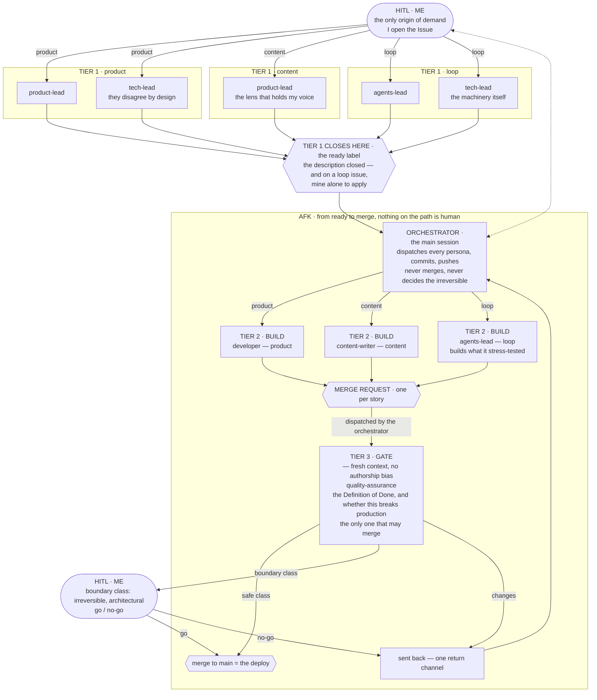
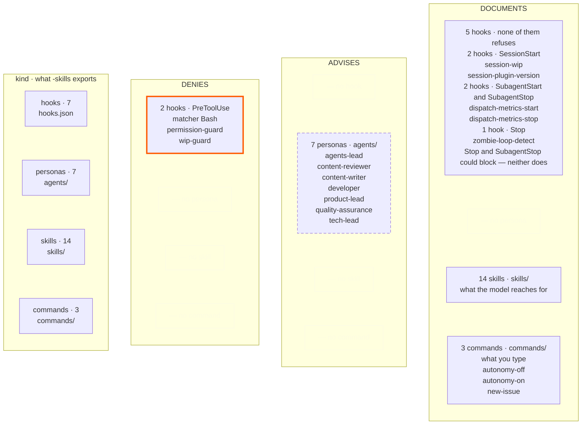

_This site is the argument. This page is the blueprint — how it's built, and how you'd build your own._

## I started the year lost

A project that was not going well, a pile of catch-up obligations on AI tooling, and things degraded until the end of the year. **Kiro** had been within reach for a while by then, and I started the year willing to learn how to use it. And there is a detail I suspect a lot of senior engineers are living through and not saying out loud: **I had the agentic development tool in hand — and still felt outside the hype.**

Because the problem was not the tool; it was where I was going to use it. At that point in the year, all the AI work I was close to split into two halves: the modelling, which is strong, and the rest — systems integration, legacy that cannot be replaced, the ordinary complications of corporate IT. That second half is where I have spent eighteen years, and it is the one with no ready-made use case to learn on — the case has to turn up on its own, in real work.

The case that turned it around was not this site. **At the beginning of the year, in January**, I started building an authentication and authorization mechanism on the side — dense business rules, custom-built on Spring Boot and Spring Security, integrating legacy systems. **I would never have delivered that without an agentic development tool** — and it was not only the deadline: I was carrying tech-lead responsibilities on that project **at the same time**. That is what the tool bought. Not typing speed: both of those fitting into the same week. And nothing is more fun to me than seeing an application running beautifully — at a scale I could not reach on my own. That was where I saw something I had not seen in a long time: if the requirement is where I stay and the code is worked by AI-DLC, a software engineering project can be more audacious. Not as a forecast — as what I saw at that moment, with the thing running in front of me.

> "Computer programming is an art, because it applies accumulated knowledge to the world,
> because it requires skill and ingenuity, and especially because it produces objects of beauty."
>
> — Donald Knuth, 1974


**The holiday was in May, in San Francisco and the Valley, and the rest of this page comes out of it.** There was not a place I passed through without some AI offering in it — on the train, on the street, in a shop window, on the lanyard of the person next to me. I came back with the idea of what to do, and since then I have run it on two fronts: an internal one, at work, with **Kiro**, and this one, in public, with **Claude Code**. Two harnesses running the same kind of work is what lets me separate what comes from the model from what comes from the setup around it.

One morning I took the Caltrain south — 8:57, next stop Palo Alto. The carriage was open laptops end to end, loops running, people trading ideas out loud on the way to work. It was not an event, not a community, nothing arranged. What I concluded from that, rather than saw: a lot of people doing the same kind of work, in the same place, at the same time — close enough to overhear without asking and to answer without scheduling. I was inside that for one week, in May. The rest of the year, I am not.

![A montage of three frames from the same week: on the left, me and my partner on a paved walkway beside a row of red, yellow and turquoise bicycles, with trees and a clear sky behind; top right, the onboard display in a Caltrain carriage, reading "Southbound · 510 EXPRESS · 8:57a" and, below it, "NEXT STOP Palo Alto"; bottom right, a museum case holding a 2007 iPhone taken apart behind acrylic, its components labelled — camera, light sensor, mic, speaker, SIM, vibrator — under the legend "iPhone · INTRODUCED IN JUN 2007".](/photos/may-week-montage.jpg "One week, in May: Google's visitor centre in Mountain View, the 8:57 Caltrain south, a case at the Computer History Museum. One train, one morning, no measurement. This is not data; it is what I saw.")

Outside that week the carriage does not exist, and it is what the public front stands in for — there is a reason the front exists rather than a notebook. There are far too many configuration options — which harness, which hooks, which persona, which gate, which model — and nobody has enough sessions to test them all alone. **Trading each other's experience of using AI is what will speed that learning up**, and that is why what is here is the whole setup, not only the conclusion it reached.

## What the requirement demanded, and the architecture it justified

The requirement for this public front is short: **publish content, in two languages, with the whole build in the open.** That is what decides the architecture, the bill, and the rest of this page.

And it **was not built lean**. It was built full and then cut: there was a backend platform — BFF on Lambda, DynamoDB, Cognito, SES —, a Lambda@Edge rendering OG images per request, a link-unfurl service, GitFlow with staging and production, and an offline-first PWA. A database with nothing to store. Auth with nobody to authenticate. A staging environment for a site whose revert is a merge. Each one was defensible when it was decided, and none survived the question *"what is this for, here"* — and every reversal is on the record with the decision that replaced it: [0025](https://github.com/tedeuxx/tadeumendonca-io/blob/main/docs/adr/0025-superseded-backend-platform.md), [0026](https://github.com/tedeuxx/tadeumendonca-io/blob/main/docs/adr/0026-superseded-lambda-edge-og.md), [0027](https://github.com/tedeuxx/tadeumendonca-io/blob/main/docs/adr/0027-superseded-backend-link-unfurl.md), [0028](https://github.com/tedeuxx/tadeumendonca-io/blob/main/docs/adr/0028-superseded-gitflow-two-env.md), [0029](https://github.com/tedeuxx/tadeumendonca-io/blob/main/docs/adr/0029-superseded-offline-first-pwa.md).

**The cut is not this page's subject; it is the consequence.** What is left is three things — a static site, a dev-loop plugin and an agent runtime — and they are not tiers of one system: **each one exists without the other two.** The site runs without the plugin. The plugin installs in any repository. The runtime is not mine. What sits in the middle is the one thing none of the three delivers on its own — and it is where the way I build this lives, which is the way I want to be hired to build: AI-native development with the SDLC rigor most AI work skips, a loop built on AI-DLC & **(Agent) Harness Engineering**.

```venn
accTitle: The three pillars, and what sits in the intersection
accDescr: Three circles of the same size, overlapping, with one shared intersection at the centre. The first circle is the solution, the tadeumendonca-io repository, and inside it sit the React SPA built with Vite and TypeScript, the Terraform that provisions CloudFront and S3, the pipeline with its gates and its deploy, and the markdown content held in the repository itself. The second is the harness customization, the tadeumendonca-skills repository, and inside it sit the personas in the agents directory, the hooks registered in hooks.json, the skill library in the skills directory, the three commands a person types in the commands directory — autonomy-off, autonomy-on and new-issue — and the methodology ADRs. The third is the harness runtime, Claude Code, and inside it sit the orchestrator and the subagents, the PreToolUse and SessionStart events, the permission policy, and the tools with MCP. At the centre, where all three overlap, it reads Agent Harness Engineering, with the word Agent in parentheses. That is the claim the drawing makes: none of the three circles is the discipline on its own, it is what exists where the three meet.
centre: (Agent) Harness | Engineering
pillar: The solution | tadeumendonca-io
- React SPA · Vite · TS
- Terraform: CloudFront, S3
- Pipeline: gates, deploy
- Markdown in the repo
pillar: The customization | tadeumendonca-skills
- Personas in agents/
- Hooks in hooks.json
- The skill library
- Commands you type
- Methodology ADRs
pillar: The runtime | Claude Code
- Orchestrator, subagents
- PreToolUse · SessionStart
- The permission policy
- Tools and MCP
```

What sits in the intersection is the actual work: deciding what the harness **refuses**, what it **advises** and what it only **documents** — and then proving the inventory of that is still true. `Agent` is in brackets on purpose: a label has to be short and a claim has to be exact, and the brackets let one rendering do both.

**The launch showed the output. The case shows the machine.**

## Pillar 1 · the solution

A fully static SPA — React + Vite + TypeScript — served from **S3 behind CloudFront**, with a small CloudFront Function rewriting clean URLs. No server, no database, no auth. The content is markdown in the repository itself, and every route is **prerendered** at build, in both languages.

*(→ [ADR-0002](https://github.com/tedeuxx/tadeumendonca-io/blob/main/docs/adr/0002-fully-static-spa-no-backend.md) fully static / no backend · [ADR-0013](https://github.com/tedeuxx/tadeumendonca-io/blob/main/docs/adr/0013-s3-cloudfront-hosting.md) S3 + CloudFront)*

End to end, backstage included — and **the interesting thing about this picture is what is not in it**:

```mermaid
flowchart LR
  accTitle: The lanes and the tiers — what the reader meets, and what keeps it standing
  accDescr: A grid read from left to right, four columns wide — public, devices, frontend and cloud infra — with three lanes stacked inside them. The top lane is the audience, what the reader meets on the site: the public arrives from a link, the device asks for a URL, and what comes back is prerendered HTML in both locales, with the React SPA taking over afterwards and no third party loaded before the reader allows it — GA4 only on consent, YouTube only on a click. That page comes whole from the cloud infra column: Route 53, ACM, CloudFront with its rewrite function, and a private S3 bucket that answers only that distribution. Between frontend and infra there is no backend column, and that absence is the claim this drawing makes: there is no application tier, because the requirement never asked for one, and nothing of mine runs per request. The two lower lanes are the backstage, what nobody sees and what keeps the operation running. The production lane: I open the Issue and ratify the irreversible; GitHub is the console, from any device, and a claude mention runs the agent inside CI with no machine of mine switched on; the repository and the build carry the personas and the hooks that deny the call, and produce both locales and the CV PDF; Terraform applies the infrastructure pipeline-only, with state in Terraform Cloud. The operation lane is the thinnest, and it is thin as a finding rather than by design: what I measure is GA4 after consent, so whoever declines is never counted; nothing watches the reader's device, no RUM, no access log and no uptime monitor; after every deploy a smoke run hits the live apex and checks that the published function is this repository's; and over the whole account there is a budget that emails, which is the only continuous watcher there is.
  subgraph T1["PUBLIC"]
    A1["AUDIENCE<br/>readers, recruiters<br/>whoever arrived from a link"]
    B1["BACKSTAGE · production<br/>me — I open the Issue<br/>and ratify the irreversible"]
    C1["BACKSTAGE · operation<br/>what I measure:<br/>GA4 only after consent<br/>whoever declines is never counted"]
  end
  subgraph T2["DEVICES"]
    A2["browser, phone<br/>and the LinkedIn and X scrapers<br/>asking for the same URL"]
    B2["GitHub, from any device<br/>Issue, comment, PR<br/>a claude mention runs the agent in CI"]
    C2["nothing watches the device<br/>no RUM, no access log<br/>no uptime monitor"]
  end
  subgraph T3["FRONTEND"]
    A3["prerendered HTML in both locales<br/>the React SPA takes over after<br/>no third party<br/>before the reader allows it"]
    B3["the repository and the build<br/>personas in agents<br/>and hooks that deny the call<br/>both locales and the CV PDF"]
    C3["after every deploy<br/>a smoke run against the live apex<br/>and the live function checked against this repo"]
  end
  subgraph T4["CLOUD INFRA"]
    A4["Route 53 · ACM<br/>CloudFront with the rewrite function<br/>private S3, reachable only by OAC"]
    B4["Terraform, pipeline-only<br/>plan on the PR, apply on merge, over OIDC<br/>state in Terraform Cloud"]
    C4["over the whole account<br/>a budget that emails<br/>the only continuous watcher"]
  end
  A1 -- "opens a link" --> A2
  A2 -- "asks for a URL" --> A3
  A3 -- "comes whole from here —<br/>and there is no backend<br/>between the two" --> A4
  B1 -- "opens the work" --> B2
  B2 -- "starts the agent loop" --> B3
  B3 -- "publishes to the origin" --> B4
  C1 ~~~ C2
  C2 ~~~ C3
  C3 ~~~ C4
  linkStyle 2 stroke-dasharray:6 4
```



**The absence is the design, not a gap.** A picture like this, for a system like this, usually carries an application column, a database and internal integrations between the frontend and the infrastructure; here there is no column there at all, and what the reader asks for comes whole out of a bucket. The only third party at runtime is analytics, and it is consent-gated. And "no backend" raises one question before all others — how does a crawler see this — whose answer is that nothing has to be **rendered** for it to: what it asks for comes back as complete HTML, with the OG tags already in it, straight from a static file. No SSR, no edge rendering — the edge's rewrite function runs on every request for a page and touches the URL, nothing else.

The limit travels with the claim, because it is the part a reader can falsify: **a URL that does not exist answers 200, not 404 — and what comes back is the landing page**, complete with the landing page's own OG tags, under an address that was never real. CloudFront maps `403` and `404` onto `/index.html`, which is what lets a SPA work on deep routes and is a real trade rather than a detail. It has bitten here once: a path misroute sent the per-article OG images into that same fallback, and each one answered `200 text/html` to every scraper that asked.

The only logic that runs between a reader and a file is that function: [ten executable lines](https://github.com/tedeuxx/tadeumendonca-io/blob/main/iac/cloudfront-functions/spa-rewrite.js), with [their own unit tests](https://github.com/tedeuxx/tadeumendonca-io/blob/main/apps/fed/scripts/spa-rewrite.test.mjs) and a [post-deploy check](https://github.com/tedeuxx/tadeumendonca-io/blob/main/.github/workflows/deploy.yml) that the live function still matches this repo. And the bucket **is not public in any sense**: it answers `s3:GetObject` only from this distribution.

*(→ [ADR-0004](https://github.com/tedeuxx/tadeumendonca-io/blob/main/docs/adr/0004-build-time-render-not-ssr-or-edge.md) build-time render, no SSR · [ADR-0005](https://github.com/tedeuxx/tadeumendonca-io/blob/main/docs/adr/0005-og-coverage-every-public-url.md) every URL OG-complete · [ADR-0033](https://github.com/tedeuxx/tadeumendonca-io/blob/main/docs/adr/0033-ga4-consent-gated-analytics.md) consent-gated analytics · [`iac/frontend.tf`](https://github.com/tedeuxx/tadeumendonca-io/blob/main/iac/frontend.tf) the distribution and the policies)*

### USD 6.57 a month

This figure measures what the site **added**, not what it **depends on**, and it measures what the site **runs on**, not what I **build** it with. "Near-zero" is the easiest claim on this page to make and the easiest to leave unchecked — so here is the bill, with the serving lines read from the account's daily cost in **late July 2026** and the registration read from the registrar's price list. Neither estimated:

- **The domain** — USD 71.00/yr for the `.io`, an annual charge that lands in one month. **USD 5.92/month** amortized. I picked the `.io` for branding, not for cost: that is the honest reason, and the single line here you can decline.
- **Route 53** — USD 0.50/month, fixed. The hosted zone, whether or not anyone visits.
- **S3** — about USD 0.15/month, and it is deploy *writes*, not reads.
- **CloudFront** — effectively USD 0.00 at this traffic.

Outside AWS the criterion is the same. GitHub Team and Claude Max are paid and stay **outside** the total — the GitHub Team subscription predates the site, though the CI load on it is entirely the site's own; GitHub Actions and SonarCloud are zero **because the repositories are public** — a property of the repos, not of the plan — and Terraform Cloud is zero **because the infrastructure is small**. And **iCloud+** is the line that shows the criterion being applied rather than announced: it predates the site, but it carries the custom-domain email at the apex and [`iac/email.tf`](https://github.com/tedeuxx/tadeumendonca-io/blob/main/iac/email.tf) provisions its MX, DKIM and SPF records — so it is not adjacent to this infrastructure, it is inside it. *(→ [ADR-0016](https://github.com/tedeuxx/tadeumendonca-io/blob/main/docs/adr/0016-custom-email-via-icloud.md))*

Outside the total sits every hour of mine as well: **USD 6.57 a month is what it costs to keep this running, not what it cost to build.** In people, it cost one — weekends, alongside consulting work. And the same reading turned up roughly **USD 12.80 a month** the site was not using: WAF web ACLs and idle public IPv4 addresses, left behind when the backend was retired. I found them by reading the bill, which is late — **infrastructure you stop using does not stop billing** — and what watches now is a budget in [`iac/budget.tf`](https://github.com/tedeuxx/tadeumendonca-io/blob/main/iac/budget.tf) deliberately **not** scoped to this project's tags: otherwise it would only ever see spend this repo created, and this was exactly the kind it did not.

## Pillar 2 · the customization

The interesting part isn't the stack — it's how it's built: **agent-led verification, human-residual**. The agent proves "done" with mechanical gates and real evidence (lint, types, tests ≥85%, a green build, SonarCloud, functional E2E, a fresh-context reviewer); the human keeps the irreversible and architectural calls. That loop lives in a separate plugin — **[tadeumendonca-skills](https://github.com/tedeuxx/tadeumendonca-skills)** — so it's a methodology you can adopt, not something bespoke to this site.



I appear at both ends, and they are different jobs: at the start, opening the Issue, and at the end, on boundary-class work only, deciding whether it ships. Between one end and the other there is no human on the path. And the drawing claims something stricter than "at the plan": I am the **only origin of demand** — nothing enters the queue on its own — and what closes intake is the `ready` label, the artifact saying the description was closed; from `ready` downwards, only the safe class crosses alone. And the cost of it, since the rest of this page states its own: what decides a change is safe is the same kind of thing that wrote the change. Mis-classify one and it takes the empty path. What makes that acceptable here is blast radius, not confidence — it is a static site, and a revert is a merge.

*(→ [ADR-0003](https://github.com/tedeuxx/tadeumendonca-io/blob/main/docs/adr/0003-trunk-based-single-environment.md) trunk-based, one environment · [ADR-0018](https://github.com/tedeuxx/tadeumendonca-io/blob/main/docs/adr/0018-ci-gates-e2e-on-pr-coverage.md) the CI gates)*

### What the harness is made of



**Of the plugin's own components, exactly one kind can stop you**, and that is the honest version of the adoption pitch: the two `PreToolUse` hooks — [`permission-guard`](https://github.com/tedeuxx/tadeumendonca-skills/blob/main/hooks/scripts/permission-guard.sh) and [`wip-guard`](https://github.com/tedeuxx/tadeumendonca-skills/blob/main/hooks/scripts/wip-guard.sh) — return a denial *before* the tool runs, and the command does not happen. The other five only report, and not for the same reason — a distinction this page owes you rather than one it can round off. Three of them [sit on events](https://github.com/tedeuxx/tadeumendonca-skills/blob/main/hooks/hooks.json) that refuse nothing: `SessionStart` and `SubagentStart` have no tool call in front of them, so those three could not block if they wanted to. The other two could. `Stop` *can* block the turn from ending and `SubagentStop` *can* block a subagent from stopping, and both scripts decline: every one of their exit paths is a success. [`zombie-loop-detect`](https://github.com/tedeuxx/tadeumendonca-skills/blob/main/hooks/scripts/zombie-loop-detect.sh) notices, one turn late and once per session for that head, that a branch is sitting on a gate verdict nobody acted on; [`dispatch-metrics-stop`](https://github.com/tedeuxx/tadeumendonca-skills/blob/main/hooks/scripts/dispatch-metrics-stop.sh) files the dispatch's numbers and gets out of the way. Two hooks choosing not to be mechanisms says more about this harness than one did. And the personas **advise** — their judgement is checked by nothing, and this repo's own guide says in as many words that a lens nobody dispatches [*fails silently*](https://github.com/tedeuxx/tadeumendonca-skills/blob/main/commands/autonomy-on.md). That is the guarantee the loop gives — and it is worth exactly what the inventory in the drawing above is worth.

**And that drawing's inventory is checkable — that is the second guarantee, and it is a different kind of thing.** Rename a persona in the plugin and this repository's build goes red. The drawing above is authored by hand: a test compares it, node by node and count by count, against a [committed manifest](https://github.com/tedeuxx/tadeumendonca-io/blob/main/apps/fed/src/content/generated/harness.json), in both editions; and a [CI job](https://github.com/tedeuxx/tadeumendonca-io/blob/main/.github/workflows/app.yml) compares that manifest against the plugin's live tree. That is exactly the difference between drawing a harness and proving the drawing is still it, and it is mechanical. And it has two legs, with different limits, stated here rather than later. From drawing to manifest, the comparison includes the **enforcement class** of all twelve cells, in both editions: give a persona `denies` in the manifest and this goes red, and that is the grid's central claim. From manifest to the plugin's live tree, the check arrives **late**, since nothing on this side can see a merge over there, and each component's class comes from a rule about its shape — which event a hook is registered on — rather than from reading what the script does: on re-reading the manifest, what is checked is that the class is a **legal** value, not that it is true of that component.

**And that is why I call this one thing and not another.** **AI-DLC** is not mine — it is AWS's name for a delivery lifecycle whose stages are run and verified by agents; I adopt it, I did not coin it. **Agent Harness Engineering** is the claim I am making: building, versioning and proving the harness around that lifecycle. Adopting a methodology costs nothing to say — which is precisely why saying it is worth nothing. This one is paid for, and the payment is in the paragraph above: a build that breaks when the inventory stops being true. It is the same **agent-led verification** ruler the rest of this page applies to code, turned on the methodology: whoever makes the claim is who produces the evidence.

*(→ [ADR-0043](https://github.com/tedeuxx/tadeumendonca-io/blob/main/docs/adr/0043-harness-inventory-derived-from-plugin-repo.md) the inventory pinned to the plugin)*

**[Seven personas](https://github.com/tedeuxx/tadeumendonca-skills/tree/main/agents), what each one argues against — and what each one carries when it is dispatched.** The last column is each brief's preload: the skills that enter the persona's session before it reads the first line of the task.

| who | what it owns | what it argues against | which skills it carries when dispatched |
|---|---|---|---|
| `product-lead` | the reader, value, order, slice size — and positioning, voice, and the truth of anything published | `tech-lead`; and it **blocks a merge** when it finds a published claim that is untrue — by convention rather than by hook | `harness-engineering` · `definition-of-ready` · `command-hygiene` |
| `tech-lead` | architecture, measurement, sequencing — and it writes the ADRs | `product-lead`, by design: product-and-market and system are genuinely different optimisations | `harness-engineering` · `definition-of-ready` · `documentation-standard` · `devops` · `command-hygiene` |
| `developer` | the slice end to end — app, infrastructure, pipeline, and the tests written as it goes | nothing. It builds, and it is what the gate is pointed at | `harness-engineering` · `code-review` · `quality-gates` · `devops` · `command-hygiene` |
| `quality-assurance` | delivery against the Definition of Done, and separately whether a change can break production | `developer`, on both axes in one pass — and it is the only one the permission hook lets merge | `harness-engineering` · `quality-gates` · `devops` · `command-hygiene` |
| `content-writer` | drafts articles, site copy and social-post language in the owner's voice — shapes, cuts, structures and translates an experience he already has, never originates one | `content-reviewer`, which reads the draft against the very ruler it was written against; the truth of what reaches a public surface stays `product-lead`'s blocking veto at the gate | `harness-engineering` · `command-hygiene` · `published-voice` |
| `content-reviewer` | raising a draft's bar before it reaches me — at most two rounds against `published-voice`, and what it **blocks** is a draft within those two rounds, never a merge, and only where it can quote a clause of that skill | `content-writer`, and this is the roster's first true pair: everything it cannot quote comes back labelled advisory-and-droppable | `harness-engineering` · `command-hygiene` · `published-voice` |
| `agents-lead` | the machinery itself: hooks, permissions, briefs, skills and commands, the plugin | **me** — and that is the interesting case: its counterpart is not another persona, it is the one seat in this loop that had nobody to argue with | `harness-engineering` · `documentation-standard` · `devops` · `command-hygiene` |

Two things in that last column are worth saying. **`harness-engineering` and `command-hygiene` are in all seven** — the universal preload: understanding the loop itself, and the file-and-command discipline, belong to no specialty. And **only 8 of the [library's 14 skills](https://github.com/tedeuxx/tadeumendonca-skills/tree/main/skills) are preloaded by anyone**, which means the other six only reach a session if the model finds them on its own, through their description.

**And this table is authored by hand — the new column included.** The persona names in the drawing above are compared against the manifest and against the plugin's live tree, so retiring a persona reddens a build here. Down here nothing compares anything: `check-harness-drift` checks persona names and counts, and does **not** check which skills each one loads. Someone changes a brief's `skills:` block and this column starts lying the next day, with no signal at all. If a role changes hands, the drawing goes red and these rows quietly do not.

## Pillar 3 · the runtime

The orchestrator is the part of the harness you **cannot install**. It is in none of the inventory above — not in the components grid, not in the manifest, even though the tier flow draws it right in the middle of the AFK stretch — and it is the main session: the context that reads an Issue, decides which persona to dispatch, and weighs what comes back. The **actor** is not a plugin component, its **policy** partly is, and what you supply is the context that runs it. It is also the party the boundaries above are drawn *against*: the column title *advises · if dispatched* names dispatch as the failure mode without naming who dispatches. That is the orchestrator, and a lens it forgets is a lens nobody ran.

**And its context runs out.** That is what a subagent buys: it reads, runs, gets it wrong and redoes it **inside its own session**, and what reaches the orchestrator is the conclusion. A task costs the orchestrator **its verdict, not its execution**, which is why the one real lever this harness has is verdict length, turned by writing the persona briefs. I measured it once, on this repo's own session, on 7–8 August 2026, by parsing the transcripts: what stayed inside the subagents was over an order of magnitude more than what came back. And the saving has a ceiling — even so, the returned verdicts were a large slice of everything the orchestrator took in from a tool. It is not an escape: that session compacted twice anyway. **The number is not published, because the input is a private session transcript that no gate can reach.**

**And the ground under it moves.** This is the part the rest of this page does not have: I control the site, I control the plugin, I do not control the runtime. Whoever produces it ships change constantly, and every new model changes which configuration still makes sense — not because the configuration became wrong, but because it was compensating for a weakness that is gone.

That is not my inference. When Opus 5 shipped, the Claude Code team **deleted more than 80% of their own system prompt** — their product's, not somebody's personal config — and the model got **better** without the scaffolding. And not as a one-off: every major model upgrade needs less scaffolding, so you delete rules and re-add them only where the model still fails. That is a cycle, not a spring clean.

The thesis that comes with it is the part I care about, and it is a hard one: frontier models are being **hobbled** by products built for yesterday's weaker models, and the advantage goes to whoever puts engineering effort into **verification rather than instruction**. That is the person who built the tool saying it — and the name I give that move, **agent-led verification**, is mine, not his. I am not quoting it for decoration: it is independent corroboration of a choice I had already made, from someone holding data I do not have.

And it is why this loop is made of hooks and gates rather than of a giant prompt explaining to the agent how to behave. Instruction ages with every new model, and it ages silently. A gate does not: it checks the result, and the result is the same thing before and after the upgrade. If the argument above is right, the part of my harness that survives is the part that verifies — and the part that instructs is the part I will be deleting.

Boris Cherny, who built Claude Code, on the Y Combinator channel:

https://www.youtube.com/watch?v=qyPCVqFUyDo

## The decision record IS the documentation

The classic argument for ADRs is the human of the future: record why the decision was taken, so that two years from now somebody does not undo it without knowing what was at stake. Here the argument is a different one, and it is what decides the format.

**In a repository where the developing is done by agents, the record is inference context.** An agent has no memory of what was discussed — it has the repository, and that is what it infers from. If the architecture that formed over time is not anchored somewhere in the code itself, every new change is decided without it, and the result is not one isolated wrong call: it is a new decision that contradicts a decision nobody remembers making. That is why a reversed decision stays here and **says** it was reversed. Without that mark, the record of a retired architecture reads as instruction — which is the cheapest way there is to get an agent to rebuild the very thing that was cut on purpose. With one exception, and it is the only one: there were **two** WAF web ACLs and only the regional one has an ADR — the CloudFront-edge one was built, was cut, and its record is this sentence rather than a file.

That purpose is what picks the format, not the other way round. **MADR**: context, the options that were on the table, the one decided, and the consequence. One short document per decision, one file per decision, all in the same repository the agent already reads — no wiki, no separate tool. What a format like that gives a human reader is traceability; what it gives an agent is what it needs in order not to contradict.

**There are 48 decisions — and what is mechanical here is the index, not this number.** The index is **generated** from `docs/adr/`, committed as an artifact, and checked in CI: adding or superseding a decision without regenerating it turns the pipeline red, so the artifact and the directory cannot drift apart. The `48` in this sentence is typed by hand: while the table was rendered here it came checked for free; cutting it removed that tie, and what holds the number up now is the link below, one click from counting them yourself. The rows are deliberately not printed here — this page **points at** canonical detail instead of restating it, and a 48-row copy would be that rule broken in the one section that exists to defend it.

*(→ [the decision library](https://github.com/tedeuxx/tadeumendonca-io/blob/main/docs/adr/README.md) · [ADR-0001](https://github.com/tedeuxx/tadeumendonca-io/blob/main/docs/adr/0001-lean-by-design-calibrated-to-strategy.md) lean by design)*

## Replicate it for your own context

It's all public — two repos, no secrets.

[https://github.com/tedeuxx/tadeumendonca-io](https://github.com/tedeuxx/tadeumendonca-io)

[https://github.com/tedeuxx/tadeumendonca-skills](https://github.com/tedeuxx/tadeumendonca-skills)

The fork-to-live steps are in the READMEs, not on this page: [this repo's](https://github.com/tedeuxx/tadeumendonca-io#fork-to-live) has the cloud path end to end, from the domain to the first merge, and [the plugin's](https://github.com/tedeuxx/tadeumendonca-skills#run-it) has the loop half, which installs with no cloud account at all. And the bar a project has to clear to be listed in the portfolio here is public too, in [docs/catalog-ready.md](https://github.com/tedeuxx/tadeumendonca-io/blob/main/docs/catalog-ready.md) — the proof-of-engineering gate.

**One thing I would copy without thinking twice.** The deploy enters AWS over OIDC, so there is **no stored secret**: a leaked key is access until somebody revokes it, and a leaked token is access until it expires — and only if whoever took it can also satisfy the trust condition, which here is that repository's *immutable* subject, by numeric ID rather than by name, because a name can be transferred to someone else and the IDs cannot. The trade is that the root of that trust has to be created outside: **Terraform here does not create the OIDC provider, nor the role that runs Terraform itself.** It is a documented hole in a floor, and no `plan` will ever tell you it has drifted.

*(→ [ADR-0042](https://github.com/tedeuxx/tadeumendonca-io/blob/main/docs/adr/0042-trust-root-bootstrapped-out-of-band.md) trust root outside Terraform · [ADR-0015](https://github.com/tedeuxx/tadeumendonca-io/blob/main/docs/adr/0015-oidc-immutable-subject-least-privilege.md) immutable subject)*

The part I would be nervous seeing someone copy without the rest is **merging straight to production**. Trunk-based with a single environment is fast and unforgiving in equal measure; without the gates in front of it, only the second half survives.

This is in the open because there are more configuration choices here than one person has sessions to run. If you have run any of those choices differently, you are the one holding the half this page is missing: **tell me your counter-example, or share the page and say what you would change.**
