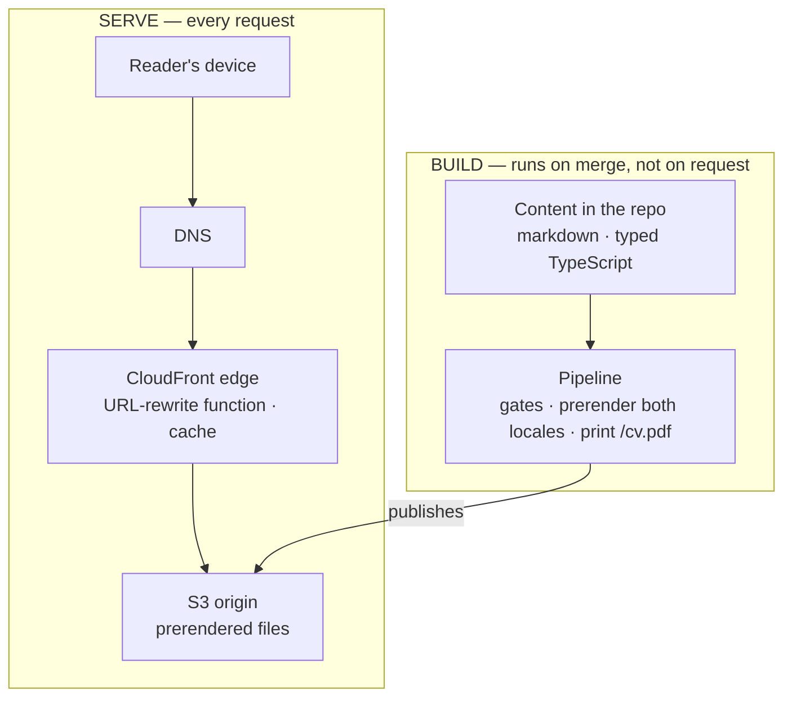
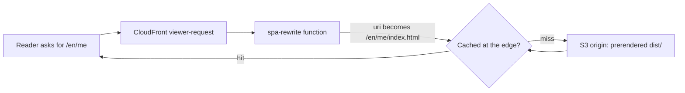
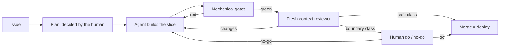
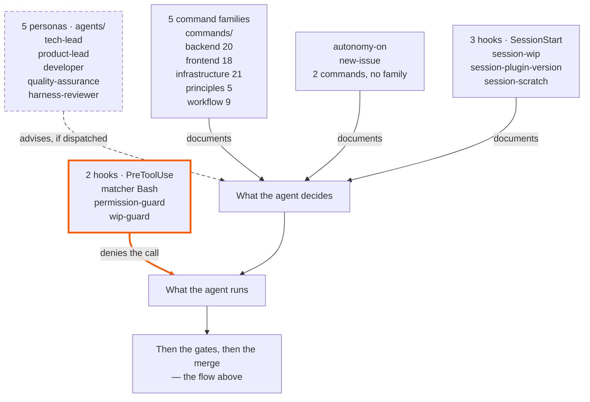

_This site is the argument. This page is the blueprint — how it's built, and how you'd build your own._

## The thesis

For a proof-of-engineering site, the code is the pitch — so the honest thing is to show the machine, not just its output. This is the whole build, in the open: the architecture below, the decisions that shaped it (each one recorded as an ADR), and the reusable layer that lets you replicate it. I build this the way I want to be hired to build: AI-native development with the SDLC rigor most AI work skips — Claude Code, Kiro, a loop built on AI-DLC & Agent Harness Engineering. The site is that loop's public output.

## The shape

A fully static SPA — React + Vite + TypeScript — served from **S3 behind CloudFront**, with a small CloudFront Function rewriting clean URLs. No backend: no server, no database, no auth. Cost near-zero, attack surface minimal, nothing to keep running at 3am.

*(→ [ADR-0002](https://github.com/tedeuxx/tadeumendonca-io/blob/main/docs/adr/0002-fully-static-spa-no-backend.md) fully static / no backend · [ADR-0013](https://github.com/tedeuxx/tadeumendonca-io/blob/main/docs/adr/0013-s3-cloudfront-hosting.md) S3 + CloudFront)*

In layers, and **the interesting thing about this picture is what is not in it** — there is no application tier and no data tier, because everything that would normally live at runtime happens at build time instead:



**The absence is the design, not a gap.** A layer diagram for a system like this usually continues into an application tier, a database and internal integrations; here it stops at a bucket. The only third party at runtime is analytics, and it is consent-gated. What a backend would do per request — resolve content, render HTML, build the OG tags — happens once, in the build lane, and ships as files.

*(→ [ADR-0033](https://github.com/tedeuxx/tadeumendonca-io/blob/main/docs/adr/0033-ga4-consent-gated-analytics.md) consent-gated analytics)*

That is also why the bill below is what it is: **the domain and the hosted zone bill whether anyone comes or not, and what a visit adds on top of them rounds to nothing.**

What none of that places is where a clean URL becomes a file:



There is no application in that path — so the only logic between a reader and a file is [ten executable lines of JavaScript](https://github.com/tedeuxx/tadeumendonca-io/blob/main/iac/cloudfront-functions/spa-rewrite.js), and it carries [its own unit tests](https://github.com/tedeuxx/tadeumendonca-io/blob/main/apps/fed/scripts/spa-rewrite.test.mjs) plus a [post-deploy check](https://github.com/tedeuxx/tadeumendonca-io/blob/main/.github/workflows/deploy.yml) that the live function still matches this repo.

**"No backend" raises one question before all others — how does a crawler see this — and the answer is that nothing has to run for it to.** A search engine or an unfurl scraper asks for a URL and gets **complete HTML with the OG tags already in it**, straight from a static file, not an empty shell that only becomes a page once JavaScript runs. **Nothing is assembled when it asks**: every route is rendered once, at build, in both languages. No SSR, no edge rendering — the function above rewrites a URL and does nothing else.

The limit travels with the claim, because it is the part a reader can falsify: **a URL that does not exist answers 200, not 404 — and what comes back is the landing page**, complete with the landing page's own OG tags, under an address that was never real. CloudFront maps `403` and `404` onto `/index.html`, which is what lets a SPA work on deep routes and is a real trade rather than a detail. So a scraper unfurling a bad link to this site gets a plausible card for the home page instead of an error. It has bitten here once: a path misroute sent the per-article OG images into that same fallback, and each one answered `200 text/html` to every scraper that asked.

*(→ [ADR-0004](https://github.com/tedeuxx/tadeumendonca-io/blob/main/docs/adr/0004-build-time-render-not-ssr-or-edge.md) build-time render, no SSR · [ADR-0005](https://github.com/tedeuxx/tadeumendonca-io/blob/main/docs/adr/0005-og-coverage-every-public-url.md) every URL OG-complete)*

## Why this site exists

To learn AI you have to build the use cases. You do not learn without them. Everything needs a user, an application, a feature, a business case — and that is where I keep seeing the gap. In the AI work I have been close to, the modelling is strong and the other half is thin: systems integration, legacy that cannot be replaced, the ordinary complications of corporate IT. That other half is where I have spent eighteen years. This site is a use case, and the open repository lets anyone check it.

I started the year lost. A project that was not going well, a pile of catch-up obligations on AI tooling, and things degraded until I took my holiday. And there is a detail I suspect a lot of senior engineers are living through and not saying out loud: **I had the agentic development tools in hand — Claude Code, Kiro — and still felt outside the hype.**

Building software is what I love. Nothing is more fun to me than seeing an application up and running, looking just right. What these tools gave back was exactly that, at a scale I could not reach on my own.

The case that proved it to me was not this site. It was an authentication and authorization mechanism with dense business rules, custom-built on Spring Boot and Spring Security, integrating legacy systems. I started building it on the side, coming back from my holiday, and it grew and matured from there. **I would never have delivered that mechanism without an agentic development tool** — not in the time I had.

Since then I have worked on two fronts: an internal one, at my job, and this one, in public. Consulting no longer gives me what I want to be doing: building digital products. I like building apps.

## Who did what

Working with an autonomous team of agents is part of this site's purpose, so the split is worth stating precisely — with no hour count, because I did not track hours and an invented number would be worth nothing.

**Mine:** the idea, the product, the content — mine even where they polished it — the site's voice, the agent architecture, the harness configuration and the experimentation with setups, the architecture patterns.
**The agent team's:** drafting the development and the code.

But the method is not dispatch. It starts from my idea. Then I **listen to how they would do it**, and shape that against my architectural judgement and my distributed-systems experience. The authorship stays mine; it is simply exercised after listening.

And listening pays. They carry more seniority than I do in the frameworks and languages this is built in — I add architecture and direction. **I recurrently learn ways to use AWS services I did not know were possible.** On this site it was Lambda@Edge OG rendering: I had no idea it could stand in for SSR and solve crawler indexing. On another system it was semantic search on Amazon S3 Vectors: I did not know you could assemble it from serverless pieces and pay on demand, instead of for a provisioned OpenSearch cluster running around the clock. The trade is throughput and latency — AWS itself positions the two as tiers, not as alternatives.

The irony of that first example sits two sections down: that Lambda@Edge has a decision on record, and it was **cut**. It worked, it taught me something, and then it proved unnecessary — build-time prerendering delivers the same served HTML with nothing running. Both are true at once.

*(→ [ADR-0026](https://github.com/tedeuxx/tadeumendonca-io/blob/main/docs/adr/0026-superseded-lambda-edge-og.md) Lambda@Edge OG, superseded)*

In people, everything above cost one person. Weekends, alongside consulting work.

## USD 6.57 a month

This figure measures what the site **added**, not what it **depends on**: subscriptions that already existed and would bill the same if it were deleted tomorrow stay out. And it measures what the site **runs on**, not what I **build** it with. What follows returns to both. Without that scope, "USD 6.57" is a loose number, and a loose number is not checkable.

"Near-zero" is the easiest claim on this page to make and the easiest to leave unchecked. So here is the AWS bill — the serving lines read from the account's daily cost in **late July 2026**, the registration read from the registrar's price list, neither estimated:

- **The domain** — USD 71.00/yr for the `.io`, an annual charge that lands in one month. **USD 5.92/month** amortized.
- **Route 53** — USD 0.50/month, fixed. The hosted zone, whether or not anyone visits.
- **S3** — about USD 0.15/month, and it is deploy *writes*, not reads.
- **CloudFront** — effectively USD 0.00 at this traffic.

The choice is the `.io`: expensive as top-level domains go, and I picked it for branding, not for cost — that is the honest reason, and it is the single line here you can decline. Nothing else on this bill moves with the domain: the hosted zone, the bucket and the distribution do not care what it is.

### The providers that could invoice this

**Anything that bills to keep the published site up, or would bill on a condition, belongs here** — the scope is the second rule stated above: what the site **runs on**, not what I **build** it with.

- **AWS** — **USD 6.57/month**, and it is the only charge this site created; of that, the 5.92 amortized annual registration and the 0.50 fixed hosted zone bill whether anyone visits or not.
- **GitHub Team** — paid, and the subscription predates the site, though the CI load on it is entirely the site's own.
- **iCloud+** — paid, and it predates the site too; it carries the custom-domain email at the apex, and [`iac/email.tf`](https://github.com/tedeuxx/tadeumendonca-io/blob/main/iac/email.tf) provisions its MX, DKIM and SPF records, so it is not adjacent to this infrastructure, it is inside it. *(→ [ADR-0016](https://github.com/tedeuxx/tadeumendonca-io/blob/main/docs/adr/0016-custom-email-via-icloud.md) custom email via iCloud)*
- **GitHub Actions** — **zero because the repositories are public**: a property of the repos, not of the plan, so it outlives a downgrade and it does not outlive going private.
- **SonarCloud** — **zero on the same condition**, on a separate account: its free tier is for public projects, and its gate blocks a merge.
- **Terraform Cloud** — **zero because the infrastructure is small**: the last plan resolved against roughly fifty resources, and that ceiling is counted in resources, not in traffic or in spend.
- **Claude Max** — paid, and **outside the total on purpose**: it is what I build the site with, not what the site runs on.

Two of those zeros depend on the repositories staying public and one depends on the infrastructure staying small; none of them depends on traffic.

Outside the total sits every hour of mine as well: **USD 6.57 a month is what it costs to keep this running, not what it cost to build.**

## What was cut — and it was built first, which is the part that matters

The easy version of this section is *"we kept the scope tight."* That is a posture, and anyone can claim it. The true version is stronger and it is checkable: **this was not built lean. It was built full and then cut**, and every reversal is on the record with the decision that replaced it.

| removed | what it was | replaced by |
|---|---|---|
| [ADR-0025](https://github.com/tedeuxx/tadeumendonca-io/blob/main/docs/adr/0025-superseded-backend-platform.md) | Backend platform — BFF on Lambda, DynamoDB, Cognito, SES | [0002](https://github.com/tedeuxx/tadeumendonca-io/blob/main/docs/adr/0002-fully-static-spa-no-backend.md) static SPA, no backend |
| [ADR-0026](https://github.com/tedeuxx/tadeumendonca-io/blob/main/docs/adr/0026-superseded-lambda-edge-og.md) | Lambda@Edge rendering OG images per request | [0004](https://github.com/tedeuxx/tadeumendonca-io/blob/main/docs/adr/0004-build-time-render-not-ssr-or-edge.md) build-time prerender |
| [ADR-0027](https://github.com/tedeuxx/tadeumendonca-io/blob/main/docs/adr/0027-superseded-backend-link-unfurl.md) | Backend link-unfurl service for preview cards | [0004](https://github.com/tedeuxx/tadeumendonca-io/blob/main/docs/adr/0004-build-time-render-not-ssr-or-edge.md) build-time prerender |
| [ADR-0028](https://github.com/tedeuxx/tadeumendonca-io/blob/main/docs/adr/0028-superseded-gitflow-two-env.md) | GitFlow with staging and production | [0003](https://github.com/tedeuxx/tadeumendonca-io/blob/main/docs/adr/0003-trunk-based-single-environment.md) trunk, one environment |
| [ADR-0029](https://github.com/tedeuxx/tadeumendonca-io/blob/main/docs/adr/0029-superseded-offline-first-pwa.md) | Offline-first installable PWA | [0002](https://github.com/tedeuxx/tadeumendonca-io/blob/main/docs/adr/0002-fully-static-spa-no-backend.md) static SPA, no backend |

**What the objective actually needed was content**, and none of that machinery served it. A database with nothing to store. Auth with nobody to authenticate. A staging environment for a site whose revert is a merge. Each one was defensible when it was decided and none survived the question *"what is this for, here."*

### What the guardrail is actually for

Reading the bill above turned up roughly **USD 12.80 a month** the site was not using: WAF web ACLs and idle public IPv4 addresses attached to nothing, left behind when the backend was retired. More than eighty times what publishing the site costs. **Those are gone** — removed in July 2026, and the daily cost series confirms the charges stop rather than an empty console implying it. Not all of it: a residue from the same era, **under a dollar a month**, is still accruing while I work out what it holds — an account-level line, not a site one, and the honest state of this at the time of writing.

I found them by reading the bill, which is late. So what watches now is an account-wide budget in `iac/budget.tf`, and two things about it are deliberate. It is **not** scoped to this project's tags — otherwise it would only ever see spend this repo created, and this was exactly the kind it did not. And the sensitivity lives in the **thresholds**, not the ceiling: a ceiling has to be sized for your worst legitimate month, which here is the renewal month, so it is by construction deaf to anything smaller than itself. The alarm that matters fires at 15% — around USD 12, quiet at the normal run rate, and awake to any new recurring cost of roughly USD 8/month. A conventional 50/80 pair would first have spoken at USD 40, several times actual spend, and stayed silent for a year about a new USD 30/month service.

That is the transferable part, and it is two-sided: infrastructure you stop using does not stop billing, and the thing meant to catch it has to look **wider** than what you are building and **lower** than what you are afraid of.

*(→ [`iac/budget.tf`](https://github.com/tedeuxx/tadeumendonca-io/blob/main/iac/budget.tf) the budget guard)*

### If you need the backend back, the record tells you which decision to reverse

A recorded reversal is what makes the growth path concrete rather than a promise that the architecture "could scale". A system that grew into needing a server does not need this site redesigned — it needs **one specific decision reopened**, and each of the five reversals above names the one that closed it:

- **dynamic data or accounts** → reverse [0002](https://github.com/tedeuxx/tadeumendonca-io/blob/main/docs/adr/0002-fully-static-spa-no-backend.md), and 0025 is the shape it had;
- **per-request rendering** → reverse [0004](https://github.com/tedeuxx/tadeumendonca-io/blob/main/docs/adr/0004-build-time-render-not-ssr-or-edge.md); 0026 and 0027 are two things that were tried at the edge;
- **a change you cannot revert by merging** → reverse [0003](https://github.com/tedeuxx/tadeumendonca-io/blob/main/docs/adr/0003-trunk-based-single-environment.md), and 0028 is the two-environment flow it replaced.

The build lane in the diagram above is the seam: adding a server means moving work **out** of it, not bolting a tier onto the side.

## Security here is mostly what was not built

There is no WAF, no key I manage, and no encrypted parameter. That is not thrift: **with no server, no database and no auth, whole classes of risk stop existing rather than being mitigated** — injection into a database, auth bypass, server-side RCE, secrets at runtime. What is left is the bundle that reaches the browser and its dependencies. The auditable part of that decision is that the infrastructure scanner **knows why it does not complain**: the deviation is written into its own config file, with the reason, rather than as a silent exception.

*(→ [ADR-0017](https://github.com/tedeuxx/tadeumendonca-io/blob/main/docs/adr/0017-no-waf-no-cmk-ssm-string-only.md) no WAF, no CMK · [`iac/.checkov.yaml`](https://github.com/tedeuxx/tadeumendonca-io/blob/main/iac/.checkov.yaml) the deviation, with its reason)*

Subtraction alone reads as a gap, so what remains is gated: static analysis in SonarCloud, and a dependency audit that **blocks the merge** rather than warning. And packages install without running their own scripts — `--ignore-scripts` on every install in the pipeline, because the runner that installs is the one that later assumes the deploy role. The trust root between the AWS account and GitHub is the other half, and it is spelled out further down, because that is where someone replicating this will look for it.

*(→ [ADR-0021](https://github.com/tedeuxx/tadeumendonca-io/blob/main/docs/adr/0021-application-security-posture.md) what is left when there is no backend)*

There were **two** web ACLs — one at the CloudFront edge and the regional one — and only the regional one has an ADR. The CloudFront-scope ACL **is not in the decision library**, on a page arguing that the library is the point. That is a cut the record does not fully account for, and the honest place to say so is here. The other uncomfortable part stays where it already was: the trust root is a documented hole in a floor, and no `plan` will tell you when it drifts.

*(→ [ADR-0031](https://github.com/tedeuxx/tadeumendonca-io/blob/main/docs/adr/0031-superseded-shared-regional-waf.md) the WAF that was cut)*

## Every decision, and where it stands

The table below is **not typed here**. It is generated from `docs/adr/`, committed as an artifact, and checked in CI: adding or superseding a decision without regenerating the index turns the pipeline red, so the page either matches the library or nothing ships. A hand-copied index of a library this size is stale within a week and nothing says so — this one is the same mechanism as the diagrams above, and for the same reason.

```adr-index
```

That is this page's own principle applied to the one list it cannot avoid reproducing: **link the canonical detail rather than restating it.** Every row is a link, and the decision itself lives in the record — with its context, the options that lost, and what it cost.

## Content is markdown in the repo, resolved at build

Every page's content — the CV, this page, the articles — is markdown or typed data in the repo. Each route is **prerendered** at build (a headless snapshot) so the OG/SEO tags and crawlable HTML land in the served files — no SSR, no edge rendering. The downloadable CV PDF is printed from the live `/me` by the same step.

*(→ [ADR-0004](https://github.com/tedeuxx/tadeumendonca-io/blob/main/docs/adr/0004-build-time-render-not-ssr-or-edge.md) build-time render · [ADR-0005](https://github.com/tedeuxx/tadeumendonca-io/blob/main/docs/adr/0005-og-coverage-every-public-url.md) every URL OG-complete · [ADR-0034](https://github.com/tedeuxx/tadeumendonca-io/blob/main/docs/adr/0034-build-time-cv-pdf-static-artifact.md) the CV PDF)*

## What the site does, from the reader's side

Everything above is machinery. This is what it produced — the part you can use without reading a line of any of it.

**This list is authored, not derived.** The decision index above is generated from `docs/adr/` and the harness inventory below is pinned to another repository; **this one is typed by hand and no check compares it to the code**, so it can fall behind the site in a way neither of those can. It carries no total for the same reason: a count is the first thing to go stale, and every entry below names a route you can open or a decision you can read instead.

- **Two complete editions, Portuguese and English.** Every route is first-class under `/pt` and `/en`, prerendered with its own head — so a forwarded link arrives in the language it was read in, rather than in the recipient's. *(→ [ADR-0036](https://github.com/tedeuxx/tadeumendonca-io/blob/main/docs/adr/0036-per-locale-urls-prerender-hreflang.md) per-locale URLs)*
- **An offer, never a redirect, when your browser disagrees with the URL you opened.** It is dismissible and remembered, so it does not nag — and the link someone sent you keeps working exactly as sent.
- **Articles, each with its own slug per language**, filterable on the landing by track without the address bar changing underneath you. *(→ [ADR-0037](https://github.com/tedeuxx/tadeumendonca-io/blob/main/docs/adr/0037-localized-article-slugs.md) localized article slugs)*
- **A CV at `/me`, and the same CV as a PDF** — printed from the live page during the build, so the download cannot disagree with the page it came from. *(→ [ADR-0034](https://github.com/tedeuxx/tadeumendonca-io/blob/main/docs/adr/0034-build-time-cv-pdf-static-artifact.md) the CV PDF)*
- **A portfolio at `/portfolio`**, with the bar for getting listed written down and public — [docs/catalog-ready.md](https://github.com/tedeuxx/tadeumendonca-io/blob/main/docs/catalog-ready.md), the proof-of-engineering gate.
- **A ramp-up plan at `/ramp-up`** — the reasoning, the roadmap and the exact sources for moving into AI Engineering, in the open while it is still in progress.
- **A reading shelf at `/library`** — a curated shelf rather than a list, each entry carrying what I made of it.
- **This page, at `/architecture`** — the whole build in the open: the shape it runs on, what it costs, the decisions behind it, and what was cut.
- **Share affordances that tag what they produced**, so a link's life after it leaves here is readable rather than guessed at. *(→ [ADR-0039](https://github.com/tedeuxx/tadeumendonca-io/blob/main/docs/adr/0039-share-campaign-tagging.md) share campaign tagging)*
- **Videos that load nothing until you ask.** A video inside an article is a facade over a poster generated at build and served from this origin; no third-party frame, cookie or request happens before the click.
- **Analytics that waits for consent** — inert until you say yes. *(→ [ADR-0033](https://github.com/tedeuxx/tadeumendonca-io/blob/main/docs/adr/0033-ga4-consent-gated-analytics.md) consent-gated analytics)*

## The dev-loop is the product

The interesting part isn't the stack — it's how it's built: **agent-led verification, human-residual**. The agent proves "done" with mechanical gates and real evidence (lint, types, tests ≥85%, a green build, SonarCloud, functional E2E, a fresh-context reviewer); the human keeps the irreversible and architectural calls. That loop lives in a separate reusable plugin — **[tadeumendonca-skills](https://github.com/tedeuxx/tadeumendonca-skills)** — so it's a methodology you can adopt, not something bespoke to this site.

*(→ [ADR-0003](https://github.com/tedeuxx/tadeumendonca-io/blob/main/docs/adr/0003-trunk-based-single-environment.md) trunk-based single-environment · [ADR-0018](https://github.com/tedeuxx/tadeumendonca-io/blob/main/docs/adr/0018-ci-gates-e2e-on-pr-coverage.md) the CI gates)*



The human appears twice, and the two appearances are different jobs. At the plan, deciding what is worth building and how — the architectural calls are never made solo. At the end, on boundary-class work only, deciding whether it ships. In between, the agent builds and the machine proves, and most changes reach production without a person in that path at all.

The picture shows the routing. What it cannot show is that the routing was **decided** — which edge the human sits on, what counts as a class boundary, where a gate is worth what it costs. That is the engineering this page is offering, more than any box in the figure.

And the cost of it, since the rest of this page states its own: what decides a change is safe is the same kind of thing that wrote the change. Mis-classify one and it takes the empty path. What makes that acceptable here is blast radius, not confidence — this is a static site, and a revert is a merge.

### What the loop is made of, and what each part can actually do

The picture above answers *how work moves*. It does not say what the loop is **made of** — and that is the question a reader deciding whether to adopt it is actually asking. The two are separate diagrams on purpose: one drawing that tried to be both would have to give a hook that refuses a command and a lens somebody has to remember to invoke the same arrow, and that difference is the most useful thing on this page.



**Of the plugin's own components, exactly one kind can stop you**, and that is the honest version of the adoption pitch. (The box that is *not* a plugin component — *Then the gates, then the merge* — is a pointer back to the first diagram, and those gates certainly do stop you: SonarCloud and the terminal `build-test` check block a merge outright. They live in this repo's workflows rather than in the plugin, which is why they are not rows in the inventory below.) Two of the five hooks run on `PreToolUse`: the agent runtime calls them *before* a tool runs, they return a denial, and the command does not happen. The other three run at `SessionStart`, an event that hands a hook no tool call to refuse, which is why they are not drawn as a floor. **The class says** what a session-start hook *cannot stop*, not that it merely watches — a hook on that event runs before the first tool call and can act, and this drawing has no shape for that. **And one of them acts:** `session-wip` and `session-plugin-version` only report; `session-scratch` empties the scratch directory. That is a fact about each script, not a property of the event, **and that is why** the drawing cannot be read as a promise about what they do. The personas advise, and *advise* is a claim about the judgement they produce, not about where they sit: one of them, `quality-assurance`, has a mechanically enforced seat — the same permission hook lets only that agent type run the merge command — and being the only one who *may* merge is a different property from being checked on how it merged. `product-lead` is the mirror image of that: it **blocks** a merge when it finds a published claim that is untrue — but by convention rather than by hook, so nothing refuses the merge command on its behalf and the drawing cannot honestly show it as a floor. Nothing checks the judgement in either case, and this repo's own guide says in as many words that a lens nobody dispatches *fails silently*. The commands are neither — they are the written form of a decision already taken, so nobody re-litigates it at 2am.

**Rename a persona in the plugin and this repository's build goes red.** The drawing above is authored by hand: a test compares it, node by node and count by count, against a [committed manifest](https://github.com/tedeuxx/tadeumendonca-io/blob/main/apps/fed/src/content/generated/harness.json), in both editions; and a [CI job](https://github.com/tedeuxx/tadeumendonca-io/blob/main/.github/workflows/app.yml) compares that manifest against the plugin's live tree.

*(→ [ADR-0043](https://github.com/tedeuxx/tadeumendonca-io/blob/main/docs/adr/0043-harness-inventory-derived-from-plugin-repo.md) the inventory pinned to the plugin)*

**What that does not buy is freshness, and the gap is structural rather than an oversight.** The plugin is a *different repository*, and nothing in this one can trigger on a merge in it. So the red arrives at the next build here — which may be days later, and on a change that has nothing to do with it. **This page can be wrong for that whole window and will not say so.** Two smaller limits, for the same reason the rest of this page states its own: the check compares **identity**, so a hook that keeps its name and changes what it does publishes a stale description under a green build; and the short glosses on the edges — *denies the call*, *advises, if dispatched* — are **authored here** and checked by nothing.

That is also where the two terms in the opening paragraph land — and they do not land the same way, which is worth being exact about. **AI-DLC** is not mine: it is AWS's name for a delivery lifecycle whose stages are run and verified by agents rather than around them, and the first picture is what practising it looks like here. **Agent Harness Engineering** is the claim I am making, and it is this picture — that the harness is a thing you build, count and check, rather than a way of prompting. Adopting a methodology costs nothing to say; the second one has to be paid for, and the payment is that it can be inventoried at all, from the repository it lives in, with a build that breaks when the inventory stops being true.

### The orchestrator is the part of the harness you cannot install

It is in none of the inventory above — not in the drawing, not in the manifest — and it is the main session: the context that reads an Issue, decides which persona to dispatch, and weighs what comes back. Be exact about what is missing, because this is the sentence an adopter acts on and the plugin is **not** silent about it. Its README draws the orchestrator as a node and warns that it is *a relay, and relays distort*; `autonomy-on` is a shipped command whose subject is the orchestrator's dispatch policy. So the **actor** is not a plugin component, its **policy** partly is, and what you supply is the context that runs it — which is the half worth knowing about before you adopt anything.

It is also the party the capability boundaries above are drawn *against*. `permission-guard` refuses the merge command from every agent type except `quality-assurance`, and the gloss on the persona edge — *advises, if dispatched* — names dispatch as the failure mode without naming who dispatches. That is the orchestrator, and a lens it forgets is a lens nobody ran.

Why the roster is **five** rather than nineteen is a decision with a record, so the rule this page runs on applies: link it rather than restate it. It took **two** cuts — nineteen to six, then six to five — and a later amendment widened the criterion behind them, which now names four reasons a persona may exist at all. One of the four is that the orchestrator's context is a finite resource the design spends deliberately. [ADR-0002's amendments in the plugin repo](https://github.com/tedeuxx/tadeumendonca-skills/blob/main/docs/adr/0002-agentic-dev-loop-architecture.md) carry all three moves and what each cut cost. The plural matters: *"five because of the context window"* is a simplification the file itself refuses.

That resource has been read once, and the honest form of the reading is a **floor**, not a figure. Measured on this repo's own session of 7–8 August 2026, by parsing the session transcripts: what stayed inside the subagents was **over an order of magnitude** more context than what came back to the orchestrator as verdicts. The saving is real and it is bounded: those returned verdicts were still a **large slice of everything the orchestrator took in from a tool**.

**A task costs the orchestrator its verdict, not its execution.** That is what a subagent buys — and it is why the one knob the harness holds is verdict length, turned by how the persona briefs are written.

It is not an escape: the verdicts accumulate anyway, and this session compacted twice regardless. No figure for that saving is published, because the input is a private session transcript that no gate can reach.

### What the Claude Code workspace adds, and where each part actually lives

The plugin is the half you can install. The workspace around it adds more, and the parts below are named at deliberately different strengths, because only one of them is in a repository at all. That ordering is the useful part: it is the same distinction the inventory above draws between something that can stop you and something somebody has to remember.

**Publication is scaffolded, and the load-bearing part is a refusal.** [`gen-distribution.mjs`](https://github.com/tedeuxx/tadeumendonca-io/blob/main/apps/fed/scripts/gen-distribution.mjs) drafts the LinkedIn and the X post for an article from that article's own frontmatter, writes them to a gitignored directory, and never overwrites one I have already voiced. **It is not automated publishing and must not be read as any**: it posts nothing and holds no credential, because ADR-0038 considered automating the fan-out and rejected it — a class of unattended public writes is not worth the two drafts it saves, and every post is still approved by hand. What it does mechanically is decline: it resolves the share URL by **looking it up in the prerendered route list** and throws when nothing matches, rather than emitting a link to a page no scraper can read OG tags from. A generator that refuses is worth more here than one that produces.

*(→ [ADR-0038](https://github.com/tedeuxx/tadeumendonca-io/blob/main/docs/adr/0038-content-distribution-linkedin-and-x.md) both surfaces, drafted and never posted unattended)*

**Remote control is a preference on my account, not configuration of this repository** — and the distinction is the whole reason it is written this way rather than the obvious way. It attaches to the session already running on my workstation, which is what lets me follow a run and unblock it from anywhere without the session stopping. **The artifact is in neither repository.** Fork this and you get none of it, because there is nothing to get: it is a user-scope setting, so it travels with me and not with the code, and presenting it as part of the harness would be dressing an operating habit as something you could adopt.

**Artifacts is weaker still, and is offered here only as testimony.** It is a vendor surface with no row in the manifest — `grep -rn -i "claude artifact"` across the plugin returns nothing at all. So what I can honestly say is first-person and nothing more: I use it to hold a draft where I can keep looking at it while a session moves past. That is a sentence about how I work, not a property of this architecture.

### Who works on this, and what each one argues against

The agents are the part of this that reads most like a staffing plan and is least like one. **A persona exists where a disagreement is wanted** — not where an org chart has a box — and that single criterion is what took the roster from nineteen down to six and then to five. A later amendment widened the criterion to four reasons rather than one, because two moves had already been made that the one-line version could not explain.

| who | what it owns | what it argues against |
|---|---|---|
| `product-lead` | the reader, value, order, slice size — and positioning, voice, and the truth of anything published | `tech-lead`; and it is the one lens that **blocks** rather than advises, on a published claim that is untrue |
| `tech-lead` | architecture, measurement, sequencing — and it writes the ADRs | `product-lead`, by design: product-and-market and system are genuinely different optimisations |
| `developer` | the slice end to end — app, infrastructure, pipeline, and the tests written as it goes | nothing. It builds, and it is what the gate is pointed at |
| `quality-assurance` | delivery against the Definition of Done, and separately whether a change can break production | `developer`, on both axes in one pass — and it is the only one the permission hook lets merge |
| `harness-reviewer` | the machinery itself: hooks, permissions, briefs, commands, the plugin | **me** — and that is the interesting case |

**`harness-reviewer` is the one that does not fit the rule as first written**, which is why the rule was widened instead of defended. Its counterpart is not another persona; it is me wearing the harness-engineer hat, which is the one seat in this loop that had nobody to argue with. Second-order effects of a configuration change are invisible from inside the change — that is the whole reason it exists. It gates nothing, and nothing forces it to be dispatched, so it fails the same silent way every lens here does.

The moves, and what each cut cost, are recorded rather than summarised here: [ADR-0002's amendments](https://github.com/tedeuxx/tadeumendonca-skills/blob/main/docs/adr/0002-agentic-dev-loop-architecture.md) and [the harness-agnostic design](https://github.com/tedeuxx/tadeumendonca-skills/blob/main/docs/dev-loop-design.md), both in the plugin repository. That is this page's rule applied again — link the canonical detail rather than restate it.

**And this table is authored, unlike the persona names in the drawing above.** Those are compared against the manifest and against the plugin's live tree, so retiring a persona reddens a build here. Nothing compares *this* table to anything. If a role changes hands, the drawing goes red and these rows quietly do not.

### Where the loop's own documentation lives

**No generator covers it**, so what stands here points at the live tree — the freshest index available, and the one that costs nothing to keep true:

- **[the methodology decision library](https://github.com/tedeuxx/tadeumendonca-skills/tree/main/docs/adr)** — the loop's own ADRs, the ones that decide how work is decided, kept separately from this site's product decisions above.
- **[the harness-agnostic design](https://github.com/tedeuxx/tadeumendonca-skills/blob/main/docs/dev-loop-design.md)** — the loop written down without reference to any particular agent runtime, which is the document to read if you are adopting rather than inspecting.
- **[the original proposal](https://github.com/tedeuxx/tadeumendonca-skills/blob/main/docs/proposals/agentic-dev-loop.md)** — where all of it was argued before any of it existed.

## The decision record IS the documentation

No separate architecture doc that drifts. Every load-bearing decision — and the reversed ones, kept as history — is an **Architecture Decision Record**, read through the library's keystone: *lean by design, calibrated to strategy.* The real "why" behind anything above is there, dated, with its trade-off.

*(→ [the decision library](https://github.com/tedeuxx/tadeumendonca-io/blob/main/docs/adr/README.md) · [ADR-0001](https://github.com/tedeuxx/tadeumendonca-io/blob/main/docs/adr/0001-lean-by-design-calibrated-to-strategy.md) lean by design)*

## Replicate it for your own context

It's all public — two repos, no secrets:

[https://github.com/tedeuxx/tadeumendonca-io](https://github.com/tedeuxx/tadeumendonca-io)

[https://github.com/tedeuxx/tadeumendonca-skills](https://github.com/tedeuxx/tadeumendonca-skills)

### Where the setup lives, and why not here

The fork-to-live steps are in the READMEs, not on this page. That is the same rule the rest of this page runs on: it links canonical detail rather than restating it. A step-by-step guide living here would be a second copy of what a README owns — and the copy that used to be here had already gone stale, describing workflows that had been renamed underneath it.

- **[This repo's README](https://github.com/tedeuxx/tadeumendonca-io#fork-to-live)** — the cloud path end to end, from the domain to the first merge.
- **[The plugin's README](https://github.com/tedeuxx/tadeumendonca-skills#run-it)** — the loop half, which installs with no cloud account and nothing to deploy.

**Terraform here does not create the GitHub OIDC provider, nor the role that runs Terraform itself.** Those are created out of band, with the AWS CLI, and they stay outside Terraform permanently. There are two independent reasons and only one of them would ever go away: the first run would need the credential it has not created yet, and — the one that does not expire — a role able to rewrite its own trust policy has no ceiling on it. The record holds both, along with the part that is uncomfortable to write down: this is a documented hole in a floor, the hand path reopens every time that role's policy is revised, and no `plan` will ever tell you it has drifted.

*(→ [ADR-0042](https://github.com/tedeuxx/tadeumendonca-io/blob/main/docs/adr/0042-trust-root-bootstrapped-out-of-band.md) trust root outside Terraform)*

**The roles trust an *immutable* subject** — by numeric ID rather than by name, because a name can be transferred to someone else and the IDs cannot. It is the step most likely to cost you an afternoon, since getting it wrong fails as an unhelpful `sts:AssumeRoleWithWebIdentity` denial. The exact form, the trade-off, and the rename that taught it are on record.

*(→ [ADR-0015](https://github.com/tedeuxx/tadeumendonca-io/blob/main/docs/adr/0015-oidc-immutable-subject-least-privilege.md) immutable subject)*

The part I would be nervous seeing someone copy without the rest is **merging straight to production**. Trunk-based with a single environment is fast and unforgiving in equal measure; without the gates in front of it, only the second half survives.

## Three honest limitations

This is a single-author site, tuned to one person's positioning — not a general-purpose template, and no one else's hands have been on it. Take the pattern, not the specifics.

And all four diagrams above show the **shape** of a thing, not a run of it. Three of them you can check, in three different strengths. That the request path is what the edge actually does: the function, its tests and the post-deploy comparison are linked. That the layers are what this repo actually builds: `iac/` and the build script settle it between them. That the harness has the parts the inventory names: a build here fails when it stops matching the plugin repo — but **late**, since nothing here can see a merge over there, and only for the parts that are *names*, never for what those parts do. The fourth you cannot check at all. That the loop is followed the way it is drawn is not something this page proves — nothing here shows that any particular change took the route in the picture. That one is a claim about how I work, and no artifact on this page can settle it for you.

**And there is the half of the workspace no repository holds.** Remote control is a setting on my account and artifacts is a vendor surface with no row in the manifest; a `grep` for it across the plugin returns nothing, which is the check and also the answer. Both are marked as testimony, and a fork of this repository gets neither — so, exactly like the reading above, they are things you can take my word for or not, and nothing here will settle it.
