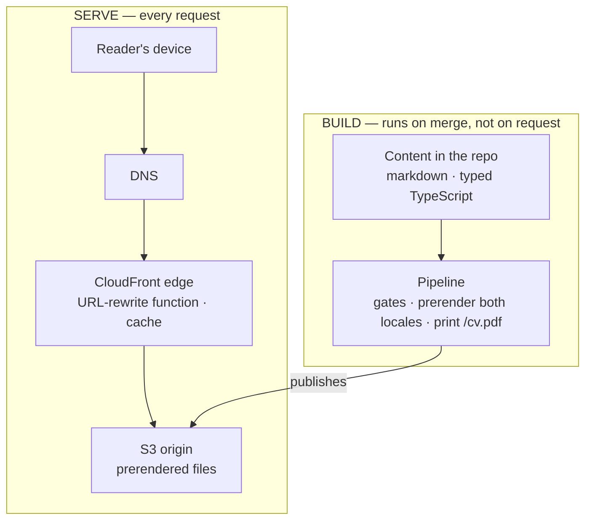
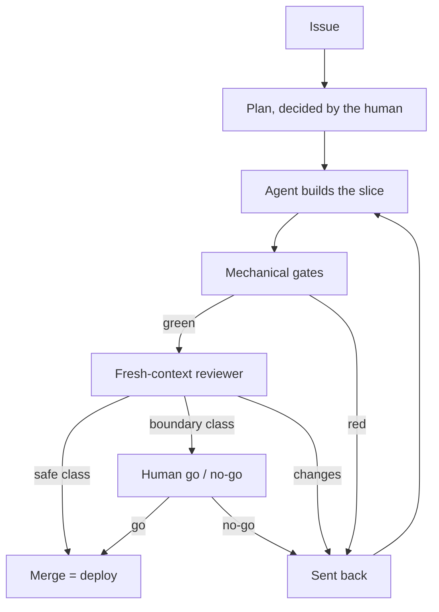
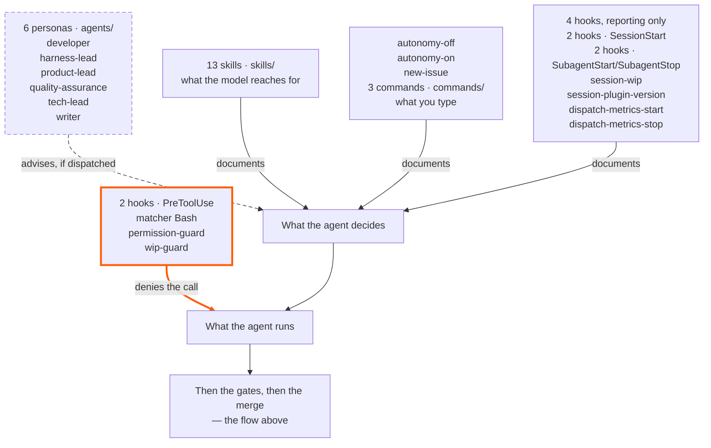

_This site is the argument. This page is the blueprint — how it's built, and how you'd build your own._

## I started the year lost

A project that was not going well, a pile of catch-up obligations on AI tooling, and things degraded until the end of the year. And there is a detail I suspect a lot of senior engineers are living through and not saying out loud: **I had the agentic development tools in hand — Claude Code, Kiro — and still felt outside the hype.**

In the AI work I have been close to, the modelling is strong and the other half is thin: systems integration, legacy that cannot be replaced, the ordinary complications of corporate IT. That other half is where I have spent eighteen years, and it is the one with no ready-made use case to learn on.

The case that turned it around was not this site. **At the beginning of the year, in January**, I started building an authentication and authorization mechanism on the side — dense business rules, custom-built on Spring Boot and Spring Security, integrating legacy systems. **I would never have delivered that without an agentic development tool** — and it was not only the deadline: I was carrying tech-lead responsibilities on that project **at the same time**. That is what the tool bought. Not typing speed: both of those fitting into the same week. And nothing is more fun to me than seeing an application up and running, looking just right — at a scale I could not reach on my own.

> "Computer programming is an art, because it applies accumulated knowledge to the world,
> because it requires skill and ingenuity, and especially because it produces objects of beauty."
>
> — Donald Knuth, 1974


**The holiday was in May, in San Francisco and the Valley, and the rest of this page comes out of it.** There was not a place I passed through without some AI offering in it — on the train, on the street, in a shop window, on the lanyard of the person next to me. I came back with the idea of what to do, and since then I have run it on two fronts: an internal one, at work, with **Kiro**, and this one, in public, with **Claude Code**. Two harnesses running the same kind of work is what lets me separate what comes from the model from what comes from the setup around it.


And there is a reason the public front exists rather than a notebook. There are far too many configuration options — which harness, which hooks, which persona, which gate, which model — and nobody has enough sessions to test them all alone. **Trading each other's experience of using AI is what will speed that learning up**, and that is why what is here is the whole setup, not only the conclusion it reached.


*The photographs on this page are mine. One week, the Valley — this is not a survey; it is what was in front of me.*

## What the requirement demanded, and the architecture it justified

The requirement for this public front is short: **publish content, in two languages, with the whole build in the open.** That is what decides the architecture, the bill, and the rest of this page.

And it **was not built lean**. It was built full and then cut: there was a backend platform — BFF on Lambda, DynamoDB, Cognito, SES —, a Lambda@Edge rendering OG images per request, a link-unfurl service, GitFlow with staging and production, and an offline-first PWA. A database with nothing to store. Auth with nobody to authenticate. A staging environment for a site whose revert is a merge. Each one was defensible when it was decided, and none survived the question *"what is this for, here"* — and every reversal is on the record with the decision that replaced it: [0025](https://github.com/tedeuxx/tadeumendonca-io/blob/main/docs/adr/0025-superseded-backend-platform.md), [0026](https://github.com/tedeuxx/tadeumendonca-io/blob/main/docs/adr/0026-superseded-lambda-edge-og.md), [0027](https://github.com/tedeuxx/tadeumendonca-io/blob/main/docs/adr/0027-superseded-backend-link-unfurl.md), [0028](https://github.com/tedeuxx/tadeumendonca-io/blob/main/docs/adr/0028-superseded-gitflow-two-env.md), [0029](https://github.com/tedeuxx/tadeumendonca-io/blob/main/docs/adr/0029-superseded-offline-first-pwa.md).

**The cut is not this page's subject; it is the consequence.** What is left is three things — a static site, a dev-loop plugin and an agent runtime — and they are not tiers of one system: **each one exists without the other two.** The site runs without the plugin. The plugin installs in any repository. The runtime is not mine. What sits in the middle is the one thing none of the three delivers on its own — and it is where the way I build this lives, which is the way I want to be hired to build: AI-native development with the SDLC rigor most AI work skips, a loop built on AI-DLC & **(Agent) Harness Engineering**.

```venn
accTitle: The three pillars, and what sits in the intersection
accDescr: Three circles of the same size, overlapping, with one shared intersection at the centre. The first circle is the solution, the tadeumendonca-io repository, and inside it sit the React SPA built with Vite and TypeScript, the Terraform that provisions CloudFront and S3, the pipeline with its gates and its deploy, and the markdown content held in the repository itself. The second is the harness customization, the tadeumendonca-skills repository, and inside it sit the personas in the agents directory, the hooks registered in hooks.json, the skill library in the skills directory, the three commands a person types in the commands directory — autonomy-off, autonomy-on and new-issue — and the methodology ADRs. The third is the harness runtime, Claude Code, and inside it sit the orchestrator and the subagents, the PreToolUse and SessionStart events, the permission policy, and the tools with MCP. At the centre, where all three overlap, it reads Agent Harness Engineering, with the word Agent in parentheses. That is the claim the drawing makes: none of the three circles is the discipline on its own, it is what exists where the three meet.
centre: (Agent) Harness | Engineering
pillar: The solution | tadeumendonca-io
- React SPA · Vite · TS
- Terraform: CloudFront, S3
- Pipeline: gates, deploy
- Markdown in the repo
pillar: The customization | tadeumendonca-skills
- Personas in agents/
- Hooks in hooks.json
- The skill library
- Commands you type
- Methodology ADRs
pillar: The runtime | Claude Code
- Orchestrator, subagents
- PreToolUse · SessionStart
- The permission policy
- Tools and MCP
```

What sits in the intersection is the actual work: deciding what the harness **refuses**, what it **advises** and what it only **documents** — and then proving the inventory of that is still true. `Agent` is in brackets on purpose: a label has to be short and a claim has to be exact, and the brackets let one rendering do both.


## Pillar 1 · the solution

A fully static SPA — React + Vite + TypeScript — served from **S3 behind CloudFront**, with a small CloudFront Function rewriting clean URLs. No server, no database, no auth. The content is markdown in the repository itself, and every route is **prerendered** at build, in both languages.

*(→ [ADR-0002](https://github.com/tedeuxx/tadeumendonca-io/blob/main/docs/adr/0002-fully-static-spa-no-backend.md) fully static / no backend · [ADR-0013](https://github.com/tedeuxx/tadeumendonca-io/blob/main/docs/adr/0013-s3-cloudfront-hosting.md) S3 + CloudFront)*

In layers — and **the interesting thing about this picture is what is not in it**:



**The absence is the design, not a gap.** A layer diagram for a system like this usually continues into an application tier, a database and internal integrations; here it stops at a bucket. The only third party at runtime is analytics, and it is consent-gated. And "no backend" raises one question before all others — how does a crawler see this — whose answer is that nothing has to be **rendered** for it to: what it asks for comes back as complete HTML, with the OG tags already in it, straight from a static file. No SSR, no edge rendering — the edge's rewrite function runs on every request for a page and touches the URL, nothing else.

The limit travels with the claim, because it is the part a reader can falsify: **a URL that does not exist answers 200, not 404 — and what comes back is the landing page**, complete with the landing page's own OG tags, under an address that was never real. CloudFront maps `403` and `404` onto `/index.html`, which is what lets a SPA work on deep routes and is a real trade rather than a detail. It has bitten here once: a path misroute sent the per-article OG images into that same fallback, and each one answered `200 text/html` to every scraper that asked.

The only logic that runs between a reader and a file is that function: [ten executable lines](https://github.com/tedeuxx/tadeumendonca-io/blob/main/iac/cloudfront-functions/spa-rewrite.js), with [their own unit tests](https://github.com/tedeuxx/tadeumendonca-io/blob/main/apps/fed/scripts/spa-rewrite.test.mjs) and a [post-deploy check](https://github.com/tedeuxx/tadeumendonca-io/blob/main/.github/workflows/deploy.yml) that the live function still matches this repo. And the bucket **is not public in any sense**: it answers `s3:GetObject` only from this distribution.

*(→ [ADR-0004](https://github.com/tedeuxx/tadeumendonca-io/blob/main/docs/adr/0004-build-time-render-not-ssr-or-edge.md) build-time render, no SSR · [ADR-0005](https://github.com/tedeuxx/tadeumendonca-io/blob/main/docs/adr/0005-og-coverage-every-public-url.md) every URL OG-complete · [ADR-0033](https://github.com/tedeuxx/tadeumendonca-io/blob/main/docs/adr/0033-ga4-consent-gated-analytics.md) consent-gated analytics · [`iac/frontend.tf`](https://github.com/tedeuxx/tadeumendonca-io/blob/main/iac/frontend.tf) the distribution and the policies)*

### USD 6.57 a month

This figure measures what the site **added**, not what it **depends on**, and it measures what the site **runs on**, not what I **build** it with. "Near-zero" is the easiest claim on this page to make and the easiest to leave unchecked — so here is the bill, with the serving lines read from the account's daily cost in **late July 2026** and the registration read from the registrar's price list. Neither estimated:

- **The domain** — USD 71.00/yr for the `.io`, an annual charge that lands in one month. **USD 5.92/month** amortized. I picked the `.io` for branding, not for cost: that is the honest reason, and the single line here you can decline.
- **Route 53** — USD 0.50/month, fixed. The hosted zone, whether or not anyone visits.
- **S3** — about USD 0.15/month, and it is deploy *writes*, not reads.
- **CloudFront** — effectively USD 0.00 at this traffic.

Outside AWS the criterion is the same. GitHub Team and Claude Max are paid and stay **outside** the total — the GitHub Team subscription predates the site, though the CI load on it is entirely the site's own; GitHub Actions and SonarCloud are zero **because the repositories are public** — a property of the repos, not of the plan — and Terraform Cloud is zero **because the infrastructure is small**. And **iCloud+** is the line that shows the criterion being applied rather than announced: it predates the site, but it carries the custom-domain email at the apex and [`iac/email.tf`](https://github.com/tedeuxx/tadeumendonca-io/blob/main/iac/email.tf) provisions its MX, DKIM and SPF records — so it is not adjacent to this infrastructure, it is inside it. *(→ [ADR-0016](https://github.com/tedeuxx/tadeumendonca-io/blob/main/docs/adr/0016-custom-email-via-icloud.md))*

Outside the total sits every hour of mine as well: **USD 6.57 a month is what it costs to keep this running, not what it cost to build.** In people, it cost one — weekends, alongside consulting work. And the same reading turned up roughly **USD 12.80 a month** the site was not using: WAF web ACLs and idle public IPv4 addresses, left behind when the backend was retired. I found them by reading the bill, which is late — **infrastructure you stop using does not stop billing** — and what watches now is a budget in [`iac/budget.tf`](https://github.com/tedeuxx/tadeumendonca-io/blob/main/iac/budget.tf) deliberately **not** scoped to this project's tags: otherwise it would only ever see spend this repo created, and this was exactly the kind it did not.

## Pillar 2 · the customization

The interesting part isn't the stack — it's how it's built: **agent-led verification, human-residual**. The agent proves "done" with mechanical gates and real evidence (lint, types, tests ≥85%, a green build, SonarCloud, functional E2E, a fresh-context reviewer); the human keeps the irreversible and architectural calls. That loop lives in a separate plugin — **[tadeumendonca-skills](https://github.com/tedeuxx/tadeumendonca-skills)** — so it's a methodology you can adopt, not something bespoke to this site.



The human appears twice, and they are different jobs: at the plan, deciding what is worth building and how — the architectural calls are never made solo — and at the end, on boundary-class work only, deciding whether it ships. And the cost of it, since the rest of this page states its own: what decides a change is safe is the same kind of thing that wrote the change. Mis-classify one and it takes the empty path. What makes that acceptable here is blast radius, not confidence — it is a static site, and a revert is a merge.

*(→ [ADR-0003](https://github.com/tedeuxx/tadeumendonca-io/blob/main/docs/adr/0003-trunk-based-single-environment.md) trunk-based, one environment · [ADR-0018](https://github.com/tedeuxx/tadeumendonca-io/blob/main/docs/adr/0018-ci-gates-e2e-on-pr-coverage.md) the CI gates)*

### Six decisions you can check

The picture shows how work moves; what it does not show is that the route was **decided**. A configuration decision is only showable when it carries three things: **the artifact it lives in**, **the alternative that lost**, and **a consequence someone else can check**. Six, from the [methodology decision library](https://github.com/tedeuxx/tadeumendonca-skills/tree/main/docs/adr):

- **A guarantee is a hook or it is an instruction** *(refuses)* — `permission-guard` rule 7b refuses the merge command from every `agent_type` but the gate's, and `agent_type` is stamped by the runtime, unforgeable by the model. The alternative that lost was trusting the instruction. *(→ [ADR-0008](https://github.com/tedeuxx/tadeumendonca-skills/blob/main/docs/adr/0008-which-layer-carries-a-control.md))*
- **A review never opens work** *(refuses)* — every persona except `developer` is denied `gh issue create` by hook. Here too the alternative was trusting the instruction, and the measurement that killed it is published: in one session the queue grew by 19 issues net, roughly 13 of them born inside a review of something else. *(→ [ADR-0013](https://github.com/tedeuxx/tadeumendonca-skills/blob/main/docs/adr/0013-the-orchestrator-is-a-named-role-not-a-persona.md))*
- **Six personas, not nineteen** *(advises)* — a persona exists where a disagreement is wanted, not where an org chart has a box; reconciliation cost is paid *within* a tier, not across tiers. The checkable consequence is the drawing below: rename a persona and this repository's build goes red. *(→ [ADR-0002's amendments](https://github.com/tedeuxx/tadeumendonca-skills/blob/main/docs/adr/0002-agentic-dev-loop-architecture.md))*
- **A verdict owed to another persona is an artifact** *(documents)* — the gate posts its verdict as a comment on the PR, carrying the head SHA it read. The alternative that lost was the verdict coming back through conversation; this way, a verdict on a head that has moved fails loudly instead of reading as approval. *(→ [ADR-0006](https://github.com/tedeuxx/tadeumendonca-skills/blob/main/docs/adr/0006-a-verdict-owed-to-another-persona-is-an-artifact.md))*
- **The Issue type is the routing axis, and it is exclusive** *(documents)* — `product`, `content` and `loop` are mutually exclusive, and each has a different intake: both leads close the description of one, `product-lead` alone closes another, and only the owner releases the third. One axis, rather than overlapping labels that force somebody to decide which one wins. *(→ [ADR-0012](https://github.com/tedeuxx/tadeumendonca-skills/blob/main/docs/adr/0012-issue-type-is-the-routing-axis-and-is-exclusive.md) · [ADR-0015](https://github.com/tedeuxx/tadeumendonca-skills/blob/main/docs/adr/0015-harness-lead-implements-the-harness-it-reviews.md))*
- **A skill description is a trigger, not a title** *(documents)* — and this is the one that charges the price to me. The descriptions were written dense on purpose, so the model would find a skill on its own; after a change in how they load, all of them started entering every session. **Measured on 10 August 2026, against the 69 descriptions the library held then: about +9,919 tokens per session.** It was free while nothing loaded them, and it is not free now. The library has been consolidated since — down to the 13 in the drawing just below — so that is the price at the measurement, not the price today. It is recorded as **an open decision, not a settled one**. *(→ [ADR-0009](https://github.com/tedeuxx/tadeumendonca-skills/blob/main/docs/adr/0009-a-skill-description-is-a-trigger-not-a-title.md) · [ADR-0011](https://github.com/tedeuxx/tadeumendonca-skills/blob/main/docs/adr/0011-a-skill-exists-to-be-assigned-to-a-profile.md))*

### What the harness is made of



**Of the plugin's own components, exactly one kind can stop you**, and that is the honest version of the adoption pitch: the two `PreToolUse` hooks return a denial *before* the tool runs, and the command does not happen. The other four run on events that hand them no tool call to refuse, so they only report. And the personas **advise** — their judgement is checked by nothing, and this repo's own guide says in as many words that a lens nobody dispatches *fails silently*.

**Rename a persona in the plugin and this repository's build goes red.** The drawing above is authored by hand: a test compares it, node by node and count by count, against a [committed manifest](https://github.com/tedeuxx/tadeumendonca-io/blob/main/apps/fed/src/content/generated/harness.json), in both editions; and a [CI job](https://github.com/tedeuxx/tadeumendonca-io/blob/main/.github/workflows/app.yml) compares that manifest against the plugin's live tree. **AI-DLC** is not mine — it is AWS's name for a delivery lifecycle whose stages are run and verified by agents. **Agent Harness Engineering** is the claim I am making, and adopting a methodology costs nothing to say: that one has to be paid for, and the payment is a build that breaks when the inventory stops being true.

*(→ [ADR-0043](https://github.com/tedeuxx/tadeumendonca-io/blob/main/docs/adr/0043-harness-inventory-derived-from-plugin-repo.md) the inventory pinned to the plugin)*

| who | what it owns | what it argues against |
|---|---|---|
| `product-lead` | the reader, value, order, slice size — and positioning, voice, and the truth of anything published | `tech-lead`; and it is the one lens that **blocks** rather than advises, on a published claim that is untrue |
| `tech-lead` | architecture, measurement, sequencing — and it writes the ADRs | `product-lead`, by design: product-and-market and system are genuinely different optimisations |
| `developer` | the slice end to end — app, infrastructure, pipeline, and the tests written as it goes | nothing. It builds, and it is what the gate is pointed at |
| `quality-assurance` | delivery against the Definition of Done, and separately whether a change can break production | `developer`, on both axes in one pass — and it is the only one the permission hook lets merge |
| `writer` | drafts articles, site copy and social-post language in the owner's voice — shapes, cuts, structures and translates an experience he already has, never originates one | `product-lead`, which holds the blocking veto on anything it drafts that reaches a public surface |
| `harness-lead` | the machinery itself: hooks, permissions, briefs, skills and commands, the plugin | **me** — and that is the interesting case: its counterpart is not another persona, it is the one seat in this loop that had nobody to argue with |

**And this table is authored, unlike the persona names in the drawing above.** Those are compared against the manifest and against the plugin's live tree, so retiring a persona reddens a build here. Nothing compares *this* table to anything. If a role changes hands, the drawing goes red and these rows quietly do not.

## Pillar 3 · the runtime

The orchestrator is the part of the harness you **cannot install**. It is in none of the inventory above — not in the drawing, not in the manifest — and it is the main session: the context that reads an Issue, decides which persona to dispatch, and weighs what comes back. The **actor** is not a plugin component, its **policy** partly is, and what you supply is the context that runs it. It is also the party the boundaries above are drawn *against*: the gloss *advises, if dispatched* names dispatch as the failure mode without naming who dispatches. That is the orchestrator, and a lens it forgets is a lens nobody ran.

**And its context runs out.** That is what a subagent buys: it reads, runs, gets it wrong and redoes it **inside its own session**, and what reaches the orchestrator is the conclusion. A task costs the orchestrator **its verdict, not its execution**, which is why the one real lever this harness has is verdict length, turned by writing the persona briefs. I measured it once, on this repo's own session, on 7–8 August 2026, by parsing the transcripts: what stayed inside the subagents was over an order of magnitude more than what came back. And the saving has a ceiling — even so, the returned verdicts were a large slice of everything the orchestrator took in from a tool. It is not an escape: that session compacted twice anyway. **The number is not published, because the input is a private session transcript that no gate can reach.**

## The decision record IS the documentation

The table below is **not typed here**. It is generated from `docs/adr/`, committed as an artifact, and checked in CI: adding or superseding a decision without regenerating the index turns the pipeline red, so the page either matches the library or nothing ships. A reversed decision stays in the repository and **says** it was reversed — without that, the record of a retired architecture reads as instruction, which is the cheapest way to get an agent to rebuild something that was cut on purpose.

```adr-index
```

*(→ [the decision library](https://github.com/tedeuxx/tadeumendonca-io/blob/main/docs/adr/README.md) · [ADR-0001](https://github.com/tedeuxx/tadeumendonca-io/blob/main/docs/adr/0001-lean-by-design-calibrated-to-strategy.md) lean by design)*

## Where this approach still does not prove what it promises

The promise of AI-DLC is that "done" is **proved by mechanism** rather than asserted by whoever built it. A page that only showed where that works would be marketing.

**One author, and nobody else's hands.** Nothing here has been tested against a second person disagreeing with the setup, which is precisely the case an agent loop finds hardest. Take the pattern, not the specifics.

**The drawings show the shape of a thing, not a run of it** — and that is the exact boundary of what a gate can verify. Four drawings above; **two** of them you can check, at different strengths. That the layers are what this repo actually builds: `iac/` and the build script settle it between them. That the harness has the parts the inventory names: a build here fails when it stops matching the plugin repo — but **late**, since nothing here can see a merge over there, and only for the parts that are *names*; of the skill library it pins the size, never what those parts do. **The other two you cannot check, for different reasons.** The loop drawing shows a route this page does not prove was taken. And the three-pillar one is no mechanism at all — it is the cut I see the problem through, and a cut cannot be wrong the way an infrastructure drawing can. This is exactly where AI-DLC is still a claim: **the machine proves the slice, and it does not prove the method.**

**And the record itself has a hole.** There were **two** web ACLs — one at the CloudFront edge and the regional one — and only the regional one has an ADR. The CloudFront-scope ACL was built, was cut, and **is not in the decision library**. It is the one place this page's own rule was not followed, and its record is this sentence rather than a file. That is the weakness, stated in full: **an announced exception costs less than a recorded decision** — no date, no context, none of the options that lost, and no gate counts it.

## Replicate it for your own context

It's all public — two repos, no secrets.

[https://github.com/tedeuxx/tadeumendonca-io](https://github.com/tedeuxx/tadeumendonca-io)

[https://github.com/tedeuxx/tadeumendonca-skills](https://github.com/tedeuxx/tadeumendonca-skills)

The fork-to-live steps are in the READMEs, not on this page: [this repo's](https://github.com/tedeuxx/tadeumendonca-io#fork-to-live) has the cloud path end to end, from the domain to the first merge, and [the plugin's](https://github.com/tedeuxx/tadeumendonca-skills#run-it) has the loop half, which installs with no cloud account at all. And the bar a project has to clear to be listed in the portfolio here is public too, in [docs/catalog-ready.md](https://github.com/tedeuxx/tadeumendonca-io/blob/main/docs/catalog-ready.md) — the proof-of-engineering gate.

**One thing I would copy without thinking twice.** The deploy enters AWS over OIDC, so there is **no stored secret**: a leaked key is access until somebody revokes it, and a leaked token is access until it expires — and only if whoever took it can also satisfy the trust condition, which here is that repository's *immutable* subject, by numeric ID rather than by name, because a name can be transferred to someone else and the IDs cannot. The trade is that the root of that trust has to be created outside: **Terraform here does not create the OIDC provider, nor the role that runs Terraform itself.** It is a documented hole in a floor, and no `plan` will ever tell you it has drifted.

*(→ [ADR-0042](https://github.com/tedeuxx/tadeumendonca-io/blob/main/docs/adr/0042-trust-root-bootstrapped-out-of-band.md) trust root outside Terraform · [ADR-0015](https://github.com/tedeuxx/tadeumendonca-io/blob/main/docs/adr/0015-oidc-immutable-subject-least-privilege.md) immutable subject)*

The part I would be nervous seeing someone copy without the rest is **merging straight to production**. Trunk-based with a single environment is fast and unforgiving in equal measure; without the gates in front of it, only the second half survives.

Up at the top is the reason this is an open page and not a notebook. If you have run any of those choices differently, you are the one holding the half this page is missing: **tell me the counter-example, or share the page and say what you would change.**
