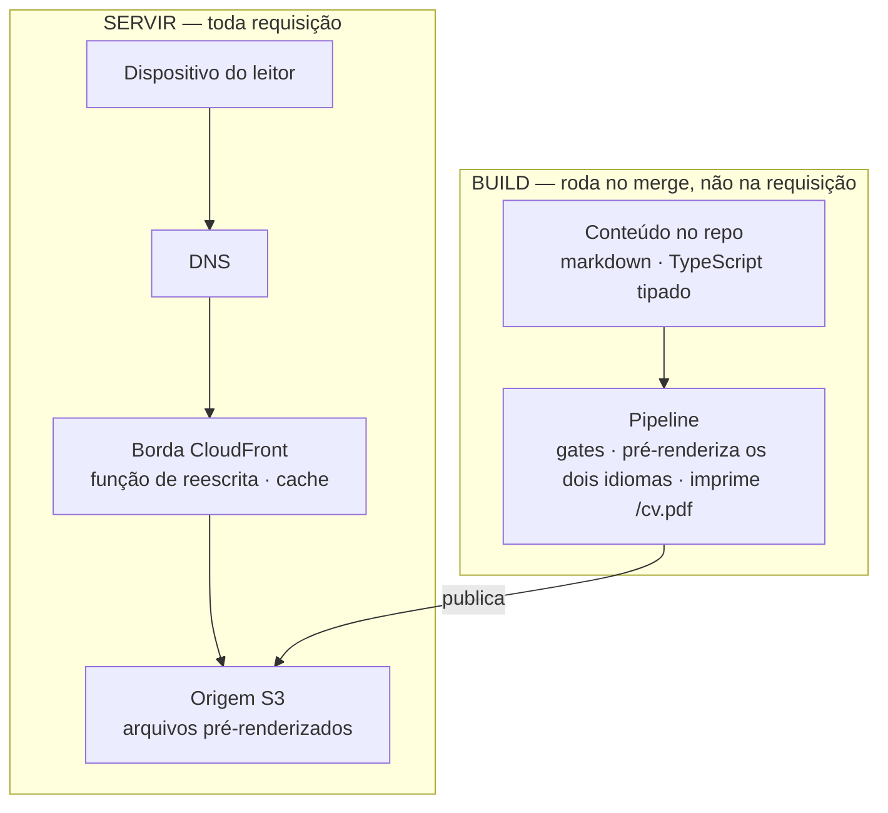
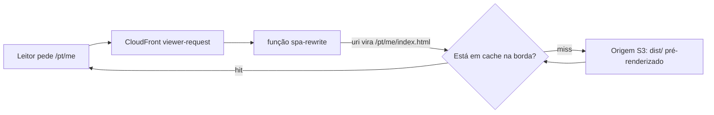

_Este site é o argumento. Esta página é a planta — como ele é construído, e como você construiria o seu._

## A tese

Para um site de prova de engenharia, o código é o pitch — então o honesto é mostrar a máquina, não só o resultado dela. Esta é a construção inteira, em aberto: a arquitetura abaixo, as decisões que a moldaram (cada uma registrada como um ADR), e a camada reutilizável que te deixa replicar. Eu construo isto do jeito que quero ser contratado pra construir — desenvolvimento AI-native (Claude Code, Kiro, um loop construído sobre AI-DLC & Agent Harness Engineering) com o rigor de SDLC que a maior parte do trabalho com IA pula. O site é a saída pública desse loop.

## O formato

Uma SPA totalmente estática — React + Vite + TypeScript — servida a partir de **S3 atrás do CloudFront**, com uma pequena CloudFront Function reescrevendo URLs limpas. Sem backend: sem servidor, sem banco, sem auth. Custo quase zero, superfície de ataque mínima, nada rodando às 3 da manhã. *(→ [ADR-0002](https://github.com/tedeuxx/tadeumendonca-io/blob/main/docs/adr/0002-fully-static-spa-no-backend.md) totalmente estático / sem backend · [ADR-0013](https://github.com/tedeuxx/tadeumendonca-io/blob/main/docs/adr/0013-s3-cloudfront-hosting.md) S3 + CloudFront)*

Em camadas — e **o que interessa nesse desenho é o que não está nele**: não há camada de aplicação nem camada de dados, porque tudo que normalmente aconteceria a cada requisição foi movido para o build:



**A ausência é deliberada, não uma lacuna.** Um diagrama de camadas para um sistema assim costuma seguir para uma camada de aplicação, um banco e integrações internas; aqui ele para num bucket. O único terceiro em tempo de execução é a analytics, e ela depende de consentimento *(→ [ADR-0033](https://github.com/tedeuxx/tadeumendonca-io/blob/main/docs/adr/0033-ga4-consent-gated-analytics.md))*. O que um backend faria por requisição — resolver conteúdo, renderizar HTML, montar as tags OG — acontece uma vez, na trilha de build, e viaja como arquivo.

É também por isso que a conta logo abaixo é tão baixa: **não há nada na trilha de servir que custe dinheiro enquanto ninguém visita.**

O que nada disso situa é onde uma URL limpa vira um arquivo:



Não existe aplicação nesse caminho — então a única lógica entre um leitor e um arquivo são [dezenove linhas de JavaScript](https://github.com/tedeuxx/tadeumendonca-io/blob/main/iac/cloudfront-functions/spa-rewrite.js), e elas carregam [testes unitários próprios](https://github.com/tedeuxx/tadeumendonca-io/blob/main/apps/fed/scripts/spa-rewrite.test.mjs) e uma [verificação pós-deploy](https://github.com/tedeuxx/tadeumendonca-io/blob/main/.github/workflows/deploy.yml) de que a função no ar continua sendo a deste repositório. Ela roda a cada requisição de *página*; os assets do build são um behavior separado, que nunca a invoca — as imagens de OG passam por ela e seguem intactas, porque o último segmento do caminho tem extensão.

Essa verificação é o preço de colocar lógica na borda, não um capricho: a versão de uma função é publicada independentemente da distribuição, então nada no deploy do site prova qual delas está de fato rodando.

## Quanto custa de verdade: USD 6,57 por mês — e USD 6,42 disso é o nome

Dizer "custo quase zero" é a coisa mais fácil desta página — e a mais fácil de ninguém conferir. Então segue a conta inteira: as linhas de hospedagem lidas do custo diário da conta no **fim de julho de 2026**, o registro lido da tabela de preço do registrador. Nenhuma das duas estimada:

- **O domínio** — USD 71,00/ano pelo `.io`, uma cobrança anual que cai num mês só. **USD 5,92/mês** amortizado.
- **Route 53** — USD 0,50/mês, fixo. A hosted zone, com ou sem visitante.
- **S3** — cerca de USD 0,15/mês, e são *escritas* de deploy, não leituras.
- **CloudFront** — na prática USD 0,00 com esse volume.

Repare no desenho disso, porque não é um efeito pequeno e é uma divisão em três, não uma razão: **o nome são 6,42, publicar são 0,15, e responder requisição é zero.** Registro e DNS custam mais que todo o resto desta página somado, quarenta vezes mais; os 0,15 são o build empurrando arquivo pro S3, não leitor puxando; e a parte que de fato atende um visitante arredonda pra nada.

As linhas de hospedagem são medição com data, não fato permanente — nenhuma fatura fechou nesse ritmo ainda. E repare *por que* a fonte é dividida, porque esse foi o erro que esta seção já cometeu uma vez: a série de custo diário é uma janela, e **uma cobrança que se repete menos vezes do que a sua janela é longa fica invisível pra ela.** A renovação é anual e cai em outubro, então ler a conta estava certo e respondia uma pergunta diferente da que eu tinha feito. "Medido, não estimado" não protege de medir o intervalo errado. Não existe linha de computação nenhuma, e é isso que "sem backend" compra: um **piso** de zero, nada cobrando enquanto ninguém visita. O que ele não compra é indiferença a tráfego — S3 e CloudFront são cobrados puramente por uso, então a parte variável é zero aqui por causa do free tier e de payloads pequenos, não porque não haja o que escalar.

### Pra que serve o guardrail, na prática

A mesma leitura mostrou cerca de **USD 12,80 por mês** que o site não estava usando: web ACLs de WAF e endereços IPv4 públicos ociosos, associados a nada, esquecidos quando o backend foi aposentado. Mais de oitenta vezes o que custa publicar o site. **Esses já saíram** — removidos em julho de 2026, e é a série diária de custo que confirma que as cobranças param, não um console vazio dando a entender isso. Não é tudo: sobrou um resíduo da mesma época, **abaixo de um dólar por mês**, ainda sendo cobrado enquanto eu descubro o que ele guarda — linha da conta, não do site, e o estado honesto disto na hora em que escrevo.

Eu descobri lendo a fatura, o que é tarde. Então quem vigia agora é um orçamento no nível da conta, em `iac/budget.tf`, e duas coisas nele são deliberadas. Ele **não** é escopado às tags deste projeto — se fosse, só enxergaria gasto que este repo criou, e este era justamente do tipo que ele não criou. E a sensibilidade mora nos **limiares**, não no teto: um teto precisa comportar o pior mês legítimo, que aqui é o mês da renovação, então ele é surdo por construção a qualquer coisa menor que ele mesmo. O alarme que importa dispara em 15% — perto de USD 12, quieto no ritmo normal, e acordado pra qualquer novo custo recorrente de uns USD 8/mês. Um par convencional de 50/80 só se manifestaria em USD 40, várias vezes o gasto real, e ficaria um ano calado sobre um serviço novo de USD 30/mês.

É isso que você tira daqui, e tem dois lados: infraestrutura que você para de usar não para de cobrar, e quem deveria pegar isso precisa olhar mais **amplo** do que aquilo que você está construindo e mais **baixo** do que aquilo que te dá medo. *(→ [`iac/budget.tf`](https://github.com/tedeuxx/tadeumendonca-io/blob/main/iac/budget.tf))*

## O que foi cortado — e tinha sido construído antes, que é a parte que importa

A versão fácil desta seção é *"mantivemos o escopo enxuto"*. Isso é postura, e qualquer um pode alegar o mesmo. A versão verdadeira é mais forte e é verificável: **isto não foi construído enxuto. Foi construído inteiro e depois cortado**, e cada reversão está registrada junto com a decisão que a substituiu.

| removido | o que era | substituído por |
|---|---|---|
| [ADR-0025](https://github.com/tedeuxx/tadeumendonca-io/blob/main/docs/adr/0025-superseded-backend-platform.md) | Plataforma com backend — BFF em Lambda, DynamoDB, Cognito, SES | [0002](https://github.com/tedeuxx/tadeumendonca-io/blob/main/docs/adr/0002-fully-static-spa-no-backend.md) |
| [ADR-0026](https://github.com/tedeuxx/tadeumendonca-io/blob/main/docs/adr/0026-superseded-lambda-edge-og.md) | Lambda@Edge renderizando imagens OG a cada requisição | [0004](https://github.com/tedeuxx/tadeumendonca-io/blob/main/docs/adr/0004-build-time-render-not-ssr-or-edge.md) |
| [ADR-0027](https://github.com/tedeuxx/tadeumendonca-io/blob/main/docs/adr/0027-superseded-backend-link-unfurl.md) | Serviço de unfurl de links para os cards de preview | [0004](https://github.com/tedeuxx/tadeumendonca-io/blob/main/docs/adr/0004-build-time-render-not-ssr-or-edge.md) |
| [ADR-0028](https://github.com/tedeuxx/tadeumendonca-io/blob/main/docs/adr/0028-superseded-gitflow-two-env.md) | GitFlow com staging e produção | [0003](https://github.com/tedeuxx/tadeumendonca-io/blob/main/docs/adr/0003-trunk-based-single-environment.md) |
| [ADR-0029](https://github.com/tedeuxx/tadeumendonca-io/blob/main/docs/adr/0029-superseded-offline-first-pwa.md) | PWA offline-first instalável | [0002](https://github.com/tedeuxx/tadeumendonca-io/blob/main/docs/adr/0002-fully-static-spa-no-backend.md) |

Essas cinco são as reversões do backend, todas em julho de 2026 — e não são todas. O índice completo, logo abaixo, lista cada decisão que este repositório tomou, e as substituídas são mais que as cinco de cima. Nenhuma foi apagada em silêncio: **o registro substituído continua lá e diz o que o substituiu**, que é o único jeito de um leitor distinguir uma decisão de uma racionalização. Clique em qualquer linha e você tem o que foi decidido, o que custou, e por que deixou de estar certo.

**O que o objetivo de fato exigia era conteúdo**, e nada daquela maquinaria servia a isso. Um banco sem nada para guardar. Auth sem ninguém para autenticar. Um ambiente de staging para um site cujo revert é um merge. Cada uma era defensável quando foi decidida, e nenhuma sobreviveu à pergunta *"para que isso serve, aqui"*.

### Se você precisar do backend de volta, o registro diz qual decisão reverter

É isso que torna o caminho de crescimento concreto em vez de uma promessa de que a arquitetura "escalaria". Um sistema que passou a precisar de servidor não exige que este site seja redesenhado — precisa de **uma decisão específica reaberta**, e cada uma das cinco acima nomeia a que a fechou:

- **dados dinâmicos ou contas** → reverter a [0002](https://github.com/tedeuxx/tadeumendonca-io/blob/main/docs/adr/0002-fully-static-spa-no-backend.md), e a 0025 é o formato que aquilo tinha;
- **renderização por requisição** → reverter a [0004](https://github.com/tedeuxx/tadeumendonca-io/blob/main/docs/adr/0004-build-time-render-not-ssr-or-edge.md); 0026 e 0027 são duas coisas que já foram tentadas na borda;
- **uma mudança que você não reverte com um merge** → reverter a [0003](https://github.com/tedeuxx/tadeumendonca-io/blob/main/docs/adr/0003-trunk-based-single-environment.md), e a 0028 é o fluxo de dois ambientes que ela substituiu.

A trilha de build no diagrama acima é onde as duas metades se encontram: acrescentar um servidor significa tirar trabalho **de dentro dela**, não pendurar uma camada na lateral.

## Cada decisão, e em que pé ela está

A tabela abaixo **não foi digitada aqui**. Ela é compilada a partir de `docs/adr/` quando o site é construído, então uma decisão acrescentada, substituída ou emendada ou atualiza esta página ou deixa o build vermelho — o mesmo mecanismo dos diagramas acima, e pelo mesmo motivo. Um índice copiado à mão para uma biblioteca desse tamanho fica velho em uma semana e nada avisa.

```adr-index
```

Isto é o princípio desta própria página aplicado à única lista que ela não tem como evitar reproduzir: **linkar o detalhe canônico em vez de repeti-lo.** Cada linha é um link, e a decisão em si mora no registro — com o contexto, as opções que perderam, e o que ela custou.

## O conteúdo é markdown no repo, resolvido no build

O conteúdo de cada página — o CV, esta página, os artigos — é markdown ou dado tipado no repo. Cada rota é **prerenderizada** no build (um snapshot headless) pra que as tags de OG/SEO e o HTML rastreável cheguem nos arquivos servidos — sem SSR, sem edge rendering. O PDF do CV para download é impresso a partir do `/me` ao vivo pela mesma etapa. *(→ [ADR-0004](https://github.com/tedeuxx/tadeumendonca-io/blob/main/docs/adr/0004-build-time-render-not-ssr-or-edge.md) render no build · [ADR-0005](https://github.com/tedeuxx/tadeumendonca-io/blob/main/docs/adr/0005-og-coverage-every-public-url.md) toda URL OG-completa · [ADR-0034](https://github.com/tedeuxx/tadeumendonca-io/blob/main/docs/adr/0034-build-time-cv-pdf-static-artifact.md) o PDF do CV)*

## O dev-loop é o produto

A parte interessante não é a stack — é como ele é construído: **agent-led verification, human-residual** (verificação liderada pelo agente, humano no resíduo). O agente prova o "pronto" com gates mecânicos e evidência real (lint, tipos, testes ≥85%, um build verde, SonarCloud, E2E funcional, um revisor de contexto fresco); o humano fica com as decisões irreversíveis e arquiteturais. Esse loop vive num plugin reutilizável à parte — **[tadeumendonca-skills](https://github.com/tedeuxx/tadeumendonca-skills)** — então é uma metodologia que você pode adotar, não algo sob medida só pra este site. *(→ [ADR-0003](https://github.com/tedeuxx/tadeumendonca-io/blob/main/docs/adr/0003-trunk-based-single-environment.md) trunk-based single-environment · [ADR-0018](https://github.com/tedeuxx/tadeumendonca-io/blob/main/docs/adr/0018-ci-gates-e2e-on-pr-coverage.md) os gates de CI)*



```mermaid
flowchart LR
  accTitle: Onde o humano fica no loop
  accDescr: Uma issue vira um plano que o humano alinha antes de existir código. O agente constrói a fatia e roda os gates mecânicos, que voltam para a construção no vermelho. Um revisor de contexto fresco então julga a mudança e pode devolvê-la. O que é classe segura ele mesmo mergeia, e o merge é o deploy. O que é classe de fronteira — infraestrutura, as regras do próprio loop, publicar um artigo — passa por um go ou no-go humano, que é a última coisa antes da produção e também pode devolver o trabalho.
  I["Issue"] --> P["Plano, decidido pelo humano"]
  P --> B["Agente constrói a fatia"]
  B --> G["Gates mecânicos"]
  G -- "vermelho" --> B
  G -- "verde" --> R["Revisor de contexto fresco"]
  R -- "mudanças" --> B
  R -- "classe segura" --> M["Merge = deploy"]
  R -- "classe de fronteira" --> H["Go / no-go humano"]
  H -- "go" --> M
  H -- "no-go" --> B
```

O humano aparece duas vezes, e as duas aparições são trabalhos diferentes. No plano, decidindo o que vale ser construído e como — arquitetura eu nunca decido sozinho. No fim, só no que é classe de fronteira, decidindo se aquilo sobe. No meio, o agente constrói e a máquina prova, e a maior parte das mudanças chega à produção sem ninguém nesse caminho.

A figura mostra por onde o trabalho passa. O que ela não consegue mostrar é que esse caminho foi **decidido** — em qual aresta o humano entra, o que conta como fronteira de classe, onde um gate vale o que custa. É essa a engenharia que esta página está oferecendo, mais do que qualquer caixa do desenho.

E o custo disso, já que o resto desta página assume os seus: quem decide que uma mudança é segura é o mesmo tipo de coisa que escreveu a mudança. Classifique uma errado e ela pega o caminho vazio. O que torna isso aceitável aqui é raio de impacto, não confiança — isto é um site estático, e reverter é um merge.

## O registro de decisões É a documentação

Nada de doc de arquitetura separado que descola da realidade. Toda decisão que sustenta peso — e as revertidas, mantidas como histórico — é um **[Architecture Decision Record](https://github.com/tedeuxx/tadeumendonca-io/blob/main/docs/adr/README.md)**, lido através do keystone [ADR-0001](https://github.com/tedeuxx/tadeumendonca-io/blob/main/docs/adr/0001-lean-by-design-calibrated-to-strategy.md): *enxuto por design, calibrado pela estratégia.* O "porquê" de verdade por trás de qualquer coisa acima está lá, datado, com seu trade-off.

## Replique para o seu contexto

Está tudo público — dois repos, sem segredos:

- **[tadeumendonca-io](https://github.com/tedeuxx/tadeumendonca-io)** — este site e sua infraestrutura (`iac/`: Terraform para S3/CloudFront/OIDC).
- **[tadeumendonca-skills](https://github.com/tedeuxx/tadeumendonca-skills)** — o plugin reutilizável do dev-loop: os princípios, as personas dos agentes, os guardas de permissão.

**A régua:** um projeto só entra no portfólio quando **cumpre** a **[docs/catalog-ready.md](https://github.com/tedeuxx/tadeumendonca-io/blob/main/docs/catalog-ready.md)** — o gate de prova de engenharia. Este site é a única entrada que não veio por ela, porque ele *é* a prateleira; o que o sustenta está nesta página — os ADRs acima, os gates, e as limitações que ele assume logo abaixo. A régua está escrita e é pública, então dá pra ler e decidir se ela é sua.

### O passo a passo

Grosso modo, uma noite — e a maior parte dela é esperar DNS e certificado.

1. **Faça fork dos dois repos.** Leia os ADRs antes, começando no 0001 — as decisões são a parte que vale levar, e várias delas não vão servir pro seu contexto.
2. **Registre o domínio e crie a hosted zone dele no Route 53.** Seu piso de custo começa aqui e é quase todo o nome, não a hospedagem — confira o preço de **renovação** do TLD que você escolheu, não só o do primeiro ano. Depois peça um certificado no ACM **em `us-east-1`** — o CloudFront só lê certificado dessa região, onde quer que o resto da sua stack viva — e **coloque os CNAMEs de validação na zona**, que é a parte que de fato te faz esperar.
3. **Crie uma organização e um workspace no Terraform Cloud**, modo de execução **Local**, e aponte o `iac/versions.tf` pros seus nomes — **e o `TF_WORKSPACE` nos dois workflows de infra**, que é onde o workspace é de fato selecionado. Mude só o primeiro e o CI continua falando com o meu. É o que este repo usa, não uma recomendação: o estado mora lá, mas o plan e o apply rodam no meu CI, onde as credenciais são roles OIDC de vida curta. Modo Remoto guardaria credencial no workspace — e aí passa a existir um segundo lugar de onde a infraestrutura pode mudar.
4. **Faça na mão o que o CI não consegue fazer por si**, e seja preciso sobre quais peças são essas, porque "roda uma vez local" não conta a história toda. O Terraform daqui cria a **role** de deploy, que publica o site. Ele **não** cria o provedor OIDC do GitHub, e **não** cria a role de infra que roda o próprio Terraform — não porque gerenciar seja impossível, mas porque a primeira execução dele precisaria da credencial que ele ainda não criou, e porque uma role capaz de reescrever a própria trust policy é uma role sem teto; o runbook é o [`docs/iac-deploy-policy.md`](https://github.com/tedeuxx/tadeumendonca-io/blob/main/docs/iac-deploy-policy.md). Coloque esses dois de pé antes, ou a sua primeira execução no CI não tem o que assumir. Esta é a única exceção honesta ao *apply é só de pipeline* — e, depois dela, tire as credenciais locais e nunca mais dê apply de um laptop.
5. **Configure os secrets do GitHub, e repare em qual escopo cada um vai.** Tudo que nomeia a AWS — `AWS_FED_OIDC_ROLE_ARN`, `AWS_INFRA_OIDC_ROLE_ARN` e o e-mail de alerta do orçamento, `BUDGET_ALERT_EMAIL` — é secret de **environment**; os tokens de ferramenta — `TFC_API_TOKEN`, `SONAR_TOKEN`, `VERSION_BUMP_TOKEN` — são secrets de **repositório**. Essa separação é o que impede um token que roda o lint de alcançar qualquer coisa na sua conta.
6. **Acerte o subject da trust policy — e é esse que vai te custar tempo.** As roles confiam num subject *imutável*: `repo:<org>@<org_id>/<repo>@<repo_id>:*`, por ID numérico, não por nome. A forma simples `repo:<org>/<repo>:*` é um nome, e nome pode ser transferido pra outra pessoa; os IDs não. O preço da forma segura é que ela não sai por copiar e colar — você tem que ir buscar os seus IDs.
7. **Troque o conteúdo e o posicionamento.** `src/content/` pro texto longo, `src/data/profile.ts` pro CV, `src/data/catalog.ts` pro portfólio, `src/i18n/messages.ts` pros textos de interface. Todo módulo que o leitor vê é tipado de modo que uma tradução faltando é **erro de compilação**, não uma página servindo o idioma errado em silêncio.
8. **Faça merge na `main`.** O merge **é** o deploy — não existe passo de promoção nem um segundo ambiente pra pegar o que o pull request deixou passar. É essa a troca que a arquitetura inteira faz, e ela só é segura porque os gates rodam no PR.

O que eu ficaria nervoso de ver alguém copiar sem o resto é **o merge direto pra produção**. Trunk-based com ambiente único é rápido e implacável na mesma medida; sem os gates na frente, sobra só a segunda metade.

## Duas limitações honestas

Este é um site de autor único, afinado ao posicionamento de uma pessoa — não é um template de propósito geral, e nunca passou pela mão de mais ninguém. Pegue o padrão, não os detalhes.

E os três desenhos acima mostram o **formato** de uma coisa, não uma execução dela. Dois deles você consegue conferir. Que o caminho da requisição é o que a borda de fato faz: a função, os testes dela e a comparação pós-deploy estão linkados. Que as camadas são o que este repositório de fato constrói: o `iac/` e o script de build resolvem isso entre si. O terceiro você não consegue. Que o loop é seguido do jeito que está desenhado não é algo que esta página prove — nada aqui mostra que alguma mudança específica percorreu aquele trajeto. Aquele é uma afirmação sobre como eu trabalho, e nenhum artefato desta página resolve isso pra você.
