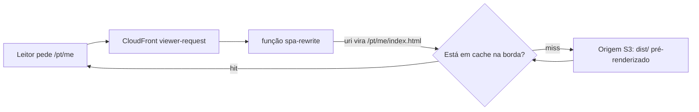

_Este site é o argumento. Esta página é a planta — como ele é construído, e como você construiria o seu._

## A tese

Para um site de prova de engenharia, o código é o pitch — então o honesto é mostrar a máquina, não só o resultado dela. Esta é a construção inteira, em aberto: a arquitetura abaixo, as decisões que a moldaram (cada uma registrada como um ADR), e a camada reutilizável que te deixa replicar. Eu construo isto do jeito que quero ser contratado pra construir: desenvolvimento AI-native com o rigor de SDLC que a maior parte do trabalho com IA pula — Claude Code, Kiro, um loop construído sobre AI-DLC & Agent Harness Engineering. O site é a saída pública desse loop.

## O formato

Uma SPA totalmente estática — React + Vite + TypeScript — servida a partir de **S3 atrás do CloudFront**, com uma pequena CloudFront Function reescrevendo URLs limpas. Sem backend: sem servidor, sem banco, sem auth. Custo quase zero, superfície de ataque mínima, nada rodando às 3 da manhã. *(→ [ADR-0002](https://github.com/tedeuxx/tadeumendonca-io/blob/main/docs/adr/0002-fully-static-spa-no-backend.md) totalmente estático / sem backend · [ADR-0013](https://github.com/tedeuxx/tadeumendonca-io/blob/main/docs/adr/0013-s3-cloudfront-hosting.md) S3 + CloudFront)*

Em camadas — e **o que interessa nesse desenho é o que não está nele**: não há camada de aplicação nem camada de dados, porque tudo que normalmente aconteceria a cada requisição foi movido para o build:

```mermaid
flowchart TB
  accTitle: As camadas, e a trilha de build que substitui as que faltam
  accDescr: Duas trilhas — dois tempos, não dois lados do desenho. A trilha de build: o conteúdo escrito no repositório passa pelo pipeline, que pré-renderiza cada rota nos dois idiomas e imprime o PDF do CV, e publica o resultado na origem em S3. A trilha de servir: o dispositivo do leitor chega ao DNS, depois à borda do CloudFront, que roda a função de reescrita de URL e mantém o cache, e daí à mesma origem em S3 com os arquivos pré-renderizados. Não há servidor de aplicação nem banco de dados. Tudo que um backend normalmente faria a cada requisição acontece na trilha de build.
  subgraph build["BUILD — roda no merge, não na requisição"]
    direction TB
    C["Conteúdo no repo<br/>markdown · TypeScript tipado"] --> P["Pipeline<br/>gates · pré-renderiza os dois idiomas · imprime /cv.pdf"]
  end
  subgraph serve["SERVIR — toda requisição"]
    direction TB
    D["Dispositivo do leitor"] --> N["DNS"]
    N --> E["Borda CloudFront<br/>função de reescrita · cache"]
    E --> O["Origem S3<br/>arquivos pré-renderizados"]
  end
  P -- "publica" --> O
```



**A ausência é deliberada, não uma lacuna.** Um diagrama de camadas para um sistema assim costuma seguir para uma camada de aplicação, um banco e integrações internas; aqui ele para num bucket. O único terceiro em tempo de execução é a analytics, e ela depende de consentimento *(→ [ADR-0033](https://github.com/tedeuxx/tadeumendonca-io/blob/main/docs/adr/0033-ga4-consent-gated-analytics.md))*. O que um backend faria por requisição — resolver conteúdo, renderizar HTML, montar as tags OG — acontece uma vez, na trilha de build, e viaja como arquivo.

É também por isso que a conta logo abaixo é o que é: **o nome e a zona hospedada cobram com ou sem visitante, e o que uma visita acrescenta em cima deles arredonda pra nada.**

O que nada disso situa é onde uma URL limpa vira um arquivo:



Não existe aplicação nesse caminho — então a única lógica entre um leitor e um arquivo são [dez linhas executáveis de JavaScript](https://github.com/tedeuxx/tadeumendonca-io/blob/main/iac/cloudfront-functions/spa-rewrite.js), e elas carregam [testes unitários próprios](https://github.com/tedeuxx/tadeumendonca-io/blob/main/apps/fed/scripts/spa-rewrite.test.mjs) e uma [verificação pós-deploy](https://github.com/tedeuxx/tadeumendonca-io/blob/main/.github/workflows/deploy.yml) de que a função no ar continua sendo a deste repositório. Ela roda a cada requisição de *página*; os assets do build são um behavior separado, que nunca a invoca — as imagens de OG passam por ela e seguem intactas, porque o último segmento do caminho tem extensão.

Essa verificação é o preço de colocar lógica na borda, não um capricho: a versão de uma função é publicada independentemente da distribuição, então nada no deploy do site prova qual delas está de fato rodando.

## Por que este site existe

Para aprender IA você precisa criar os use cases. Você não aprende sem eles. Tudo precisa de um usuário, uma aplicação, uma funcionalidade, um business case — e é aí que eu continuo vendo a lacuna. No trabalho com IA de que estive perto, a modelagem é forte e a outra metade é rala: systems integration, legado que não dá pra trocar, as complicações comuns de TI corporativa. É nessa outra metade que eu passei dezoito anos. Este site é um use case, e o repositório aberto deixa qualquer um conferir.

Comecei o ano perdido. Um projeto que não estava indo bem, um monte de obrigações de catch-up nas ferramentas de IA, e a coisa foi degradando até eu sair de férias. E tem um detalhe que eu suspeito que muita gente sênior está vivendo e não diz em voz alta: **eu tinha as ferramentas de desenvolvimento agêntico na mão — Claude Code, Kiro — e mesmo assim me sentia de fora do hype.**

Desenvolvimento de software é minha paixão. Nada me diverte mais que ver uma aplicação funcionando bonitinha. O que essas ferramentas me devolveram foi isso, numa escala que sozinho eu não alcançava.

O caso que me provou isso não foi este site. Foi um mecanismo de autenticação e autorização com regras de negócio densas, custom em Spring Boot e Spring Security, integrando sistemas legados. Comecei a construir por fora, na volta das férias, e aquilo foi crescendo e amadurecendo. **Eu jamais teria conseguido desenvolver esse mecanismo sem uma agentic development tool** — não no prazo que eu tinha.

Desde então tenho feito isso em duas frentes: uma interna, no meu trabalho, e esta, pública. Consultoria não me dá mais o que eu quero fazer: produto digital. Gosto de criar apps.

## Quem fez o quê

Trabalhar com um time autônomo de agentes é parte do propósito deste site, então vale ser específico sobre o recorte — sem número de horas, porque eu não os registrei e um número inventado não valeria nada.

**Meu:** a ideia, o produto, os conteúdos — meus mesmo onde eles lapidaram — a voz do site, a arquitetura de agentes, a configuração do harness e a experimentação de setups, os padrões de arquitetura.
**Do time de agentes:** rascunhar o desenvolvimento e o código.

Mas o método não é despacho. Parte da minha ideia, eu **ouço deles como fariam**, e vou aparando arestas contra a minha visão de arquitetura e minha experiência com sistemas distribuídos. A autoria continua minha; ela só se exerce depois de escutar.

E escutar rende. Eles têm senioridade maior que a minha nos frameworks e nas linguagens escolhidas — eu agrego com arquitetura e visão. **Recorrentemente aprendo formas de usar os serviços AWS que eu não sabia que existiam.** Neste site foi a renderização de OG com Lambda@Edge: eu não fazia ideia de que dava para suprir um SSR e resolver indexação de crawler com aquilo. Em outro sistema foi trocar OpenSearch por busca semântica com S3 Vector Store, que ali saiu mais rápido e mais barato.

A ironia do primeiro exemplo está a duas seções daqui: aquele Lambda@Edge é a [ADR-0026](https://github.com/tedeuxx/tadeumendonca-io/blob/main/docs/adr/0026-superseded-lambda-edge-og.md), e ela foi **cortada**. Funcionou, me ensinou, e depois se provou desnecessária — prerender no build entrega o mesmo HTML servido sem nada rodando. As duas coisas são verdade ao mesmo tempo.

Em pessoas, o que está acima custou uma. Fins de semana, em paralelo com consultoria.

## Quanto custa de verdade: USD 6,57 por mês — e USD 6,42 disso é o nome

Dizer "custo quase zero" é a coisa mais fácil desta página — e a mais fácil de ninguém conferir. Então segue a conta da AWS: as linhas de hospedagem lidas do custo diário da conta no **fim de julho de 2026**, o registro lido da tabela de preço do registrador. Nenhuma das duas estimada:

- **O domínio** — USD 71,00/ano pelo `.io`, uma cobrança anual que cai num mês só. **USD 5,92/mês** amortizado.
- **Route 53** — USD 0,50/mês, fixo. A hosted zone, com ou sem visitante.
- **S3** — cerca de USD 0,15/mês, e são *escritas* de deploy, não leituras.
- **CloudFront** — na prática USD 0,00 com esse volume.

**E a maior linha da conta é justamente a que foi escolha.** `.io` é caro entre os domínios de topo, e eu escolhi por branding, não por custo — essa é a razão honesta, e é a única linha daqui que você pode recusar. Nada mais nesta conta se mexe com o nome: a hosted zone, o bucket e a distribuição não ligam para qual ele é. Então, em vez de imprimir uma tabela de preços que envelhece — ou citar uma comparação que eu não medi —, fica o comando que responde isso para o nome que você quiser, pelo mesmo registrador que este usa: `aws route53domains list-prices --tld com`. Replique esta stack sob um nome mais barato e o número mensal acima deixa de ser dominado por uma preferência minha.

Repare no formato disso, porque não é um efeito pequeno e é uma divisão em três, não uma razão: **o nome são 6,42, publicar são 0,15, e responder requisição é zero.** Registro e DNS custam mais que todo o resto desta conta somado, quarenta vezes mais; os 0,15 são o build empurrando arquivo pro S3, não leitor puxando; e a parte que de fato atende um visitante arredonda pra nada.

As linhas de hospedagem são medição com data, não fato permanente — nenhuma fatura fechou nesse ritmo ainda. E repare *por que* a fonte é dividida, porque esse foi o erro que esta seção já cometeu uma vez: a série de custo diário é uma janela, e **uma cobrança que se repete menos vezes do que a sua janela é longa fica invisível pra ela.** A renovação é anual e cai em outubro, então ler a conta estava certo e respondia uma pergunta diferente da que eu tinha feito. "Medido, não estimado" não protege de medir o intervalo errado. A única computação nesse caminho é a função de edge lá de cima, cobrada por invocação e arredondando pra zero neste volume; não existe linha de *servidor* nenhuma, e é isso que "sem backend" compra: um **piso** sem computação nenhuma — nada parado ali cobrando por capacidade, embora o nome e a zona hospedada cobrem de todo jeito. O que ele não compra é indiferença a tráfego — S3 e CloudFront são cobrados puramente por uso, então a parte variável é zero aqui por causa do free tier e de payloads pequenos, não porque não haja o que escalar.

### Os outros fornecedores, e por que um número só é o formato errado

A AWS é um dos fornecedores que poderiam faturar este site — e esse é o critério, declarado em vez de virar contagem, porque número envelhece na primeira dependência nova. **Entra aqui tudo que cobra para manter o site publicado no ar, ou que cobraria sob alguma condição.** O recorte é deliberado, e a seção final volta nele: aquilo com que eu **construo** o site é uma pergunta diferente daquilo em que ele **roda**. Aplicado com honestidade, ele ainda revela mais do que uma lista de zeros — e o interessante é que os itens não se comportam do mesmo jeito.

**Dois cobram hoje, e nenhuma das duas cobranças foi criada por este site.** O **GitHub** hospeda o código e roda todos os gates, num plano pago — a assinatura é anterior ao site, embora a carga de CI em cima dela seja inteiramente dele, e cobrada a zero por um motivo que aparece dois parágrafos abaixo. O **iCloud+** carrega o e-mail com domínio próprio no apex — o [`iac/email.tf`](https://github.com/tedeuxx/tadeumendonca-io/blob/main/iac/email.tf) provisiona os registros MX, DKIM e SPF dele, então não é algo adjacente a esta infraestrutura: está dentro dela *(→ [ADR-0016](https://github.com/tedeuxx/tadeumendonca-io/blob/main/docs/adr/0016-custom-email-via-icloud.md) e-mail próprio via iCloud)*. As duas assinaturas já existiam antes do site e cobrariam exatamente o mesmo se ele fosse apagado amanhã — e é por isso que os USD 6,57 não as absorvem: aquele número é o que este site **acrescentou**, não do que ele **depende**. São afirmações diferentes, e "roda com quase nada" só vale para a primeira.

**O resto cobra zero, sob condições que são justamente a parte que interessa:**

- **O GitHub Actions é gratuito porque os repositórios são públicos** — uma propriedade dos repositórios, não do plano, então sobreviveria a um downgrade e não sobrevive a fechá-los. Aí passa a consumir minutos de uma franquia mensal, e este pipeline roda o conjunto inteiro de gates **a cada pull request que mexe na aplicação** — instalação, auditoria, lint, checagem de tipos, unitários, build, E2E e uma varredura do Sonar; os workflows filtram por caminho, e os ADRs estão dentro desse filtro porque esta página os publica, então quem roda bem menos é prosa *fora* desses caminhos —, e **de novo no merge**, que ainda por cima publica e roda um segundo E2E contra o site no ar. O número que aparece não é pequeno, e nada no código teria mudado.
- **O SonarCloud depende da mesma condição**, numa conta separada: o tier gratuito dele é para projetos públicos. O gate dele barra um merge, então ele é estrutural no loop cobrando exatamente zero — que é o caso mais claro de por que escrever só o zero seria a resposta mais enganosa.
- **O tier gratuito do Terraform Cloud cobre este workspace** porque a infraestrutura é pequena: o último plan resolveu contra cerca de cinquenta recursos, bem dentro do limite. Esse teto é contado em **recursos** — não em tráfego, nem em gasto — então é o único limite aqui que uma **decisão** move, e não um público.

A analytics aparece lá em cima como o único terceiro em runtime e está deliberadamente fora desta lista: depende de consentimento e é gratuita em qualquer volume que este site vá produzir, o que faz dela uma questão de privacidade, não de cobrança.

Então o formato honesto é **uma conta medida, um conjunto de zeros condicionais e duas assinaturas que cobrariam com ou sem este site** — e nenhum fornecedor aqui se move com leitores. Fechar um repositório, crescer o parque, registrar um nome: tudo decisão. As únicas linhas cobradas por tráfego em tudo isso estão dentro da conta da AWS, e são as duas que arredondam pra nada.

**E isso também vale para a medida, que é a parte escondida por um total só.** Dos USD 6,57, USD 5,92 são o registro anual amortizado e USD 0,50 a zona hospedada fixa — 6,42 antes de um único arquivo ser servido. Os 0,15 restantes são o build escrevendo no S3, não leitores lendo de lá.

**Isso está em texto e não em tabela, de propósito.** Uma linha escrita `GitHub — USD 0,00` convida o leitor a somar e parar. O que importa não é a célula estar vazia, e sim que ela está vazia **por um motivo que alguém escolheu** — e que esse motivo se reverte por decisão, não por tráfego.

### O que o número ainda deixa de fora

É a conta de um provedor só, deliberadamente — e o eixo acima é o que torna isso honesto em vez de parcial: os USD 6,57 são o que este site **acrescentou**, não aquilo de que ele depende. Então ficam de fora as duas assinaturas que cobrariam com ou sem ele, fica de fora a assinatura do Claude Max em que este trabalho roda, e ficam de fora todas as minhas horas. **Só infraestrutura e ferramental**, e nem isso inteiro.

Isso precisa estar escrito, senão o número mente por omissão: **USD 6,57 por mês é o que custa manter isto no ar, não o que custou construir.** São duas perguntas diferentes, e esta seção responde só a primeira.

### Pra que serve o guardrail, na prática

A mesma leitura mostrou cerca de **USD 12,80 por mês** que o site não estava usando: web ACLs de WAF e endereços IPv4 públicos ociosos, associados a nada, esquecidos quando o backend foi aposentado. Mais de oitenta vezes o que custa publicar o site. **Esses já saíram** — removidos em julho de 2026, e é a série diária de custo que confirma que as cobranças param, não um console vazio dando a entender isso. Não é tudo: sobrou um resíduo da mesma época, **abaixo de um dólar por mês**, ainda sendo cobrado enquanto eu descubro o que ele guarda — linha da conta, não do site, e o estado honesto disto na hora em que escrevo.

Eu descobri lendo a fatura, o que é tarde. Então quem vigia agora é um orçamento no nível da conta, em `iac/budget.tf`, e duas coisas nele são deliberadas. Ele **não** é escopado às tags deste projeto — se fosse, só enxergaria gasto que este repo criou, e este era justamente do tipo que ele não criou. E a sensibilidade mora nos **limiares**, não no teto: um teto precisa comportar o pior mês legítimo, que aqui é o mês da renovação, então ele é surdo por construção a qualquer coisa menor que ele mesmo. O alarme que importa dispara em 15% — perto de USD 12, quieto no ritmo normal, e acordado pra qualquer novo custo recorrente de uns USD 8/mês. Um par convencional de 50/80 só se manifestaria em USD 40, várias vezes o gasto real, e ficaria um ano calado sobre um serviço novo de USD 30/mês.

É isso que você tira daqui, e tem dois lados: infraestrutura que você para de usar não para de cobrar, e quem deveria pegar isso precisa olhar mais **amplo** do que aquilo que você está construindo e mais **baixo** do que aquilo que te dá medo. *(→ [`iac/budget.tf`](https://github.com/tedeuxx/tadeumendonca-io/blob/main/iac/budget.tf))*

## O que foi cortado — e tinha sido construído antes, que é a parte que importa

A versão fácil desta seção é *"mantivemos o escopo enxuto"*. Isso é postura, e qualquer um pode alegar o mesmo. A versão verdadeira é mais forte e é verificável: **isto não foi construído enxuto. Foi construído inteiro e depois cortado**, e cada reversão está registrada junto com a decisão que a substituiu.

| removido | o que era | substituído por |
|---|---|---|
| [ADR-0025](https://github.com/tedeuxx/tadeumendonca-io/blob/main/docs/adr/0025-superseded-backend-platform.md) | Plataforma com backend — BFF em Lambda, DynamoDB, Cognito, SES | [0002](https://github.com/tedeuxx/tadeumendonca-io/blob/main/docs/adr/0002-fully-static-spa-no-backend.md) |
| [ADR-0026](https://github.com/tedeuxx/tadeumendonca-io/blob/main/docs/adr/0026-superseded-lambda-edge-og.md) | Lambda@Edge renderizando imagens OG a cada requisição | [0004](https://github.com/tedeuxx/tadeumendonca-io/blob/main/docs/adr/0004-build-time-render-not-ssr-or-edge.md) |
| [ADR-0027](https://github.com/tedeuxx/tadeumendonca-io/blob/main/docs/adr/0027-superseded-backend-link-unfurl.md) | Serviço de unfurl de links para os cards de preview | [0004](https://github.com/tedeuxx/tadeumendonca-io/blob/main/docs/adr/0004-build-time-render-not-ssr-or-edge.md) |
| [ADR-0028](https://github.com/tedeuxx/tadeumendonca-io/blob/main/docs/adr/0028-superseded-gitflow-two-env.md) | GitFlow com staging e produção | [0003](https://github.com/tedeuxx/tadeumendonca-io/blob/main/docs/adr/0003-trunk-based-single-environment.md) |
| [ADR-0029](https://github.com/tedeuxx/tadeumendonca-io/blob/main/docs/adr/0029-superseded-offline-first-pwa.md) | PWA offline-first instalável | [0002](https://github.com/tedeuxx/tadeumendonca-io/blob/main/docs/adr/0002-fully-static-spa-no-backend.md) |

Essas cinco são as que esta seção percorre, todas em julho de 2026 — o backend e a maquinaria que vinha junto, e é por isso que um fluxo de staging e um PWA offline-first estão na lista ao lado do servidor. Não são todas as reversões. O índice logo abaixo traz as decisões que sustentam peso, e as substituídas são mais que as cinco de cima. Nenhuma foi apagada em silêncio: **o registro substituído continua lá e diz o que o substituiu**, que é o único jeito de um leitor distinguir uma decisão de uma racionalização. Clique em qualquer linha e você tem o que foi decidido, o que custou, e por que deixou de estar certo.

**O que o objetivo de fato exigia era conteúdo**, e nada daquela maquinaria servia a isso. Um banco sem nada para guardar. Auth sem ninguém para autenticar. Um ambiente de staging para um site cujo revert é um merge. Cada uma era defensável quando foi decidida, e nenhuma sobreviveu à pergunta *"para que isso serve, aqui"*.

### Se você precisar do backend de volta, o registro diz qual decisão reverter

É isso que torna o caminho de crescimento concreto em vez de uma promessa de que a arquitetura "escalaria". Um sistema que passou a precisar de servidor não exige que este site seja redesenhado — precisa de **uma decisão específica reaberta**, e cada uma das cinco acima nomeia a que a fechou:

- **dados dinâmicos ou contas** → reverter a [0002](https://github.com/tedeuxx/tadeumendonca-io/blob/main/docs/adr/0002-fully-static-spa-no-backend.md), e a 0025 é o formato que aquilo tinha;
- **renderização por requisição** → reverter a [0004](https://github.com/tedeuxx/tadeumendonca-io/blob/main/docs/adr/0004-build-time-render-not-ssr-or-edge.md); 0026 e 0027 são duas coisas que já foram tentadas na borda;
- **uma mudança que você não reverte com um merge** → reverter a [0003](https://github.com/tedeuxx/tadeumendonca-io/blob/main/docs/adr/0003-trunk-based-single-environment.md), e a 0028 é o fluxo de dois ambientes que ela substituiu.

A trilha de build no diagrama acima é onde as duas metades se encontram: acrescentar um servidor significa tirar trabalho **de dentro dela**, não pendurar uma camada na lateral.

## Cada decisão, e em que pé ela está

A tabela abaixo **não foi digitada aqui**. Ela é gerada a partir de `docs/adr/`, commitada como artefato e conferida no CI: acrescentar ou substituir uma decisão sem regenerar o índice deixa o pipeline vermelho, então ou a página bate com a biblioteca ou nada é publicado. Um índice copiado à mão para uma biblioteca desse tamanho envelhece em uma semana e nada avisa — este é o mesmo mecanismo dos diagramas acima, e pelo mesmo motivo.

```adr-index
```

Isso é o princípio da própria página aplicado à única lista que ela não tem como evitar reproduzir: **linkar o detalhe canônico em vez de repeti-lo.** Cada linha é um link, e a decisão em si mora no registro — com o contexto, as opções que perderam, e o que ela custou.

## O conteúdo é markdown no repo, resolvido no build

O conteúdo de cada página — o CV, esta página, os artigos — é markdown ou dado tipado no repo. Cada rota é **prerenderizada** no build (um snapshot headless) pra que as tags de OG/SEO e o HTML rastreável cheguem nos arquivos servidos — sem SSR, sem edge rendering. O PDF do CV para download é impresso a partir do `/me` ao vivo pela mesma etapa. *(→ [ADR-0004](https://github.com/tedeuxx/tadeumendonca-io/blob/main/docs/adr/0004-build-time-render-not-ssr-or-edge.md) render no build · [ADR-0005](https://github.com/tedeuxx/tadeumendonca-io/blob/main/docs/adr/0005-og-coverage-every-public-url.md) toda URL OG-completa · [ADR-0034](https://github.com/tedeuxx/tadeumendonca-io/blob/main/docs/adr/0034-build-time-cv-pdf-static-artifact.md) o PDF do CV)*

## O dev-loop é o produto

A parte interessante não é a stack — é como ele é construído: **agent-led verification, human-residual** (verificação liderada pelo agente, humano no resíduo). O agente prova o "pronto" com gates mecânicos e evidência real (lint, tipos, testes ≥85%, um build verde, SonarCloud, E2E funcional, um revisor de contexto fresco); o humano fica com as decisões irreversíveis e arquiteturais. Esse loop vive num plugin reutilizável à parte — **[tadeumendonca-skills](https://github.com/tedeuxx/tadeumendonca-skills)** — então é uma metodologia que você pode adotar, não algo sob medida só pra este site. *(→ [ADR-0003](https://github.com/tedeuxx/tadeumendonca-io/blob/main/docs/adr/0003-trunk-based-single-environment.md) trunk-based single-environment · [ADR-0018](https://github.com/tedeuxx/tadeumendonca-io/blob/main/docs/adr/0018-ci-gates-e2e-on-pr-coverage.md) os gates de CI)*



```mermaid
flowchart LR
  accTitle: Onde o humano fica no loop
  accDescr: Uma issue vira um plano que o humano alinha antes de existir código. O agente constrói a fatia e roda os gates mecânicos, que voltam para a construção no vermelho. Um revisor de contexto fresco então julga a mudança e pode devolvê-la. O que é classe segura ele mesmo mergeia, e o merge é o deploy. O que é classe de fronteira — infraestrutura, as regras do próprio loop, publicar um artigo — passa por um go ou no-go humano, que é a última coisa antes da produção e também pode devolver o trabalho.
  I["Issue"] --> P["Plano, decidido pelo humano"]
  P --> B["Agente constrói a fatia"]
  B --> G["Gates mecânicos"]
  G -- "vermelho" --> B
  G -- "verde" --> R["Revisor de contexto fresco"]
  R -- "mudanças" --> B
  R -- "classe segura" --> M["Merge = deploy"]
  R -- "classe de fronteira" --> H["Go / no-go humano"]
  H -- "go" --> M
  H -- "no-go" --> B
```

O humano aparece duas vezes, e as duas aparições são trabalhos diferentes. No plano, decidindo o que vale ser construído e como — arquitetura eu nunca decido sozinho. No fim, só no que é classe de fronteira, decidindo se aquilo sobe. No meio, o agente constrói e a máquina prova, e a maior parte das mudanças chega à produção sem ninguém nesse caminho.

A figura mostra por onde o trabalho passa. O que ela não consegue mostrar é que esse caminho foi **decidido** — em qual aresta o humano entra, o que conta como fronteira de classe, onde um gate vale o que custa. É essa a engenharia que esta página está oferecendo, mais do que qualquer caixa do desenho.

E o custo disso, já que o resto desta página assume os seus: quem decide que uma mudança é segura é o mesmo tipo de coisa que escreveu a mudança. Classifique uma errado e ela pega o caminho vazio. O que torna isso aceitável aqui é raio de impacto, não confiança — isto é um site estático, e reverter é um merge.

### Do que o loop é feito, e o que cada parte consegue de fato fazer

A figura acima responde *por onde o trabalho passa*. Ela não diz do que o loop é **feito** — e é essa a pergunta de quem está decidindo se adota isso. São dois desenhos separados de propósito: um só, tentando ser os dois, teria que dar a mesma seta pra um hook que recusa um comando e pra uma lente que alguém precisa lembrar de acionar, e essa diferença é a coisa mais útil desta página.


**Dos componentes do próprio plugin, exatamente um tipo consegue te barrar**, e essa é a versão honesta do convite a adotar. (A caixa que *não* é componente do plugin — *Aí os gates, aí o merge* — é um ponteiro de volta pro primeiro diagrama, e aqueles gates barram sim: o SonarCloud e o check terminal `build-test` bloqueiam um merge. Eles moram nos workflows deste repositório, e não no plugin, e é justamente por isso que não são linhas do inventário abaixo.) Dois dos quatro hooks rodam no `PreToolUse`: o runtime do agente chama eles *antes* da ferramenta rodar, eles devolvem uma negativa e o comando não acontece. Os outros dois rodam no `SessionStart` e só reportam — não têm chamada nenhuma pra recusar, e é por isso que não estão desenhados como piso. As personas aconselham, e *aconselhar* é uma afirmação sobre o julgamento que elas produzem, não sobre onde elas sentam: uma delas, a `quality-assurance`, tem uma cadeira garantida por mecanismo — o mesmo hook de permissão só deixa aquele agent type rodar o comando de merge — e ser a única que *pode* fazer o merge é uma propriedade diferente de ser verificada em como fez. A `product-lead` é a imagem espelhada disso: ela **barra** um merge quando encontra uma afirmação publicada que não é verdade — mas por convenção, não por hook, então nada recusa o comando de merge em nome dela e o desenho não teria como mostrá-la como piso sem mentir. Nos dois casos o julgamento não é verificado por nada, e o guia deste repositório diz com todas as letras que uma lente que ninguém aciona *falha em silêncio*. Os comandos não são nem uma coisa nem outra — são a forma escrita de uma decisão já tomada, pra ninguém rediscutir ela às duas da manhã.

**O inventário é digitado aqui e ancorado no plugin** — o que é uma afirmação mais estreita que *gerado*, e é a que de fato se sustenta. Cada nome, evento, matcher, caminho e contagem acima está escrito à mão no diagrama; o que torna isso confiável é uma corrente de dois elos. Um teste compara o desenho, nó a nó e contagem a contagem, com um [manifesto versionado](https://github.com/tedeuxx/tadeumendonca-io/blob/main/apps/fed/src/content/generated/harness.json), então a figura não consegue divergir dele em nenhum dos dois idiomas. E um [job de CI](https://github.com/tedeuxx/tadeumendonca-io/blob/main/.github/workflows/app.yml) compara esse manifesto com a árvore viva do plugin de três formas — um componente que falta no manifesto, uma linha do manifesto sem nada por trás, e uma que existe dos dois lados tendo mudado de forma. Adicione, aposente ou renomeie uma persona lá e o build deste repositório fica vermelho. *(→ [ADR-0043](https://github.com/tedeuxx/tadeumendonca-io/blob/main/docs/adr/0043-harness-inventory-derived-from-plugin-repo.md))*

**O que isso não compra é atualidade, e a lacuna é estrutural, não descuido.** O plugin é um *outro repositório*, e nada aqui consegue disparar num merge lá. Então o vermelho chega no próximo build daqui — que pode ser dias depois, e numa mudança que não tem nada a ver. **Esta página pode estar errada durante essa janela inteira e não vai avisar.** Dois limites menores, pela mesma razão que o resto da página assume os seus: a verificação compara **identidade**, então um hook que mantém o nome e muda o que faz publica uma descrição velha com o build verde; e as glosas curtas nas arestas — *nega a chamada*, *aconselha, se acionada* — são **escritas aqui** e não são verificadas por nada.

É aí também que caem os dois termos do parágrafo de abertura — e eles não caem do mesmo jeito, o que vale dizer com precisão. **AI-DLC** não é meu: é o nome que a AWS deu a um ciclo de entrega cujas etapas são executadas e verificadas por agentes, e não em volta deles, e a primeira figura é como isso é praticado aqui. **Agent Harness Engineering** é a afirmação que eu faço, e é esta figura — que o harness é uma coisa que se constrói, se conta e se verifica, e não um jeito de escrever prompt. Adotar uma metodologia não custa nada dizer; a segunda precisa ser paga, e o pagamento é que ela *pode* ser inventariada, a partir do repositório onde mora, com um build que quebra quando o inventário deixa de ser verdade.

## O registro de decisões É a documentação

Nada de doc de arquitetura separado que descola da realidade. Toda decisão que sustenta peso — e as revertidas, mantidas como histórico — é um **[Architecture Decision Record](https://github.com/tedeuxx/tadeumendonca-io/blob/main/docs/adr/README.md)**, lido através do keystone [ADR-0001](https://github.com/tedeuxx/tadeumendonca-io/blob/main/docs/adr/0001-lean-by-design-calibrated-to-strategy.md): *enxuto por design, calibrado pela estratégia.* O "porquê" de verdade por trás de qualquer coisa acima está lá, datado, com seu trade-off.

## Replique para o seu contexto

Está tudo público — dois repos, sem segredos:

[https://github.com/tedeuxx/tadeumendonca-io](https://github.com/tedeuxx/tadeumendonca-io)

[https://github.com/tedeuxx/tadeumendonca-skills](https://github.com/tedeuxx/tadeumendonca-skills)

**A régua:** um projeto só entra no portfólio quando **cumpre** a **[docs/catalog-ready.md](https://github.com/tedeuxx/tadeumendonca-io/blob/main/docs/catalog-ready.md)** — o gate de prova de engenharia. Este site é a única entrada que não veio por ela, porque ele *é* a prateleira; o que o sustenta está nesta página — os ADRs acima, os gates, e as limitações que ele assume logo abaixo. A régua está escrita e é pública, então dá pra ler e decidir se ela é sua.

### Onde está o passo a passo, e por que não aqui

Os passos de "do fork até no ar" estão nos READMEs, não nesta página. É a mesma regra que rege o resto daqui: a página aponta para o detalhe canônico em vez de reescrevê-lo. Um guia passo a passo morando aqui seria uma segunda cópia do que um README já é dono — e a cópia que morava aqui já tinha envelhecido, descrevendo workflows que foram renomeados por baixo dela. O **[README deste repo](https://github.com/tedeuxx/tadeumendonca-io#fork-to-live)** cobre o caminho de nuvem inteiro, do domínio até o primeiro merge; o **[README do plugin](https://github.com/tedeuxx/tadeumendonca-skills#run-it)** cobre a metade do loop, que se instala sem nenhuma conta em nuvem e sem nada pra fazer deploy.

Dois desses passos são decisão, não procedimento, e são os que vale ler antes de começar em vez de no meio de um problema.

**O Terraform daqui não cria o provedor OIDC do GitHub, nem a role que roda o próprio Terraform.** Esses dois nascem fora, pela CLI da AWS, e ficam fora do Terraform pra sempre. São duas razões independentes e só uma delas um dia deixaria de valer: a primeira execução precisaria da credencial que ela ainda não criou, e — a que não expira — uma role capaz de reescrever a própria trust policy é uma role sem teto. O **[ADR-0042](https://github.com/tedeuxx/tadeumendonca-io/blob/main/docs/adr/0042-trust-root-bootstrapped-out-of-band.md)** registra as duas, junto com a parte desconfortável de escrever: isto é um buraco documentado num piso, o caminho manual reabre toda vez que a policy dessa role muda, e nenhum `plan` vai te avisar que ela saiu do lugar.

**As roles confiam num subject *imutável*** — por ID numérico e não por nome, porque nome pode ser transferido pra outra pessoa e os IDs não. É o passo com mais chance de te custar uma tarde, já que errar nele falha como um `sts:AssumeRoleWithWebIdentity` negado sem explicação. O **[ADR-0015](https://github.com/tedeuxx/tadeumendonca-io/blob/main/docs/adr/0015-oidc-immutable-subject-least-privilege.md)** tem a forma, o trade-off e o rename que ensinou isso.

O que eu ficaria nervoso de ver alguém copiar sem o resto é **o merge direto pra produção**. Trunk-based com ambiente único é rápido e implacável na mesma medida; sem os gates na frente, sobra só a segunda metade.

## Duas limitações honestas

Este é um site de autor único, afinado ao posicionamento de uma pessoa — não é um template de propósito geral, e nunca passou pela mão de mais ninguém. Pegue o padrão, não os detalhes.

E os quatro desenhos acima mostram o **formato** de uma coisa, não uma execução dela. Três deles você consegue conferir, em três forças diferentes. Que o caminho da requisição é o que a borda de fato faz: a função, os testes dela e a comparação pós-deploy estão linkados. Que as camadas são o que este repositório de fato constrói: o `iac/` e o script de build resolvem isso entre si. Que o harness tem as partes que o inventário nomeia: um build aqui falha quando ele deixa de bater com o repositório do plugin — mas **tarde**, já que nada aqui enxerga um merge de lá, e só para as partes que são *nomes*, nunca para o que essas partes fazem. O quarto você não consegue conferir de jeito nenhum. Que o loop é seguido do jeito que está desenhado não é algo que esta página prove — nada aqui mostra que alguma mudança específica percorreu aquele trajeto. Aquele é uma afirmação sobre como eu trabalho, e nenhum artefato desta página resolve isso pra você.
