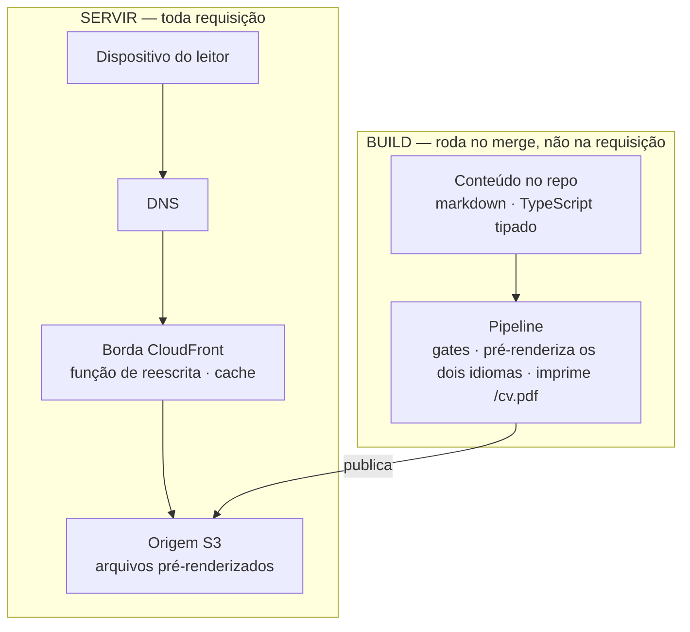
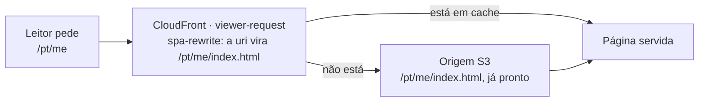
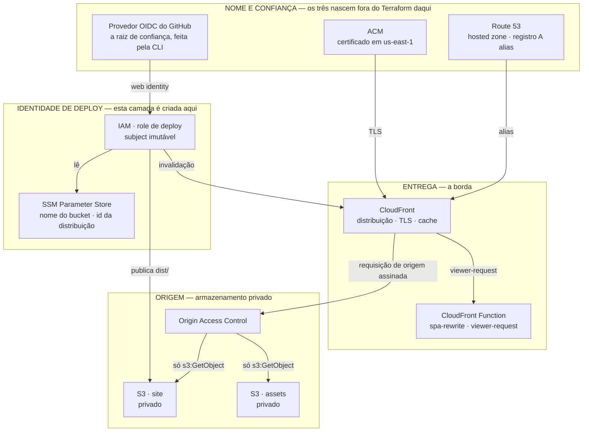
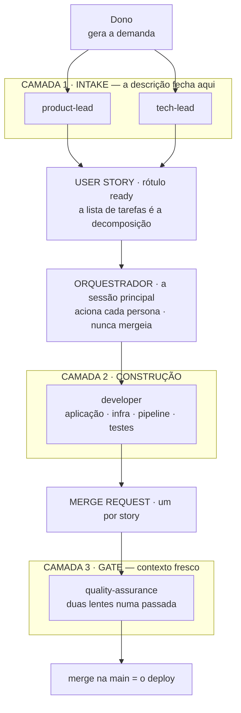
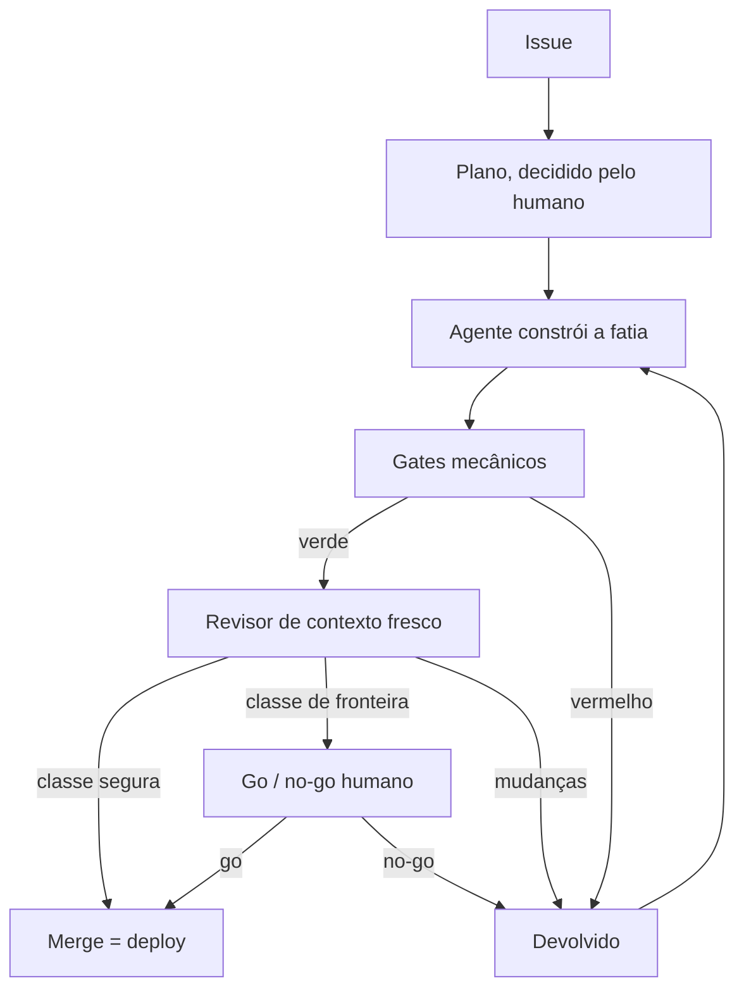
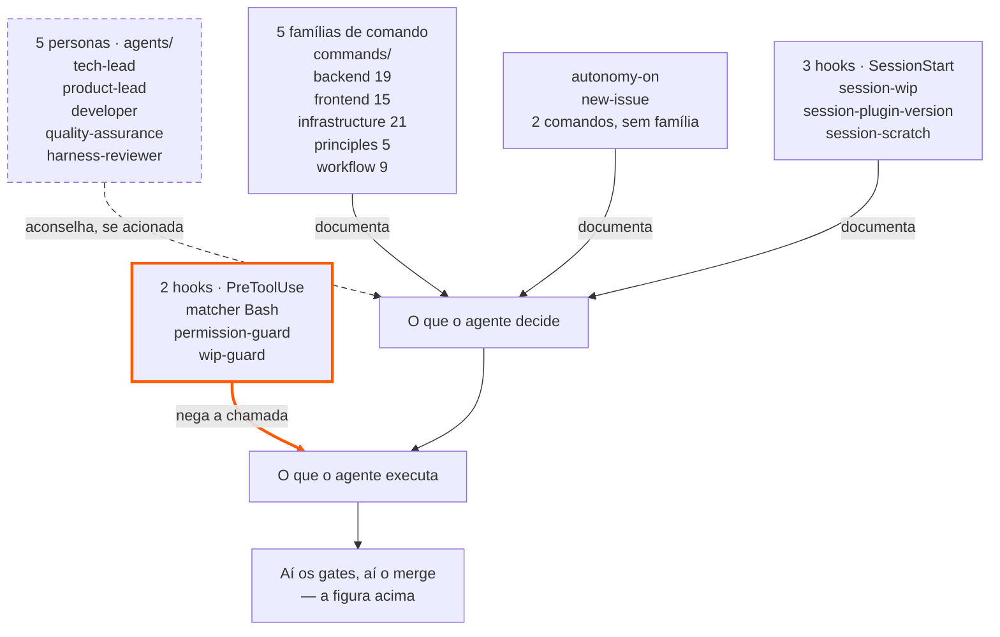

_Este site é o argumento. Esta página é a planta — como ele é construído, e como você construiria o seu._

## Três coisas

Isto aqui são três coisas.

- **Um site estático.** React, Vite e TypeScript num bucket atrás do CloudFront — sem servidor, sem banco, sem auth. É o que você está lendo agora.
- **Um plugin de dev-loop.** As personas, os hooks e os comandos que decidem *como* o trabalho é feito: versionado num repositório à parte, instalável em qualquer projeto, e o que ele entrega é uma verificação que não depende de quem escreveu o código.
- **Um runtime de agente.** O Claude Code, que executa aquilo — o orquestrador, os subagentes, o piso de permissões. É a única das três que eu não escrevi.

Não são três produtos. **É uma coisa só**, e este site é o que ela produz em público.

Num site de prova de engenharia o código é o pitch, e o que ele deve ao leitor não é o resultado — é a máquina que produziu o resultado. Então o honesto é mostrar a construção inteira, em aberto: a arquitetura abaixo, as decisões que a moldaram (cada uma registrada como um ADR), e a camada reutilizável que te deixa replicar. Eu construo isto do jeito que quero ser contratado pra construir: desenvolvimento AI-native com o rigor de SDLC que a maior parte do trabalho com IA dispensa — Claude Code, Kiro, um loop construído sobre AI-DLC & Agent Harness Engineering.


### Os três pilares, e o que fica na interseção

As três não são camadas de um mesmo sistema, e essa é a parte que o desenho abaixo existe pra deixar óbvia: **cada uma existe sem as outras duas**. O site roda sem o plugin. O plugin instala em qualquer repositório. O runtime não é meu. O que fica no meio é a única coisa que nenhuma das três entrega sozinha.

```venn
accTitle: Os três pilares, e o que fica na interseção
accDescr: Três círculos do mesmo tamanho, sobrepostos, com uma interseção comum no centro. O primeiro círculo é a solução, o repositório tadeumendonca-io, e dentro dele estão a SPA em React com Vite e TypeScript, o Terraform que provisiona CloudFront e S3, o pipeline com os gates e o deploy, e o conteúdo em markdown no próprio repositório. O segundo é a customização do harness, o repositório tadeumendonca-skills, e dentro dele estão as personas no diretório agents, os hooks registrados em hooks.json, a biblioteca de skills no diretório commands, os comandos fora de qualquer família — autonomy-on e new-issue — e os ADRs de metodologia. O terceiro é o runtime do harness, o Claude Code, e dentro dele estão o orquestrador e os subagentes, os eventos PreToolUse e SessionStart, a política de permissões e as ferramentas com o MCP. No centro, onde os três se sobrepõem, está escrito Agent Harness Engineering, com a palavra Agent entre parênteses. A afirmação do desenho é essa: nenhum dos três círculos sozinho é a disciplina, ela é o que existe onde os três se encontram.
centre: (Agent) Harness | Engineering
pillar: A solução | tadeumendonca-io
- SPA React · Vite · TS
- Terraform: CloudFront, S3
- Pipeline: gates, deploy
- Markdown no repositório
pillar: A customização | tadeumendonca-skills
- Personas em agents/
- Hooks em hooks.json
- Skills em commands/
- Comandos sem família
- ADRs de metodologia
pillar: O runtime | Claude Code
- Orquestrador, subagentes
- PreToolUse · SessionStart
- Política de permissões
- Ferramentas e MCP
```

O que fica na interseção é o trabalho de verdade: decidir o que o harness **barra**, o que ele **aconselha** e o que ele só **documenta** — e depois provar que o inventário disso continua verdadeiro. O `Agent` fica entre parênteses de propósito: hoje se fala em *harness engineering* referindo só a prática, e os parênteses ligam um termo ao outro sem fingir que são duas coisas diferentes.

Os tópicos dentro de cada círculo são o **inventário** de cada pilar; o que cada um **entrega** tem uma seção própria mais abaixo, e vale dizer qual é qual: a do site é *O que o site faz, do lado do leitor*; a da customização é *Os quatro elementos do harness*; a do runtime é *O orquestrador é a parte do harness que você não consegue instalar*.

## O formato

Uma SPA totalmente estática — React + Vite + TypeScript — servida a partir de **S3 atrás do CloudFront**, com uma pequena CloudFront Function reescrevendo URLs limpas. Sem backend: sem servidor, sem banco, sem auth. Custo quase zero, superfície de ataque mínima, nada rodando às 3 da manhã.

*(→ [ADR-0002](https://github.com/tedeuxx/tadeumendonca-io/blob/main/docs/adr/0002-fully-static-spa-no-backend.md) totalmente estático / sem backend · [ADR-0013](https://github.com/tedeuxx/tadeumendonca-io/blob/main/docs/adr/0013-s3-cloudfront-hosting.md) S3 + CloudFront)*

Em camadas — e **o que interessa nesse desenho é o que não está nele**: não há camada de aplicação nem camada de dados, porque tudo que normalmente aconteceria a cada requisição foi movido para o build:



**A ausência é deliberada, não uma lacuna.** Um diagrama de camadas para um sistema assim costuma seguir para uma camada de aplicação, um banco e integrações internas; aqui ele para num bucket. O único terceiro em tempo de execução é a analytics, e ela depende de consentimento. O que um backend faria por requisição — resolver conteúdo, renderizar HTML, montar as tags OG — acontece uma vez, na trilha de build, e viaja como arquivo.

*(→ [ADR-0033](https://github.com/tedeuxx/tadeumendonca-io/blob/main/docs/adr/0033-ga4-consent-gated-analytics.md) analytics dependente de consentimento)*

É também por isso que a conta logo abaixo é o que é: **o domínio e a hosted zone cobram com ou sem visitante, e o que uma visita acrescenta em cima deles arredonda pra nada.**

O que nada disso situa é onde uma URL limpa vira um arquivo:



**"Sem backend" levanta uma pergunta antes das outras — como um crawler enxerga isto — e a resposta é que nada precisa rodar para ele enxergar.** Um buscador ou um scraper de unfurl pede uma URL e recebe **HTML completo com as tags OG dentro**, direto de um arquivo estático, não um shell vazio que só vira página depois que o JavaScript roda. **Nada é montado quando ele pede**: cada rota é renderizada uma vez, no build, nos dois idiomas. Sem SSR, sem renderização na borda — a função acima reescreve URL e nada mais.

O limite viaja junto com a afirmação, porque é a parte que um leitor consegue derrubar: **uma URL que não existe responde 200, não 404 — e o que volta é a landing page**, com as tags OG da própria landing, sob um endereço que nunca existiu. O CloudFront mapeia `403` e `404` para `/index.html`, que é o que deixa uma SPA funcionar em rotas profundas e é uma troca real, não um detalhe. Então um scraper que desdobra um link errado deste site recebe um card plausível da home em vez de um erro. Já mordeu aqui uma vez: um desvio de caminho jogou as imagens de OG por artigo nesse mesmo fallback, e cada uma respondeu `200 text/html` a todo scraper que a pediu.

*(→ [ADR-0004](https://github.com/tedeuxx/tadeumendonca-io/blob/main/docs/adr/0004-build-time-render-not-ssr-or-edge.md) render no build, sem SSR · [ADR-0005](https://github.com/tedeuxx/tadeumendonca-io/blob/main/docs/adr/0005-og-coverage-every-public-url.md) toda URL OG-completa)*

### A pilha AWS, camada a camada

Os dois desenhos acima mostram **tempo** — quando cada coisa acontece. Este mostra **inventário**: quais serviços da AWS estão no ar e em que camada cada um fica. A prosa desta página cita todos eles em algum lugar, e a conta lá embaixo cobra por alguns; nenhum desenho os tinha juntos.



Duas coisas aqui valem ser ditas em voz alta. **A primeira camada inteira nasce fora do Terraform deste repositório.** A hosted zone e o certificado já existem na conta e entram por `data source` — o que é escolha e não esquecimento: eles sobrevivem a um `destroy` completo desta stack, e é por isso que a linha de USD 0,50 da hosted zone continuaria cobrando mesmo sem site nenhum. E o provedor OIDC, que é a raiz de confiança, é criado à mão pela CLI da AWS e **fica fora do Terraform pra sempre** — o porquê está mais abaixo, junto com a parte desconfortável de admitir isso. O que é criado aqui é a *role*, não o provedor. A segunda: o bucket do site **não é público em nenhum sentido** — a policy dele permite `s3:GetObject` só para o serviço do CloudFront, e só quando o `AWS:SourceArn` é o desta distribuição.

A única lógica que roda entre um leitor e um arquivo é a função da segunda camada: [dez linhas executáveis](https://github.com/tedeuxx/tadeumendonca-io/blob/main/iac/cloudfront-functions/spa-rewrite.js), com [testes unitários próprios](https://github.com/tedeuxx/tadeumendonca-io/blob/main/apps/fed/scripts/spa-rewrite.test.mjs) e uma [verificação pós-deploy](https://github.com/tedeuxx/tadeumendonca-io/blob/main/.github/workflows/deploy.yml) de que a função no ar continua sendo a deste repositório.

*(→ [`iac/frontend.tf`](https://github.com/tedeuxx/tadeumendonca-io/blob/main/iac/frontend.tf) a distribuição, a função e as policies de bucket · [`iac/iam.tf`](https://github.com/tedeuxx/tadeumendonca-io/blob/main/iac/iam.tf) a role de deploy e o subject OIDC)*

## Por que este site existe

Para aprender IA você precisa criar os use cases. Você não aprende sem eles. Tudo precisa de um usuário, uma aplicação, uma funcionalidade, um business case — e é aí que eu continuo vendo a lacuna. No trabalho com IA de que estive perto, a modelagem é forte e a outra metade é rala: systems integration, legado que não dá pra trocar, as complicações comuns de TI corporativa. É nessa outra metade que eu passei dezoito anos. Este site é um use case, e o repositório aberto deixa qualquer um conferir.

Comecei o ano perdido. Um projeto que não estava indo bem, um monte de obrigações de catch-up nas ferramentas de IA, e a coisa foi degradando até eu sair de férias. E tem um detalhe que eu suspeito que muita gente sênior está vivendo e não diz em voz alta: **eu tinha as ferramentas de desenvolvimento agêntico na mão — Claude Code, Kiro — e mesmo assim me sentia de fora do hype.**

E tem uma razão para isto ser público em vez de um caderno. Vivemos num mundo com opções de configuração demais — qual harness, quais hooks, que persona, que gate, qual modelo — e ninguém tem sessões suficientes para testar todas sozinho. **Trocar a experiência de cada um usando IA é o que vai acelerar esse aprendizado**, e é por isso que o que está aqui é o setup inteiro, aberto, e não só a conclusão a que ele chegou.


Desenvolvimento de software é minha paixão. Nada me diverte mais que ver uma aplicação funcionando bonitinha. O que essas ferramentas me devolveram foi isso, numa escala que sozinho eu não alcançava.

> "Computer programming is an art, because it applies accumulated knowledge to the world,
> because it requires skill and ingenuity, and especially because it produces objects of beauty."
>
> — Donald Knuth, 1974


O caso que me provou isso não foi este site. Foi um mecanismo de autenticação e autorização com regras de negócio densas, custom em Spring Boot e Spring Security, integrando sistemas legados. Comecei a construir por fora, na volta das férias, e aquilo foi crescendo e amadurecendo. **Eu jamais teria conseguido desenvolver esse mecanismo sem uma agentic development tool** — e não era só o prazo. Eu estava dividindo as responsabilidades de tech lead naquele projeto **ao mesmo tempo** em que me dedicava ao desenvolvimento com agente, em paralelo. É essa a parte que a ferramenta comprou: não velocidade de digitação, e sim as duas coisas caberem na mesma semana.

Desde então tenho feito isso em duas frentes: uma interna, no meu trabalho, com **Kiro**, e esta, pública, com **Claude Code**. A separação é deliberada — dois harness diferentes rodando o mesmo tipo de trabalho é o que me deixa comparar, e é assim que dá pra separar o que é do modelo do que é do setup em volta dele. Durante o expediente, nem sempre atuo diretamente no desenvolvimento de produto digital, e é onde eu quero passar mais tempo. Gosto de criar apps.


São Francisco e o Vale, maio de 2026. Não teve lugar por onde eu passei sem alguma oferta de IA — no trem, na rua, na vitrine, no crachá de quem estava do lado. Voltei dessa semana com a ideia do que fazer. A decisão veio depois, enquanto eu construía — e a frente pública dela é este site.

*As fotos desta página são minhas. Uma semana, o Vale — não é levantamento; é o que estava na minha frente.*

## Quem fez o quê

Trabalhar com um time autônomo de agentes é parte do propósito deste site, então vale ser específico sobre o recorte — sem número de horas, porque eu não os registrei e um número inventado não valeria nada.

**Meu:** a ideia, o produto, os conteúdos — meus mesmo onde eles lapidaram — a voz do site, a arquitetura de agentes, a configuração do harness e a experimentação de setups, os padrões de arquitetura.
**Do time de agentes:** rascunhar o desenvolvimento e o código.

Mas o método não é despacho. Parte da minha ideia, eu **ouço deles como fariam**, e vou aparando arestas contra a minha visão de arquitetura e minha experiência com sistemas distribuídos. A autoria continua minha; ela só se exerce depois de escutar.

E escutar rende. Eles têm senioridade maior que a minha nos frameworks e nas linguagens escolhidas — eu agrego com arquitetura e visão. **Recorrentemente aprendo formas de usar os serviços AWS que eu não sabia que existiam.** Neste site foi a renderização de OG com Lambda@Edge: eu não fazia ideia de que dava para suprir um SSR e resolver indexação de crawler com aquilo. Em outro sistema foi a busca semântica com Amazon S3 Vectors: eu não sabia que dava para montar isso em peças serverless e pagar por demanda, em vez de por um cluster OpenSearch provisionado rodando o tempo todo. A troca é vazão e latência — a própria AWS posiciona os dois como camadas, não como alternativas.

A ironia do primeiro exemplo está a duas seções daqui: aquele Lambda@Edge tem uma decisão registrada, e ela foi **cortada**. Funcionou, me ensinou, e depois se provou desnecessária — prerender no build entrega o mesmo HTML servido sem nada rodando. As duas coisas são verdade ao mesmo tempo.

*(→ [ADR-0026](https://github.com/tedeuxx/tadeumendonca-io/blob/main/docs/adr/0026-superseded-lambda-edge-og.md) OG com Lambda@Edge, substituída)*

Em pessoas, o que está acima custou uma. Fins de semana, em paralelo com consultoria.

## USD 6,57 por mês

Esse número mede o que este site **acrescentou**, não aquilo de que ele **depende**: assinaturas que já existiam e cobrariam igual se ele fosse apagado amanhã ficam de fora. E mede aquilo **em que** o site roda, não aquilo com que eu o **construo**. O que vem abaixo volta às duas. Sem esse recorte, "USD 6,57" é um número solto, e um número solto não é conferível.

Dizer "custo quase zero" é a coisa mais fácil desta página — e a mais fácil de ninguém conferir. Então segue a conta da AWS: as linhas de hospedagem lidas do custo diário da conta no **fim de julho de 2026**, o registro lido da tabela de preço do registrador. Nenhuma das duas estimada:

- **O domínio** — USD 71,00/ano pelo `.io`, uma cobrança anual que cai num mês só. **USD 5,92/mês** amortizado.
- **Route 53** — USD 0,50/mês, fixo. A hosted zone, com ou sem visitante.
- **S3** — cerca de USD 0,15/mês, e são *escritas* de deploy, não leituras.
- **CloudFront** — na prática USD 0,00 com esse volume.

A escolha é o `.io`: caro entre os domínios de topo, e eu o escolhi por branding, não por custo — essa é a razão honesta, e é a única linha daqui que você pode recusar. Nada mais nesta conta se mexe com o domínio: a hosted zone, o bucket e a distribuição não ligam para qual ele é.

### Os fornecedores que poderiam faturar isto

**Entra aqui tudo que cobra para manter o site publicado no ar, ou que cobraria sob alguma condição** — o recorte é a segunda regra lá de cima: aquilo **em que** o site roda, não aquilo com que eu o **construo**.

- **AWS** — **USD 6,57/mês**, e é a única cobrança que este site criou; dela, os 5,92 do registro anual amortizado e os 0,50 da hosted zone cobram com ou sem visitante.
- **GitHub Team** — pago, e a assinatura é anterior ao site, embora a carga de CI em cima dela seja inteiramente dele.
- **iCloud+** — pago, também anterior ao site; carrega o e-mail com domínio próprio no apex, e o [`iac/email.tf`](https://github.com/tedeuxx/tadeumendonca-io/blob/main/iac/email.tf) provisiona os registros MX, DKIM e SPF dele, então não é algo adjacente a esta infraestrutura: está dentro dela. *(→ [ADR-0016](https://github.com/tedeuxx/tadeumendonca-io/blob/main/docs/adr/0016-custom-email-via-icloud.md) e-mail próprio via iCloud)*
- **GitHub Actions** — **zero porque os repositórios são públicos**: uma propriedade dos repositórios, não do plano, então sobrevive a um downgrade e não sobrevive a fechá-los.
- **SonarCloud** — **zero pela mesma condição**, numa conta separada: o tier gratuito dele é para projetos públicos, e o gate dele barra um merge.
- **Terraform Cloud** — **zero porque a infraestrutura é pequena**: o último plan resolveu contra cerca de cinquenta recursos, e esse teto é contado em recursos, não em tráfego nem em gasto.
- **Claude Max** — pago, e **fora do total de propósito**: é com o que eu construo o site, não aquilo em que ele roda.

Dois desses zeros dependem de os repositórios continuarem públicos e um depende de a infraestrutura continuar pequena; nenhum depende de tráfego.

Fora do total ficam também todas as minhas horas: **USD 6,57 por mês é o que custa manter isto no ar, não o que custou construir.**

## O que foi cortado — e tinha sido construído antes, que é a parte que importa

A versão fácil desta seção é *"mantivemos o escopo enxuto"*. Isso é postura, e qualquer um pode alegar o mesmo. A versão verdadeira é mais forte e é verificável: **isto não foi construído enxuto. Foi construído inteiro e depois cortado**, e cada reversão está registrada junto com a decisão que a substituiu.

| removido | o que era | substituído por |
|---|---|---|
| [ADR-0025](https://github.com/tedeuxx/tadeumendonca-io/blob/main/docs/adr/0025-superseded-backend-platform.md) | Plataforma com backend — BFF em Lambda, DynamoDB, Cognito, SES | [0002](https://github.com/tedeuxx/tadeumendonca-io/blob/main/docs/adr/0002-fully-static-spa-no-backend.md) SPA estática, sem backend |
| [ADR-0026](https://github.com/tedeuxx/tadeumendonca-io/blob/main/docs/adr/0026-superseded-lambda-edge-og.md) | Lambda@Edge renderizando imagens OG a cada requisição | [0004](https://github.com/tedeuxx/tadeumendonca-io/blob/main/docs/adr/0004-build-time-render-not-ssr-or-edge.md) prerender no build |
| [ADR-0027](https://github.com/tedeuxx/tadeumendonca-io/blob/main/docs/adr/0027-superseded-backend-link-unfurl.md) | Serviço de unfurl de links para os cards de preview | [0004](https://github.com/tedeuxx/tadeumendonca-io/blob/main/docs/adr/0004-build-time-render-not-ssr-or-edge.md) prerender no build |
| [ADR-0028](https://github.com/tedeuxx/tadeumendonca-io/blob/main/docs/adr/0028-superseded-gitflow-two-env.md) | GitFlow com staging e produção | [0003](https://github.com/tedeuxx/tadeumendonca-io/blob/main/docs/adr/0003-trunk-based-single-environment.md) trunk, ambiente único |
| [ADR-0029](https://github.com/tedeuxx/tadeumendonca-io/blob/main/docs/adr/0029-superseded-offline-first-pwa.md) | PWA offline-first instalável | [0002](https://github.com/tedeuxx/tadeumendonca-io/blob/main/docs/adr/0002-fully-static-spa-no-backend.md) SPA estática, sem backend |

**O que o objetivo de fato exigia era conteúdo**, e nada daquela maquinaria servia a isso. Um banco sem nada para guardar. Auth sem ninguém para autenticar. Um ambiente de staging para um site cujo revert é um merge. Cada uma era defensável quando foi decidida, e nenhuma sobreviveu à pergunta *"para que isso serve, aqui"*.

### Pra que serve o guardrail, na prática

A leitura da conta lá em cima mostrou cerca de **USD 12,80 por mês** que o site não estava usando: web ACLs de WAF e endereços IPv4 públicos ociosos, associados a nada, esquecidos quando o backend foi aposentado. Mais de oitenta vezes o que custa publicar o site. **Esses já saíram** — removidos em julho de 2026, e é a série diária de custo que confirma que as cobranças param, não um console vazio dando a entender isso. Não é tudo: sobrou um resíduo da mesma época, **abaixo de um dólar por mês**, ainda sendo cobrado enquanto eu descubro o que ele guarda — linha da conta, não do site, e o estado honesto disto na hora em que escrevo.

Eu descobri lendo a fatura, o que é tarde. Então quem vigia agora é um orçamento no nível da conta, em `iac/budget.tf`, e duas coisas nele são deliberadas. Ele **não** é escopado às tags deste projeto — se fosse, só enxergaria gasto que este repo criou, e este era justamente do tipo que ele não criou. E a sensibilidade mora nos **limiares**, não no teto: um teto precisa comportar o pior mês legítimo, que aqui é o mês da renovação, então ele é surdo por construção a qualquer coisa menor que ele mesmo. O alarme que importa dispara em 15% — perto de USD 12, quieto no ritmo normal, e acordado pra qualquer novo custo recorrente de uns USD 8/mês. Um par convencional de 50/80 só se manifestaria em USD 40, várias vezes o gasto real, e ficaria um ano calado sobre um serviço novo de USD 30/mês.

É isso que você tira daqui, e tem dois lados: infraestrutura que você para de usar não para de cobrar, e quem deveria pegar isso precisa olhar mais **amplo** do que aquilo que você está construindo e mais **baixo** do que aquilo que te dá medo.

*(→ [`iac/budget.tf`](https://github.com/tedeuxx/tadeumendonca-io/blob/main/iac/budget.tf) o guarda de orçamento)*

### Se você precisar do backend de volta, o registro diz qual decisão reverter

Uma reversão registrada é o que torna o caminho de crescimento concreto em vez de uma promessa de que a arquitetura "escalaria". Um sistema que passou a precisar de servidor não exige que este site seja redesenhado — precisa de **uma decisão específica reaberta**, e cada uma das cinco reversões acima nomeia a que a fechou:

- **dados dinâmicos ou contas** → reverter a [0002](https://github.com/tedeuxx/tadeumendonca-io/blob/main/docs/adr/0002-fully-static-spa-no-backend.md), e a 0025 é o formato que aquilo tinha;
- **renderização por requisição** → reverter a [0004](https://github.com/tedeuxx/tadeumendonca-io/blob/main/docs/adr/0004-build-time-render-not-ssr-or-edge.md); 0026 e 0027 são duas coisas que já foram tentadas na borda;
- **uma mudança que você não reverte com um merge** → reverter a [0003](https://github.com/tedeuxx/tadeumendonca-io/blob/main/docs/adr/0003-trunk-based-single-environment.md), e a 0028 é o fluxo de dois ambientes que ela substituiu.

A trilha de build no diagrama acima é onde as duas metades se encontram: acrescentar um servidor significa tirar trabalho **de dentro dela**, não pendurar uma camada na lateral.

## Cada decisão, e em que pé ela está

**Por que MADR, e por que o formato pesa mais quando quem lê é um agente.** [MADR](https://adr.github.io/madr/) é um formato de seções fixas — contexto, opções consideradas, decisão, consequências — e três propriedades dele são a razão de a biblioteca ser assim:

- **Uma decisão por arquivo.** Quem precisa saber por que não existe ambiente de staging aqui lê um arquivo, não um documento de arquitetura inteiro. O contexto gasto é o da decisão, não o da vizinhança dela — e para um agente isso não é conforto, é o recurso que ele tem menos.
- **Seções fixas.** O "porquê" e as opções que perderam ficam em lugares previsíveis, então recuperar a razão de uma escolha não depende de interpretar prosa. É exatamente aí que um leitor, humano ou não, inventa a metade que faltou.
- **`status` e `superseded-by`.** Uma decisão revertida continua no repositório e **diz** que foi revertida. Sem isso, o registro de uma arquitetura aposentada lê como instrução — que é a forma mais barata de fazer um agente reconstruir algo que foi cortado de propósito. A tabela abaixo traz essa coluna, e é onde as decisões revertidas aparecem marcadas em vez de sumirem.

O limite é o de sempre nesta página: **nada aqui recupera um ADR sozinho.** Não há índice semântico e não há injeção automática de contexto; um agente lê estes arquivos porque o guia do repositório aponta para eles. O formato torna a leitura barata quando ela acontece — ele não faz ela acontecer.

A tabela abaixo **não foi digitada aqui**. Ela é gerada a partir de `docs/adr/`, commitada como artefato e conferida no CI: acrescentar ou substituir uma decisão sem regenerar o índice deixa o pipeline vermelho, então ou a página bate com a biblioteca ou nada é publicado. Um índice copiado à mão para uma biblioteca desse tamanho envelhece em uma semana e nada avisa — este é o mesmo mecanismo dos diagramas acima, e pelo mesmo motivo.

```adr-index
```

Isso é o princípio da própria página aplicado à única lista que ela não tem como evitar reproduzir: **linkar o detalhe canônico em vez de repeti-lo.** Cada linha é um link, e a decisão em si mora no registro — com o contexto, as opções que perderam, e o que ela custou.

## O conteúdo é markdown no repo, resolvido no build

O conteúdo de cada página — o CV, esta página, os artigos — é markdown ou dado tipado no repo. Cada rota é **prerenderizada** no build (um snapshot headless) pra que as tags de OG/SEO e o HTML rastreável cheguem nos arquivos servidos — sem SSR, sem edge rendering. O PDF do CV para download é impresso a partir do `/me` ao vivo pela mesma etapa.

*(→ [ADR-0004](https://github.com/tedeuxx/tadeumendonca-io/blob/main/docs/adr/0004-build-time-render-not-ssr-or-edge.md) render no build · [ADR-0005](https://github.com/tedeuxx/tadeumendonca-io/blob/main/docs/adr/0005-og-coverage-every-public-url.md) toda URL OG-completa · [ADR-0034](https://github.com/tedeuxx/tadeumendonca-io/blob/main/docs/adr/0034-build-time-cv-pdf-static-artifact.md) o PDF do CV)*

## O que o site faz, do lado do leitor

Tudo acima é maquinaria. Isto é o que ela produziu — a parte que dá pra usar sem ler uma linha de nada disso.

**Esta lista é escrita à mão, não derivada.** O índice de decisões acima é gerado a partir do `docs/adr/`, e o inventário do harness logo abaixo é ancorado em outro repositório; **esta aqui foi digitada e nenhuma verificação a compara com o código**, então ela pode ficar para trás do site de um jeito que nenhuma das duas outras pode. E ela não traz total nenhum, pelo mesmo motivo: contagem é a primeira coisa a envelhecer, e cada item abaixo nomeia uma rota que você abre ou uma decisão que você lê.

- **Duas edições completas, português e inglês.** Cada rota é de primeira classe sob `/pt` e `/en`, pré-renderizada com head próprio — então um link encaminhado chega no idioma em que foi lido, e não no de quem recebeu. *(→ [ADR-0036](https://github.com/tedeuxx/tadeumendonca-io/blob/main/docs/adr/0036-per-locale-urls-prerender-hreflang.md) URLs por idioma)*
- **Um convite, nunca um redirecionamento, quando seu navegador discorda da URL que você abriu.** Dá pra dispensar e ele lembra, então não fica insistindo — e o link que te mandaram continua funcionando exatamente como foi mandado.
- **Artigos, cada um com slug próprio por idioma**, filtráveis por trilha na landing sem a barra de endereço mudar embaixo de você. *(→ [ADR-0037](https://github.com/tedeuxx/tadeumendonca-io/blob/main/docs/adr/0037-localized-article-slugs.md) slugs de artigo por idioma)*
- **Um CV em `/me`, e o mesmo CV em PDF** — impresso a partir da página no ar durante o build, então o download não tem como discordar da página de onde saiu. *(→ [ADR-0034](https://github.com/tedeuxx/tadeumendonca-io/blob/main/docs/adr/0034-build-time-cv-pdf-static-artifact.md) o PDF do CV)*
- **Um portfólio em `/portfolio`**, com a régua pra entrar escrita e pública — [docs/catalog-ready.md](https://github.com/tedeuxx/tadeumendonca-io/blob/main/docs/catalog-ready.md), o gate de prova de engenharia.
- **Um plano de ramp-up em `/ramp-up`** — o raciocínio, o roteiro e as fontes exatas da virada para AI Engineering, em aberto enquanto ainda está em andamento.
- **Uma estante de leitura em `/library`** — uma estante curada, e não uma lista, cada entrada carregando o que eu achei dela.
- **Esta página, em `/architecture`** — a construção inteira em aberto: o formato em que ela roda, quanto custa, as decisões por trás dela, e o que foi cortado.
- **Botões de compartilhamento que marcam o que produziram**, para que a vida de um link depois que ele sai daqui seja legível em vez de adivinhada. *(→ [ADR-0039](https://github.com/tedeuxx/tadeumendonca-io/blob/main/docs/adr/0039-share-campaign-tagging.md) marcação de campanha no compartilhamento)*
- **Vídeos que não carregam nada até você pedir.** Um vídeo dentro de um artigo é uma fachada sobre um poster gerado no build e servido desta origem; nenhum frame, cookie ou requisição de terceiro acontece antes do clique.
- **Analytics que espera consentimento** — inerte até você dizer sim. *(→ [ADR-0033](https://github.com/tedeuxx/tadeumendonca-io/blob/main/docs/adr/0033-ga4-consent-gated-analytics.md) analytics dependente de consentimento)*

## O dev-loop é o produto

A parte interessante não é a stack — é como ele é construído: **agent-led verification, human-residual** (verificação liderada pelo agente, humano no resíduo). O agente prova o "pronto" com gates mecânicos e evidência real (lint, tipos, testes ≥85%, um build verde, SonarCloud, E2E funcional, um revisor de contexto fresco); o humano fica com as decisões irreversíveis e arquiteturais. Esse loop vive num plugin reutilizável à parte — **[tadeumendonca-skills](https://github.com/tedeuxx/tadeumendonca-skills)** — então é uma metodologia que você pode adotar, não algo sob medida só pra este site.

*(→ [ADR-0003](https://github.com/tedeuxx/tadeumendonca-io/blob/main/docs/adr/0003-trunk-based-single-environment.md) trunk-based single-environment · [ADR-0018](https://github.com/tedeuxx/tadeumendonca-io/blob/main/docs/adr/0018-ci-gates-e2e-on-pr-coverage.md) os gates de CI)*

Duas figuras, e elas respondem perguntas diferentes. A primeira é o **formato** do loop: quem fecha cada unidade de trabalho, e em que camada.



**A camada é a unidade de reconciliação, e é isso que o desenho está afirmando.** Cada uma entrega para a próxima um artefato acabado — uma descrição fechada, uma fatia construída, um veredito — e não uma opinião que alguém precise pesar contra outra. É por isso que duas personas na mesma camada precisam de uma razão, e por isso que o time é de cinco.

A segunda figura é a outra pergunta: **onde o humano fica.**



O humano aparece duas vezes, e as duas aparições são trabalhos diferentes. No plano, decidindo o que vale ser construído e como — arquitetura eu nunca decido sozinho. No fim, só no que é classe de fronteira, decidindo se aquilo sobe. No meio, o agente constrói e a máquina prova, e a maior parte das mudanças chega à produção sem ninguém nesse caminho.

A figura mostra por onde o trabalho passa. O que ela não consegue mostrar é que esse caminho foi **decidido** — em qual aresta o humano entra, o que conta como fronteira de classe, onde um gate vale o que custa. É essa a engenharia que esta página está oferecendo, mais do que qualquer caixa do desenho.

E o custo disso, já que o resto desta página assume os seus: quem decide que uma mudança é segura é o mesmo tipo de coisa que escreveu a mudança. Classifique uma errado e ela pega o caminho vazio. O que torna isso aceitável aqui é raio de impacto, não confiança — isto é um site estático, e reverter é um merge.

### Do que o loop é feito, e o que cada parte consegue de fato fazer

As duas figuras acima respondem *por onde o trabalho passa* e *quem fecha cada etapa*. Nenhuma delas diz do que o loop é **feito** — e é essa a pergunta de quem está decidindo se adota isso. É um terceiro desenho de propósito: um só, tentando ser os três, teria que dar a mesma seta pra um hook que recusa um comando e pra uma lente que alguém precisa lembrar de acionar, e essa diferença é a coisa mais útil desta página.



**Dos componentes do próprio plugin, exatamente um tipo consegue te barrar**, e essa é a versão honesta do convite a adotar. (A caixa que *não* é componente do plugin — *Aí os gates, aí o merge* — é um ponteiro de volta pro primeiro diagrama, e aqueles gates barram sim: o SonarCloud e o check terminal `build-test` bloqueiam um merge. Eles moram nos workflows deste repositório, e não no plugin, e é justamente por isso que não são linhas do inventário.) As partes, e o que cada uma consegue de fato fazer:

- **Dois dos cinco hooks rodam no `PreToolUse`.** O runtime do agente chama eles *antes* da ferramenta rodar, eles devolvem uma negativa e o comando não acontece. **Eles são o piso.**
- **Os outros três rodam no `SessionStart`**, um evento que não entrega chamada nenhuma de ferramenta pra recusar, e é por isso que não estão desenhados como piso. **A classe diz** o que um hook de início de sessão *não consegue barrar*, e não que ele só observa — um hook nesse evento roda antes da primeira chamada de ferramenta e pode agir, e este desenho não tem forma pra isso. **E um deles age:** `session-wip` e `session-plugin-version` só reportam; `session-scratch` esvazia o diretório de scratch. Isso é um fato sobre cada script, não uma propriedade do evento, **e é por isso que** o desenho não pode ser lido como uma promessa sobre o que eles fazem.
- **As personas aconselham**, e *aconselhar* é uma afirmação sobre o julgamento que elas produzem, não sobre onde elas sentam: uma delas, a `quality-assurance`, tem uma cadeira garantida por mecanismo — o mesmo hook de permissão só deixa aquele agent type rodar o comando de merge — e ser a única que *pode* fazer o merge é uma propriedade diferente de ser verificada em como fez. A `product-lead` é a imagem espelhada disso: ela **barra** um merge quando encontra uma afirmação publicada que não é verdade — mas por convenção, não por hook, então nada recusa o comando de merge em nome dela e o desenho não teria como mostrá-la como piso sem mentir. Nos dois casos o julgamento não é verificado por nada, e o guia deste repositório diz com todas as letras que uma lente que ninguém aciona *falha em silêncio*.
- **Os comandos não são nem uma coisa nem outra** — são a forma escrita de uma decisão já tomada, pra ninguém rediscutir ela às duas da manhã.

**Renomeie uma persona no plugin e o build deste repositório fica vermelho.** O diagrama acima é escrito à mão: um teste compara o desenho, nó a nó e contagem a contagem, com um [manifesto versionado](https://github.com/tedeuxx/tadeumendonca-io/blob/main/apps/fed/src/content/generated/harness.json), nas duas edições; e um [job de CI](https://github.com/tedeuxx/tadeumendonca-io/blob/main/.github/workflows/app.yml) compara esse manifesto com a árvore viva do plugin.

*(→ [ADR-0043](https://github.com/tedeuxx/tadeumendonca-io/blob/main/docs/adr/0043-harness-inventory-derived-from-plugin-repo.md) o inventário ancorado no plugin)*

É nesse mecanismo que caem também os dois termos do parágrafo de abertura — e eles não caem do mesmo jeito, o que vale dizer com precisão. **AI-DLC** não é meu: é o nome que a AWS deu a um ciclo de entrega cujas etapas são executadas e verificadas por agentes, e não em volta deles, e o primeiro diagrama é como isso é praticado aqui. **Agent Harness Engineering** é a afirmação que eu faço, e é esta figura — que o harness é uma coisa que se constrói, se conta e se verifica, e não um jeito de escrever prompt. Adotar uma metodologia não custa nada dizer; a segunda precisa ser paga, e o pagamento é que ela *pode* ser inventariada, a partir do repositório onde mora, com um build que quebra quando o inventário deixa de ser verdade.

### Os quatro elementos do harness, e o que cada um entrega

A lista acima é sobre **força** — o que cada tipo de componente consegue ou não consegue barrar. Esta é a outra pergunta, e é a que alguém avaliando o setup faz primeiro: **o que cada elemento entrega para o valor da solução inteira**. Cada item aponta para o arquivo ou o diretório vivo no repositório do plugin, porque é lá que o detalhe mora.

- **[Agents](https://github.com/tedeuxx/tadeumendonca-skills/tree/main/agents)** — subagente é um recurso do runtime, e é o único que troca contexto por veredito: a execução inteira fica na sessão do subagente e o que volta é a conclusão. O que isso entrega para a arquitetura é uma revisão em **contexto novo**, sem o viés de quem escreveu — a propriedade que nenhuma instrução de auto-revisão consegue produzir, porque quem escreveu e quem julga seriam o mesmo contexto.
- **[A pirâmide de perfis](https://github.com/tedeuxx/tadeumendonca-skills/blob/main/docs/dev-loop-design.md)** — as cinco personas não estão num mesmo plano: dois leads que discordam por construção em cima, um builder no meio, um gate embaixo. O que ela entrega é **discordância onde ela é útil e handoff onde não é** — e a regra que decide isso é explícita, custo de reconciliação se paga *dentro* de uma camada e não entre camadas, e é o que segurou o time em cinco em vez de dezenove.
- **[Hooks](https://github.com/tedeuxx/tadeumendonca-skills/tree/main/hooks/scripts)** — a única parte do plugin que roda código e **recusa**. Dois respondem no `PreToolUse`, antes da ferramenta acontecer; os três de `SessionStart` rodam antes da primeira chamada — dois reportam e um esvazia o diretório de scratch. O que eles entregam é o piso irreversível sem depender de alguém lembrar dele, e o registro de qual evento chama qual script está em [`hooks/hooks.json`](https://github.com/tedeuxx/tadeumendonca-skills/blob/main/hooks/hooks.json).
- **[Comandos e skills](https://github.com/tedeuxx/tadeumendonca-skills/tree/main/commands)** — cada arquivo é uma decisão já tomada, escrita: qual serviço da AWS para qual cenário, que gate é bloqueante, como uma versão é cortada. Os que valem para qualquer repositório ficam em [`commands/principles`](https://github.com/tedeuxx/tadeumendonca-skills/tree/main/commands/principles). O que eles entregam é **ausência de re-decisão** — e como o plugin é instalado e não lido do disco, um dos hooks de sessão diz qual build está de fato rodando, porque uma skill corrigida e não recarregada é uma skill que não teve efeito.

### O orquestrador é a parte do harness que você não consegue instalar

Ele não está em nada do inventário acima — nem no desenho, nem no manifesto — e é a sessão principal: o contexto que lê uma Issue, decide qual persona acionar e pesa o que volta. Vale ser exato sobre o que falta, porque é com base nessa frase que quem adota vai agir, e o plugin **não** é omisso a respeito dele. O README de lá desenha o orquestrador como um nó e avisa que ele é *um relé, e relé distorce*; o `autonomy-on` é um comando publicado cujo assunto é a política de acionamento do orquestrador. Ou seja: o **ator** não é componente do plugin, a **política** dele em parte é, e o que você põe é o contexto que roda aquilo — e é essa a metade que vale conhecer antes de adotar qualquer coisa.

Ele é também a parte *contra* a qual as fronteiras de capacidade acima foram desenhadas. O `permission-guard` recusa o comando de merge vindo de qualquer agent type que não seja o `quality-assurance`, e a glosa na aresta das personas — *aconselha, se acionada* — nomeia o acionamento como o modo de falha sem nomear quem aciona. Quem aciona é o orquestrador, e uma lente que ele esquece é uma lente que ninguém rodou.

**E o contexto dele acaba.** Essa é a restrição que desenha o resto: a sessão principal tem uma janela finita, e tudo que ela lê fica lá dentro até a janela estourar.

É isso que um subagente compra. Ele lê, roda, erra e refaz **dentro da sessão dele**; o que chega ao orquestrador é a conclusão. Uma tarefa custa ao orquestrador **o veredito, não a execução** — e é por isso que a única alavanca real deste harness é o tamanho do veredito, girada escrevendo as instruções de cada persona.

Medi uma vez, na sessão deste repositório, em 7–8 de agosto de 2026, **lendo as transcrições da sessão**: o que ficou dentro dos subagentes foi **mais de uma ordem de grandeza** maior do que o que voltou. E a economia tem teto — mesmo assim, os vereditos que voltaram foram **uma fatia grande de tudo que o orquestrador consumiu vindo de uma ferramenta**. Não é fuga: esta sessão compactou duas vezes de qualquer jeito. O número não é publicado porque a fonte é uma transcrição de sessão privada, que gate nenhum alcança.

### O que o workspace do Claude Code acrescenta, e onde cada parte de fato mora

O plugin é a metade que você instala. O workspace em volta dele acrescenta mais, e as partes abaixo são nomeadas em forças deliberadamente diferentes, porque só uma delas está em algum repositório. Essa ordem é justamente a parte útil: é a mesma distinção que o inventário acima faz entre uma coisa que consegue te barrar e uma coisa que alguém precisa lembrar de acionar.

**A publicação é rascunhada, e a parte que sustenta peso é uma recusa.** O [`gen-distribution.mjs`](https://github.com/tedeuxx/tadeumendonca-io/blob/main/apps/fed/scripts/gen-distribution.mjs) rascunha o post do LinkedIn e o do X a partir do frontmatter do próprio artigo, escreve os dois num diretório fora do versionamento, e nunca sobrescreve um que eu já tenha passado na voz. **Isso não é publicação automatizada e não pode ser lido como se fosse**: ele não posta nada e não guarda credencial nenhuma, porque o ADR-0038 considerou automatizar o disparo e recusou — uma classe de escrita pública sem supervisão não vale os dois rascunhos que economiza, e toda publicação continua aprovada na mão. O que ele faz por mecanismo é declinar: resolve a URL de compartilhamento **procurando na lista de rotas pré-renderizadas** e estoura quando nada bate, em vez de emitir um link para uma página de onde nenhum scraper consegue ler tags OG. Um gerador que recusa vale mais aqui do que um que produz.

*(→ [ADR-0038](https://github.com/tedeuxx/tadeumendonca-io/blob/main/docs/adr/0038-content-distribution-linkedin-and-x.md) as duas superfícies, rascunhadas e nunca postadas sem supervisão)*

**O remote control é uma preferência da minha conta, não configuração deste repositório** — e é essa distinção que faz isto estar escrito assim, e não do jeito óbvio. Ele se acopla à sessão que já está rodando na minha workstation, que é o que me deixa acompanhar uma execução e destravá-la de qualquer lugar sem a sessão parar. **O artefato não está em nenhum dos dois repositórios.** Faça um fork disto e você não leva nada disso, porque não há o que levar: é configuração no escopo do usuário, então viaja comigo e não com o código — e apresentar isso como parte do harness seria fantasiar um hábito de operação como algo que você poderia adotar.

**Artifacts é mais fraco ainda, e aparece aqui só como depoimento.** É uma superfície do fornecedor, sem linha no manifesto — um `grep -rn -i "claude artifact"` no plugin inteiro não devolve absolutamente nada. Então o que dá pra dizer com honestidade é em primeira pessoa e nada além disso: eu uso pra segurar um rascunho onde eu consiga continuar olhando pra ele enquanto a sessão anda. Isso é uma frase sobre como eu trabalho, não uma propriedade desta arquitetura.

### Quem trabalha nisto, e contra quem cada um argumenta

Os agentes são a parte disto que mais parece um organograma e menos é um. **Uma persona existe onde se quer uma discordância** — não onde um organograma tem uma caixinha — e foi esse único critério que levou o time de dezenove para seis e depois para cinco. Uma emenda posterior alargou o critério para quatro razões em vez de uma, porque dois movimentos já tinham sido feitos e a versão de uma linha não explicava nenhum dos dois. Uma das quatro é que o contexto do orquestrador é um recurso finito que o desenho gasta de propósito — e o plural importa: *"cinco por causa da janela de contexto"* é uma simplificação que as próprias emendas do ADR-0002, linkadas abaixo, recusam.

| quem | o que é dele | contra quem argumenta |
|---|---|---|
| `product-lead` | o leitor, valor, ordem, tamanho da fatia — e posicionamento, voz, e a verdade de qualquer coisa publicada | o `tech-lead`; e é a única lente que **barra** em vez de aconselhar, diante de uma afirmação publicada que não é verdade |
| `tech-lead` | arquitetura, medição, sequenciamento — e é ele que escreve os ADRs | o `product-lead`, de propósito: produto-e-mercado e sistema são otimizações genuinamente diferentes |
| `developer` | a fatia inteira — aplicação, infraestrutura, pipeline, e os testes escritos junto | ninguém. Ele constrói, e é pra ele que o gate está apontado |
| `quality-assurance` | a entrega contra a Definition of Done, e, à parte, se a mudança pode quebrar a produção | o `developer`, nos dois eixos numa passada só — e é o único que o hook de permissão deixa fazer merge |
| `harness-reviewer` | a maquinaria em si: hooks, permissões, instruções das personas, comandos, o plugin | **eu** — e esse é o caso interessante |

**O `harness-reviewer` é o que não cabe na regra como ela foi escrita primeiro**, e foi por isso que a regra foi alargada em vez de defendida. O contraponto dele não é outra persona; sou eu com o chapéu de engenheiro de harness, que é a única cadeira deste loop que não tinha com quem discutir. Efeito de segunda ordem de uma mudança de configuração é invisível de dentro da própria mudança — é essa a razão inteira de ele existir. Ele não barra nada, e nada obriga que seja acionado, então ele falha do mesmo jeito silencioso que toda lente daqui.

Os movimentos, e o que cada corte custou, estão registrados em vez de resumidos aqui: [as emendas do ADR-0002](https://github.com/tedeuxx/tadeumendonca-skills/blob/main/docs/adr/0002-agentic-dev-loop-architecture.md) e [o desenho independente de harness](https://github.com/tedeuxx/tadeumendonca-skills/blob/main/docs/dev-loop-design.md), os dois no repositório do plugin. É a regra desta página aplicada de novo — apontar o detalhe canônico em vez de reescrevê-lo.

**E esta tabela é escrita à mão, ao contrário dos nomes de persona no desenho lá em cima.** Aqueles são comparados com o manifesto e com a árvore viva do plugin, então aposentar uma persona deixa um build daqui vermelho. Nada compara *esta* tabela com coisa nenhuma. Se um papel mudar de mãos, o desenho fica vermelho e estas linhas caladamente não.

### Onde mora a documentação do próprio loop

**Nenhum gerador cobre isso**, então o que fica aqui aponta pra árvore viva — o índice mais fresco disponível, e o que não custa nada pra continuar verdadeiro:

- **[a biblioteca de decisões da metodologia](https://github.com/tedeuxx/tadeumendonca-skills/tree/main/docs/adr)** — os ADRs do próprio loop, os que decidem como o trabalho é decidido, mantidos à parte das decisões de produto deste site lá em cima.
- **[o desenho independente de harness](https://github.com/tedeuxx/tadeumendonca-skills/blob/main/docs/dev-loop-design.md)** — o loop escrito sem depender de nenhum runtime de agente em particular, que é o documento pra ler se você está adotando, e não inspecionando.
- **[a proposta original](https://github.com/tedeuxx/tadeumendonca-skills/blob/main/docs/proposals/agentic-dev-loop.md)** — onde tudo isso foi argumentado antes de qualquer parte existir.

## O registro de decisões É a documentação

Nada de doc de arquitetura separado que descola da realidade. Decisão que sustenta peso — e as revertidas, mantidas como histórico — vira um **Architecture Decision Record**, com uma exceção conhecida que está registrada mais abaixo, lido através do keystone da biblioteca: *enxuto por design, calibrado pela estratégia.* O "porquê" de verdade por trás de qualquer coisa acima está lá, datado, com seu trade-off.

*(→ [a biblioteca de decisões](https://github.com/tedeuxx/tadeumendonca-io/blob/main/docs/adr/README.md) · [ADR-0001](https://github.com/tedeuxx/tadeumendonca-io/blob/main/docs/adr/0001-lean-by-design-calibrated-to-strategy.md) enxuto por design)*

## Replique para o seu contexto

Está tudo público — dois repos, sem segredos:

[https://github.com/tedeuxx/tadeumendonca-io](https://github.com/tedeuxx/tadeumendonca-io)

[https://github.com/tedeuxx/tadeumendonca-skills](https://github.com/tedeuxx/tadeumendonca-skills)

### Onde está o passo a passo, e por que não aqui

Os passos de "do fork até no ar" estão nos READMEs, não nesta página. É a mesma regra que rege o resto daqui: a página aponta para o detalhe canônico em vez de reescrevê-lo. Um guia passo a passo morando aqui seria uma segunda cópia do que um README já é dono — e a cópia que morava aqui já tinha envelhecido, descrevendo workflows que foram renomeados por baixo dela.

- **[O README deste repo](https://github.com/tedeuxx/tadeumendonca-io#fork-to-live)** — o caminho de nuvem inteiro, do domínio até o primeiro merge.
- **[O README do plugin](https://github.com/tedeuxx/tadeumendonca-skills#run-it)** — a metade do loop, que se instala sem nenhuma conta em nuvem e sem nada pra fazer deploy.

**Por que OIDC, e não uma chave.** A alternativa óbvia é gerar um par de access key para um usuário IAM e guardar como secret no GitHub. Funciona no primeiro dia, e é uma credencial de longa duração vivendo num sistema que não é meu: ela vale até alguém revogar, chega junto em qualquer lugar para onde o log daquele job vaze, e a rotação vira um processo humano que ninguém faz no prazo. Com OIDC **não há segredo guardado**: o runner apresenta um token que o GitHub assina para aquele job, a AWS troca esse token por credenciais **temporárias** da role, e elas expiram sozinhas sem ninguém revogar nada. O que fica no repositório é o ARN da role, que não é segredo.

Isso muda o que um vazamento significa, e é essa a razão de a decisão ser essa. Uma chave vazada é acesso até ser revogada. Um token vazado é acesso até expirar — **e só se quem o pegou também satisfizer a condição do trust**, que aqui é o subject exato daquele repositório e mais nada. Menos privilégio permanente, nada para rotacionar, e o raio de impacto delimitado pela política da role em vez de pela velocidade com que alguém percebe. A troca é que a raiz dessa confiança precisa nascer fora, e o parágrafo seguinte é sobre exatamente isso.

**O Terraform daqui não cria o provedor OIDC do GitHub, nem a role que roda o próprio Terraform.** Esses dois nascem fora, pela CLI da AWS, e ficam fora do Terraform pra sempre. São duas razões independentes e só uma delas um dia deixaria de valer: a primeira execução precisaria da credencial que ela ainda não criou, e — a que não expira — uma role capaz de reescrever a própria trust policy é uma role sem teto. O registro traz as duas, junto com a parte desconfortável de escrever: isto é um buraco documentado num piso, o caminho manual reabre toda vez que a policy dessa role muda, e nenhum `plan` vai te avisar que ela saiu do lugar.

*(→ [ADR-0042](https://github.com/tedeuxx/tadeumendonca-io/blob/main/docs/adr/0042-trust-root-bootstrapped-out-of-band.md) raiz de confiança fora do Terraform)*

**As roles confiam num subject *imutável*** — por ID numérico e não por nome, porque nome pode ser transferido pra outra pessoa e os IDs não. É o passo com mais chance de te custar uma tarde, já que errar nele falha como um `sts:AssumeRoleWithWebIdentity` negado sem explicação. A forma exata, o trade-off e o rename que ensinou isso estão registrados.

*(→ [ADR-0015](https://github.com/tedeuxx/tadeumendonca-io/blob/main/docs/adr/0015-oidc-immutable-subject-least-privilege.md) subject imutável)*

O que eu ficaria nervoso de ver alguém copiar sem o resto é **o merge direto pra produção**. Trunk-based com ambiente único é rápido e implacável na mesma medida; sem os gates na frente, sobra só a segunda metade.

## Onde esta abordagem ainda não prova o que promete

Tudo acima defende uma coisa só: **AI-DLC** — um ciclo de entrega cujas etapas são executadas e verificadas por agentes, com o humano no resíduo. A promessa dessa abordagem é que o "pronto" é **provado por mecanismo**, e não afirmado por quem construiu. Uma página que mostrasse só onde isso funciona seria propaganda. Então esta seção é o inverso, e ela é parte do argumento e não um apêndice dele: **onde a verificação liderada pelo agente ainda não alcança, e o que continua dependendo da minha palavra.**

**Um autor só, e nenhuma outra mão.** Este é um site de autor único, afinado ao posicionamento de uma pessoa — não é um template de propósito geral, e nunca passou pela mão de mais ninguém. Nada aqui foi testado contra uma segunda pessoa discordando do setup, que é justamente o caso em que um loop de agentes é mais difícil. Pegue o padrão, não os detalhes.

**Os desenhos mostram o formato, não uma execução dele** — e é essa a fronteira exata do que um gate consegue verificar. Sete desenhos acima; **quatro** você consegue conferir, em forças diferentes. Que o caminho da requisição é o que a borda de fato faz: a função, os testes dela e a comparação pós-deploy estão linkados. Que as camadas e a pilha AWS são o que este repositório de fato constrói: o `iac/` e o script de build resolvem isso entre si — com a ressalva que o próprio desenho carrega, de que a hosted zone e o certificado entram por `data source` e não são criados aqui. Que o harness tem as partes que o inventário nomeia: um build aqui falha quando ele deixa de bater com o repositório do plugin — mas **tarde**, já que nada aqui enxerga um merge de lá, e só para as partes que são *nomes*, nunca para o que essas partes fazem. **As outras três você não consegue conferir, e por motivos diferentes.** Os dois desenhos do loop mostram um trajeto que esta página não prova ter sido percorrido: nenhum artefato daqui mostra que alguma mudança específica passou por aquelas camadas. E o dos três pilares não é mecanismo nenhum — é o recorte com que eu enxergo o problema, e um recorte não tem como estar errado do jeito que um desenho de infraestrutura tem. É exatamente aqui que o AI-DLC ainda é uma afirmação: **a máquina prova a fatia, e não prova o método.**

**E o próprio registro tem um buraco — é a exceção que foi anunciada lá em cima.** Havia **duas** web ACLs — uma na borda do CloudFront e a regional — e só a regional tem ADR. A do CloudFront foi construída, foi cortada, e **não está na biblioteca de decisões**. É o único lugar onde a regra desta página não foi seguida, e o registro dela é esta frase, não um arquivo. Aí está a fraqueza, dita por inteiro: **uma exceção anunciada custa menos que uma decisão registrada** — não tem data, não tem contexto, não traz as opções que perderam, e nenhum gate a conta. É por isso que ela mora aqui, junto do que depende da minha palavra, e não na tabela lá em cima.

**E há a metade do workspace que repositório nenhum guarda.** Remote control é uma configuração da minha conta e artifacts é uma superfície do fornecedor sem linha no manifesto; um `grep` por ele no plugin inteiro não devolve nada, o que é a verificação e também a resposta. Os dois estão marcados como depoimento, e um fork deste repositório não leva nenhum dos dois — então, exatamente como a leitura acima, são coisas em que você acredita na minha palavra ou não, e nada aqui resolve isso.
