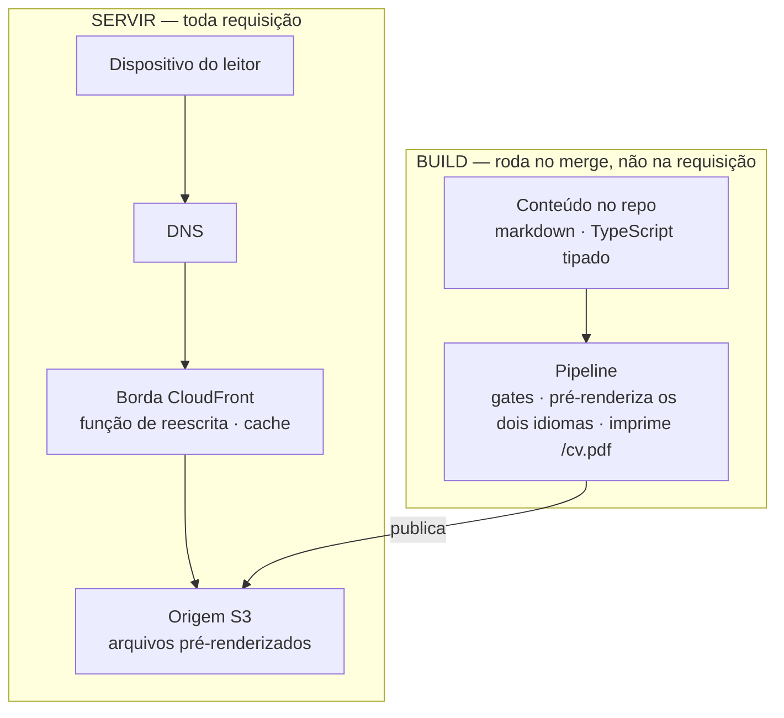
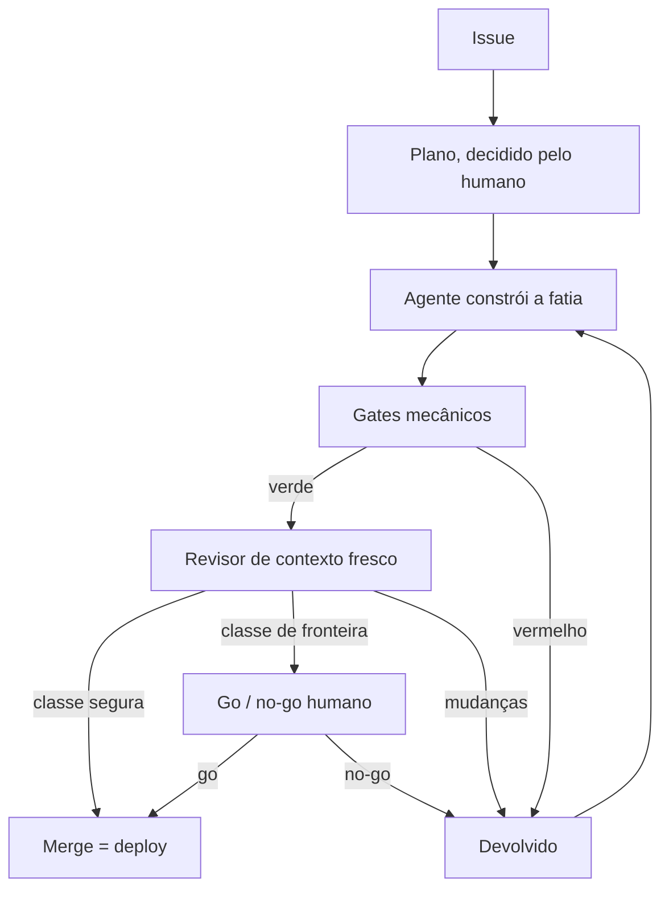
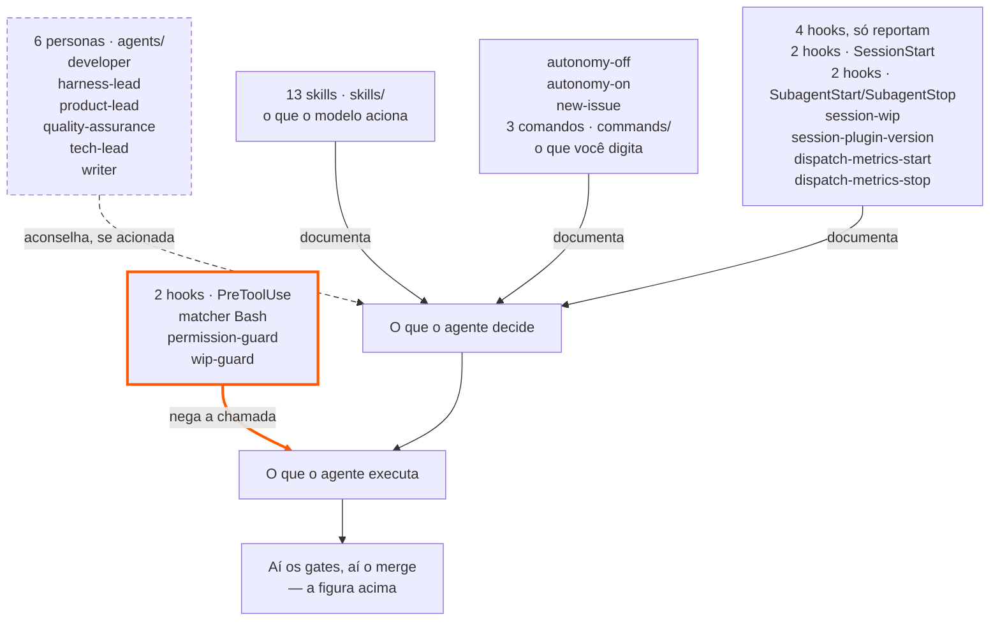

_Este site é o argumento. Esta página é a planta — como ele é construído, e como você construiria o seu._

## Comecei o ano perdido

Um projeto que não estava indo bem, um monte de obrigações de catch-up nas ferramentas de IA, e a coisa foi degradando até o fim do ano. O **Kiro** já estava à mão fazia um tempo, e eu comecei o ano disposto a aprender a usar a ferramenta. E tem um detalhe que eu suspeito que muita gente sênior está vivendo e não diz em voz alta: **eu tinha a ferramenta de desenvolvimento agêntico na mão — e mesmo assim me sentia de fora do hype.**

Porque o problema não era a ferramenta; era onde eu ia usá-la. Naquele começo de ano, todo trabalho com IA de que eu estava perto se dividia em duas metades: a modelagem, que é forte, e o resto — systems integration, legado que não dá pra trocar, as complicações comuns de TI corporativa. É nessa segunda metade que eu passei dezoito anos, e é ela que não tem use case pronto pra você aprender — o caso tem que aparecer sozinho, no trabalho de verdade.

O caso que virou o jogo não foi este site. **No início do ano, em janeiro**, comecei a construir por fora um mecanismo de autenticação e autorização com regras de negócio densas, custom em Spring Boot e Spring Security, integrando sistemas legados. **Eu jamais teria conseguido desenvolver aquilo sem uma agentic development tool** — e não era só o prazo: eu dividia as responsabilidades de tech lead naquele projeto **ao mesmo tempo**. É essa a parte que a ferramenta comprou. Não velocidade de digitação: as duas coisas caberem na mesma semana. E nada me diverte mais que ver uma aplicação funcionando bonitinha — numa escala que sozinho eu não alcançava. Foi ali que eu vi uma coisa que não via fazia tempo: se o requisito é onde eu fico e o código é trabalhado por AI-DLC, projeto de software engineering volta a ser prazeroso. Não como previsão — como o que eu enxerguei naquele momento, com aquilo rodando na minha frente.

> "Computer programming is an art, because it applies accumulated knowledge to the world,
> because it requires skill and ingenuity, and especially because it produces objects of beauty."
>
> — Donald Knuth, 1974


**As férias foram em maio, em São Francisco e no Vale, e é dali que sai o resto desta página.** Não teve lugar por onde eu passei sem alguma oferta de IA — no trem, na rua, na vitrine, no crachá de quem estava do lado. Voltei com a ideia do que fazer, e desde então toco isso em duas frentes: uma interna, no trabalho, com **Kiro**, e esta, pública, com **Claude Code**. Dois harness rodando o mesmo tipo de trabalho é o que me deixa separar o que é do modelo do que é do setup em volta dele.


Numa manhã eu peguei o Caltrain para sul — 8h57, próxima parada Palo Alto. O vagão era laptop aberto de ponta a ponta, loop rodando, gente trocando ideia em voz alta a caminho do trabalho. Não era evento, não era comunidade, não era nada combinado: era um monte de gente fazendo o mesmo tipo de trabalho, no mesmo lugar, na mesma hora — perto o suficiente para ouvir sem pedir e para responder sem marcar. Eu estive dentro disso por uma semana, em maio. No resto do ano, não estou.

E tem uma razão para a frente pública existir em vez de um caderno. Há opções de configuração demais — qual harness, quais hooks, que persona, que gate, qual modelo — e ninguém tem sessões suficientes para testar todas sozinho. **Trocar a experiência de cada um usando IA é o que vai acelerar esse aprendizado**, e por isso o que está aqui é o setup inteiro, não só a conclusão a que ele chegou.


## O que o requisito exigia, e a arquitetura que ele justificou

O requisito desta frente pública é curto: **publicar conteúdo, em dois idiomas, com a construção inteira em aberto.** É ele que decide a arquitetura, a conta, e o resto desta página.

E ela **não foi construída enxuta**. Foi construída inteira e depois cortada: havia uma plataforma com backend — BFF em Lambda, DynamoDB, Cognito, SES —, um Lambda@Edge renderizando imagens OG a cada requisição, um serviço de unfurl de links, GitFlow com staging e produção, e um PWA offline-first. Um banco sem nada para guardar. Auth sem ninguém para autenticar. Um staging para um site cujo revert é um merge. Cada uma era defensável quando foi decidida, e nenhuma sobreviveu à pergunta *"para que isso serve, aqui"* — e cada reversão está registrada junto com a decisão que a substituiu: [0025](https://github.com/tedeuxx/tadeumendonca-io/blob/main/docs/adr/0025-superseded-backend-platform.md), [0026](https://github.com/tedeuxx/tadeumendonca-io/blob/main/docs/adr/0026-superseded-lambda-edge-og.md), [0027](https://github.com/tedeuxx/tadeumendonca-io/blob/main/docs/adr/0027-superseded-backend-link-unfurl.md), [0028](https://github.com/tedeuxx/tadeumendonca-io/blob/main/docs/adr/0028-superseded-gitflow-two-env.md), [0029](https://github.com/tedeuxx/tadeumendonca-io/blob/main/docs/adr/0029-superseded-offline-first-pwa.md).

**O corte não é o assunto desta página; ele é a consequência.** O que sobrou são três coisas — um site estático, um plugin de dev-loop e um runtime de agente — e elas não são camadas de um mesmo sistema: **cada uma existe sem as outras duas.** O site roda sem o plugin. O plugin instala em qualquer repositório. O runtime não é meu. O que fica no meio é a única coisa que nenhuma das três entrega sozinha — e é ali que mora o jeito como eu construo isto, que é o jeito como eu quero ser contratado pra construir: desenvolvimento AI-native com o rigor de SDLC que a maior parte do trabalho com IA dispensa, num loop construído sobre AI-DLC & **(Agent) Harness Engineering**.

```venn
accTitle: Os três pilares, e o que fica na interseção
accDescr: Três círculos do mesmo tamanho, sobrepostos, com uma interseção comum no centro. O primeiro círculo é a solução, o repositório tadeumendonca-io, e dentro dele estão a SPA em React com Vite e TypeScript, o Terraform que provisiona CloudFront e S3, o pipeline com os gates e o deploy, e o conteúdo em markdown no próprio repositório. O segundo é a customização do harness, o repositório tadeumendonca-skills, e dentro dele estão as personas no diretório agents, os hooks registrados em hooks.json, a biblioteca de skills no diretório skills, os três comandos que uma pessoa digita no diretório commands — autonomy-off, autonomy-on e new-issue — e os ADRs de metodologia. O terceiro é o runtime do harness, o Claude Code, e dentro dele estão o orquestrador e os subagentes, os eventos PreToolUse e SessionStart, a política de permissões e as ferramentas com o MCP. No centro, onde os três se sobrepõem, está escrito Agent Harness Engineering, com a palavra Agent entre parênteses. A afirmação do desenho é essa: nenhum dos três círculos sozinho é a disciplina, ela é o que existe onde os três se encontram.
centre: (Agent) Harness | Engineering
pillar: A solução | tadeumendonca-io
- SPA React · Vite · TS
- Terraform: CloudFront, S3
- Pipeline: gates, deploy
- Markdown no repositório
pillar: A customização | tadeumendonca-skills
- Personas em agents/
- Hooks em hooks.json
- A biblioteca de skills
- Comandos que você digita
- ADRs de metodologia
pillar: O runtime | Claude Code
- Orquestrador, subagentes
- PreToolUse · SessionStart
- Política de permissões
- Ferramentas e MCP
```

O que fica na interseção é o trabalho de verdade: decidir o que o harness **barra**, o que ele **aconselha** e o que ele só **documenta** — e depois provar que o inventário disso continua verdadeiro. O `Agent` fica entre parênteses de propósito: um rótulo precisa ser curto e uma afirmação precisa ser exata, e o parêntese deixa uma forma só fazer as duas coisas.


## Pilar 1 · a solução

Uma SPA totalmente estática — React + Vite + TypeScript — servida a partir de **S3 atrás do CloudFront**, com uma pequena CloudFront Function reescrevendo URLs limpas. Sem servidor, sem banco, sem auth. O conteúdo é markdown no próprio repositório, e cada rota é **prerenderizada** no build, nos dois idiomas.

*(→ [ADR-0002](https://github.com/tedeuxx/tadeumendonca-io/blob/main/docs/adr/0002-fully-static-spa-no-backend.md) totalmente estático / sem backend · [ADR-0013](https://github.com/tedeuxx/tadeumendonca-io/blob/main/docs/adr/0013-s3-cloudfront-hosting.md) S3 + CloudFront)*

Em camadas — e **o que interessa nesse desenho é o que não está nele**:



**A ausência é deliberada, não uma lacuna.** Um diagrama de camadas para um sistema assim costuma seguir para uma camada de aplicação, um banco e integrações internas; aqui ele para num bucket. O único terceiro em tempo de execução é a analytics, e ela depende de consentimento. E "sem backend" levanta uma pergunta antes das outras — como um crawler enxerga isto —, cuja resposta é que nada precisa ser **renderizado** para ele enxergar: o que ele pede vem como HTML completo, com as tags OG dentro, direto de um arquivo estático. Sem SSR, sem renderização na borda — a função de reescrita da borda roda a cada requisição de página e mexe na URL, nada mais.

O limite viaja junto com a afirmação, porque é a parte que um leitor consegue derrubar: **uma URL que não existe responde 200, não 404 — e o que volta é a landing page**, com as tags OG da própria landing, sob um endereço que nunca existiu. O CloudFront mapeia `403` e `404` para `/index.html`, que é o que deixa uma SPA funcionar em rotas profundas e é uma troca real, não um detalhe. Já mordeu aqui uma vez: um desvio de caminho jogou as imagens de OG por artigo nesse mesmo fallback, e cada uma respondeu `200 text/html` a todo scraper que a pediu.

A única lógica que roda entre um leitor e um arquivo é essa função: [dez linhas executáveis](https://github.com/tedeuxx/tadeumendonca-io/blob/main/iac/cloudfront-functions/spa-rewrite.js), com [testes unitários próprios](https://github.com/tedeuxx/tadeumendonca-io/blob/main/apps/fed/scripts/spa-rewrite.test.mjs) e uma [verificação pós-deploy](https://github.com/tedeuxx/tadeumendonca-io/blob/main/.github/workflows/deploy.yml) de que a função no ar continua sendo a deste repositório. E o bucket **não é público em nenhum sentido**: só responde a `s3:GetObject` vindo desta distribuição.

*(→ [ADR-0004](https://github.com/tedeuxx/tadeumendonca-io/blob/main/docs/adr/0004-build-time-render-not-ssr-or-edge.md) render no build, sem SSR · [ADR-0005](https://github.com/tedeuxx/tadeumendonca-io/blob/main/docs/adr/0005-og-coverage-every-public-url.md) toda URL OG-completa · [ADR-0033](https://github.com/tedeuxx/tadeumendonca-io/blob/main/docs/adr/0033-ga4-consent-gated-analytics.md) analytics dependente de consentimento · [`iac/frontend.tf`](https://github.com/tedeuxx/tadeumendonca-io/blob/main/iac/frontend.tf) a distribuição e as policies)*

### R$ 34,31 por mês

Esse número mede o que este site **acrescentou**, não aquilo de que ele **depende**, e mede aquilo **em que** ele roda, não aquilo com que eu o **construo**. Dizer "custo quase zero" é a coisa mais fácil desta página, e a mais fácil de ninguém conferir — então segue a conta, com as linhas de hospedagem lidas do custo diário da conta no **fim de julho de 2026** e o registro lido da tabela do registrador. Nenhuma estimada. A fatura da AWS é em dólar, e o câmbio usado aqui é **R$ 5,222/USD**, o fechamento de **14 de agosto de 2026** — fixo no texto, não buscado a cada build, para que o número publicado só mude quando alguém decidir mudá-lo. É com ele que você desfaz qualquer linha abaixo de volta ao valor da fatura:

- **O domínio** — R$ 370,76/ano pelo `.io`, uma cobrança anual que cai num mês só. **R$ 30,91/mês** amortizado. Escolhi o `.io` por branding, não por custo: é a razão honesta, e a única linha daqui que você pode recusar.
- **Route 53** — R$ 2,61/mês, fixo. A hosted zone, com ou sem visitante.
- **S3** — cerca de R$ 0,78/mês, e são *escritas* de deploy, não leituras.
- **CloudFront** — não custa nada com esse volume: o tráfego deste site não chega a arranhar o piso do serviço.

Fora da AWS o critério é o mesmo. GitHub Team e Claude Max são pagos e ficam **fora** do total — a assinatura do GitHub Team é anterior ao site, embora a carga de CI em cima dela seja inteiramente dele; GitHub Actions e SonarCloud são zero **porque os repositórios são públicos** — propriedade dos repositórios, não do plano — e Terraform Cloud é zero **porque a infraestrutura é pequena**. E o **iCloud+** é a linha que mostra o critério sendo aplicado em vez de anunciado: ele é anterior ao site, mas carrega o e-mail com domínio próprio no apex e o [`iac/email.tf`](https://github.com/tedeuxx/tadeumendonca-io/blob/main/iac/email.tf) provisiona os registros MX, DKIM e SPF dele — então não é adjacente a esta infraestrutura, está dentro dela. *(→ [ADR-0016](https://github.com/tedeuxx/tadeumendonca-io/blob/main/docs/adr/0016-custom-email-via-icloud.md))*

Fora do total ficam também todas as minhas horas: **R$ 34,31 por mês é o que custa manter isto no ar, não o que custou construir.** Em pessoas, custou uma — fins de semana, em paralelo com consultoria. E a mesma leitura mostrou cerca de **R$ 66,84 por mês** que o site não estava usando: web ACLs de WAF e IPv4 públicos ociosos, esquecidos quando o backend foi aposentado. Descobri lendo a fatura, o que é tarde — **infraestrutura que você para de usar não para de cobrar** —, e quem vigia agora é um orçamento em [`iac/budget.tf`](https://github.com/tedeuxx/tadeumendonca-io/blob/main/iac/budget.tf) deliberadamente **não** escopado às tags deste projeto: se fosse, só enxergaria gasto que este repo criou, e este era justamente do tipo que ele não criou.

## Pilar 2 · a customização

A parte interessante não é a stack — é como ela é construída: **agent-led verification, human-residual**. O agente prova o "pronto" com gates mecânicos e evidência real (lint, tipos, testes ≥85%, build verde, SonarCloud, E2E funcional, um revisor de contexto fresco); o humano fica com as decisões irreversíveis e arquiteturais. Esse loop vive num plugin à parte — **[tadeumendonca-skills](https://github.com/tedeuxx/tadeumendonca-skills)** —, então é uma metodologia que você pode adotar, não algo sob medida só pra este site.



O humano aparece duas vezes, e são trabalhos diferentes: no plano, decidindo o que vale ser construído e como — arquitetura eu nunca decido sozinho — e no fim, só no que é classe de fronteira, decidindo se aquilo sobe. E o custo disso, já que o resto desta página assume os seus: quem decide que uma mudança é segura é o mesmo tipo de coisa que escreveu a mudança. Classifique uma errado e ela pega o caminho vazio. O que torna isso aceitável aqui é raio de impacto, não confiança — é um site estático, e reverter é um merge.

*(→ [ADR-0003](https://github.com/tedeuxx/tadeumendonca-io/blob/main/docs/adr/0003-trunk-based-single-environment.md) trunk-based, ambiente único · [ADR-0018](https://github.com/tedeuxx/tadeumendonca-io/blob/main/docs/adr/0018-ci-gates-e2e-on-pr-coverage.md) os gates de CI)*

### Do que o harness é feito



**Dos componentes do próprio plugin, exatamente um tipo consegue te barrar**, e essa é a versão honesta do convite a adotar: os dois hooks de `PreToolUse` devolvem uma negativa *antes* da ferramenta rodar, e o comando não acontece. Os outros quatro rodam em eventos que não entregam chamada nenhuma pra recusar, então só reportam. E as personas **aconselham** — o julgamento delas não é verificado por nada, e o guia deste repositório diz com todas as letras que uma lente que ninguém aciona *falha em silêncio*. Essa é a garantia que o loop dá — e ela vale exatamente o que valer o inventário do desenho acima.

**E o inventário desse desenho é conferível — é essa a segunda garantia, e ela é de outra natureza.** Renomeie uma persona no plugin e o build deste repositório fica vermelho. O diagrama acima é escrito à mão: um teste compara o desenho, nó a nó e contagem a contagem, com um [manifesto versionado](https://github.com/tedeuxx/tadeumendonca-io/blob/main/apps/fed/src/content/generated/harness.json), nas duas edições; e um [job de CI](https://github.com/tedeuxx/tadeumendonca-io/blob/main/.github/workflows/app.yml) compara esse manifesto com a árvore viva do plugin. A diferença entre desenhar um harness e provar que o desenho ainda é ele é exatamente essa, e ela é mecânica.

**E é por isso que eu chamo isto de uma coisa, e não de outra.** **AI-DLC** não é meu — é o nome que a AWS deu a um ciclo de entrega cujas etapas são executadas e verificadas por agentes; eu adoto, não inventei. **Agent Harness Engineering** é a afirmação que eu faço: construir, versionar e provar o harness em volta desse ciclo. Adotar uma metodologia não custa nada dizer — e é justamente por isso que dizer não vale nada. Essa aqui é paga, e o pagamento está no parágrafo acima: um build que quebra quando o inventário deixa de ser verdade. É a mesma régua de **agent-led verification** que o resto desta página aplica ao código, virada para a metodologia: quem afirma é quem produz a evidência.

*(→ [ADR-0043](https://github.com/tedeuxx/tadeumendonca-io/blob/main/docs/adr/0043-harness-inventory-derived-from-plugin-repo.md) o inventário ancorado no plugin)*

**Seis personas, contra quem cada uma argumenta — e o que cada uma carrega ao ser acionada.** A última coluna é o preload de cada brief: as skills que entram na sessão da persona antes de ela ler a primeira linha da tarefa.

| quem | o que é dele | contra quem argumenta | o que carrega ao ser acionada |
|---|---|---|---|
| `product-lead` | o leitor, valor, ordem, tamanho da fatia — e posicionamento, voz, e a verdade de qualquer coisa publicada | o `tech-lead`; e é a única lente que **barra** em vez de aconselhar, diante de uma afirmação publicada que não é verdade | `harness-engineering` · `definition-of-ready` · `command-hygiene` |
| `tech-lead` | arquitetura, medição, sequenciamento — e é ele que escreve os ADRs | o `product-lead`, de propósito: produto-e-mercado e sistema são otimizações genuinamente diferentes | `harness-engineering` · `definition-of-ready` · `documentation-standard` · `command-hygiene` |
| `developer` | a fatia inteira — aplicação, infraestrutura, pipeline, e os testes escritos junto | ninguém. Ele constrói, e é pra ele que o gate está apontado | `harness-engineering` · `code-review` · `quality-gates` · `command-hygiene` |
| `quality-assurance` | a entrega contra a Definition of Done, e, à parte, se a mudança pode quebrar a produção | o `developer`, nos dois eixos numa passada só — e é o único que o hook de permissão deixa fazer merge | `harness-engineering` · `quality-gates` · `devops` · `command-hygiene` |
| `writer` | redige artigos, texto do site e a linguagem dos posts de rede social na voz do dono — molda, corta, estrutura e traduz uma experiência que ele já tem, nunca origina uma | o `product-lead`, que segura o veto bloqueante sobre qualquer coisa que ela redige e chega a uma superfície pública | `harness-engineering` · `command-hygiene` |
| `harness-lead` | a maquinaria em si: hooks, permissões, instruções das personas, skills e comandos, o plugin | **eu** — e esse é o caso interessante: o contraponto dele não é outra persona, é a única cadeira deste loop que não tinha com quem discutir | `harness-engineering` · `documentation-standard` · `devops` · `command-hygiene` |

Duas coisas dessa última coluna valem ser ditas. **`harness-engineering` e `command-hygiene` estão nas seis** — é o preload universal: entender o próprio loop e a disciplina de arquivo e comando não é assunto de especialidade nenhuma. E **só 7 das 13 skills da biblioteca são pré-carregadas por alguém**, ou seja, mais da metade da biblioteca só chega numa sessão se o modelo a encontrar sozinho, pela descrição dela.

**E esta tabela é escrita à mão — a coluna nova inclusive.** Os nomes de persona do desenho lá em cima são comparados com o manifesto e com a árvore viva do plugin, então aposentar uma persona deixa um build daqui vermelho. Aqui, nada compara coisa nenhuma: o `check-harness-drift` confere nomes e contagem de personas, e **não** confere quais skills cada uma carrega. Basta alguém mudar o bloco `skills:` de um brief para esta coluna passar a mentir no dia seguinte, sem nenhum sinal. Se um papel mudar de mãos, o desenho fica vermelho e estas linhas caladamente não.

## Pilar 3 · o runtime

O orquestrador é a parte do harness que você **não consegue instalar**. Ele não está em nada do inventário acima — nem no desenho, nem no manifesto — e é a sessão principal: o contexto que lê uma Issue, decide qual persona acionar e pesa o que volta. O **ator** não é componente do plugin, a **política** dele em parte é, e o que você põe é o contexto que roda aquilo. É também a parte *contra* a qual as fronteiras acima foram desenhadas: a glosa *aconselha, se acionada* nomeia o acionamento como o modo de falha sem nomear quem aciona. Quem aciona é ele, e uma lente que ele esquece é uma lente que ninguém rodou.

**E o contexto dele acaba.** É isso que um subagente compra: ele lê, roda, erra e refaz **dentro da sessão dele**, e o que chega ao orquestrador é a conclusão. Uma tarefa custa ao orquestrador **o veredito, não a execução**, e por isso a única alavanca real deste harness é o tamanho do veredito, girada escrevendo as instruções de cada persona. Medi uma vez, na sessão deste repositório, em 7–8 de agosto de 2026, lendo as transcrições: o que ficou dentro dos subagentes foi mais de uma ordem de grandeza maior do que o que voltou. E a economia tem teto — mesmo assim, os vereditos que voltaram foram uma fatia grande de tudo que o orquestrador consumiu vindo de uma ferramenta. Não é fuga: aquela sessão compactou duas vezes de qualquer jeito. **O número não é publicado porque a fonte é uma transcrição de sessão privada, que gate nenhum alcança.**

**E o chão embaixo dele se mexe.** Esta é a parte que o resto desta página não tem: o site eu controlo, o plugin eu controlo, o runtime não. Quem o produz publica mudança o tempo todo, e cada modelo novo muda qual configuração ainda faz sentido — não porque a configuração tenha ficado errada, mas porque ela estava compensando uma fraqueza que sumiu.

Não é dedução minha. Quando o Opus 5 saiu, o time do Claude Code **apagou mais de 80% do próprio system prompt** — o do produto deles, não a configuração pessoal de alguém — e o modelo ficou **melhor** sem o andaime. E não como evento único: a cada upgrade grande de modelo é menos andaime necessário, então se apaga regra e se recoloca só onde o modelo ainda erra. Isso é um ciclo, não uma faxina.

A tese que vem junto é a que me interessa, e ela é dura: modelos de fronteira estão sendo **limitados** por produtos construídos para os modelos fracos de ontem, e a vantagem fica com quem põe esforço de engenharia em **verificação, e não em instrução**. É a pessoa que construiu a ferramenta dizendo que o movimento vencedor é o termo central desta página — **agent-led verification**. Não estou citando isso de enfeite: é corroboração independente de uma escolha que eu já tinha feito, vinda de quem tem o dado que eu não tenho.

E é por isso que este loop é feito de hooks e de gates, e não de um prompt gigante explicando ao agente como se comportar. Instrução envelhece a cada modelo novo, e envelhece calada. Um gate, não: ele confere o resultado, e o resultado é a mesma coisa antes e depois do upgrade. Se o argumento acima estiver certo, a parte do meu harness que vai sobreviver é a que verifica — e a que manda é a que eu vou apagar.

Boris Cherny, que construiu o Claude Code, no canal do Y Combinator:

https://www.youtube.com/watch?v=qyPCVqFUyDo

## O registro de decisões É a documentação

O argumento clássico para ADRs é o humano do futuro: registre por que a decisão foi tomada, para que daqui a dois anos alguém não a desfaça sem saber o que estava em jogo. Aqui o argumento é outro, e é ele que decide o formato.

**Num repositório onde quem desenvolve são agentes, o registro é contexto de inferência.** O agente não tem memória do que foi discutido — ele tem o repositório, e é dali que infere o que fazer. Se a arquitetura que se formou ao longo do tempo não estiver ancorada em algum lugar do próprio código, cada mudança nova é decidida sem ela, e o resultado não é uma decisão errada isolada: é uma decisão nova que contradiz uma decisão que ninguém lembra de ter tomado. Por isso uma decisão revertida continua aqui e **diz** que foi revertida. Sem essa marca, o registro de uma arquitetura aposentada lê como instrução — que é a forma mais barata que existe de fazer um agente reconstruir aquilo que foi cortado de propósito.

É esse propósito que escolhe o formato, e não o contrário. **MADR**: contexto, as opções que estavam na mesa, a decidida, e a consequência. Um documento curto por decisão, um arquivo por decisão, tudo no mesmo repositório que o agente já lê — nada de wiki, nada de ferramenta à parte. O que um formato assim entrega para um leitor humano é rastreabilidade; o que ele entrega para um agente é o que ele precisa para não contradizer.

**São 48 decisões, e a prova de que este parágrafo não está inventando o número é mecânica.** O índice é **gerado** a partir de `docs/adr/`, commitado como artefato e conferido no CI: acrescentar ou substituir uma decisão sem regenerar o índice deixa o pipeline vermelho. As linhas não estão impressas aqui de propósito — esta página **aponta** o detalhe canônico em vez de repeti-lo, e uma cópia de 48 linhas seria a própria regra sendo quebrada na única seção que existe para defendê-la.

*(→ [a biblioteca de decisões](https://github.com/tedeuxx/tadeumendonca-io/blob/main/docs/adr/README.md) · [ADR-0001](https://github.com/tedeuxx/tadeumendonca-io/blob/main/docs/adr/0001-lean-by-design-calibrated-to-strategy.md) enxuto por design)*

## Replique para o seu contexto

Está tudo público — dois repos, sem segredos.

[https://github.com/tedeuxx/tadeumendonca-io](https://github.com/tedeuxx/tadeumendonca-io)

[https://github.com/tedeuxx/tadeumendonca-skills](https://github.com/tedeuxx/tadeumendonca-skills)

Os passos de "do fork até no ar" estão nos READMEs, não nesta página: [o deste repo](https://github.com/tedeuxx/tadeumendonca-io#fork-to-live) traz o caminho de nuvem inteiro, do domínio até o primeiro merge, e [o do plugin](https://github.com/tedeuxx/tadeumendonca-skills#run-it) traz a metade do loop, que se instala sem nenhuma conta em nuvem. E a régua que um projeto precisa passar pra entrar no portfólio daqui também é pública, em [docs/catalog-ready.md](https://github.com/tedeuxx/tadeumendonca-io/blob/main/docs/catalog-ready.md) — o gate de prova de engenharia.

**Uma coisa eu recomendaria copiar sem pensar duas vezes.** O deploy entra na AWS por OIDC, então **não há segredo guardado**: uma chave vazada é acesso até alguém revogar, e um token vazado é acesso até expirar — e só se quem o pegou também satisfizer a condição do trust, que aqui é o subject *imutável* daquele repositório, por ID numérico e não por nome, porque nome pode ser transferido pra outra pessoa e os IDs não. A troca é que a raiz dessa confiança precisa nascer fora: **o Terraform daqui não cria o provedor OIDC, nem a role que roda o próprio Terraform.** É um buraco documentado num piso, e nenhum `plan` vai te avisar que ela saiu do lugar.

*(→ [ADR-0042](https://github.com/tedeuxx/tadeumendonca-io/blob/main/docs/adr/0042-trust-root-bootstrapped-out-of-band.md) raiz de confiança fora do Terraform · [ADR-0015](https://github.com/tedeuxx/tadeumendonca-io/blob/main/docs/adr/0015-oidc-immutable-subject-least-privilege.md) subject imutável)*

O que eu ficaria nervoso de ver alguém copiar sem o resto é **o merge direto pra produção**. Trunk-based com ambiente único é rápido e implacável na mesma medida; sem os gates na frente, sobra só a segunda metade.

Isto está em aberto porque há mais escolhas de configuração do que sessões que uma pessoa sozinha consegue rodar. Se você rodou alguma dessas escolhas de outro jeito, é você que tem a metade que falta nesta página: **me conte o contra-exemplo, ou compartilhe dizendo o que faria diferente.**
