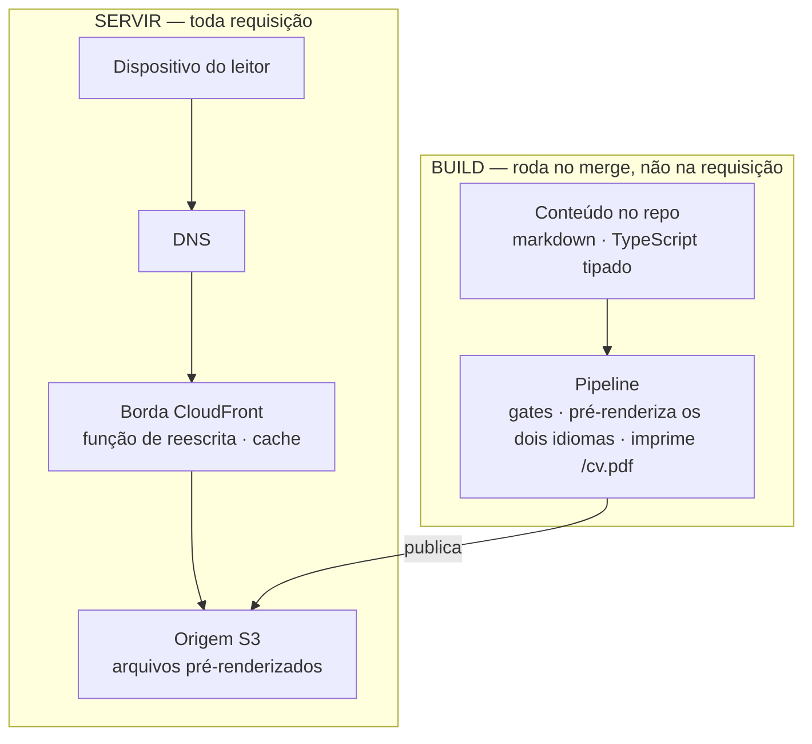
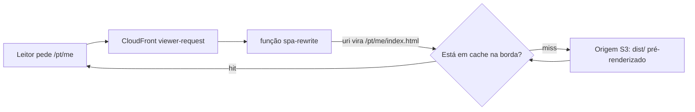

_Este site é o argumento. Esta página é a planta — como ele é construído, e como você construiria o seu._

## A tese

Para um site de prova de engenharia, o código é o pitch — então o honesto é mostrar a máquina, não só o resultado dela. Esta é a construção inteira, em aberto: a arquitetura abaixo, as decisões que a moldaram (cada uma registrada como um ADR), e a camada reutilizável que te deixa replicar. Eu construo isto do jeito que quero ser contratado pra construir: desenvolvimento AI-native com o rigor de SDLC que a maior parte do trabalho com IA pula — Claude Code, Kiro, um loop construído sobre AI-DLC & Agent Harness Engineering. O site é a saída pública desse loop.

## O formato

Uma SPA totalmente estática — React + Vite + TypeScript — servida a partir de **S3 atrás do CloudFront**, com uma pequena CloudFront Function reescrevendo URLs limpas. Sem backend: sem servidor, sem banco, sem auth. Custo quase zero, superfície de ataque mínima, nada rodando às 3 da manhã.

*(→ [ADR-0002](https://github.com/tedeuxx/tadeumendonca-io/blob/main/docs/adr/0002-fully-static-spa-no-backend.md) totalmente estático / sem backend · [ADR-0013](https://github.com/tedeuxx/tadeumendonca-io/blob/main/docs/adr/0013-s3-cloudfront-hosting.md) S3 + CloudFront)*

Em camadas — e **o que interessa nesse desenho é o que não está nele**: não há camada de aplicação nem camada de dados, porque tudo que normalmente aconteceria a cada requisição foi movido para o build:



**A ausência é deliberada, não uma lacuna.** Um diagrama de camadas para um sistema assim costuma seguir para uma camada de aplicação, um banco e integrações internas; aqui ele para num bucket. O único terceiro em tempo de execução é a analytics, e ela depende de consentimento. O que um backend faria por requisição — resolver conteúdo, renderizar HTML, montar as tags OG — acontece uma vez, na trilha de build, e viaja como arquivo.

*(→ [ADR-0033](https://github.com/tedeuxx/tadeumendonca-io/blob/main/docs/adr/0033-ga4-consent-gated-analytics.md) analytics dependente de consentimento)*

É também por isso que a conta logo abaixo é o que é: **o nome e a zona hospedada cobram com ou sem visitante, e o que uma visita acrescenta em cima deles arredonda pra nada.**

O que nada disso situa é onde uma URL limpa vira um arquivo:



Não existe aplicação nesse caminho — então a única lógica entre um leitor e um arquivo são [dez linhas executáveis de JavaScript](https://github.com/tedeuxx/tadeumendonca-io/blob/main/iac/cloudfront-functions/spa-rewrite.js), e elas carregam [testes unitários próprios](https://github.com/tedeuxx/tadeumendonca-io/blob/main/apps/fed/scripts/spa-rewrite.test.mjs) e uma [verificação pós-deploy](https://github.com/tedeuxx/tadeumendonca-io/blob/main/.github/workflows/deploy.yml) de que a função no ar continua sendo a deste repositório. Ela roda a cada requisição de *página*; os assets do build são um behavior separado, que nunca a invoca — as imagens de OG passam por ela e seguem intactas, porque o último segmento do caminho tem extensão.

Essa verificação é o preço de colocar lógica na borda, não um capricho: a versão de uma função é publicada independentemente da distribuição, então nada no deploy do site prova qual delas está de fato rodando.

**"Sem backend" levanta uma pergunta antes das outras — como um crawler enxerga isto — e a resposta é que nada precisa rodar para ele enxergar.** Um buscador ou um scraper de unfurl pede uma URL e recebe **HTML completo com as tags OG dentro**, direto de um arquivo estático, não um shell vazio que só vira página depois que o JavaScript roda. **Nada é montado quando ele pede**: cada rota é renderizada uma vez, no build, nos dois idiomas. Sem SSR, sem renderização na borda — a função acima reescreve URL e nada mais.

O limite viaja junto com a afirmação, porque é a parte que um leitor consegue derrubar: **uma URL que não existe responde 200, não 404 — e o que volta é a landing page**, com as tags OG da própria landing, sob um endereço que nunca existiu. O CloudFront mapeia `403` e `404` para `/index.html`, que é o que deixa uma SPA funcionar em rotas profundas e é uma troca real, não um detalhe. Então um scraper que desdobra um link errado deste site recebe um card plausível da home em vez de um erro. Já mordeu aqui uma vez: um desvio de caminho jogou as imagens de OG por artigo nesse mesmo fallback, e cada uma respondeu `200 text/html` a todo scraper que a pediu.

*(→ [ADR-0004](https://github.com/tedeuxx/tadeumendonca-io/blob/main/docs/adr/0004-build-time-render-not-ssr-or-edge.md) render no build, sem SSR · [ADR-0005](https://github.com/tedeuxx/tadeumendonca-io/blob/main/docs/adr/0005-og-coverage-every-public-url.md) toda URL OG-completa)*

## Por que este site existe

Para aprender IA você precisa criar os use cases. Você não aprende sem eles. Tudo precisa de um usuário, uma aplicação, uma funcionalidade, um business case — e é aí que eu continuo vendo a lacuna. No trabalho com IA de que estive perto, a modelagem é forte e a outra metade é rala: systems integration, legado que não dá pra trocar, as complicações comuns de TI corporativa. É nessa outra metade que eu passei dezoito anos. Este site é um use case, e o repositório aberto deixa qualquer um conferir.

Comecei o ano perdido. Um projeto que não estava indo bem, um monte de obrigações de catch-up nas ferramentas de IA, e a coisa foi degradando até eu sair de férias. E tem um detalhe que eu suspeito que muita gente sênior está vivendo e não diz em voz alta: **eu tinha as ferramentas de desenvolvimento agêntico na mão — Claude Code, Kiro — e mesmo assim me sentia de fora do hype.**

Desenvolvimento de software é minha paixão. Nada me diverte mais que ver uma aplicação funcionando bonitinha. O que essas ferramentas me devolveram foi isso, numa escala que sozinho eu não alcançava.

O caso que me provou isso não foi este site. Foi um mecanismo de autenticação e autorização com regras de negócio densas, custom em Spring Boot e Spring Security, integrando sistemas legados. Comecei a construir por fora, na volta das férias, e aquilo foi crescendo e amadurecendo. **Eu jamais teria conseguido desenvolver esse mecanismo sem uma agentic development tool** — não no prazo que eu tinha.

Desde então tenho feito isso em duas frentes: uma interna, no meu trabalho, e esta, pública. Consultoria não me dá mais o que eu quero fazer: produto digital. Gosto de criar apps.

## Quem fez o quê

Trabalhar com um time autônomo de agentes é parte do propósito deste site, então vale ser específico sobre o recorte — sem número de horas, porque eu não os registrei e um número inventado não valeria nada.

**Meu:** a ideia, o produto, os conteúdos — meus mesmo onde eles lapidaram — a voz do site, a arquitetura de agentes, a configuração do harness e a experimentação de setups, os padrões de arquitetura.
**Do time de agentes:** rascunhar o desenvolvimento e o código.

Mas o método não é despacho. Parte da minha ideia, eu **ouço deles como fariam**, e vou aparando arestas contra a minha visão de arquitetura e minha experiência com sistemas distribuídos. A autoria continua minha; ela só se exerce depois de escutar.

E escutar rende. Eles têm senioridade maior que a minha nos frameworks e nas linguagens escolhidas — eu agrego com arquitetura e visão. **Recorrentemente aprendo formas de usar os serviços AWS que eu não sabia que existiam.** Neste site foi a renderização de OG com Lambda@Edge: eu não fazia ideia de que dava para suprir um SSR e resolver indexação de crawler com aquilo. Em outro sistema foi a busca semântica com Amazon S3 Vectors: eu não sabia que dava para montar isso em peças serverless e pagar por demanda, em vez de por um cluster OpenSearch provisionado rodando o tempo todo. A troca é vazão e latência — a própria AWS posiciona os dois como camadas, não como alternativas.

A ironia do primeiro exemplo está a duas seções daqui: aquele Lambda@Edge tem uma decisão registrada, e ela foi **cortada**. Funcionou, me ensinou, e depois se provou desnecessária — prerender no build entrega o mesmo HTML servido sem nada rodando. As duas coisas são verdade ao mesmo tempo.

*(→ [ADR-0026](https://github.com/tedeuxx/tadeumendonca-io/blob/main/docs/adr/0026-superseded-lambda-edge-og.md) OG com Lambda@Edge, substituída)*

Em pessoas, o que está acima custou uma. Fins de semana, em paralelo com consultoria.

## Quanto custa de verdade: USD 6,57 por mês — e USD 6,42 disso é o nome

Esse número mede o que este site **acrescentou**, não aquilo de que ele **depende**: assinaturas que já existiam e cobrariam igual se ele fosse apagado amanhã ficam de fora. E mede aquilo **em que** o site roda, não aquilo com que eu o **construo**. As subseções abaixo voltam às duas. Sem esse recorte, "USD 6,57" é um número solto, e um número solto não é conferível.

Dizer "custo quase zero" é a coisa mais fácil desta página — e a mais fácil de ninguém conferir. Então segue a conta da AWS: as linhas de hospedagem lidas do custo diário da conta no **fim de julho de 2026**, o registro lido da tabela de preço do registrador. Nenhuma das duas estimada:

- **O domínio** — USD 71,00/ano pelo `.io`, uma cobrança anual que cai num mês só. **USD 5,92/mês** amortizado.
- **Route 53** — USD 0,50/mês, fixo. A hosted zone, com ou sem visitante.
- **S3** — cerca de USD 0,15/mês, e são *escritas* de deploy, não leituras.
- **CloudFront** — na prática USD 0,00 com esse volume.

**A maior linha da conta é a que foi escolha — e um nome mais barato derruba o total.** Em vez de imprimir uma tabela de preços que envelhece, ou de citar uma comparação que eu não medi, fica o comando que responde isso para o nome que você quiser, pelo mesmo registrador que este usa: `aws route53domains list-prices --tld com`. Replique esta stack sob um nome mais barato e o número mensal acima deixa de ser dominado por uma preferência minha.

A escolha é o `.io`: caro entre os domínios de topo, e eu o escolhi por branding, não por custo — essa é a razão honesta, e é a única linha daqui que você pode recusar. Nada mais nesta conta se mexe com o nome: a hosted zone, o bucket e a distribuição não ligam para qual ele é.

Repare no formato disso, porque não é um efeito pequeno e é uma divisão em três, não uma razão: **o nome são 6,42, publicar são 0,15, e responder requisição é zero.** Registro e DNS custam mais que todo o resto desta conta somado, quarenta vezes mais; os 0,15 são o build empurrando arquivo pro S3, não leitor puxando; e a parte que de fato atende um visitante arredonda pra nada.

As linhas de hospedagem são medição com data, não fato permanente — nenhuma fatura fechou nesse ritmo ainda.

E repare *por que* a fonte é dividida, porque esse foi o erro que esta seção já cometeu uma vez: a série de custo diário é uma janela, e **uma cobrança que se repete menos vezes do que a sua janela é longa fica invisível pra ela.** A renovação é anual e cai em outubro, então ler a conta estava certo e respondia uma pergunta diferente da que eu tinha feito. "Medido, não estimado" não protege de medir o intervalo errado.

A única computação nesse caminho é a função de edge lá de cima, cobrada por invocação e arredondando pra zero neste volume; não existe linha de *servidor* nenhuma. É isso que "sem backend" compra: um **piso** sem computação nenhuma — nada parado ali cobrando por capacidade, embora o nome e a zona hospedada cobrem de todo jeito.

O que ele não compra é indiferença a tráfego — S3 e CloudFront são cobrados puramente por uso, então a parte variável é zero aqui por causa do free tier e de payloads pequenos, não porque não haja o que escalar.

### Os outros fornecedores, e por que um número só é o formato errado

A AWS é um dos fornecedores que poderiam faturar este site — e esse é o critério, declarado em vez de virar contagem, porque número envelhece na primeira dependência nova. **Entra aqui tudo que cobra para manter o site publicado no ar, ou que cobraria sob alguma condição.** O recorte é a segunda regra declarada lá em cima — aquilo **em que** o site roda, não aquilo com que eu o **construo** — e a seção final volta nele. Aplicado com honestidade, ele ainda revela mais do que uma lista de zeros — e o interessante é que os itens não se comportam do mesmo jeito.

**Dois cobram hoje, e nenhuma das duas cobranças foi criada por este site.** O **GitHub** hospeda o código e roda todos os gates, num plano **Team** pago — a assinatura é anterior ao site, embora a carga de CI em cima dela seja inteiramente dele, e cobrada a zero por um motivo que aparece dois parágrafos abaixo. O **iCloud+** carrega o e-mail com domínio próprio no apex — o [`iac/email.tf`](https://github.com/tedeuxx/tadeumendonca-io/blob/main/iac/email.tf) provisiona os registros MX, DKIM e SPF dele, então não é algo adjacente a esta infraestrutura: está dentro dela. As duas assinaturas já existiam antes do site e cobrariam exatamente o mesmo se ele fosse apagado amanhã — e é por isso que os USD 6,57 não as absorvem — a primeira regra lá em cima, aplicada. "Roda com quase nada" vale para o que o site acrescentou, não para tudo de que ele depende.

*(→ [ADR-0016](https://github.com/tedeuxx/tadeumendonca-io/blob/main/docs/adr/0016-custom-email-via-icloud.md) e-mail próprio via iCloud)*

**O resto cobra zero, sob condições que são justamente a parte que interessa:**

- **O GitHub Actions é gratuito porque os repositórios são públicos** — uma propriedade dos repositórios, não do plano, então sobreviveria a um downgrade e não sobrevive a fechá-los. Aí passa a consumir minutos de uma franquia mensal, e este pipeline roda o conjunto inteiro de gates **a cada pull request que mexe na aplicação** — instalação, auditoria, lint, checagem de tipos, unitários, build, E2E e uma varredura do Sonar; os workflows filtram por caminho, e os ADRs estão dentro desse filtro porque esta página os publica, então quem roda bem menos é prosa *fora* desses caminhos —, e **de novo no merge**, que ainda por cima publica e roda um segundo E2E contra o site no ar. O número que aparece não é pequeno, e nada no código teria mudado.
- **O SonarCloud depende da mesma condição**, numa conta separada: o tier gratuito dele é para projetos públicos. O gate dele barra um merge, então ele é estrutural no loop cobrando exatamente zero — que é o caso mais claro de por que escrever só o zero seria a resposta mais enganosa.
- **O tier gratuito do Terraform Cloud cobre este workspace** porque a infraestrutura é pequena: o último plan resolveu contra cerca de cinquenta recursos, bem dentro do limite. Esse teto é contado em **recursos** — não em tráfego, nem em gasto — então é o único limite aqui que uma **decisão** move, e não um público.

A analytics aparece lá em cima como o único terceiro em runtime e está deliberadamente fora desta lista: depende de consentimento e é gratuita em qualquer volume que este site vá produzir, o que faz dela uma questão de privacidade, não de cobrança.

Então o formato honesto é **uma conta medida, um conjunto de zeros condicionais e duas assinaturas que cobrariam com ou sem este site** — e nenhum fornecedor aqui se move com leitores. Fechar um repositório, crescer o parque, registrar um nome: tudo decisão. As únicas linhas cobradas por tráfego em tudo isso estão dentro da conta da AWS, e são as duas que arredondam pra nada.

**E isso também vale para a medida, que é a parte escondida por um total só.** Dos USD 6,57, USD 5,92 são o registro anual amortizado e USD 0,50 a zona hospedada fixa — 6,42 antes de um único arquivo ser servido. Os 0,15 restantes são o build escrevendo no S3, não leitores lendo de lá.

**Isso está em texto e não em tabela, de propósito.** Uma linha escrita `GitHub — USD 0,00` convida o leitor a somar e parar. O que importa não é a célula estar vazia, e sim que ela está vazia **por um motivo que alguém escolheu** — e que esse motivo se reverte por decisão, não por tráfego.

### O que o número ainda deixa de fora

É a conta de um provedor só, deliberadamente — e o eixo acima é o que torna isso honesto em vez de parcial: os USD 6,57 são o que este site **acrescentou**, não aquilo de que ele depende. Então ficam de fora as duas assinaturas que cobrariam com ou sem ele, fica de fora a assinatura do Claude Max em que este trabalho roda, e ficam de fora todas as minhas horas. **Só infraestrutura e ferramental**, e nem isso inteiro.

Isso precisa estar escrito, senão o número mente por omissão: **USD 6,57 por mês é o que custa manter isto no ar, não o que custou construir.** São duas perguntas diferentes, e esta seção responde só a primeira.

### Pra que serve o guardrail, na prática

A mesma leitura mostrou cerca de **USD 12,80 por mês** que o site não estava usando: web ACLs de WAF e endereços IPv4 públicos ociosos, associados a nada, esquecidos quando o backend foi aposentado. Mais de oitenta vezes o que custa publicar o site. **Esses já saíram** — removidos em julho de 2026, e é a série diária de custo que confirma que as cobranças param, não um console vazio dando a entender isso. Não é tudo: sobrou um resíduo da mesma época, **abaixo de um dólar por mês**, ainda sendo cobrado enquanto eu descubro o que ele guarda — linha da conta, não do site, e o estado honesto disto na hora em que escrevo.

Eu descobri lendo a fatura, o que é tarde. Então quem vigia agora é um orçamento no nível da conta, em `iac/budget.tf`, e duas coisas nele são deliberadas. Ele **não** é escopado às tags deste projeto — se fosse, só enxergaria gasto que este repo criou, e este era justamente do tipo que ele não criou. E a sensibilidade mora nos **limiares**, não no teto: um teto precisa comportar o pior mês legítimo, que aqui é o mês da renovação, então ele é surdo por construção a qualquer coisa menor que ele mesmo. O alarme que importa dispara em 15% — perto de USD 12, quieto no ritmo normal, e acordado pra qualquer novo custo recorrente de uns USD 8/mês. Um par convencional de 50/80 só se manifestaria em USD 40, várias vezes o gasto real, e ficaria um ano calado sobre um serviço novo de USD 30/mês.

É isso que você tira daqui, e tem dois lados: infraestrutura que você para de usar não para de cobrar, e quem deveria pegar isso precisa olhar mais **amplo** do que aquilo que você está construindo e mais **baixo** do que aquilo que te dá medo.

*(→ [`iac/budget.tf`](https://github.com/tedeuxx/tadeumendonca-io/blob/main/iac/budget.tf) o guarda de orçamento)*

## O que foi cortado — e tinha sido construído antes, que é a parte que importa

A versão fácil desta seção é *"mantivemos o escopo enxuto"*. Isso é postura, e qualquer um pode alegar o mesmo. A versão verdadeira é mais forte e é verificável: **isto não foi construído enxuto. Foi construído inteiro e depois cortado**, e cada reversão está registrada junto com a decisão que a substituiu.

| removido | o que era | substituído por |
|---|---|---|
| [ADR-0025](https://github.com/tedeuxx/tadeumendonca-io/blob/main/docs/adr/0025-superseded-backend-platform.md) | Plataforma com backend — BFF em Lambda, DynamoDB, Cognito, SES | [0002](https://github.com/tedeuxx/tadeumendonca-io/blob/main/docs/adr/0002-fully-static-spa-no-backend.md) SPA estática, sem backend |
| [ADR-0026](https://github.com/tedeuxx/tadeumendonca-io/blob/main/docs/adr/0026-superseded-lambda-edge-og.md) | Lambda@Edge renderizando imagens OG a cada requisição | [0004](https://github.com/tedeuxx/tadeumendonca-io/blob/main/docs/adr/0004-build-time-render-not-ssr-or-edge.md) prerender no build |
| [ADR-0027](https://github.com/tedeuxx/tadeumendonca-io/blob/main/docs/adr/0027-superseded-backend-link-unfurl.md) | Serviço de unfurl de links para os cards de preview | [0004](https://github.com/tedeuxx/tadeumendonca-io/blob/main/docs/adr/0004-build-time-render-not-ssr-or-edge.md) prerender no build |
| [ADR-0028](https://github.com/tedeuxx/tadeumendonca-io/blob/main/docs/adr/0028-superseded-gitflow-two-env.md) | GitFlow com staging e produção | [0003](https://github.com/tedeuxx/tadeumendonca-io/blob/main/docs/adr/0003-trunk-based-single-environment.md) trunk, ambiente único |
| [ADR-0029](https://github.com/tedeuxx/tadeumendonca-io/blob/main/docs/adr/0029-superseded-offline-first-pwa.md) | PWA offline-first instalável | [0002](https://github.com/tedeuxx/tadeumendonca-io/blob/main/docs/adr/0002-fully-static-spa-no-backend.md) SPA estática, sem backend |

Essas cinco são as que esta seção percorre, todas em julho de 2026 — o backend e a maquinaria que vinha junto, e é por isso que um fluxo de staging e um PWA offline-first estão na lista ao lado do servidor. Não são todas as reversões. O índice logo abaixo traz as decisões que sustentam peso, e as substituídas são mais que as cinco de cima. Nenhuma foi apagada em silêncio: **o registro substituído continua lá e diz o que o substituiu**, que é o único jeito de um leitor distinguir uma decisão de uma racionalização. Clique em qualquer linha e você tem o que foi decidido, o que custou, e por que deixou de estar certo.

**O que o objetivo de fato exigia era conteúdo**, e nada daquela maquinaria servia a isso. Um banco sem nada para guardar. Auth sem ninguém para autenticar. Um ambiente de staging para um site cujo revert é um merge. Cada uma era defensável quando foi decidida, e nenhuma sobreviveu à pergunta *"para que isso serve, aqui"*.

### Segurança aqui é sobretudo o que não foi construído

Não há WAF, não há chave gerenciada por mim, e nenhum parâmetro cifrado. Isso não é economia: **sem servidor, sem banco e sem auth, classes inteiras de risco deixam de existir em vez de serem mitigadas** — injeção num banco, bypass de autenticação, execução remota no servidor, segredo em runtime. O que sobra é o bundle que vai pro navegador e as dependências dele. A parte auditável dessa decisão é que o scanner de infraestrutura **sabe por que não reclama**: o desvio está escrito no próprio arquivo de configuração dele, com a razão, e não numa exceção silenciosa.

*(→ [ADR-0017](https://github.com/tedeuxx/tadeumendonca-io/blob/main/docs/adr/0017-no-waf-no-cmk-ssm-string-only.md) sem WAF, sem CMK · [`iac/.checkov.yaml`](https://github.com/tedeuxx/tadeumendonca-io/blob/main/iac/.checkov.yaml) o desvio, com o motivo)*

Subtração sozinha lê como buraco, então o que restou tem gate: análise estática no SonarCloud e uma auditoria de dependências que **barra o merge**, não avisa. E os pacotes são instalados sem rodar os scripts deles — `--ignore-scripts` em toda instalação do pipeline, porque o mesmo runner que instala é o que depois assume a role de deploy. A raiz de confiança entre a conta AWS e o GitHub é o outro pedaço, e ela está duas seções abaixo, em detalhe, porque é lá que alguém replicando isto vai procurar.

*(→ [ADR-0021](https://github.com/tedeuxx/tadeumendonca-io/blob/main/docs/adr/0021-application-security-posture.md) o que resta quando não há backend)*

**E um controle de segurança daqui foi construído, pago e cortado.** O WAF regional que protegia a camada dinâmica virou registro substituído em julho de 2026, e parte do gasto ocioso da conta lá em cima era ele — cobrando depois de já não proteger nada. As duas coisas são o mesmo evento visto do dinheiro e da decisão.

Mas havia **duas** web ACLs — uma na borda do CloudFront e a regional — e só a regional tem ADR. A do CloudFront **não está na biblioteca de decisões**, numa página que argumenta que a biblioteca é o ponto. Isso é um corte que o registro não contabiliza inteiro, e o lugar honesto de dizer isso é aqui. A outra parte desconfortável fica onde já estava: a raiz de confiança é um buraco documentado num piso, e nenhum `plan` avisa quando ela sai do lugar.

*(→ [ADR-0031](https://github.com/tedeuxx/tadeumendonca-io/blob/main/docs/adr/0031-superseded-shared-regional-waf.md) o WAF que foi cortado)*

### Se você precisar do backend de volta, o registro diz qual decisão reverter

Uma reversão registrada é o que torna o caminho de crescimento concreto em vez de uma promessa de que a arquitetura "escalaria". Um sistema que passou a precisar de servidor não exige que este site seja redesenhado — precisa de **uma decisão específica reaberta**, e cada uma das cinco acima nomeia a que a fechou:

- **dados dinâmicos ou contas** → reverter a [0002](https://github.com/tedeuxx/tadeumendonca-io/blob/main/docs/adr/0002-fully-static-spa-no-backend.md), e a 0025 é o formato que aquilo tinha;
- **renderização por requisição** → reverter a [0004](https://github.com/tedeuxx/tadeumendonca-io/blob/main/docs/adr/0004-build-time-render-not-ssr-or-edge.md); 0026 e 0027 são duas coisas que já foram tentadas na borda;
- **uma mudança que você não reverte com um merge** → reverter a [0003](https://github.com/tedeuxx/tadeumendonca-io/blob/main/docs/adr/0003-trunk-based-single-environment.md), e a 0028 é o fluxo de dois ambientes que ela substituiu.

A trilha de build no diagrama acima é onde as duas metades se encontram: acrescentar um servidor significa tirar trabalho **de dentro dela**, não pendurar uma camada na lateral.

## Cada decisão, e em que pé ela está

A tabela abaixo **não foi digitada aqui**. Ela é gerada a partir de `docs/adr/`, commitada como artefato e conferida no CI: acrescentar ou substituir uma decisão sem regenerar o índice deixa o pipeline vermelho, então ou a página bate com a biblioteca ou nada é publicado. Um índice copiado à mão para uma biblioteca desse tamanho envelhece em uma semana e nada avisa — este é o mesmo mecanismo dos diagramas acima, e pelo mesmo motivo.

```adr-index
```

Isso é o princípio da própria página aplicado à única lista que ela não tem como evitar reproduzir: **linkar o detalhe canônico em vez de repeti-lo.** Cada linha é um link, e a decisão em si mora no registro — com o contexto, as opções que perderam, e o que ela custou.

## O conteúdo é markdown no repo, resolvido no build

O conteúdo de cada página — o CV, esta página, os artigos — é markdown ou dado tipado no repo. Cada rota é **prerenderizada** no build (um snapshot headless) pra que as tags de OG/SEO e o HTML rastreável cheguem nos arquivos servidos — sem SSR, sem edge rendering. O PDF do CV para download é impresso a partir do `/me` ao vivo pela mesma etapa.

*(→ [ADR-0004](https://github.com/tedeuxx/tadeumendonca-io/blob/main/docs/adr/0004-build-time-render-not-ssr-or-edge.md) render no build · [ADR-0005](https://github.com/tedeuxx/tadeumendonca-io/blob/main/docs/adr/0005-og-coverage-every-public-url.md) toda URL OG-completa · [ADR-0034](https://github.com/tedeuxx/tadeumendonca-io/blob/main/docs/adr/0034-build-time-cv-pdf-static-artifact.md) o PDF do CV)*

## O que o site faz, do lado do leitor

Tudo acima é maquinaria. Isto é o que ela produziu — a parte que dá pra usar sem ler uma linha de nada disso.

**Esta lista é escrita à mão, não derivada.** O índice de decisões acima é gerado a partir do `docs/adr/`, e o inventário do harness logo abaixo é ancorado em outro repositório; **esta aqui foi digitada e nenhuma verificação a compara com o código**, então ela pode ficar para trás do site de um jeito que nenhuma das duas outras pode. E ela não traz total nenhum, pelo mesmo motivo: contagem é a primeira coisa a envelhecer, e cada item abaixo nomeia uma rota que você abre ou uma decisão que você lê.

- **Duas edições completas, português e inglês.** Cada rota é de primeira classe sob `/pt` e `/en`, pré-renderizada com head próprio e card de OG próprio — então um link encaminhado chega no idioma em que foi lido, e não no de quem recebeu. *(→ [ADR-0036](https://github.com/tedeuxx/tadeumendonca-io/blob/main/docs/adr/0036-per-locale-urls-prerender-hreflang.md) URLs por idioma)*
- **Um convite, nunca um redirecionamento, quando seu navegador discorda da URL que você abriu.** Dá pra dispensar e ele lembra, então não fica insistindo — e o link que te mandaram continua funcionando exatamente como foi mandado.
- **Artigos, cada um com slug próprio por idioma**, filtráveis por trilha na landing sem a barra de endereço mudar embaixo de você. *(→ [ADR-0037](https://github.com/tedeuxx/tadeumendonca-io/blob/main/docs/adr/0037-localized-article-slugs.md) slugs de artigo por idioma)*
- **Um CV em `/me`, e o mesmo CV em PDF** — impresso a partir da página no ar durante o build, então o download não tem como discordar da página de onde saiu. *(→ [ADR-0034](https://github.com/tedeuxx/tadeumendonca-io/blob/main/docs/adr/0034-build-time-cv-pdf-static-artifact.md) o PDF do CV)*
- **Um portfólio em `/portfolio`**, onde um projeto entra passando pela régua escrita que está linkada no fim desta página.
- **Um plano de ramp-up em `/ramp-up`** — o raciocínio, o roteiro e as fontes exatas da virada para AI Engineering, em aberto enquanto ainda está em andamento.
- **Uma estante de leitura em `/library`** — uma estante curada, e não uma lista, cada entrada carregando o que eu achei dela.
- **Esta página, em `/architecture`** — a construção inteira em aberto: o formato em que ela roda, quanto custa, as decisões por trás dela, e o que foi cortado.
- **Botões de compartilhamento que marcam o que produziram**, para que a vida de um link depois que ele sai daqui seja legível em vez de adivinhada. *(→ [ADR-0039](https://github.com/tedeuxx/tadeumendonca-io/blob/main/docs/adr/0039-share-campaign-tagging.md) marcação de campanha no compartilhamento)*
- **Vídeos que não carregam nada até você pedir.** Um vídeo dentro de um artigo é uma fachada sobre um poster gerado no build e servido desta origem; nenhum frame, cookie ou requisição de terceiro acontece antes do clique.
- **Analytics que espera consentimento** — o único terceiro em runtime, e inerte até você dizer sim. *(→ [ADR-0033](https://github.com/tedeuxx/tadeumendonca-io/blob/main/docs/adr/0033-ga4-consent-gated-analytics.md) analytics dependente de consentimento)*

## O dev-loop é o produto

A parte interessante não é a stack — é como ele é construído: **agent-led verification, human-residual** (verificação liderada pelo agente, humano no resíduo). O agente prova o "pronto" com gates mecânicos e evidência real (lint, tipos, testes ≥85%, um build verde, SonarCloud, E2E funcional, um revisor de contexto fresco); o humano fica com as decisões irreversíveis e arquiteturais. Esse loop vive num plugin reutilizável à parte — **[tadeumendonca-skills](https://github.com/tedeuxx/tadeumendonca-skills)** — então é uma metodologia que você pode adotar, não algo sob medida só pra este site.

*(→ [ADR-0003](https://github.com/tedeuxx/tadeumendonca-io/blob/main/docs/adr/0003-trunk-based-single-environment.md) trunk-based single-environment · [ADR-0018](https://github.com/tedeuxx/tadeumendonca-io/blob/main/docs/adr/0018-ci-gates-e2e-on-pr-coverage.md) os gates de CI)*

```mermaid
flowchart LR
  accTitle: Onde o humano fica no loop
  accDescr: Uma issue vira um plano que o humano alinha antes de existir código. O agente constrói a fatia e roda os gates mecânicos, que voltam para a construção no vermelho. Um revisor de contexto fresco então julga a mudança e pode devolvê-la. O que é classe segura ele mesmo mergeia, e o merge é o deploy. O que é classe de fronteira — infraestrutura, as regras do próprio loop, publicar um artigo — passa por um go ou no-go humano, que é a última coisa antes da produção e também pode devolver o trabalho.
  I["Issue"] --> P["Plano, decidido pelo humano"]
  P --> B["Agente constrói a fatia"]
  B --> G["Gates mecânicos"]
  G -- "vermelho" --> B
  G -- "verde" --> R["Revisor de contexto fresco"]
  R -- "mudanças" --> B
  R -- "classe segura" --> M["Merge = deploy"]
  R -- "classe de fronteira" --> H["Go / no-go humano"]
  H -- "go" --> M
  H -- "no-go" --> B
```



O humano aparece duas vezes, e as duas aparições são trabalhos diferentes. No plano, decidindo o que vale ser construído e como — arquitetura eu nunca decido sozinho. No fim, só no que é classe de fronteira, decidindo se aquilo sobe. No meio, o agente constrói e a máquina prova, e a maior parte das mudanças chega à produção sem ninguém nesse caminho.

A figura mostra por onde o trabalho passa. O que ela não consegue mostrar é que esse caminho foi **decidido** — em qual aresta o humano entra, o que conta como fronteira de classe, onde um gate vale o que custa. É essa a engenharia que esta página está oferecendo, mais do que qualquer caixa do desenho.

E o custo disso, já que o resto desta página assume os seus: quem decide que uma mudança é segura é o mesmo tipo de coisa que escreveu a mudança. Classifique uma errado e ela pega o caminho vazio. O que torna isso aceitável aqui é raio de impacto, não confiança — isto é um site estático, e reverter é um merge.

### Do que o loop é feito, e o que cada parte consegue de fato fazer

A figura acima responde *por onde o trabalho passa*. Ela não diz do que o loop é **feito** — e é essa a pergunta de quem está decidindo se adota isso. São dois desenhos separados de propósito: um só, tentando ser os dois, teria que dar a mesma seta pra um hook que recusa um comando e pra uma lente que alguém precisa lembrar de acionar, e essa diferença é a coisa mais útil desta página.


**Dos componentes do próprio plugin, exatamente um tipo consegue te barrar**, e essa é a versão honesta do convite a adotar. (A caixa que *não* é componente do plugin — *Aí os gates, aí o merge* — é um ponteiro de volta pro primeiro diagrama, e aqueles gates barram sim: o SonarCloud e o check terminal `build-test` bloqueiam um merge. Eles moram nos workflows deste repositório, e não no plugin, e é justamente por isso que não são linhas do inventário abaixo.) Dois dos cinco hooks rodam no `PreToolUse`: o runtime do agente chama eles *antes* da ferramenta rodar, eles devolvem uma negativa e o comando não acontece. Os outros três rodam no `SessionStart`, um evento que não entrega chamada nenhuma de ferramenta pra recusar, e é por isso que não estão desenhados como piso. **A classe diz** o que um hook de início de sessão *não consegue barrar*, e não que ele só observa — um hook nesse evento roda antes da primeira chamada de ferramenta e pode agir, e este desenho não tem forma pra isso. **E um deles age:** `session-wip` e `session-plugin-version` só reportam; `session-scratch` esvazia o diretório de scratch. Isso é um fato sobre cada script, não uma propriedade do evento, **e é por isso que** o desenho não pode ser lido como uma promessa sobre o que eles fazem. As personas aconselham, e *aconselhar* é uma afirmação sobre o julgamento que elas produzem, não sobre onde elas sentam: uma delas, a `quality-assurance`, tem uma cadeira garantida por mecanismo — o mesmo hook de permissão só deixa aquele agent type rodar o comando de merge — e ser a única que *pode* fazer o merge é uma propriedade diferente de ser verificada em como fez. A `product-lead` é a imagem espelhada disso: ela **barra** um merge quando encontra uma afirmação publicada que não é verdade — mas por convenção, não por hook, então nada recusa o comando de merge em nome dela e o desenho não teria como mostrá-la como piso sem mentir. Nos dois casos o julgamento não é verificado por nada, e o guia deste repositório diz com todas as letras que uma lente que ninguém aciona *falha em silêncio*. Os comandos não são nem uma coisa nem outra — são a forma escrita de uma decisão já tomada, pra ninguém rediscutir ela às duas da manhã.

**O inventário é digitado aqui e ancorado no plugin** — o que é uma afirmação mais estreita que *gerado*, e é a que de fato se sustenta. Cada nome, evento, matcher, caminho e contagem acima está escrito à mão no diagrama; o que torna isso confiável é uma corrente de dois elos. Um teste compara o desenho, nó a nó e contagem a contagem, com um [manifesto versionado](https://github.com/tedeuxx/tadeumendonca-io/blob/main/apps/fed/src/content/generated/harness.json), então a figura não consegue divergir dele em nenhum dos dois idiomas. E um [job de CI](https://github.com/tedeuxx/tadeumendonca-io/blob/main/.github/workflows/app.yml) compara esse manifesto com a árvore viva do plugin de três formas — um componente que falta no manifesto, uma linha do manifesto sem nada por trás, e uma que existe dos dois lados tendo mudado de forma. Adicione, aposente ou renomeie uma persona lá e o build deste repositório fica vermelho.

*(→ [ADR-0043](https://github.com/tedeuxx/tadeumendonca-io/blob/main/docs/adr/0043-harness-inventory-derived-from-plugin-repo.md) o inventário ancorado no plugin)*

**O que isso não compra é atualidade, e a lacuna é estrutural, não descuido.** O plugin é um *outro repositório*, e nada aqui consegue disparar num merge lá. Então o vermelho chega no próximo build daqui — que pode ser dias depois, e numa mudança que não tem nada a ver. **Esta página pode estar errada durante essa janela inteira e não vai avisar.** Dois limites menores, pela mesma razão que o resto da página assume os seus: a verificação compara **identidade**, então um hook que mantém o nome e muda o que faz publica uma descrição velha com o build verde; e as glosas curtas nas arestas — *nega a chamada*, *aconselha, se acionada* — são **escritas aqui** e não são verificadas por nada.

É aí também que caem os dois termos do parágrafo de abertura — e eles não caem do mesmo jeito, o que vale dizer com precisão. **AI-DLC** não é meu: é o nome que a AWS deu a um ciclo de entrega cujas etapas são executadas e verificadas por agentes, e não em volta deles, e a primeira figura é como isso é praticado aqui. **Agent Harness Engineering** é a afirmação que eu faço, e é esta figura — que o harness é uma coisa que se constrói, se conta e se verifica, e não um jeito de escrever prompt. Adotar uma metodologia não custa nada dizer; a segunda precisa ser paga, e o pagamento é que ela *pode* ser inventariada, a partir do repositório onde mora, com um build que quebra quando o inventário deixa de ser verdade.

### O orquestrador é a parte do harness que você não consegue instalar

Ele não está em nada do inventário acima — nem no desenho, nem no manifesto — e é a sessão principal: o contexto que lê uma Issue, decide qual persona acionar e pesa o que volta. Vale ser exato sobre o que falta, porque é com base nessa frase que quem adota vai agir, e o plugin **não** é omisso a respeito dele. O README de lá desenha o orquestrador como um nó e avisa que ele é *um relé, e relé distorce*; o `autonomy-on` é um comando publicado cujo assunto é a política de acionamento do orquestrador. Ou seja: o **ator** não é componente do plugin, a **política** dele em parte é, e o que você põe é o contexto que roda aquilo — e é essa a metade que vale conhecer antes de adotar qualquer coisa.

Ele é também a parte *contra* a qual as fronteiras de capacidade acima foram desenhadas. O `permission-guard` recusa o comando de merge vindo de qualquer agent type que não seja o `quality-assurance`, e a glosa na aresta das personas — *aconselha, se acionada* — nomeia o acionamento como o modo de falha sem nomear quem aciona. Quem aciona é o orquestrador, e uma lente que ele esquece é uma lente que ninguém rodou.

Por que o time de personas é de **cinco** e não de dezenove é uma decisão registrada, então vale a regra que rege esta página: apontar, não reescrever. Foram **dois** cortes — de dezenove para seis, e depois de seis para cinco — e uma emenda posterior alargou o critério por trás deles, que hoje nomeia quatro razões pelas quais uma persona pode existir. Uma das quatro é que o contexto do orquestrador é um recurso finito que o desenho gasta de propósito. [As emendas do ADR-0002 no repositório do plugin](https://github.com/tedeuxx/tadeumendonca-skills/blob/main/docs/adr/0002-agentic-dev-loop-architecture.md) trazem os três movimentos e o que cada corte custou. O plural importa: *"cinco por causa da janela de contexto"* é uma simplificação que o próprio arquivo recusa.

Esse recurso foi lido uma vez, e a forma honesta dessa leitura é um **piso**, não um número. Medido na própria sessão deste repositório em 7–8 de agosto de 2026, pelas transcrições da sessão: o que ficou dentro dos subagentes é **mais de uma ordem de grandeza** maior do que o que voltou ao orquestrador em forma de veredito. A economia é real e é limitada — a sessão **compactou duas vezes** assim mesmo, e os vereditos que voltaram ainda responderam por **uma fatia grande de tudo que o orquestrador consumiu vindo de uma ferramenta**.

**Nenhuma estimativa pontual dessa economia é publicada, e a razão que decide isso é a fonte.** É uma transcrição de sessão privada, numa máquina só: não está em nenhum dos dois repositórios, gate nenhum alcança, e nada nesta página a recalcula. Isso faz dela uma leitura, e não um artefato que você possa conferir. Duas razões menores apontam para o mesmo lado: a população continua crescendo enquanto você mede, e há quatro denominadores em jogo — acionamentos, transcrições, agentes que retornaram, retornos — então qualquer razão única escolhe um deles em silêncio.

O que sobrevive à aritmética é o formato, e ele é uma afirmação de desenho, não uma medição:

> Uma tarefa custa ao orquestrador o **veredito**, não a **execução** — o que faz do tamanho do veredito o único botão que o harness tem, e ele se gira pelo jeito como as instruções de cada persona são escritas. Isso é um limite, não uma fuga: os vereditos se acumulam do mesmo jeito, e esta sessão compactou duas vezes apesar disso.

### O que o workspace do Claude Code acrescenta, e onde cada parte de fato mora

O plugin é a metade que você instala. O workspace em volta dele acrescenta mais, e as partes abaixo são nomeadas em forças deliberadamente diferentes, porque só uma delas está em algum repositório. Essa ordem é justamente a parte útil: é a mesma distinção que o inventário acima faz entre uma coisa que consegue te barrar e uma coisa que alguém precisa lembrar de acionar.

**A publicação é rascunhada, e a parte que sustenta peso é uma recusa.** O [`gen-distribution.mjs`](https://github.com/tedeuxx/tadeumendonca-io/blob/main/apps/fed/scripts/gen-distribution.mjs) rascunha o post do LinkedIn e o do X a partir do frontmatter do próprio artigo, escreve os dois num diretório fora do versionamento, e nunca sobrescreve um que eu já tenha passado na voz. **Isso não é publicação automatizada e não pode ser lido como se fosse**: ele não posta nada e não guarda credencial nenhuma, porque o ADR-0038 considerou automatizar o disparo e recusou — uma classe de escrita pública sem supervisão não vale os dois rascunhos que economiza, e toda publicação continua aprovada na mão. O que ele faz por mecanismo é declinar: resolve a URL de compartilhamento **procurando na lista de rotas pré-renderizadas** e estoura quando nada bate, em vez de emitir um link para uma página de onde nenhum scraper consegue ler tags OG. Um gerador que recusa vale mais aqui do que um que produz.

*(→ [ADR-0038](https://github.com/tedeuxx/tadeumendonca-io/blob/main/docs/adr/0038-content-distribution-linkedin-and-x.md) as duas superfícies, rascunhadas e nunca postadas sem supervisão)*

**O controle remoto é uma preferência da minha conta, não configuração deste repositório** — e é essa distinção que faz isto estar escrito assim, e não do jeito óbvio. Ele se acopla à sessão que já está rodando na minha workstation, que é o que me deixa acompanhar uma execução e destravá-la de qualquer lugar sem a sessão parar. **O artefato não está em nenhum dos dois repositórios.** Faça um fork disto e você não leva nada disso, porque não há o que levar: é configuração no escopo do usuário, então viaja comigo e não com o código — e apresentar isso como parte do harness seria vestir um hábito de operação de uma coisa que você poderia adotar.

**Artifacts é mais fraco ainda, e aparece aqui só como depoimento.** É uma superfície do fornecedor, sem linha no manifesto — um `grep -rn -i "claude artifact"` no plugin inteiro não devolve absolutamente nada. Então o que dá pra dizer com honestidade é em primeira pessoa e nada além disso: eu uso pra segurar um rascunho onde eu consiga continuar olhando pra ele enquanto a sessão anda. Isso é uma frase sobre como eu trabalho, não uma propriedade desta arquitetura, e é por isso que a contagem no fim desta página anda um pra cima do lado que não se resolve.

### Quem trabalha nisto, e contra quem cada um argumenta

Os agentes são a parte disto que mais parece um organograma e menos é um. **Uma persona existe onde se quer uma discordância** — não onde um organograma tem uma caixinha — e foi esse único critério que levou o time de dezenove para seis e depois para cinco. Uma emenda posterior alargou o critério para quatro razões em vez de uma, porque dois movimentos já tinham sido feitos e a versão de uma linha não explicava nenhum dos dois.

| quem | o que é dele | contra quem argumenta |
|---|---|---|
| `product-lead` | o leitor, valor, ordem, tamanho da fatia — e posicionamento, voz, e a verdade de qualquer coisa publicada | o `tech-lead`; e é a única lente que **barra** em vez de aconselhar, diante de uma afirmação publicada que não é verdade |
| `tech-lead` | arquitetura, medição, sequenciamento — e é ele que escreve os ADRs | o `product-lead`, de propósito: produto-e-mercado e sistema são otimizações genuinamente diferentes |
| `developer` | a fatia inteira — aplicação, infraestrutura, pipeline, e os testes escritos junto | ninguém. Ele constrói, e é pra ele que o gate está apontado |
| `quality-assurance` | a entrega contra a Definition of Done, e à parte se a mudança pode quebrar a produção | o `developer`, nos dois eixos numa passada só — e é o único que o hook de permissão deixa fazer merge |
| `harness-reviewer` | a maquinaria em si: hooks, permissões, instruções das personas, comandos, o plugin | **eu** — e esse é o caso interessante |

**O `harness-reviewer` é o que não cabe na regra como ela foi escrita primeiro**, e foi por isso que a regra foi alargada em vez de defendida. O contraponto dele não é outra persona; sou eu com o chapéu de engenheiro de harness, que é a única cadeira deste loop que não tinha com quem discutir. Efeito de segunda ordem de uma mudança de configuração é invisível de dentro da própria mudança — é essa a razão inteira de ele existir. Ele não barra nada, e nada obriga que seja acionado, então ele falha do mesmo jeito silencioso que toda lente daqui.

Os três movimentos, e o que cada corte custou, estão registrados em vez de resumidos aqui: [as emendas do ADR-0002](https://github.com/tedeuxx/tadeumendonca-skills/blob/main/docs/adr/0002-agentic-dev-loop-architecture.md) e [o desenho independente de harness](https://github.com/tedeuxx/tadeumendonca-skills/blob/main/docs/dev-loop-design.md), os dois no repositório do plugin. É a regra desta página aplicada de novo — apontar o detalhe canônico em vez de reescrevê-lo.

**E esta tabela é escrita à mão, ao contrário dos nomes de persona no desenho lá em cima.** Aqueles são comparados com o manifesto e com a árvore viva do plugin, então aposentar uma persona deixa um build daqui vermelho. Nada compara *esta* tabela com coisa nenhuma. Se um papel mudar de mãos, o desenho fica vermelho e estas linhas caladamente não.

### Onde mora a documentação do próprio loop

Esta página descreve o loop à exaustão e, até agora, nunca disse onde lê-lo — o que é uma lacuna numa página cuja regra é apontar para a cópia canônica.

**Nenhum gerador cobre isso.** A verificação entre repositórios que mantém o inventário honesto lê o `agents/`, o `hooks/` e o `commands/` do plugin; ela não lê o `docs/`. Estendê-la significaria um coletor novo, um artefato versionado novo, uma cerca nova pra renderizar aquilo e mais um artefato pro job de deriva comparar — um check de CI novo e mais um jeito de este repositório ficar vermelho dias depois por uma mudança feita no outro. Isso é uma fatia por si só, e não uma pra comprar a caminho de um release.

Então o que fica aqui aponta pra árvore viva, que é o índice mais fresco disponível e não custa nada pra continuar verdadeiro:

- **[a biblioteca de decisões da metodologia](https://github.com/tedeuxx/tadeumendonca-skills/tree/main/docs/adr)** — os ADRs do próprio loop, os que decidem como o trabalho é decidido, mantidos à parte das decisões de produto deste site lá em cima.
- **[o desenho independente de harness](https://github.com/tedeuxx/tadeumendonca-skills/blob/main/docs/dev-loop-design.md)** — o loop escrito sem depender de nenhum runtime de agente em particular, que é o documento pra ler se você está adotando, e não inspecionando.
- **[a proposta original](https://github.com/tedeuxx/tadeumendonca-skills/blob/main/docs/proposals/agentic-dev-loop.md)** — onde tudo isso foi argumentado antes de qualquer parte existir.

Uma listagem de diretório é gerada a partir da árvore por definição, então ela não descola como um índice copiado descola. O que ela não consegue é te avisar que um documento mudou de ideia — o mesmo limite que o inventário acima assume sobre si, chegando aqui pelo mesmo motivo.

## O registro de decisões É a documentação

Nada de doc de arquitetura separado que descola da realidade. Toda decisão que sustenta peso — e as revertidas, mantidas como histórico — é um **Architecture Decision Record**, lido através do keystone da biblioteca: *enxuto por design, calibrado pela estratégia.* O "porquê" de verdade por trás de qualquer coisa acima está lá, datado, com seu trade-off.

*(→ [a biblioteca de decisões](https://github.com/tedeuxx/tadeumendonca-io/blob/main/docs/adr/README.md) · [ADR-0001](https://github.com/tedeuxx/tadeumendonca-io/blob/main/docs/adr/0001-lean-by-design-calibrated-to-strategy.md) enxuto por design)*

## Replique para o seu contexto

Está tudo público — dois repos, sem segredos:

[https://github.com/tedeuxx/tadeumendonca-io](https://github.com/tedeuxx/tadeumendonca-io)

[https://github.com/tedeuxx/tadeumendonca-skills](https://github.com/tedeuxx/tadeumendonca-skills)

**A régua:** um projeto só entra no portfólio quando **cumpre** a **[docs/catalog-ready.md](https://github.com/tedeuxx/tadeumendonca-io/blob/main/docs/catalog-ready.md)** — o gate de prova de engenharia. Este site é a única entrada que não veio por ela, porque ele *é* a prateleira; o que o sustenta está nesta página — os ADRs acima, os gates, e as limitações que ele assume logo abaixo. A régua está escrita e é pública, então dá pra ler e decidir se ela é sua.

### Onde está o passo a passo, e por que não aqui

Os passos de "do fork até no ar" estão nos READMEs, não nesta página. É a mesma regra que rege o resto daqui: a página aponta para o detalhe canônico em vez de reescrevê-lo. Um guia passo a passo morando aqui seria uma segunda cópia do que um README já é dono — e a cópia que morava aqui já tinha envelhecido, descrevendo workflows que foram renomeados por baixo dela. O **[README deste repo](https://github.com/tedeuxx/tadeumendonca-io#fork-to-live)** cobre o caminho de nuvem inteiro, do domínio até o primeiro merge; o **[README do plugin](https://github.com/tedeuxx/tadeumendonca-skills#run-it)** cobre a metade do loop, que se instala sem nenhuma conta em nuvem e sem nada pra fazer deploy.

Dois desses passos são decisão, não procedimento, e são os que vale ler antes de começar em vez de no meio de um problema.

**O Terraform daqui não cria o provedor OIDC do GitHub, nem a role que roda o próprio Terraform.** Esses dois nascem fora, pela CLI da AWS, e ficam fora do Terraform pra sempre. São duas razões independentes e só uma delas um dia deixaria de valer: a primeira execução precisaria da credencial que ela ainda não criou, e — a que não expira — uma role capaz de reescrever a própria trust policy é uma role sem teto. O registro traz as duas, junto com a parte desconfortável de escrever: isto é um buraco documentado num piso, o caminho manual reabre toda vez que a policy dessa role muda, e nenhum `plan` vai te avisar que ela saiu do lugar.

*(→ [ADR-0042](https://github.com/tedeuxx/tadeumendonca-io/blob/main/docs/adr/0042-trust-root-bootstrapped-out-of-band.md) raiz de confiança fora do Terraform)*

**As roles confiam num subject *imutável*** — por ID numérico e não por nome, porque nome pode ser transferido pra outra pessoa e os IDs não. É o passo com mais chance de te custar uma tarde, já que errar nele falha como um `sts:AssumeRoleWithWebIdentity` negado sem explicação. A forma exata, o trade-off e o rename que ensinou isso estão registrados.

*(→ [ADR-0015](https://github.com/tedeuxx/tadeumendonca-io/blob/main/docs/adr/0015-oidc-immutable-subject-least-privilege.md) subject imutável)*

O que eu ficaria nervoso de ver alguém copiar sem o resto é **o merge direto pra produção**. Trunk-based com ambiente único é rápido e implacável na mesma medida; sem os gates na frente, sobra só a segunda metade.

## Duas limitações honestas

Este é um site de autor único, afinado ao posicionamento de uma pessoa — não é um template de propósito geral, e nunca passou pela mão de mais ninguém. Pegue o padrão, não os detalhes.

E os quatro desenhos acima mostram o **formato** de uma coisa, não uma execução dela. Três deles você consegue conferir, em três forças diferentes. Que o caminho da requisição é o que a borda de fato faz: a função, os testes dela e a comparação pós-deploy estão linkados. Que as camadas são o que este repositório de fato constrói: o `iac/` e o script de build resolvem isso entre si. Que o harness tem as partes que o inventário nomeia: um build aqui falha quando ele deixa de bater com o repositório do plugin — mas **tarde**, já que nada aqui enxerga um merge de lá, e só para as partes que são *nomes*, nunca para o que essas partes fazem. O quarto você não consegue conferir de jeito nenhum. Que o loop é seguido do jeito que está desenhado não é algo que esta página prove — nada aqui mostra que alguma mudança específica percorreu aquele trajeto. Aquele é uma afirmação sobre como eu trabalho, e nenhum artefato desta página resolve isso pra você.

**Nomear o orquestrador acrescentou uma afirmação que não tem desenho por trás, e este release acrescentou mais cinco, então o que se conta aqui são afirmações e não figuras — dez agora: sete você confere, e três você não.** Quatro das cinco novas se resolvem: a lista de funcionalidades em rotas que você abre e nas decisões ao lado delas, o rascunhador de publicação num script com testes próprios, o time de personas no registro do próprio plugin, e o índice de documentação numa árvore viva. A segunda que não dá pra conferir é o orquestrador e tudo que foi dito sobre ele, e ela deixa de se resolver em duas camadas. O ator em si não está em desenho nenhum daqui nem em inventário nenhum — não é componente do plugin, então a verificação de deriva que mantém a figura do harness honesta é estruturalmente incapaz de enxergá-lo, e nada aqui fica vermelho quando aquela descrição deixa de ser verdade. E a leitura ao lado dele — declarada como piso justamente por isso — saiu de transcrições de sessão que estão na minha máquina e não são publicadas, então o que você tem é depoimento com um método junto, não algo que dá pra rodar de novo.

**A terceira é a metade do workspace que repositório nenhum guarda.** Controle remoto é uma configuração da minha conta e artifacts é uma superfície do fornecedor sem linha no manifesto; um `grep` por ele no plugin inteiro não devolve nada, o que é a verificação e também a resposta. Os dois estão marcados como depoimento, e um fork deste repositório não leva nenhum dos dois — então, exatamente como a leitura acima, são coisas em que você acredita na minha palavra ou não, e nada aqui resolve isso.
