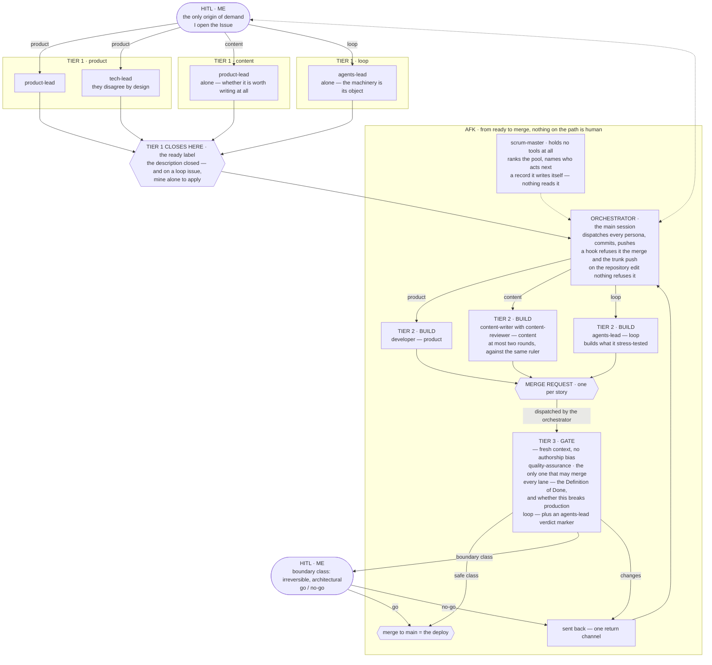

https://www.youtube.com/watch?v=eBUyTS7SzV4

Garry Tan, who runs Y Combinator, gave a twenty-minute talk called *Every company should have a Brain*. No slides, no deck, just him talking. It is about AI-native companies — the ones already running on Claude, on Codex, on harnesses built around them.

His argument fits in one sentence: the leverage is not in the model, it is in how you wire the work. Two people with the same Claude, the same weights, the same context window — one gets a bit more done, the other gets a lot more, and the whole difference is the wiring.

He is describing companies with people in them. I am one person, two repositories and weekends. What I did was take his breakdown and run it against something I had already built without having seen the talk — piece by piece, to see what matched and what did not.

## A company written in files

The part that got me is that he never says "use AI". He describes the functions of a company, and each one turns out to be a file.

He names four. A skill file, he says, is an employee: one capability, one job, written down clearly enough that someone else can execute it. The resolver table — the table you end up writing when your `CLAUDE.md` grows past what anybody wants to read, the one that says *when the work looks like this, load that* — is the org chart. Filing rules and trigger evals are the other two.

Then the line that ties them together, and this one is worth his exact words:

> *"When you sit down with Claude Code or Codex, you're not writing software, you're hiring, training, and managing a workforce made of markdown."*
>
> — Garry Tan, 2026

I went looking for those four in my own loop, and three of them were already there, under names I had not borrowed from him. What decides which reviewers get involved is a table keyed on the kind of work — `loop`, `product`, `content`. The internal process is the one rule my decision library runs on, which I quote in a minute. And the performance review is a suite that reads the skill list in both directions: a declared skill that does not exist turns it red, and one that exists and was never declared does too. Not one of the three was built from theory. Each of them is a thing that broke first.

The fourth did not hold, and it is the more interesting of the two places this comes apart. His model puts the employee and the capability in the same file. Mine keeps them apart. The employee here is the agent declaration — eight of them, each carrying a mandate, a tool grant and the list of skills it loads. The fifteen skills are not employees at all: they are capabilities, and several employees carry the same one. Two of them are loaded by all eight. One artifact on his side, two on mine, with a many-to-many relation between them that his mapping has nowhere to put.

And there is a fifth piece underneath the four, which he does not put on that list. That one comes apart for a different reason.

## Keep judgment in the model, and state in code

Before the fifth, the line I most wish I had had in writing three years ago.

He splits computation into the two places it can live. *Latent space* is the model: taste, judgment, working out what somebody meant by a vague request — the non-deterministic part, steered with markdown. *Deterministic space* is ordinary code, which executes and holds state. The bugs, he says, are usually work sitting on the wrong side of that line.

His example is seating eight hundred people so that whoever ends up next to you is worth meeting. The model decides who fits with whom. Where each of the eight hundred is actually sitting must not live in the context window.

That is my loop's architecture described by somebody else, and I had never had the words for it. The personas argue, weigh, hold opinions: judgment. Who may merge, what counts as irreversible, which verdict authorises what: those are hooks, and a hook has no opinion. I did not get there by theory. I got there by putting things on the wrong side of that line and paying for it.

## The brain, and what it costs

The fifth piece is the one underneath the other four: the company's memory. His name for it is the library plus the librarian, and his sharpest line about it is that retrieval is the easy half — being worth retrieving from is the product.

He is blunt about how it dies:

> *"a brain nobody curates becomes a garbage dump with great search."*
>
> — Garry Tan, 2026

And what he offers instead is a role rather than a feature — provenance on every fact, a check for when a new one contradicts an old one, and a librarian whose actual job is pruning.

That is the one claim here I can hand you a receipt for rather than a recollection.

Decisions here are records in a library, and the library is the development journey: every decision taken along the way, why it was taken, and none of them closed for good — any record can be re-opened. Keeping that usable takes one rule, the title of one of the records: *"An ADR earns its place by explaining the **current** codebase."* A record that stops doing that does not get a banner saying it is out of date. Its file leaves the repository; the trace stays as a row elsewhere, under a clause I can point at: *"A record leaves this library only as a disposition, never as an absence."*

Twenty-one numbers have been issued. Seven are live. The fourteen that are gone each have a row saying what they decided and where that decision lives now. And a test reads it in both directions: a number with no file and no row turns the suite red, and so does a row for a number that is still alive.

Pruning is not the part that feels like progress. It is the part that made the rest usable.

His reason for bothering is that model quality is rented and the brain is the part you own: the organisation that writes down what it learns gets better every day, and the one that does not wakes up every morning with amnesia, however good the model is.

Here I have to be honest about scale, because this is where his analogy touches my life and stops fitting. Knowledge that does not leave when the people leave is a claim about organisations, and I am not one. What I have is the one-person version, and it is less impressive and just as real: what I wrote down still works after I have forgotten it. I have tested that by accident several times, coming back to a file of my own six months later remembering none of it.

## Never do one-off work

If you take one thing from here, take this one, and you can do it this week.

Give the agent the task. Look at what comes back. Correct what is not good enough — and then, once it is good, turn that corrected workflow into a skill you can use again. The order is the whole trick: you capture **after** correcting, so the skill is born with the correction already inside it. The standard he holds it to is harsh, and I have not met it yet — *"if you have to ask for something twice, you failed."* Why that is right is mine rather than his. The point of capturing is behaviour that repeats — the same process run the same way, because the correction is written down instead of remembered. With people, failing at that was survivable: plenty of managers were bad at giving effective feedback, and the organisation absorbed it. With agents it costs more, because a correction nobody captured is not just lost — it gets paid again, every time.

I read that and went to look at what I actually did. Sixty-nine skills became fourteen, and there are fifteen now. Nineteen personas became six, and there are eight now. A count that only falls tells a story by itself; a count that falls and then climbs back tells none at all — and that is exactly the shape that stops being readable the moment nobody wrote down why. Which is why the behaviours here are rows in a registry, and each entry has to say what that behaviour is *for*, and what it does *not* do.

## What one has to do with the other

It took me a while to see that the two ideas are the same piece from two sides.

You can only rearrange the profiles because what each one does is not inside a person. An org chart of people cannot be re-run in a different shape; an org chart of files can. And you only learn anything from the rearrangement if the record says what each piece was there for — otherwise you changed the shape, the result changed with it, and you have no idea why.

And the shape worth changing it into is a disagreement. A profile here earns its place mostly by producing one somebody needs to hear — that is the first of four reasons one may exist, and the version of the rule that said it was the only reason got struck, because it could not explain two of the profiles that are actually there.

What took me longer to see is that the useful disagreement is not the same at every stage. Two leads arguing about a piece of work before anything is built is one act; a gate whose whole job is to fight the builder after it is built is another; the drafting pair reading the same ruler is a third. And some stages want none at all — a change to the loop itself is closed by one reviewer alone, with no exception, because an exception there becomes the default case.

So writing down what each piece is for is not tidiness. It is the only thing that lets you change the shape and learn from having changed it.

**What to take out of this:**

- **A profile earns its place by producing a disagreement somebody needs to hear** — not by filling a box on an org chart. If nobody would argue back, what you have is a handoff, and a handoff is the thing that never gets used.
- **Match the conflict to the stage.** Before anything is built you want two opinions that genuinely differ; after it is built you want an adversary; while a draft is being written you want one ruler, read twice. Using the same conflict everywhere is how a review turns into a ceremony.

And here is the limit, before you reach it on your own: I do not have the measurement. I have not run two arrangements side by side to compare which produces more. What I have is the record that makes the comparison possible, and the counts above are change over time, not an experiment.

One thing I am leaving out, deliberately. Everything above is the part that worked. What none of it can check, and the two occasions where something was written down and then simply not read, is the next article — the one with the receipts I like least. Saying that costs me a sentence; letting this one look finished would have cost more.

The tiers, what each one is *not* allowed to do, and how a change crosses them are in one drawing — the same loop, laid out to be inspected rather than read. It is not a second drawing: it is the one that sits on [the architecture page](/architecture), taken as it is. Drawing it twice is exactly the one-off work this piece is against.

He closes by listing what is portable: skill files as employees, the library and the librarian, never do one-off work. Those, he says, travel with you to any stack. Mine travels as a plugin, in the other repository — the one thing here built to be carried off by somebody else. That it can be is not why I wrote it: I wrote the reasons for myself, and only afterwards found out the reasons were the part that could leave.

Good luck, and I hope you find yours in better shape than I found mine.

This is what I think.
