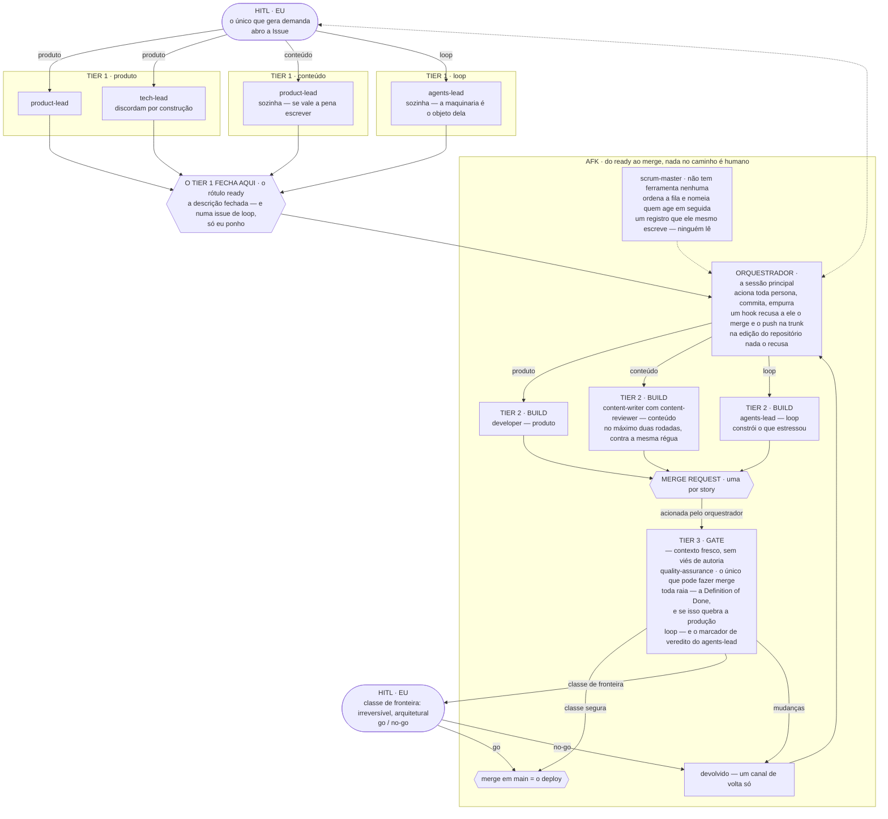

https://www.youtube.com/watch?v=eBUyTS7SzV4

Garry Tan, que toca a Y Combinator, deu uma palestra de vinte minutos chamada *Every company should have a Brain* ("toda empresa deveria ter um cérebro"). Sem slide nenhum, só ele falando. É sobre empresas AI-native — as que já rodam em cima de Claude, de Codex, de harnesses construídos em volta deles.

O argumento dele cabe numa frase: a alavanca não está no modelo, está em como você liga o trabalho. Duas pessoas com o mesmo Claude, os mesmos pesos, a mesma janela de contexto — uma tira um pouco mais, a outra tira muito mais, e a diferença inteira é a ligação.

Ele está falando de empresas com gente dentro. Eu sou uma pessoa com dois repositórios e fins de semana. O que eu fiz foi pegar a decomposição dele e rodar contra uma coisa que eu já tinha construído sem ter visto a palestra — peça por peça, para ver o que batia e o que não batia.

## Uma empresa escrita em arquivos

A parte que me pegou é que ele não fala em "usar IA". Ele descreve funções de uma empresa, e cada uma delas acaba sendo um arquivo.

Ele nomeia quatro. Um arquivo de skill, diz ele, é um funcionário: uma capacidade, um trabalho, escrito claro o bastante para outra pessoa executar. A tabela de resolução — aquela que você acaba escrevendo quando o `CLAUDE.md` fica maior do que qualquer um quer ler, a que diz *quando o trabalho for assim, carregue aquilo* — é o organograma. Regras de arquivamento e avaliação de gatilho são as outras duas.

E aí vem a frase que junta tudo, e essa vale nas palavras exatas dele:

> *"When you sit down with Claude Code or Codex, you're not writing software, you're hiring, training, and managing a workforce made of markdown."*
>
> — Garry Tan
>
> *(Quando você senta com o Claude Code ou o Codex, você não está escrevendo software: está contratando, treinando e gerindo uma equipe feita de markdown.)*

Fui procurar essas quatro no meu loop, e três já estavam lá, com nomes que eu não tinha pegado emprestado dele. O que decide quais revisores entram é uma tabela por tipo de trabalho — `loop`, `product`, `content`. O processo interno é a regra em que a minha biblioteca de decisões funciona, que eu cito daqui a pouco. E a avaliação de desempenho é uma suíte que lê a lista de skills nos dois sentidos: uma skill declarada que não existe deixa vermelho, e uma que existe e não foi declarada também. Nenhuma das três eu construí por teoria. Cada uma é uma coisa que quebrou antes.

A quarta não bateu, e é o mais interessante dos dois lugares onde isso desmonta. O modelo dele põe o funcionário e a capacidade no mesmo arquivo. O meu mantém os dois separados. O funcionário aqui é a declaração do agente — são oito, cada uma carregando um mandato, uma concessão de ferramentas e a lista de skills que ela carrega. As quinze skills não são funcionários: são capacidades, e vários funcionários carregam a mesma. Duas delas são carregadas pelos oito. Um artefato do lado dele, dois do meu, com uma relação de muitos para muitos que o mapeamento dele não tem onde colocar.

E tem uma quinta peça embaixo das quatro, que ele não põe naquela lista. Essa desmonta por um motivo diferente.

## Onde fica o julgamento, e onde fica o estado

Antes da quinta, a linha que eu mais queria ter tido por escrito três anos atrás.

Ele separa os dois lugares onde a computação pode morar. *Latent space* (espaço latente) é o modelo: gosto, julgamento, entender o que a pessoa quis dizer quando falou uma coisa vaga — as chamadas não determinísticas, que você guia com markdown. *Deterministic space* (espaço determinístico) é código normal, que executa e guarda estado. Os bugs, segundo ele, quase sempre são trabalho sentado do lado errado dessa linha.

O exemplo é sentar oitocentas pessoas num evento de forma que o vizinho de cada uma seja alguém que vale a pena conhecer. O modelo julga quem combina com quem. Mas onde cada uma das oitocentas está sentada não pode morar na janela de contexto.

Isso é a arquitetura do meu loop descrita por outra pessoa, e eu nunca tinha tido as palavras. As personas discordam, pesam, opinam: julgamento. Quem pode mergear, o que é irreversível, qual verdict autoriza o quê: isso são hooks, e hook não tem opinião. Eu não cheguei aí por teoria. Cheguei porque botei coisa do lado errado da linha e doeu.

## O cérebro, e o preço dele

A quinta peça é a que fica embaixo das outras quatro: a memória da empresa. O nome que ele dá é a biblioteca mais o bibliotecário, e a frase mais afiada dele sobre isso é que buscar é a parte fácil — ser digno de ser buscado é o produto.

Ele é direto sobre o que mata isso:

> *"a brain nobody curates becomes a garbage dump with great search."*
>
> — Garry Tan
>
> *(Um cérebro que ninguém cuida vira um lixão com busca excelente.)*

E o que ele oferece no lugar é um papel, não uma funcionalidade — proveniência em cada fato, checagem para quando um fato novo contradiz um velho, e um bibliotecário cujo trabalho de verdade é podar.

É dessa afirmação que eu consigo te dar recibo, e não lembrança.

As decisões aqui são registros numa biblioteca, e a biblioteca é a jornada de desenvolvimento: cada decisão tomada no caminho, por que ela foi tomada, e nenhuma delas fechada para sempre — qualquer registro pode ser reaberto. Manter isso utilizável exige uma regra, que é o título de um dos registros — como o repositório é em inglês, vem o original e a tradução: *"An ADR earns its place by explaining the **current** codebase."* Um ADR ganha o lugar dele explicando o código **atual**. Um registro que para de fazer isso não ganha uma tarja em cima dizendo que está velho. O arquivo dele sai do repositório; o rastro fica numa linha em outro arquivo, debaixo de uma cláusula que eu aponto: *"A record leaves this library only as a disposition, never as an absence."* Um registro só sai desta biblioteca como disposição, nunca como ausência.

Vinte e um números já foram emitidos. Sete estão vivos. Os quatorze que sumiram têm, cada um, uma linha dizendo o que decidiram e onde aquela decisão mora agora. E um teste lê isso nos dois sentidos: um número sem arquivo e sem linha deixa a suíte vermelha, e uma linha para um número que ainda está vivo também.

Podar não é a parte que dá sensação de progresso. É a parte que deixou o resto utilizável.

O motivo que ele dá para o trabalho valer a pena é que qualidade de modelo é alugada e o cérebro é a parte que é sua: a empresa que escreve o que aprende fica melhor todo dia, e a que não escreve acorda todo dia com amnésia, não importa quão bom seja o modelo.

Aqui eu preciso ser honesto sobre escala, porque é onde a analogia dele encosta na minha vida e não cabe. Conhecimento que não vai embora quando as pessoas saem é uma afirmação sobre organizações, e eu não sou uma. O que eu tenho é a versão de uma pessoa só, e ela é menos bonita e igualmente real: o que eu escrevi continua funcionando depois que eu esqueço. Eu já testei isso sem querer, várias vezes, voltando num arquivo meu seis meses depois sem lembrar de nada.

## Nunca faça trabalho de uma vez só

Se você for levar uma coisa só daqui, é esta, e dá para fazer nesta semana.

Dá a tarefa pro agente. Olha o que voltou. Corrige o que não ficou bom — e aí, quando ficou bom, transforma aquele fluxo corrigido numa skill que dá para reusar. A ordem é o truque inteiro: você captura **depois** de corrigir, para a skill já nascer com a correção dentro. O padrão que ele usa é ríspido, e eu ainda não cheguei nele: *"if you have to ask for something twice, you failed."* Se você teve que pedir duas vezes, você falhou. Por que isso está certo é meu, não dele. O objetivo de capturar é comportamento que se repete — o mesmo processo, rodado do mesmo jeito, porque a correção ficou escrita em vez de lembrada. Com gente, falhar nisso era suportável: muito gestor era ruim em dar feedback efetivo, e a organização absorvia. Com agentes custa mais caro, porque uma correção que ninguém capturou não fica só perdida — ela é paga de novo, toda vez.

Eu li isso e fui olhar o que eu fazia. Sessenta e nove skills viraram quatorze, e hoje são quinze. Dezenove personas viraram seis, e hoje são oito. Uma contagem que só cai conta uma história sozinha; uma que cai e depois volta a subir não conta nenhuma — e é exatamente esse o formato que deixa de ser legível no instante em que ninguém escreveu o porquê. Por isso os comportamentos aqui são linhas num catálogo, e cada entrada é obrigada a dizer para que aquele comportamento serve, e o que ele **não** faz.

## O que uma coisa tem a ver com a outra

Demorei para ver que as duas ideias são a mesma peça vista de dois lados.

Você só consegue rearranjar os perfis porque o que cada um faz não está dentro de uma pessoa. Organograma de gente não dá para rodar de novo com outro formato; organograma de arquivo dá. E você só aprende alguma coisa com o rearranjo se o registro disser para que cada peça estava ali — senão você mudou o formato, o resultado mudou junto, e você não faz ideia do porquê.

E o formato que vale a pena montar é um desacordo. Um perfil aqui ganha o lugar dele principalmente por produzir um que alguém precisa ouvir — essa é a primeira de quatro razões para existir um, e a versão da regra que dizia ser a única razão foi riscada, porque não explicava dois dos perfis que estão lá.

O que demorou mais para eu enxergar é que o desacordo útil não é o mesmo em toda etapa. Dois leads discutindo um trabalho antes de qualquer coisa ser construída é um ato; um gate cuja função inteira é brigar com quem construiu, depois de construído, é outro; a dupla de redação lendo a mesma régua é um terceiro. E algumas etapas não querem nenhum — uma mudança no próprio loop é fechada por um revisor sozinho, sem exceção, porque exceção ali vira o caso padrão.

Então escrever para que serve cada peça não é organização. É a única coisa que deixa você mudar o formato e aprender com a mudança.

**O que levar daqui:**

- **Um perfil ganha o lugar dele produzindo um desacordo que alguém precisa ouvir** — não preenchendo uma casinha de organograma. Se ninguém fosse discordar, o que você tem é um repasse, e repasse é justamente o que nunca é usado.
- **Case o conflito com a etapa.** Antes de construir você quer duas opiniões que discordam de verdade; depois de construído você quer um adversário; enquanto um texto está sendo escrito você quer uma régua só, lida duas vezes. Usar o mesmo conflito em toda etapa é como uma revisão vira cerimônia.

E aqui vai o limite, antes que você chegue nele sozinho: eu não tenho a medição. Não rodei dois arranjos lado a lado para comparar qual produz mais. O que eu tenho é o registro que torna a comparação possível, e as contagens aí em cima são mudança ao longo do tempo, não experimento.

Uma coisa eu estou deixando de fora, de propósito. Tudo aí em cima é a parte que deu certo. O que nada disso consegue conferir, e as duas vezes em que alguma coisa foi registrada e simplesmente não foi lida, é o próximo artigo — o dos recibos de que eu menos gosto. Falar isso me custa uma frase; deixar este aqui parecendo pronto teria custado mais.

As camadas, o que cada uma **não** pode fazer, e como uma mudança atravessa elas estão em um desenho só — o mesmo loop, montado para ser inspecionado, não lido. E não é um segundo desenho: é o que está na [página de arquitetura](/architecture), tal como está. Desenhar de novo seria exatamente o trabalho de uma vez só contra o qual este texto argumenta.

Ele fecha listando o que é portátil: arquivos de skill como funcionários, a biblioteca e o bibliotecário, nunca fazer trabalho de uma vez só. Isso, ele diz, viaja com você para qualquer stack. O meu viaja num plugin, no outro repositório — a única coisa aqui feita para alguém pegar e levar embora. Poder ser levado não é o motivo de eu ter escrito: eu escrevi os motivos para mim mesmo, e só depois descobri que os motivos eram justamente a parte que conseguia sair dali.

Boa sorte, e tomara que você encontre o seu em estado melhor do que eu encontrei o meu.

Isso é o que eu penso.
